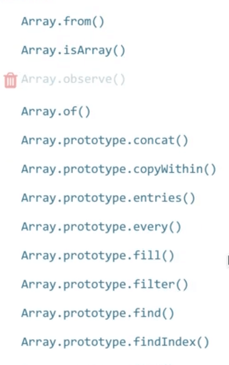
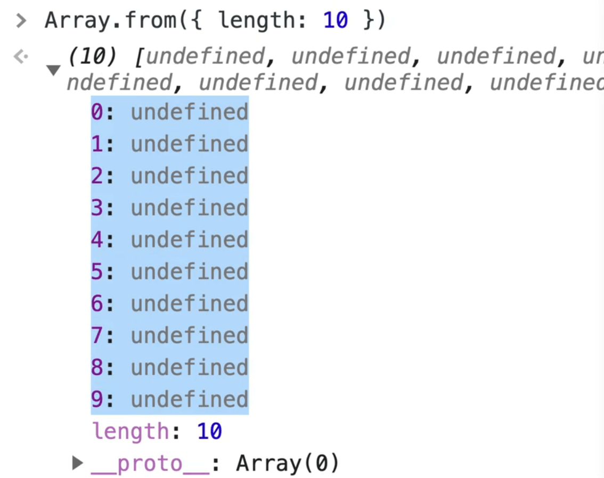
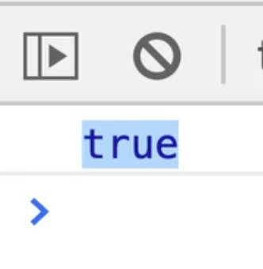

This is method cardio!

This is something that Wes likes to do where we do a bunch of little examples.

Instead of Wes sitting there and trying to explain all the different array methods to us, we are just going to do lots of examples.

You can take a stab at trying each one on your own, then come back and watch Wes do it, and he will talk through how it works.

Let's look up the MDN docs for arrays.

When you open it, you will see all the array methods in the documentation, along the sidebar.


Instead of Wes going through each one, we are going to work with the data Wes has provided and use the methods to add, remove and sort items.

Wes has another course called JavaScript30 (it's totally free), and in that course there are 2 lessons that focus on Array Cardio. If after this video you want more practice, you can visit those videos.

Wes has broken this up into different sections.

We have:
- static methods
- instance methods
- callback methods
- looping methods

We are going to start off with the static methods.

Open up `array-methods-START.html`, which will give you a starting version with data and commented out instructions.



If you look at the sidebar of the array documentation, you will see there are three methods:
- `Array.from()`
- `Array.isArray()`
- `Array.of()`

All the rest of the methods have `Array.prototype` and then the method instead of calling the method directly on `Array`.
What is the deal with that?

That is because those 3 methods are **static methods**, while the rest are referred to as **instance or prototypal methods**.

Refresh the HTML page, open the console and create the following array in the console.

```js
const numbers = [1, 2, 3, 4, 5];
```

Using this array, we can pop numbers out, push numbers in, etc.


Whenever you create an array, you get what is referred to as the array prototype.

These are the methods that are on every single array that are available for us to work with on that array.

Now there are also this thing called **static methods** which aren't available on every single array, but they sort of live on the capital A `Array`.

Those are often what Wes refers to as **utility methods**. They are handy methods for creating or working with arrays.

We will also look at some object static methods as well.

The way static methods work are they are NOT a method like `numbers.push(5)` _(you call `push()` on the `numbers` array that you created earlier)_.

Static methods are called with something like `Array.from()` and they are access like that.

Let's go through it.

`Array.of()` is used for creating an array from it's arguments.

For example you could pass it the arguments of 'wes' and 'kait' and it would create an array with those 2 items, like so 👇

```js
Array.of('wes', 'kait');
```


Wes has never used that in his career, ever, mainly because it's shorter and simpler to create an array using an array literal.

There are a couple of little edge cases for it. One kinda cool this is you can spread into a function.

We have already covered how when you have something, you can spread it into an array, like so 👇

```js
[...'wes'];
Array.of(...'wes');
```


What the `...` does in the example above is it takes an **iterable**, meaning something that has a length, _("wes" is something that has a length because strings have a length)_, and you can spread each of the items of that iterable into the surrounding array.

So in the example above, you have spread every letter that makes up "wes" and put it as an item of the array.

The same things works if you are spreading into a function.

For example, if you have a function that takes an unlimited amount of arguments, or you have something where you want to spread each item as argument 1, argument 2 etc. you can spread into a function call.

There is `Array.from()` which is something that Wes uses fairly often.

`Array.from()` will take an **iterable** (something with a length), and most often Wes will give it an object with a length property like so 👇

```js
Array.from({ length: 10 })
```

What that will do is it returns an array from that iterable with that many empty slots.  So in the example above, you are saying you want 10 spots, and that returns to us an array with 10 empty spots.



That is really handy because Wes often wants to make an array of numbers 1 through 10 and loop over them and display each items or something like that.

Sometimes Wes just wants to loop from 1 to 10 or 5 to 8 and using `Array.from()` will do that.

`Array.from()` also takes in a secondary argument which is referred to as a map argument. The map argument will tell you what you can return to put into those slots.

Let's do an example.

Create a variable `range`, which will be equal to an array with 10 slots, like so 👇

```js
const range = Array.from({ length: 10 });
```

A second argument from that is a function from which you can return anything.

Add the following 👇

```js
const range = Array.from({ length: 10 }, function() {
  return 'wes';
});
```

If you refresh the page, and open the console you should see that all 10 items have a value of "wes".


This callback function will give you the actual item that is in the slot as an argument, as well as the index.

For example 👇

```js
const range = Array.from({ length: 10 }, function(item, index) {
  return index;
});
```

What that code above does is it gives you an array where each number is the index that you have.


Use this to make a little function that takes in 2 arguments, `start` and `end`, like so 👇

```js
createRange(start, end);
```

Move the `const range` variable inside of that function like so 👇

```js
function createRange(start, end) {
  const range = Array.from({ length: 10 }, function(item, index) {
  return index;
});
}
```

However, you want to change the length value. Instead of 10, do the end minus the start like so 👇

```js
function createRange(start, end) {
  const range = Array.from({ length: end - start },
  function(item, index) {
    return index;
  });
}
```

Let's test that out by refreshing the HTML page and opening the console.

Add the following in the console 👇

```js
createRange(3, 7)
```

You should see the following 👇


Oops! You forgot to return the range.

Add a return to the function like so 👇

```js
function createRange(start, end) {
  const range = Array.from({ length: end - start },

  function(item, index) {
    return index;
  });

  return range;
}
```


You started at 3 and went to 7, which gave us 4 spots.

Then what you can do is return the index + the start number by modifying the code to instead of returning `index`, to return `index + start` like so 👇

```js
function createRange(start, end) {
  const range = Array.from({ length: end - start },

  function (item, index) {
    return index + start;
  });

  return range;
}
```


If you wanted this to be inclusive of 7, you could add 1 to where you set the length of array.

You change `Array.from({ length: end - start})` to `Array.from({ length: end - start + 1 })`

That is a handy range function which Wes has probably written a dozen times in his career.

So that is what Array.from() does, it creates an array given an iterable which is most likely aways going to be an object with a length on it.

Create a range using that function.

Add the following line underneath the range function 👇

```js
const myRange = createRange(3, 7);
```

Refresh the HTML page and open the console.

Let's try to the following `createRange(3,734223423)`.

If you try that, you should get an error like so 👇

{/* TODO: where did this image go?  */}

There is a limit to how big your arrays can be. They are very, very, very large.

There are some additional data types in the language for having big, big arrays, and you will most likely only run into those when you're dealing with 3D graphics and you have to work at a per pixel level.

Let's refresh the page, open the console and try with a smaller number as shown below.

```js
createRange(3, 7342);
```


You can see that runs nice and quickly.

We have looked at `Array.isArray()` before but let's do it quickly.

```js
console.log(Array.isArray(myRange));
```

You should see "true" logged.



That is a pretty common thing you will need to do because if you try to use `typeof` with an array, it will return "object" because an array isn't a real type.

The only way to check whether an array is an array is by using `Array.isArray()`

Some people sort of cheat it and instead of using `Array.isArray` they will check fo the existence of things that are array-ish such as for the existence of a length property. That isn't good because you could have an object with a length property as well and that check wouldn't work.

## Object Static Methods

Next up we have these static methods:
- `Object.entries()`
- `Object.keys`
- `Object.values()`

Those methods are on the object instead of on the array. However they return arrays, which is why we are covering them here.

This exercise requires us to take the `meats` object and make 3 arrays with `.entries()`, `.keys()`, `.values()`.

Here is our meats object 👇

```js
const meats = {
  beyond: 10,
  beef: 5,
  pork: 7,
};
```

If you want to turn this object into an array of keys, or an array of the values, or both, that is where we use these static helper methods.

You use `Object.entries()` when you want to put both the keys and values into an array like so:

```js
console.log(Object.entries(meats));
```


Add the following code below the line where you are logging the entries array.

```js
console.log(Object.entries(meats));
console.log(Object.keys(meats));
console.log(Object.values(meats));
```


As you can see, `keys()` is going to give us an array of all the object keys, `values()` will give us an array of all the values and `entries()` is going to give us an array where each item is then a nested second array inside of it where the first item in the nested array is the key and the second item is the value.

These are pretty common things to do.

One pretty common way to work with those is using the `forEach`.

This is getting a little bit ahead of ourselves because we haven't learned about looping all that much, but Wes will show us how to do it anyway.

Add the following code 👇

```js
Object.values(meats).forEach(qty => {
  console.log(qty);
});
```

If you refresh the HTML page and look at the console you should see the following 👇


That is a pretty common thing to do it you want to like loop over and add up how much inventory you have or you want to add up all the numbers, lets look at how you can use `reduce()` to do that.

The same thing is if you were to do `keys`, instead of getting the quantity we would be grabbing the values and putting them into an array and then looping over them.

```js
Object.keys(meats).forEach(qty => {
  console.log(qty);
});
```

{/* TODO: where did this image go?  */}

Now entries 👇

```js
Object.entries(meats).forEach(entry => {
  console.log(entry);
});
```


For each one, you get an array with 2 items.

The first item is always going to be the **key**, and the second item will always be the **value**.

If you wanted to split those up into their own vairables you could do the following 👇

```js
const key = entry[0];
const value = entry[1];
console.log(key, value);
```


Something that we have talked about that is very useful in this scenario is **destructuring**.

Instead of using the square brackets and indexes on the entry array to grab each item, you can do this 👇

```js
const [key, value] = entry;
```
What that code is doing is it is taking the first item in the entry array and assigning it to the variable key and it's taking the second item and assigning it to the variable value.

That is the exact same thing as 👇

```js
const key = entry[0];
const value = entry[1];
```

You could take it even one step further and destructure the entry variable inside of the function definition rather than in the function body.

First modify this line of code
👇
```js
Object.entries(meats).forEach(entry => {
```

Wrap `entry` in paranthesis like so 👇

```js
Object.entries(meats).forEach((entry) => {
```

If you refresh the page, everything should still work, you did nothing by adding those parenthesis.

Instead of just passing one variable called `entry`, you are going to destructure that `entry` array into `key` and `value` directly.

Within the function body you do not need to do any destructuring, we can just log the key and value variables directly.

```js
Object.entries(meats).forEach(([key, value]) => {
  // const key = entry[0];
  // const value = entry[1];
  // const [key, value] = entry;
  console.log(key, value);
});
```

`key` and `value` are not special names, you could name them anything you want, for example this would still work 👇

```js
Object.entries(meats).forEach(([meat, qty]) => {
  // const key = entry[0];
  // const value = entry[1];
  // const [key, value] = entry;
  console.log(meat, qty);
});
```

There is nothing wrong with any of these approaches, they all work.

Wes find that for some beginners destructuring can be a bit confusing so feel free to use the other approaches for now if they are more clear to you.
