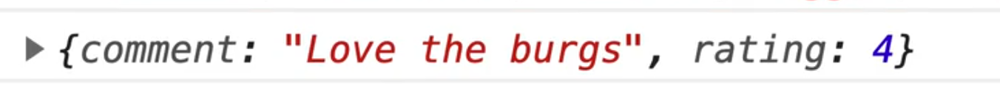
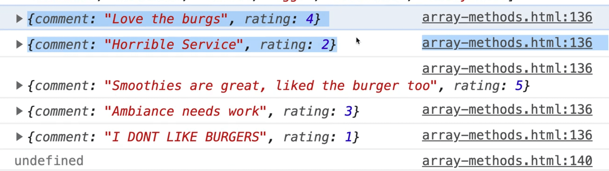
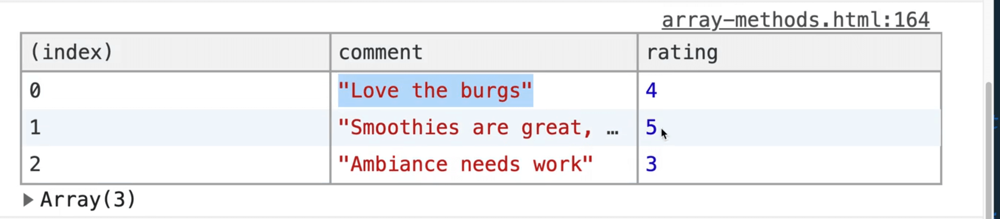
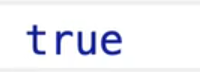

```js
/*
  Callback Methods
*/

// find the first rating that talks about a burger with find()
// find all ratings that are above 2 with filter()
// find all ratings that talk about a burger with filter()
// Remove the one star rating however you like!

// check if there is at least 5 of one type of meat with some()
// make sure we have at least 3 of every meat with every()
// sort the toppings alphabetically with sort()
// sort the order totals from most expensive to least with sort()
// Sort the prices with sort()
```

In this lesson we are going to cover what Wes calls **"callback" methods** methods. They aren't actually called callback methods,  Wes just made that up.

The reason he is grouping all of these methods into their own section (which he is calling "callback methods") is because before we even hit looping, a lot of these methods take a function as an argument and it's often called a callback.

The one that we have used so far is `find()`. We are going to dig into how this work with find right now.

First we need to find the first rating that talks about a burger using `find()`.

We have this data to work with  👇

```js
const feedback = [
  { comment: "Love the burgs", rating: 4 },
  { comment: "Horrible Service", rating: 2 },
  { comment: "Smoothies are great, liked the burger too", rating: 5 },
  { comment: "Ambiance needs work", rating: 3 },
  { comment: "I DONT LIKE BURGERS", rating: 1 },
];
```

We want to find the first one that has either the word "burg" or "burger" in it.

Add the following code 👇

```js
const burgRating = rating.find();
```

Let's look up `find()` on MDN.

>T he find() method returns the value of the first element in the provided array that satisfies the provided testing function.

{/* TODO: where did this image go?  */}

As you can see, the `find()` function takes a callback as it's argument. It takes in the nested arguments of `element`, `index` and `array`, which are optional.

What does that all mean?

It means that the argument of `find()` is going to be a function that either returns true or false when it has found the item that it wants.

We have been doing something like this with an arrow function.

```js
const burgRating = feedback.find(rating => rating.comment.includes('burg'));
console.log(burg);
```

Let's refresh the HTML page, open the console and see how this works.



As you can see it returned a comment "Love the burgs".

So what is this part we have highlighted in this image below?


It is a function.

Create a function called `findBurgRating` which takes in 3 arguments, and we know what those are from the MDN docs we looked at a few minutes ago.

First it takes `element`. The element is just a nice way of saying each individual item. So rather than calling it element, we can name it something that is meaningful to use. Wes is choosing to call it `feedback`.

The next argument is going to be the index. That is often short formed to an `i`. If you ever need to know what index something is when you are in the loop, you have access to it.

The third argument is the array. If you ever need to reference the entire array while you are inside of the function, you can use that argument.

Typically Wes doesn't need to pass both index and array but if you ever do need access to where it is in the array as well as the original array, you can use that.

You might be asking, why don't we just use reference it by the feedback array?

That is because this function could be reused on multiple arrays, and in order to make it a function that can be reused on many arrays, we can pass in.

Right now we don't need to pass index or the array, we just care about the feedback (the element argument).

```js
function findBurgRating(feedback) {
  console.log(feedback);
}
```

Instead of doing an inline function within the `find` function, we can just simply pass the function `findBurgRating` like so 👇

```js
function findBurgRating(feedback) {
  console.log(feedback);
}

const burgRating = feedback.find(findBurgRating);
console.log(burgRating);
```

Notice that we do not put parenthesis on `findBurgRating`. We do `findBurgRating` instead of `findBurgRating()`. That is because we are not calling the function, we are simply passing it reference to the function and JavaScript itself is going to run that function once for each item in our feedback array.

Modify the parameter name in `findBurgRating` from `feedback` because it's not singular. Rename it to `singleFeedback` like so 👇

```js
function findBurgRating(singleFeedback) {
  console.log(singleFeedback);
}
```



Now when we run this, you see that every comment is logged in our console.

Add a `return true` to our `findBurgRating` function.

```js
function findBurgRating(singleFeedback) {
  console.log(singleFeedback);
  return true;
}
```

What will happen then is it will only every log the first one, and then it will stop.


As soon as you return true from the callback function, it thinks you have found the thing you are looking for, and it will then return the item in the array.

Within the `findBurgRating()` method, add an if statement that looks whether the word burgs or burger is within that `singleFeedback` item's comment.

Modify the code like so 👇

```js
function findBurgRating(singleFeedback) {
  if (singleFeedback.comment.includes('burg')) {
    return true;
  } else {
    return false;
  }
}
```

Now when you refresh, you should see the following logged in the console 👇


It looped over and found the first item to contain "burg" in the `feedback` array.

We can refactor that code to make it a bit shorter.

Because we are checking for a condition, and a condition is something that tests whether something is true or not, and `includes()` is a method that will only ever return true or false, we don't actually have to have an if statement and return true or false ourselves. We can simply get rid of that and simply return the results of the condition, like so 👇

```js
function findBurgRating(singleFeedback) {
  return singleFeedback.comment.includes("burg");
}
```

If you refresh the page, you will see that it still works.

That is just one way to do this. You will often see Wes doing it inline, but anytime you find yourself writing the same code more than once, you can refactor it out into it's own reusable function.

The `findBurgRating` function, just like everything else, can be any type of function.

You can do it like we did in the example, or you could modify the function like so 👇

```js
const findBurgRating = function(singleFeedback) {
  return singleFeedback.comment.includes("burg");
}
```

That works the exact same.

You can also make it an arrow function.

```js
const findBurgRating = (singleFeedback) => {
  return singleFeedback.comment.includes("burg");
}
```

That works too. We could go even one step further and make it an implicit return.

```js
const findBurgRating = (singleFeedback) => singleFeedback.comment.includes("burg");
```

Now that function has become a one-liner.

There is one more pretty common way to do this. That is grouping all those find functions into an object.

What Wes will do is he will create an object called `util` or something, and inside of that, he will put all his helper functions for finding things that he is looking for.

```js
const util = {
  findBurgRating: function(singleFeedback) {
    return singleFeedback.comment.includes("burg");
  }
}
```

What you have done above is you put the function inside of an object which turns it into a method. Now when you are looking for something, you can just pass it `util.findBurgRating()`.

There is actually one more way, which is putting them in modules and importing and exporting them. We will look at that when we get to modules.

One other concept is functions that return other functions.  Those are referred to as **high-order functions**.

Wes is going to show us how those work.

The `findBurgRating` function is very tied to the word "burg". If we wanted to make another function that looked for another word, for example the word "smoothie", we would have to duplicate our `findBurgRating` method, and make a `findSmoothieRating` function and then swap out the word we are looking for like so 👇

```js
const findBurgRating = (singleFeedback) => singleFeedback.comment.include("burg");
const findSmoothieRating = (singleFeedback) => singleFeedback.comment.includes("Smoothie");
const burgRating = feedback.find(findSmoothieRating);

console.log(burgRating);
```

That might seem a bit weird.

You may be thinking "Do I have to create a new function for every single word?"

The answer is no!

We can create a function that will create these functions for us.

Comment out the `findBurgRating` and `findSmoothieRating` functions and make another function called `findByWord`, which takes in one argument: `word`.

In that function, we are going to return another function which takes in the `singleFeedback` and returns true or false based on whether the object includes the word we have passed like so 👇

```js
function findByWord(word) {
  return function(singleFeedback) {
    return singleFeedback.comment.includes(word);
  };
}
```

So this function `findByWord` you can think of as a sort of momma function which returns another function, and we have made this function machine which will turn out more functions.

What we can do here is modify how we grab `burgRating` like so 👇

```js
const burgFinder = findByWord('burg');
const burgRating = feedback.find(burgFinder);
```

`burgFinder` is just a function that is setup for finding the word burg and we can pass it to the `find` method.

Now we can do something similar with the word smoothie like so 👇

```js
const burgFinder = findByWord('burg');
const burgRating = feedback.find(burgFinder);

const smoothieFinder = findByWord('Smoothie');
const smoothieRating = feedback.find(smoothieFinder)
```

What we have done is created a function, `findByWord`, which makes a function. We have made `findByWord` flexible enough that we can pass it the word we are looking for and it will find the specific word that we want.

We don't even need the `smoothieFinder` and `burgFinder` variables. We can instead just pass them directly like so 👇

```js
const burgRating = feedback.find(findByWord('burg'));
const smoothieRating = feedback.find(findByWord('Smoothie'))
```

You might be saying, "hold on Wes, I thought you weren't supposed to call a function when you pass it to find. I thought you were just supposed to pass it reference to the function".

The key here is that `findByWord()` function doesn't find the burger itself, instead it returns a function which then, in turn, will find the burg for you.

To demonstrate this, open the console and clear everything.

Try running `findByWord('burg')` and see what is returned in the console.


As you see, when you run the `findByWord` burg function, it returns to us another function that is then setup to find the word burg in it.

That is a bit of an advanced example, but if you do find yourself in a situation where you keep writing the same code over and over and just one thing is changing, then maybe come back to this video to refresh on how we made a function that returns another function.

The next exercise is finding all the ratings that are above 2 using `filter()`.

`filter()` works very much like `find()` but it will return to you a new array instead of just one item.

The `filter` method will loop over every single one and either return true (I want to keep it) or false (I don't want to keep it).

```js
const goodReviews = feedback.filter(singleFeedback => {
  if (singleFeedback.rating >= 2) {
    return true;
  } else {
    return false;
  }
});

console.table(goodReviews);
```


As you can see, this also returns an item with a rating of 2 so let's actually change our filter from greater than or equal to 2 to just greater than 2. Now we only get 3 items returned.



How can we make this function better? We have done this a few times now so you can feel free to do it yourself.

This function contains a condition that returns true or false, so we can just simple return the condition instead, and use an implicit return, like so 👇

```js
const goodReviews = feedback.filter(singleFeedback => singleFeedback.rating > 2);
console.table(goodReviews);
```

That should work the same.

Now could we do another function like `findByWord`?

Yes, we can!

Add the following function `filterByMinRating`.

One thing to note with these filtering and find methods is it is a lot easier if you explicitly name them to describe what they are supposed to do because quite often they will be in another file or something, and it is nice to be able to know what they do just by the name without having to look at the function.

```js
function filterByMinRating(minRating) {
  return function(singleFeedback) {
    return singleFeedback.rating > minRating;
  }
}
```

Another thing to note is that the function we are returning does not have to be named. It can be, but there is no need to.

Our function above takes in a `minRating` value and then returns another function that checks whether the object passed in contains a rating greater than the `minRating` that was passed.

Now we can go to our `filter` function and replace the filter by generating another function like so 👇

```js
const goodReviews = feedback.filter(filterByMinRating(2));
console.log(goodReviews);
```

If you refresh the HTML page and open the console, you will see that it still works.

Now we can change our filter to take any items with a rating over 4 like so:

```js
const goodReviews = feedback.filter(filterByMinRating(4));
```


The next exercise asks use to find all the ratings that talk about a burger using `filter`.

```js
const burgRatings = feedback.filter(singleFeedback => singleFeedback.comment.includes('burg'));
console.table(burgRatings);
```

You might be saying "hold on Wes, didn't we already do that with our `findByWord` function?". Yes, we did! What we can do is we can actually just reuse the function in our filter like so:

```js
const burgRatings = feedback.filter(findByWord('burg'));
console.table(burgRatings);
```


If you refresh the page, you will see that it still works.

So what we have done is we have written a JavaScript function, `findByWord` that can be used both for our `find` method and our `filter` method because they both just check whether a condition is true ot not.

It is fine if you don't create re-usable functions all the time, because sometimes a small little arrow function just does the trick. However it is good to know that if you ever keep repeating yourself over and over than you should probably refactor to save yourself some typing.

The next exercise is to remove the 1 star rating, however we like.

Let's take a look at the one star rating.


So there is a few ways we could find the one star rating. We could filter out comments that are done in all caps, or filter ratings that are equal to 1. Let's go  with the second approach.

```js
const legitRatings = feedback.filter(single => single.rating === 1);
console.log(legitRatings);
```

Note: notice this time we didn't name the variable that represents each instance we are looping `singleFeedback`? Wes named it `single` instead just to demonstrate that this variable name could be anything you choose (as long as it's a valid variable name).


As you can see above, that gives us the 1 star rating. However we want everything but the one star rating.

How do we get the opposite of that?

We can simply put a bang infront of our condition like so 👇

```js
const legitRatings = feedback.filter(single => single.rating !== 1);
console.log(legitRatings);
```


That has given us everything else but the 1 star rating.
We are not going to create a function for this one because we can do it in a simle one liner, so why not.

The next exercise is to check whether there are at least 5 of one type of meat with `some()`.

What does `some` do? Let's take a look at MDN.

>The some() method tests whether at least one element in the array passes the test implemented by the provided function. It returns a Boolean value.

Let's take a look at `meats`.


As you can see, it's an object. All of the stuff we have been learning about is arrays.

How do you convert an object into an array so you can use these methods on it?

We can use `.entries()`, `.keys()`, or `.values()`. We will use `values()`.

```js
const isThereEnoughOfAtLeastOneMeat = Object.values(meats);
```

Next we will chain the `some` method onto our newly created array.

`some` will loop over each item which we will call `meatValue` and check to see if it's equal to or greater than 5 like so 👇

```js
const isThereEnoughOfAtLeastOneMeat = Object.values(meats).some(meatValue => meatValue >= 5);
```

When we converted the `meats` object into an array of values, it returned the following 👇


Next, we check if at least one of the values in that array is greater than or equal to 5.

Log the value of `isThereEnoughOfAtLeastOneMeat`, which should return true.



The next exercise is to make sure we have at least 3 of every meat with `every()`.

Let's say you have 5 people in a family, and you want to make sure there is at least one adult who is greater than 19 years old. What you could do is loop through each person in the family and check for their ages using `.some()`.

`some` means at least one of (at least one person greater than 19).

`every` means make sure every single thing in that array meets our criteria.

Duplicate the code you added above and rename the variable to `isThereEnoughOfEveryMeat`.

Change the method from `some` to an `every` and change the condition to check whether the value is greater than or equal to 3, like so 👇

```js
const isThereEnoughOfEveryMeat = Object.values(meats).every(meatValue => meatValue >= 3);
console.log(isThereEnoughOfEveryMeat);
```

If you refresh that in the console, you should see true.

The next exercise says to sort the toppings alphabetically with `.sort()`. That is a different kind of callback function there.

So let's say we have an array of numbers and we call sort on it, like so 👇

```js
[1, 2, 100].sort();
```

We are returning the following 👇


If we try adding a few more numbers to the array and then calling sort, we get the following:

{/* TODO: where did this image go?  */}

What is going on there?

Let's look up the docs on MDN.

{/* TODO: where did this image go?  */}

> The default sort order is ascending, built upon converting the elements into strings, then comparing their sequences of UTF-16 code units values.

That is a fancy way of saying that it does it alphabetically as a string.

So what was happening when we were sorting our numbers array is it was converting them to strings and then sorting them.

Let's do an example before we get into our exercise to demonstrate how it would work if you do want to sort numbers.

```js
const numbers = [1, 2, 100, 3, 200, 400, 155];
const numbersSorted = numbers.sort();

console.log(numbersSorted);
```

First log to see what it looks like when we call `.sort()` directly one it.

{/* TODO: where did this image go?  */}

That is clearly not what we want.

The way sort works is it takes a compare callback function that defines the sort order. That callback function gives you the first and the second thing.

So basically we are going to loop over the array and it will give us the first item, and the second thing, and then it's up to us to decide the sort order (if one item should go in front of the other, etc).

So, what do you return?

{/* TODO: where did this image go?  */}

If you return less than 0, it will go before it. If you return 0, it will be unchanged, and if you return greater than 0 it will go ahead of it.

We will create a regular function as our callback function for now.

```js
const numbersSorted = numbers.sort(function(firstItem, secondItem) {
  console.log(firstItem, secondItem);
});

console.log(numbersSorted);
```

{/* TODO: where did this image go?  */}

As you can see we get 2 items each time.

We get `item1` which you can think of as being in the left hand and `item2` which you can think of as being in the right hand and it's up to you, the developer, to tell JavaScript whether the items should switch places or remain the same. As JavaScript loops over those things, you keep switching them and eventually it will run through it enough times that there are no more switches, and that is how it knows its done.

So what we can do is we can return 0, -1, or 1. You can return any value, up or down, and that's what we are going to do in our sort callback function.

* So if the first item is greater than the second item, we want to return 1.
* Else if, we will check whether the second item is greater than the first item. If it is, then we will return -1.
* If the numbers are the same, we will return 0.

```js
const numbersSorted = numbers.sort(function(firstItem, secondItem) {
  if (firstItem > secondItem) {
    return 1;
  } else if (secondItem > firstItem) {
    return -1;
  } else {
    return 0;
  }

  console.log(firstItem, secondItem);
});

console.log(numbersSorted);
```

Let's refresh the page to see how that works.

{/* TODO: where did this image go?  */}

So that works, but it's pretty verbose and we don't have to return 1, -1 or zero. You can return any zero, negative number or positive number.

Because the items we are looping over are numbers, we can get aray with just returning the `secondItem - firstItem`.

```js
const numbersSorted = numbers.sort(function(firstItem, secondItem) {
  return secondItem - firstItem;
});

console.log(numbersSorted);
```

{/* TODO: where did this image go?  */}

Oops, that returns it in the wrong order. It should be `firstItem - secondItem`.

How do you know? Just do it one way and if your array is backwards, switch them.

So it's going to return `1-2`, which would be `-1` which will move it to the beginning of the array. Then it will get `100 - 2`, and those numbers just help it learn how to sort itself.

So by default, it will sort itself on strings. So if you did have strings like 👇

```js
['a', 'z', 'e', 'r', 'b'].sort()
```

It will sort it easily, like so 👇

{/* TODO: where did this image go?  */}

But if you have numbers or nested elements, then you have to use a callback like we did.

We can convert our example from above to an arrow function also like so 👇

```js
const numbersSorted = numbers.sort((firstItem, secondItem) => secondItem - firstItem);
console.log(numbersSorted);
```

If you refresh the HTML page, you will see it still works 👇

{/* TODO: where did this image go?  */}

So now back to our exercise about sorting the toppings alphabetically using `sort()`.

That is easy. We just need to do add the following code 👇

```js
console.log(toppings.sort());
```

{/* TODO: where did this image go?  */}

The next exercise is sorting the order totals from most expensive to leat with `.sort()`.

{/* TODO: where did this image go?  */}

So this is just an array of numbers.
We can do the same thing we did before, or we can make a function called `numbersSort` like so:

```js
function numbersSort(a, b) {
  return a - b;
}
```

Now we can call `sort` and just pass in that function like so 👇

```js
console.log(orderTotals.sort(numbersSort))
```

{/* TODO: where did this image go?  */}

As you can see, that worked.

Next we need to sort the prices with sort.

{/* TODO: where did this image go?  */}

Since `prices` is an object, how would we sort them?

We can use `Object.entries()`. However, we need to keep the thing we are sorting along with it.  How would we do that?

Let's do it step by step.

```js
const productsSortedByPrice = Object.entries(prices);
```

As you can see, that gives us an array where each item is an array.

{/* TODO: where did this image go?  */}

Now, what we can do is sort over each of them. We will use a regular function for that which takes in 2 parameters, the first item and the second item which we will represent with the variables `a` and `b`.

Wes isn't a fan typically of using short variable names but in this case, he is fine with it.

```js
const productsSortedByPrice = Object.entries(prices).sort(function(a, b) {
  debugger;
})
```

If you refresh HTMl page, the debugger will popup. You should see something like the following 👇

{/* TODO: where did this image go?  */}

The important part is the local scope, meaning that what are these `a` and `b` variables equal to?

{/* TODO: where did this image go?  */}

It tells us that `a` is equal to burger and `b` is equal to hotdog.

{/* TODO: where did this image go?  */}

It says they are both arrays.

```js
const aPrice = a[1];
const bPrice = b[1];
debugger;
```

{/* TODO: where did this image go?  */}

```js
const productsSortedByPrice = Object.entries(prices).sort(function(a, b) {
  const aPrice = a[1];
  const bPrice = b[1];
  return bPrice - aPrice;
});

console.table(productsSortedByPrice);
```

As you can see, we return the most expensive to the least expensive.

{/* TODO: where did this image go?  */}

If we wanted to turn that back into an object we can simply wrap it in `Object.fromEntries()`.

```js
Object.fromEntries(productsSortedByPrice);
```

{/* TODO: where did this image go?  */}

What that does is it takes a nested array, like we have here, and turns it back into a regular objects.

Remember earlier when we were learning about objects and how they are not order-sensitive?

Wes has since found out that they have added it to the language where they are maintained in the order in which you put them in, except if they have numbers, in always goes to the top and then the other ones come after it.

Wes spends most of his time working with these sorts of functions.
