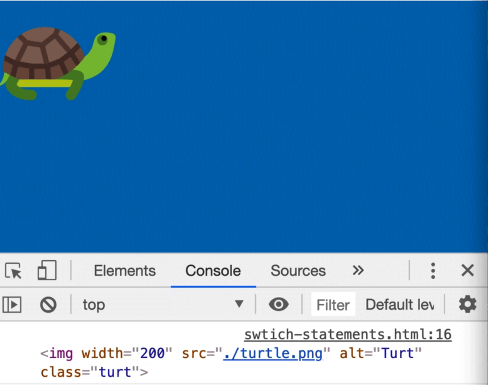

We are going to talk about switch statements now.

We already used a switch statement in our etch-a-sketch exercise. In this video we will go over them again and this time do an example where we animate a turtle.

Within the `playground` directory, open up `switch-statements.html`.

Add an image tag like so 👇

```html

```

Now add a script tag and within that script tag grab the turtle and log it 👇

```html
<script>
  const turtle = document.querySelector(".turt");
  console.log(turtle);
</script>
```

It's a bit big so add `width="200"` to the image element.

You should see the following when you load the HTML page 👇



In this exercise, we want to make this turtle walk, and also flip around when you hit the arrow keys.

The first thing you need to do is listen for the keydown event. Make a function called `handleKeyDown` which you will pass to the keydown event listener.

In the `handleKeyDown` function, grab the event and log the event key like so 👇

```js
function handleKeyDown(event) {
  console.log(event.key);
}

window.addEventListener("keydown", handleKeyDown);
```

YOu only care if it's an arrow key or not, so add code to check if the event key includes the word arrow and if it does not, just return which will exit out of the function like so 👇

```js
if (!event.key.includes("Arrow")) { return; }
console.log(event.key);
```

If you refresh the HTML page and hit any key, you will see only the arrow keys are logged. That is because you are returning if the key is anything but an arrow key before logging.

Now you want to make the turtle move.

Declare two variables, `x` and `y`, right before the `handleKeyDown` variable and set both to zero.

```js
let x = 0;
let y = 0;

function handleKeyDown(event) {
  if (!event.key.includes("Arrow")) { return; }
}
```

Now within `handleKeyDown`, when they move right, decrease the `x` and vice versa. This is a use case for a `switch` statement.

The way a switch works is you write `switch` and then you pass it the thing you are testing, so switch on the `event.key`.

Then there is a block which will contain a whole bunch of different cases. This is a bit easier to look at than an if statement in some cases.

The only downside is that they have to be clearly defined cases. There is no case like greater than 20, that is an if statement.

```js
switch (event.key) {
  case 'ArrowUp':
    y = y - 1;
  case 'ArrowDown':
    y = y + 1;
  case 'ArrowLeft':
    x =  x + 1;
  case 'ArrowRight':
    x = x - 1;
}
```

Note: You might notice that prettier isn't auto-fixing on save. That is because we are writing JavaScript within an HTML file.

For each of the cases above, we need to add a `break`.

If you do not break, then it will keep going down to each of the cases which will cause trouble.

In a switch statement you **must always break after each of your cases.**

You should also always have a default case which will run if the condition doesn't match any of the cases. 👇

```js
switch (event.key) {
  case 'ArrowUp':
    y = y - 1;
    break;
  case 'ArrowDown':
    y = y + 1;
    break;
  case 'ArrowLeft':
    x =  x + 1;
    break;
  case 'ArrowRight':
    x = x - 1;
    break;
  default:
    console.log("That is not a valid move");
    break;
}
```

Now that you have those variables, lets take the turtle and move him over.

After the switch, log the values of x and y and refresh the HTML page.

Open the console and hit some of the arrow keys.


Oops! We made a mistake.

In our switch statement, `ArrowLeft` should be `x = x -1;` and `ArrowRight` should be ` x = x + 1`, like so 👇

```js
case "ArrowLeft":
  x = x - 1;
  break;
case "ArrowRight":
  x = x + 1;
  break;
```

Modify the switch statements and try again.

Now when you hit the up, down, left, and right keys you should see the `x` and `y` variables changing in the console.


Now you need to convey the `x` and `y` values to the turtle somehow.

We are going to do this via css variables.

Add a style tag right after the opening body tag.

Grab the turtle class and add the following 👇

```html
<body>
  <style>
    .turt {
      position: relative;
      transform: translateX(10px) translateY(10px);
    }
  </style>
</body>
```

In the dev tools, if you manipulate the values of `translateX` and `translateY`, you will see that the turtle moves.


Now take those variables and put them into their own CSS variables like so 👇

```html
<style>
  .turt {
    position: relative;
    --x: 10px;
    --y: 10px;
    transform: translateX(var(--x)) translateY(var(--y));
  }
</style>
```

Now if you modify the `x` or `y` variable values in the console, you will see that the turtle moves fine.


Next we are going to update the `x` and `y` CSS variables with JavaScript.

After the switch statement, we will grab our turtle and apply styles directly to it.

```js
turtle.style.background = 'red';
```

If you refresh the page and hit an arrow, you should see the following 👇


So if you want to apply a variable, you can't just do `turtle.style--x`.

Instead you have to use what is called **square bracket notation**. We haven't looked at this yet, but we will get into it more when we look at arrays and objects.

For now, know that you can also access a property in 2 ways, via:

- `turtle.style.background`

or

-`turtle.style['background']`

When you use the square bracket notation, you pass it a string.
Those two ways are exactly the same.

Try using the second approach to set the `x` and `y` CSS variables like so:

```js
turtle.style["--x"] = `${x}px`;
turtle.style["--y"] = `${y}px`;
```

If you refresh the page and try hitting some arrow keys, you will notice that it does not work.

That might be because CSS variables are not standard CSS attributes.

Let's say you also set a value for the CSS property "madeup" which doesn't exist.

If you added the code `turtle.style['madeup'] = 'green';`, you will notice that it doesn't show up in the style tag. That is because only real CSS properties will be added.

So how do you apply custom CSS properties if it is not?

You can reach for `setAttribute` which you were looking at before. 👇

```js
turtle.setAttribute("style", `--x: ${x}px; --y: ${y}px`);
```

Now if you refresh the HTML page and hit the arrow keys, you will notice that the turtle moves up, down, left, and right.

Set the `x` and `y` CSS variables to default at 0 instead of 10px.

One other thing you could do is something like a speed operator. Declare a `speed` variable after the `x` and `y` variable declarations like so 👇

```js
let speed = 5;
```

Now modify the code which updates the `x` and `y` values to multiple them by `speed` like so 👇

```js
turtle.setAttribute('style', `--x: ${x * speed}px; --y: ${y * speed}px`);
```

You will notice that now the turtle moves much more quickly.

You can also add a CSS transition, to make the turtle move a bit more smoothly, like so 👇

```html
<style>
  .turt {
    transition: transform 0.2s;
  }
</style>
```

Feel free to increase the speed value to make the turtle go even faster. Wes set his to 50!

The last thing we are going to do is flip the turtle. When you press the left arrow key, the turtle should be facing the other way.

Add a variable `flipped` and set it to false like so 👇

```js
let flipped = false;
```

Now within the `ArrowLeft` switch statement, add `flipped=true;` before the break. When we hit the `ArrowRight` case, set `flipped = false;`.

To flip the turtle, go into the CSS transform and `rotateY` to flip the turtle.

In the CSS, add another variable called `--rotate: 0`.

Modify the transform like so 👇

```css
<style>
  .turt {
    --rotate: 0;
    transform: rotateY(var(--rotate)) translateX(var(--x)) translateY(var(--y));
  }
</style>
```

Further down where you use `setAttribute`, modify the code like so 👇

```js
turtle.setAttribute('style',`
          --rotate: ${flipped ? '180deg': '0'}
          --x: ${x * speed}px;
          --y: ${y * speed}px;
          `);
```

_Note: Because you are using backticks, you can move each variable to it's own line, as shown above👆_

You might notice it looks a bit weird when we flip it. That is because we are rotating it before we move it.

Modify the transform to move the `rotateY` to the end of the transform. The order there matters!

```css
<style>
  .turt {
    transform: translateX(var(--x)) translateY(var(--y)) rotateY(var(--rotate));
  }
</style>
```

Now when you hit the left arrow, the turtle should look left like so 👇


We could also rotate the turtle up and down.

Modify the CSS rotate variable from `rotate` to `rotateX`. Modify it everywhere it's called in the code.

Add another CSS variable called `rotate` and set it to 0.

Modify the transform to take that variable like so 👇

```css
<style>
  .turt {
    position: relative;
    --x: 0px;
    --y: 0px;
    --rotateX: 0;
    --rotate: 0;
    transform: translateX(var(--x)) translateY(var(--y))
      rotateY(var(--rotateX)) rotate(var(--rotate));
    transition: transform 0.2s;
  }
</style>
```

We know that when we set `rotate(90)`, the turtle is pointing down, and when we do `rotate(-90)`, the turtle is going up. So we need another variable like `flipped` to keep track of that. Add a JavaScript variable called `rotate` and set it to 0.

`let rotate = 0;`

In the `ArrowUp` case, add `rotate = -90`.

In the `ArrowDown` case, add `rotate = 90;`. For `ArrowLeft` and `ArrowRight` we will set rotate to 0.

Finally modify the `setAttribute` statement to update the rotate variable like so 👇

```js
turtle.setAttribute('style', `
  --rotateX: ${flipped ? '180deg' : '0'};
  --x: ${x * speed}px;
  --y: ${y * speed}px;
  --rotate: ${rotate}deg;
`);
```

Now when you hit the arrow keys left, right, up and down the turtle should be facing in that direction and also move in that direction.
