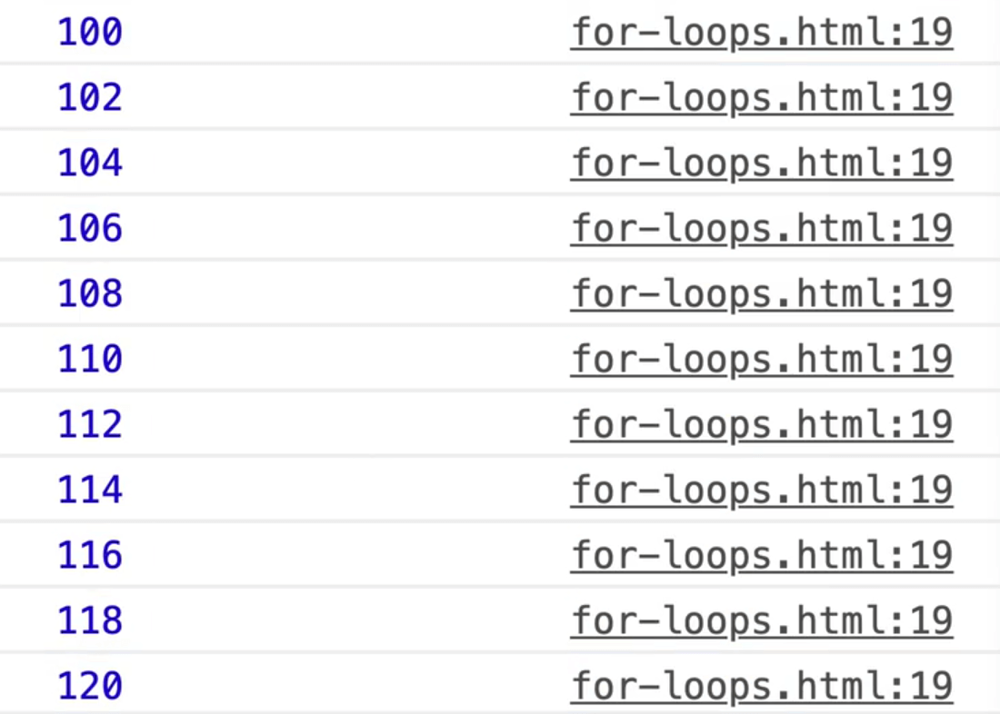
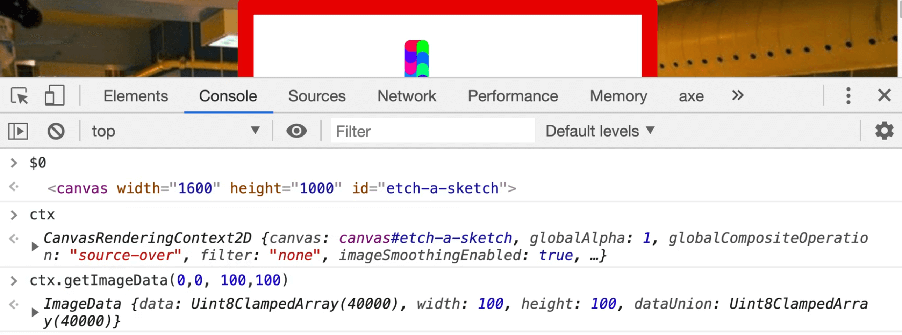
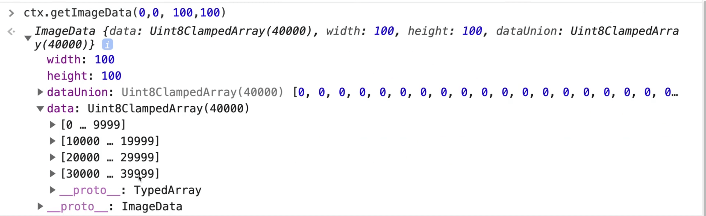
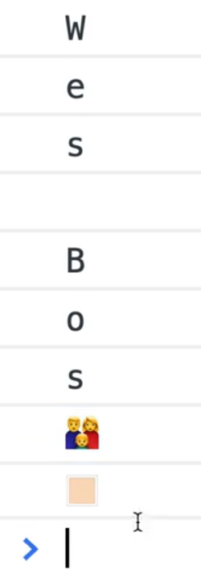
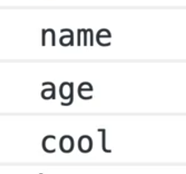
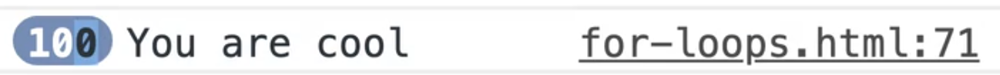

We are going to talk about 4 types of loops in this video:
1. for loops
1. for in loops
1. for of loops
1. while loops

They are not as popular as the array methods that we are working with. However, you should still know them because you will run into them from time to time.

We will be working out of the `for-loops.html` file.

## The for loop

Let's start with the for loop. The way it works is you type `for` with parenthesis and then you open and close a block.

Let's look at the for loop docs really quickly.


The for loop requires three things:
1. an initial expression
1. a condition
1. an increment expression

The plain for loop is great for running a block of code a certain number of times for example 5 times.

Let's start with an extremely basic example.

Add the code below.

```js
for (let i = 0; i<= 10; i++) {
  console.log(i);
}
```

What we did above is:
- we added the initial expression `let i = 0;` within the parenthesis
- then we added the condition if `i` is less than or equal to 10, `i <= 10;`
- finally we have the increment expression which is `i++`

If you open up the page in a browser and look at the console, you should see 0 through 10 logged, just like in the image below.


What has happened in the code is we looped from 0 to 10, so we looped 11 times over, and logged what the `i` variable equals.

Let's go through this piece by piece to make sure we understand it.

You can think of the first piece, the initial expression, as sort of a setup for the code you are about the write.

```js
let i = 0;
```

The second piece, the condition, will run each time before the loop runs. In our example the condition is `i <= 10`.

If the condition is true, then the loop will run one more time, and so on until the condition is false.

Once the condition is false, the loop will no longer run and it will just move on to the next lines of code underneath it.

Finally, the last piece is the increment, which in our example is `i++`.

In this example, we are taking `i`, which we have set to 0, and incrementing it by 1 every time our loop runs. That lets us access this variable, `i`, inside of the loop.

You might be wondering why we made the `i` variable a `let` instead of a `const`.


As you can see, it logs 0 then returns an error.

Let's go over why.

The first time the loop runs, the setup is run (the initial expression) which assigns a variable called `i` and sets it to 0.

Then we check if it is less than 10 (the condition), which is true then the code moves onto the loop block, which logs `i` which is 0 the first time it runs.

Once the loop block has finished running, it comes back and increments the `i` variable (the increment) by 1 like so `i++`.

The error we get in the console is

> Uncaught TypeError: Assignment to constant variable.

You cannot increment a constant variable, so that is a bit of an issue, which is why we use a `let` instead.

What else can you do with `for` loops?

They are helpful for if you want to start at say 100, go until `i` is greater than or equal to 120 and increment by 2.

```js
for (let i = 100; i < 120; i += 2) {
  console.log(i);
}
```



As you can see, this loop is fairly flexible in incrementing the way that we want.

One thing to note is the last part of the loop, the increment part, doesn't have a semi colon.

If you try to add it like so `for (let i = 100; i <= 200; i += 2)`. You will get an exception of "Uncaught SyntaxError".
Thankfully your ESLint should catch that for you and yell at you.

Traditionally, for loops were used to loop over something, like an array of numbers.

It very well may be that you see this in the wild so Wes is going to show us how it works.

You might notice that we are using a variable named `i` again in this example and wondering how that is possible because we have already used it. That is the beauty of `let`. Even though the assignment of the variable `i` is the in parenthesis, it's actually scoped to it's body so you are able to reuse it.

When we used to just have `var` variables, that was not the case.

Let's demonstrate how it used to work with `var`.

Add the following code 👇

```js
for (var i = 0; i <= 120; i += 2) {
  console.log(i);
}

console.log(i);
```


Our code logged 100-120 but then suddenly we see 22.

Why is that?

Because the last time the loop ran, that variable was incremented, so the condition was no longer true but the value of the `i` variable was globally scoped so it remained 22.

So if we wanted to make another loop and we had used `var i`, we would have to find another variable name.

If you wanted to loop over the array the old fashioned way, you could do this. 👇

```js
for (let i = 0; i < numbers.length; i++) {
  console.log(i);
}
```


As you can see, it logged 0 to 11 because there are 12 numbers in our `numbers` array (you can check the length by typing `numbers.length` in the console).

Now to access the individual number, you would have to use the index to retrieve it using square brackets like so 👇

```js
for (let i = 0; i < numbers.length; i++) {
  console.log(numbers[i]);
}
```


That is the way loops used to be done. It is much easier now with a `foreach` and `map` and `reduce` methods. If you do see the old way, maybe ask yourself can I refactor that?

Another place that `for` loops are useful is when you are working with canvas.

If you remember back to our Etch-a-Sketch exercise, the canvas element actually has a method on it called `getImageData` that will allow us to pull the stuff out of that canvas.



If you open the `etch-a-sketch.html` html file, draw in the top left hand corner of the etch-a-sketch and then inspect the canvas, if you click on the canvas element in the inspector and then flip to the console and type `$0`, you should get the canvas element returned.

You should be able to access `ctx` which is the canvas context in the console. Call the following code from the console: `ctx.getImageData(0,0,100,100)`.

That returns a data array with a lot of items, 40000 in our case.



It is a special kind of array called a **ClampedArray** which is used when you have very, very, very large arrays.

The contents of the array are numbers like 255, 0, 119, and they represent RGBA values.


What that code did is it pulled the raw data from the canvas element, and for each pixel on the canvas, it is returning 4 values.


The red is 255, the green is 0, the blue is 119, and then it returns to us an alpha channel which is if it's transparent or not. 255 would be totally not transparent and then 0 is totally transparent.

That is a pretty common thing to do, and if you want to loop over that data, you would have to loop over every single pixel, meaning that you would have to take 4 at a time.

In that scenario a `for` loop that can increment itself by 4 instead of by 1 is very handy.

That is the only place that Wes still uses a for loop.

## for of Loop

The `for of` loop is fairly new to the language and it is actually pretty nice.

So what is it?

It is used for looping over iterables. If you recall, an **iterable** is anything that has a length, so something like an array or a string.

Let's say you wanted to log all the letters in the `name` variable. You could do that with the following code 👇

```js
const name = 'Wes Bos';

for (const letter of name) {
  console.log(letter);
}
```


Why would that be better than splitting the string into an array and using `forEach` like we have learned in a previous exercise?

One thing is it can handle emojis.


For the family emoji, if you log it, you will see we get the family emoji and then the modifier, which is peach skin.



If you tried that with `name.split('')`, you would see something similar to the image below.


As you can see, it doesn't know how to handle the emojis.

Another way you could do it is using the spread operator like so:

```js
[...name]
```


That is one use case.

The other use case is something to do with **promises**, which we have not covered yet.

If you ever need to sequence a bunch of data, meaning you have to do one thing after another in a loop, the `for of` loop will allow you to do something called **await** inside of it.

We will come back to this when we learn about promises later in the course, but now what you need to know is that `for of` loops are very handy for sequencing promises, and that is really the only use case that Wes uses it for.

The `for of` loop can be used with an array as well.

Take the following example 👇

```js
for (const number of numbers) {
  console.log(number);
}
```


The downside of the `for of` loop compared to a `forEach` loo is that it doesn't give us the index. It just gives us the raw value. It also doesn't allow us to filter or anything like that.

## for in loop

Next we have the `for in` loop, which works similarly.

Let's use the `numbers` array for this example.

```js
for (const number in numbers) {
  console.log(number);
}
```


As you can see, we get 0 through 11.

What is actually happening there is it is giving us the keys of the object.

`for in` is used for looping over keys of an object.

Create the following object.

```js
const wes = {
  name: 'wes',
  age: 100,
  cool: true
}
```

Use the `for in` loop with that object.

```js
for (const prop in wes) {
  console.log(prop);
}
```



You might be asking, how is that better than using `Object.entries`, `Object.key` or `Object.values`?

It is not.

Wes prefers to use those over the `for in` loop, but it is still here if you prefer to use it.

There is one gotcha with the `for in` versus `Object.entries`, which we will demonstrate with an example right now.

It looks ahead to this thing called **prototypes**.

Let's make a `baseHumanStats` object as shown below.

```js
const baseHumanStats = {
  feet: 2,
  arms: 2,
  eyes: 2,
  head: 1
};
```

Create a function `Human` that takes in a `name`, and then within that function add `this.name = name;`.

This is getting a bit ahead of ourselves, but we can now use this `Human` function to make a `wes2`?

```js
function Human(name) {
  this.name = name;
}

const wes2 = new Human('wes');
```

If you go ahead and take a look at `wes2` by refreshing the page and typing it into the console, you will see that it has a `type` of human with a `name` that is equal to "wes".

If you were to try typing in  `wes2.arms`, however, you would get `undefined`.


However if we take the `Human` function and set the prototype to be the `baseHumanStats` like so 👇

```js
Human.prototype = baseHumanStats;
const wes2 = new Human('wes');
```

If we take a look at `wes2`, it still looks the same, but if you were to look at `wes2.feet` or `wes2.arms`, you will see that it is referencing the values from the prototype.


What does that mean?

What happens with a prototype is that when you try to access a property, it first checks on the object itself for a property on that. If it is not on there, it will look up the prototype chain.

It will say "okay that is not on here, but maybe the thing that created me has a prototype that has that value", and it will look it up.


In our case this prototype has some sort of base values that it will pull it from.

We will get into this more when we get into classes but the point of all this is the following..

What would happen if you call log `Object.keys(wes2)`?
Will it log the `name` property only?
Or will it also log the properties that are on the prototype (feet, arms, eyes, head)?


We only get `name`.

Let's try entries.

```js
console.log(Object.entries(wes2));
```


We only get the `name` property and value returned to us as you can see above.

Now what would happen if we tried that with a `for in` loop?

```js
for (const prop in wes2) {
  console.log(prop);
}
```


As you can see, it does grab the properties from the prototype that it was made from.

So, if you need to grab the prototype properties and methods, then you can use a `for in` loop to grab those.

However if you do not need to grab those, you're fine with just using `Object.entries`.

## while and do while loops

Next we have the `while` and the `do while` loops.

These are loops that Wes doesn't use all too often but they are still good to know.

`while` takes a condition and run infinitely until the condition is false.

The syntax looks like this 👇

```js
while() {

}
```

Within the parenthesis, we include the condition that we need to check for.

In our example we will check whether the variable `cool` equals true. If it does, we will log "you are cool".

Now be careful if you run this code because it will cause an infinite loop and might crash your computer.

```js
let cool = true;
while (cool === true) {
  console.log('You are cool');
}
```


As you can see, that log is happening all the time, just constantly running in the infinite loop we created.

A `while` loop needs an **exit condition** that will set `cool` to false, or else the condition will never evaluate to false.

Here is an example of an exit condition we could add 👇

```js
let cool = true;
let i = 1;
while (cool === true) {
  console.log('You are cool');
  i++
  if (i > 100) {
    cool = false;
  }
}
```

What should happen is after this loop has run 100 times, `cool` will be set to false, and then the condition will evaluate to false and the loop will no longer run.



As you can see, it ran 100 times before exiting.

It is important to note that someone could set this `cool` variable in another piece of JavaScript code and then the next time it runs, it would check whether it is true or false, so that is one way to do it.

The only different between the `do while` and the `while` loop is that we have a `do` with a block and then a while with a condition on the end, like so 👇

```js
do {

} while()
```

The `do` block will run first, and then it will check the condition after the first run.

With the `while` loop, the condition will always be checked before the first run.

While loops are not that popular, but good to know.
