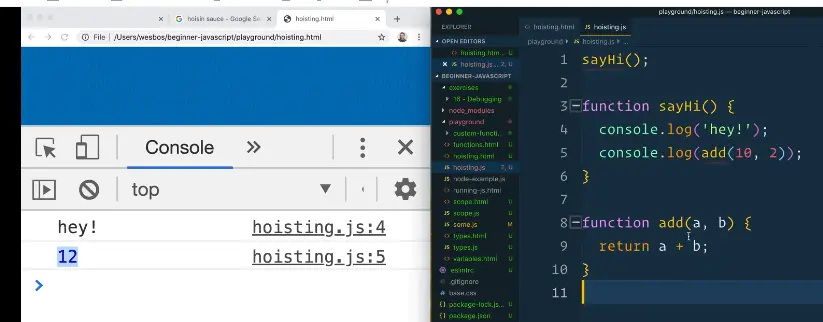
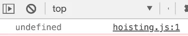
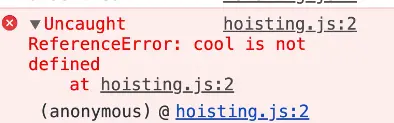

We talked about this a little bit before.

Now we will get into the details about what it is, when you can use it and why you might want to use it.

**Hoisting** in JavaScript allows you to access functions and variables before they have been created.

There are two things in JavaScript that are hoisted:

1. function declarations
2. variable declarations.

## Hoisting Function Declarations

We will focus on function declarations first.

Make a `hoisting.html` file in the `/playgrounds` directory and give it the base html.

Add a script source of `./hoisting.js` and create a new JavaScript file with that name.

Do our usual `console.log('It works!');` to check that it works.

Next, make a function `sayHi();`.

If you try to run this function before it exists, will it work?

You can see ESLint is complaining with warning of:
>`sayHi` was used before it was defined. eslint(no-use-before-define)


```js
sayHi();

function sayHi() {
  console.log('hey!');
}
```

If you open `hoisting.html` in the browser, does it work?

It does.

Why is that?

When you run your JavaScript file, the JavaScript compiler will take all of your function declarations and move them to the top of the file so they are all available before you use them.

Because of hoisting, you can technically run a function before it exists.

Let's do another example.

Add the following function 👇

```js
function add(a, b) {
  return a + b;
}
```

Now use that function within `sayHi()`, like so 👇

```js
sayHi();

function sayHi() {
  console.log('hey!');
  console.log(add(10, 2));
}

function add(a, b){
  return a + b;
}
```

Is that going to work?

It does.



That is because hoisting moves them to the top before it will actually run anything.

So JavaScript rearranges the file and puts all the variable and function declarations at the top of the file.

Why does that functionality exist?

Wes hardly ever uses hoisting, he prefers to declare his functions before using them.

When we get into modules, he prefers to put his separate functions in a module like util functions or math functions, and then import them as he needs them.

One argument Wes has heard for hoisting being useful is people often prefer when opening up a file, say you open up `hoisting.js`, they much prefer to first be able to see _what_ does this file do, and then _how_ does this file do it.

That way if you are quickly jumping into a file, you can quickly see from the first couple of lines "what does this file do".

If you do care about how it does it, you can go a bit further down into the file and see what it does, as shown below 👇

```js
/* What does this file do? */
sayHi();

/* How does this file do it? */
function sayHi() {
  console.log('hey!');
  console.log(add(10, 2));
}
```

Personally, Wes doesn't use this method very much and doesn't like it all that much but that is just his personal opinion.

## Variable Hoisting

The other type of hoisting is called **variable hoisting**.

If you were to go the top of the file and add 👇

```js
console.log(age);
var age = 10;
```

What will happen? Is it going to error? Undefined? 10?

The value is undefined.



If you try to log another variable that does not exist, you will get an error 👇



Why is that?

What is happening is that JavaScript will hoist the variable declarations but it will not actually hoist the setting of the values.

So if after the page is loaded, you type `age` into the console, it will be set to 10.

So what JavaScript does is it says before everything runs, I am going to make my variables and then I'm just going to go ahead and update them.

It is basically doing the equivalent of the following 👇

```js
var age;
console.log(age);
age = 10;
```

You can use hoisting to figure out if variables are created but not what their values are later in the file.

Hoisting is when variable declarations and function declarations are hoisted to the top of the file.

Only function declaration types of functions are hoisted, **not** function expressions (when you put a function in a variable).

Same thing goes with arrow function or any other type of function.

It is important to note that although **let** and **const** variables are hoisted, they are not initialised to `undefined`, unlike **var** variables. Hence, in the above example if you replace var with let or const, you would be presented with a `ReferenceError` saying - `Cannot access 'age' before initialization`
