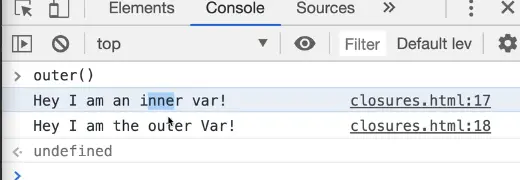
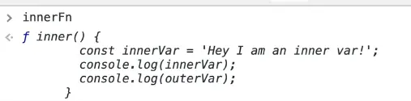
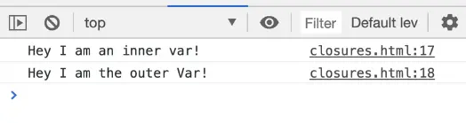
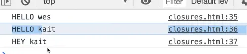
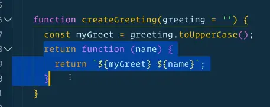
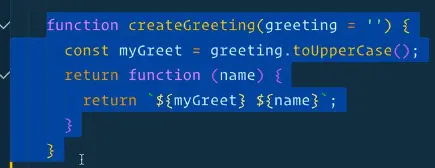
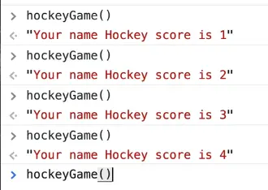
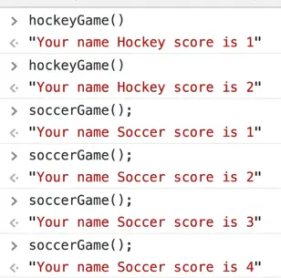
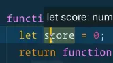

**Closures** is one of the scariest words in JavaScript and a concept that comes up all the time in JavaScript, especially in interviews.

It's a hard  concept to get, but it can be relatively simple to understand. We will tackle now understanding of the basics of what a closure is.

As we build stuff, Wes will mention when something is a closure to give us more context and examples of when closures are used.

Create a new file  `closures.html` in the `playground` directory and add our HTML base.

Open up a set of script tags. Our examples will go within the script tags, like so 👇

```html
<!DOCTYPE html>
<html lang="en">

<head>
  <meta charset="UTF-8">
  <meta name="viewport" content="width=device-width,initial-scale=1.0">
  <title></title>
  <link rel="stylesheet" href="../base.css">
</head>

<body>
  <script>
  //examples go in here
  </script>
</body>
</html>
```

A **closure** is the ability to access a parent level scope from a child scope, even after the parent function has been terminated.

Normally, Wes doesn't like examples that are not real world but since this is a tough concept, we will start with a simple example.

We are going to make a function inside of a function, called `inner` and `outer` to illustrate the concept and then we will get into more fun examples.

Create a function `outer` and within it set a variable `outerVar` equal to "Hey I am the outer var".

Now inside of that, make another function called `inner()` and within it declare the following variable 👇

```js
const innerVar = "Hey I am an inner var";
```

In the previous lesson on scope, we learned that within the `inner()` function, we can add a log of the `innerVar` variable like so 👇

```js
console.log(innerVar);
```

You can also log the `outerVar` within the `inner()` method because of the scope lookup chain.

Since there is no variable called `outerVar` in that function, it will go a level up to the `outer()` function and since it finds that variable there, it will use that variable.

```js
  function outer(){
    const outerVar = 'Hey I am the outer Var';

    function inner(){
      const innerVar = "hey I am an inner var";
      console.log(innerVar);
      console.log(outerVar);
    }

    inner();
  }
```

Now, let's try calling `inner()` from within `outer()`, and open the browser and console and run the `outer()` function from the console.

You should see both the inner and outer variables.



The same thing would happen if you called it from within the html script tag like so 👇

```js
function outer() {
  const outerVar = "Hey I am the outer Var";

  function inner() {
    const innerVar = "hey I am an inner var";
    console.log(innerVar);
    console.log(outerVar);
  }

  inner();
}

outer();
```

The `inner()` function is able to do a scope lookup and see the `outer`. We have already learned about that, and that's not really a closure.

Now the kind of interesting thing, and this is where closures come into play, is where you don't call the `inner()` function from within the `outer()` function but you call it at a later point in time.

So let's not call it from within `outer()`, remove that line of code where we are calling `inner()` and also remove the call to `outer()`.

From the `outer()` function, let's return the `inner` function. You can return it two ways.

The first way is shown below 👇

```js
function outer() {
  const outerVar = "Hey I am the outer Var";

  return function inner() {
    const innerVar = "hey I am an inner var";
    console.log(innerVar);
    console.log(outerVar);
  }
}
```

The second way is like so 👇

```js
function outer() {
  const outerVar = "Hey I am the outer Var";

  function inner() {
    const innerVar = "hey I am an inner var";
    console.log(innerVar);
    console.log(outerVar);
  }

  return inner;
}
```

We will go with the second one and after the `outer()` function, we will add 👇

```js
const innerFn = outer();
```

What we are doing there is:
 - we are running the outer function
- it's creating an outer variable (`outerVar`)
-  then we are returning the inner function, which is why we are sticking it in a variable (`innerFn`).

In the console, when you type `innerFn` it will return the `inner` function like so 👇



The question is, if you were to run `innerFn()` right below the function expression, is the `outerVar` still going to be accessible or will it be `undefined`?

```js
function outer() {
  const outerVar = "Hey I am the outer Var";

  function inner() {
    const innerVar = "hey I am an inner var";
    console.log(innerVar);
    console.log(outerVar);
  }

  return inner;
}

const innerFn = outer();
innerFn();
```

We ran the `outer()` function on this line of code `const innerFn = outer();`, which is where it created the variable, and then it returned the inner function.

Is that still going to be available to us or will it be `undefined`?

If you try that code, you will see that they both work.



What you can do is stick a function into a variable, and then at a later point in time, you can have access to that function. A closure comes into play because you can access the function even though the outer function is done.

We learned in scoping that when a function is done,  anytime there are scoped variables that aren't returned from the function, they are not accessible.

Now we get this weird thing where when we run the function outside of it, it's still able to access it. That is what is referred to as a **closure**.

JavaScript is able to create functions inside of functions, and it can still reach outside to the parent scope, and even though the outer function is done running, it will still maintain that variable in memory so that we can then access it at a later time.

The variable is not **cleaned up** or "**garbage collected**" which is a term that is often used.

Why would that be helpful? It looks very confusing.

## Examples of Closures

Let's look at some actual examples.

First, we will go over an example of a closure creating a function which is what we just went over.

The second example will be how you can use closures to create what are called **private variables**.

Comment out the previous code we had added in the script tags, and add the following 👇

```js
function createGreeting(greeting = "") {
  const myGreet = greeting.toUpperCase();

  return function(name) {
    return `${myGreet} ${name}`;
  };
}
```

This function:
- takes in a greeting, the default of which is an empty string
- assigns it to the `myGreet` variable which takes the greeting that got passed in to the function
- then runs `toUpperCase()` against it.

From there, we will return a function, which we don't have to name, which will take in the persons name and return a greeting.

Why is that helpful?

Why did we do this in two separate functions?

Because you can create functions that are based off whichever greeting you like.

```js
const sayHello = createGreeting('hello');
const sayHey = createGreeting('hey');
console.log(sayHello('wes'));
console.log(sayHello('kait'));
console.log(sayHey('kait'));
```

If you refresh you will see the following in the console 👇



What is happening here is that when we create the outer function `createGreeting(){...}`, we had created a variable inside of that function, which is then accessed at a lower scope.

We've got inner scope here 👇



And we have outer scope here 👇



Since our inner scope references a variable that was created in our outer scope, that is what is referred to as **closure**.

We still are able to access our outer variables inside of the outer function scope, inside of our inner even after the `createGreeting()` function has been closed over. That is the whole idea behind closures, it's been closed.

That is the first example where you have functions inside of functions and they are able to access the closure data inside of that.

## Private Variables

The other sort of similar way is to create something called **private variables**.

We will demonstrate it with another example.

We are going to create a function, `createGame` that will take the name of the game as a parameter.

Inside of the function we will declare a variable `score` and another function `win` within, in which we will increment the score and return a string with the name of the game and the score.

Next we will create a variable `hockeyGame` and assign it to the `createGame()` function where we will pass "Hockey" as an argument.

Add the following code 👇

```js
function createGame(gameName){
  let score = 0;

  return function win(){
    score ++;
    return `Your name ${gameName} score is ${score}`
  }
}

const hockeyGame = createGame('Hockey');
```

_(Note: if you forget to add the `return` keyword that is in front of the `win()` function, when you try to run `hockeyGame()` in the console, it will throw an error saying `hockeyGame is not a function`.)_

Now, whenever we run the hockey game function, a message will be logged in the console showing the incrementing score.



What is happening there is the function that we create is called `win()`, and we are using a `score` variable.

So whenever we create the game, we initialize a score variable with a value of 0.

And then the inner function, whenever we actually run it, will increment the score variable that is of the outer scope.

Why is that helpful?

That allows you to maintain multiple games at once.

Under the `hockeyGame` variable, we will declare another variable, like so 👇

```js
const soccerGame = createGame('Soccer');
```

Now we can do this in the console 👇





Even though the `score` variable 👆 is the same variable name, because we have created two separate `win()` functions by using the `createGame()` function, they each have their own private variable score.

Currently there is no way for us to access `score`.

If you try to access it in the console, you will get an error like the following
> score is not defined

There is no way for us to access that unless we were to explicitly return that variable or as we did in this example, by putting it into a string.

To recap:

Closures are the ability of a child function, or an inner function, to access variables from a higher level scope even after the functions have been called or closed or closed over.
