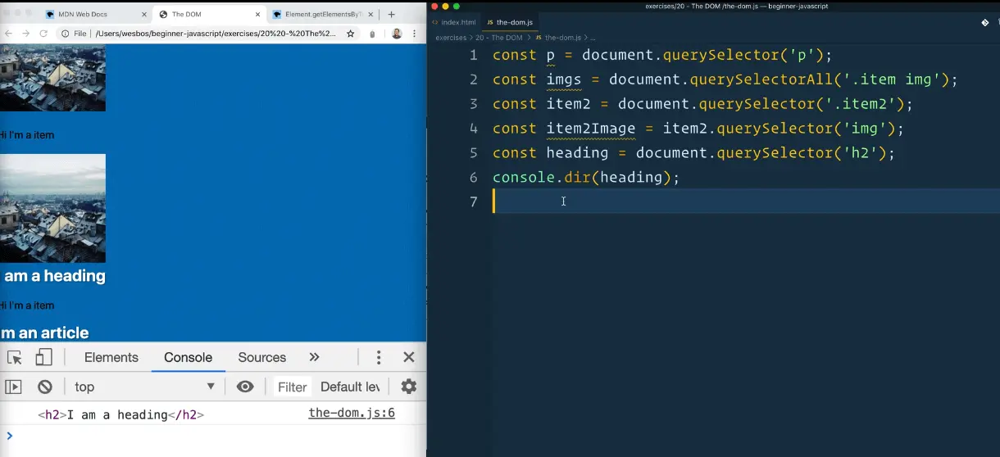
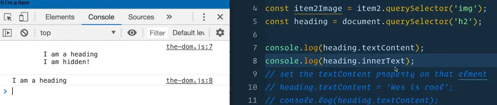
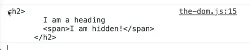
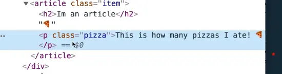
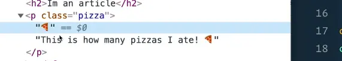
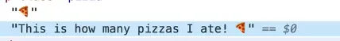
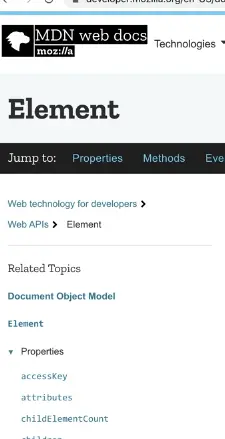

Now that we know how to select elements, let's go over what we can do with them.

Start by selecting an `h2` element from the page and logging it. 👇



Although in the console it looks like the `heading` variable is the actual element, in reality it is an object that has a lot of properties and methods inside of it.

If we change the `console.log()` to a `console.dir()`, that will show us the object properties instead of the actual element itself.

It's still the same `h2` tag, but you can see all the properties on it.

One example of that is `parentElement` which shows you what the parent element is.

There is `outerText` `textContent` `outerHTML`, and many other properties.

## Getters and Setters

We can use those properties as getters to get the data from the element that we need, or we can use them as setters.

We will demontsrate this using `textContent`.

```js
const heading = document.querySelector('h2');
console.dir(heading.textContent);
```

The code above is an example of a getter.

A setter is when you update the property.

An example of that would be `heading.textContent = 'Wes is cool';`.

Now when you reload the page, you will see Wes is cool in the console.

### textContent and innerText

`textContent` and `innerText` are very similar properties, `textContent` is the newer one.

The only difference is that `innerText` returns only the human readable content whereas `textContent` will get the contents of all of the elements, including script and style elements.

```html
<h2>
  I am a heading
  <style>
    h2 {
      color:red;
    }
  </style>
</h2>
```

Let's say your `h2` looked like the code above for some reason 👆

If you log both the `heading.textContent` and `heading.innerText`, you will see that `textContent` includes the content within the style tag whereas `innerText` only returns the text `I am a heading`.

`textContent` returns every element in the node.

`innerText` is aware of styling and won't return text of hidden elements.

Let's say you have the following code 👇

```html
<h2>
  I am a heading!
  <span>I am hiddden!</span>
</h2>
<style>
  h2 span {
    display: none
  }
</style>
```

`textContent` will return the "I am hidden!" text, however `innerText` will not.



We have a set of properties when working with HTML. If we were to log the `innerHTML` of the `h2`, you would see 👇


There is also `outerHTML`, which should include the `h2` tag and whitespace that goes inside of it.



If you ever want to add text onto something is another useful thing to learn.

## Exercise

Go to `index.html` and modify the code as shown below 👇

```html
<article class="item">
  <h2>Im an article</h2>
  <p class="pizza">This is how many pizzas I ate! 🍕</p>
</article>
```

What we are going to do is build something to add more pizza emojis to the end of it.

First we need to select it.

```js
const pizzaList = document.querySelector('.pizza');
console.log(pizzaList.textContent);
```

To update the `textContent` we could use the code below 👇

```js
pizzaList.textContent = `${pizzaList.textContent} 🍕`;
```

That will take what was already there and adds a pizza emoji to the end.

That method can be slow in some applications that have lots of text and html, because it causes the browser to re-render the entire list.

## insertAdjacentText and insertAdjacentElement

To fix that, what we can do is add text onto the end using a different method, either  `insertAdjacentElement` or `insertAdjacentText`

That will give us the ability to add stuff to the back or the front of it.

```js
pizzaList.insertAdjacentText()
```

If you go to MDN and search for `insertAdjacentText()` you will see that it is not a property, it is a method, meaning it is a function that we run _against_ the element, like we do for `querySelector` and `querySelectorAll`.

It takes two arguments:
1. the position (`beforebegin`, `afterbegin`, `beforeend`, `afterend`)
2. the text that you want to pass it.

MDN says the second argument is element but it's actually just the raw text you want to add.

Add the following code 👇

```js
pizzaList.insertAdjacentText('beforeend','🍕');
```

If you refresh `index.html` you should see two pizza emojis now.

It works the same as the other way we tried earlier, however this is the best way to attach text to the end of something.

If you were to try  👇

```js
pizzaList.insertAdjacentText('beforebegin','🍕');
```



That will put the pizza emoji before the paragraph entirely, it's not inside of that element. We would want to use `afterbegin` to add the pizza in front of the text.



The browser actually knows that the pizza emoji was added later, because the text is split up between what we used to have and what we inserted.



That is actually the difference between elements and nodes.

**Nodes** can be anything, but an actual **element** is something that is wrapped in a tag.

It is a little bit confusing because everything is a node, and it only upgrades itself to an element if you have wrapped it in a tag.

If you are wondering what all the possible methods are, we will stumble upon different properties and methods as we build out our exercises.

You can go to the MDN docs and go to element, it will tell us what all the properties are of elements.



That wraps up elements. We covered how to get properties from an element, how to set properties on an element and how to use more powerful methods on each of our elements or nodes.
