In this section of the course we will be learning about Objects and Arrays.

In this particular video, the focus will be on objects.

**Objects** are another fundamental building block of JavaScript, just like strings, numbers and booleans. Actually, almost everything in JavaScript is an object, as you soon will see.

So, what are they?

Objects allow us to group together **properties** and **values**, or **keys** and **values** is what they are often called (throughout the course Wes will be saying **properties** and **values**).

Objects have many uses from storing related data to storing functionality, all the way through to creating your own custom types.

Objects are used for when the order of the properties does not matter.

That is very important to note.

Let's do an example to demonstrate this.

Open `objects.html` and add the following code in the body tag 👇

```html
<script>
  const person = {
    name: "wes",
    age: 100
  };

  console.log(person);
</script>
```

Now if you log the person object, what will you see?

You will probably see the object displayed with the properties in the same order.

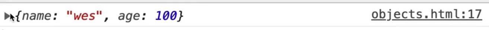

If you modify the code to swap out `age` and `name` so `age` comes first and then log, you will see that the properties also changed order when you logged it.

However, just because the JavaScript interpreter does that, never rely on the properties that you put into the object being in the same order.

## Creating an Object

Typically when you create an object, you are going to open up a curly bracket, and then go ahead and close that curly bracket like so 👇

```js
const person = {

};
```

That is called the **object literal** syntax.

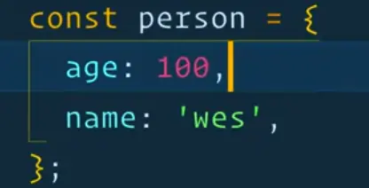

You can also create an object like this 👇

```js
const person = new Object({
  name: "wes",
  age: 100
});
```

You probably won't see that notation often or ever because the object literal syntax is much cleaner.

In fact if you wanted to, you could create strings by doing `const name = new String('wes');` but we don't because it's simpler and shorter to use the **string literal syntax**.

_Note: we will talk about the `new` keyword in coming videos._

Let's talk about some of the keywords related to objects.


The **property** is on the left, and then there is a colon and then we have the **value** on the right.

The values of an object can be any type (string, function, boolean, other objects, arrays etc).

So for example, let's say we have a variable, `age` which is set to 100 like so `const age = 100;`.

Now you could swap out the hardcoded age from the person's object and instead assign it the variable like so 👇

```js
const age = 100;

const person = new Object({
  name: "wes",
  age: age
});
```

If you log the `person` object now, you will see that `age` still shows the value of 100.

That's a pretty common thing that we'll do.

Now if you ever run into this situation where the property is the same name as the value variable that you're setting it to, you can simply get away with simply writing age like this 👇

```js
const age = 100;

const person = new Object({
  name: "wes",
  age
});
```

`age` is both the property name and the value because the `age` variable is being used for the `age` property.

That is the exact same thing as doing `age: age`.

The properties of an object pretty much follow the same rules as variables and Wes would recommend that you use the same rules as variables.

However, you can go a bit further with the properties of an object.

For example let's say you added one more property to the `persons` object 👇

```js
const person = new Object({
  name: "wes",
  age,
  "cool-dude": true
});
```

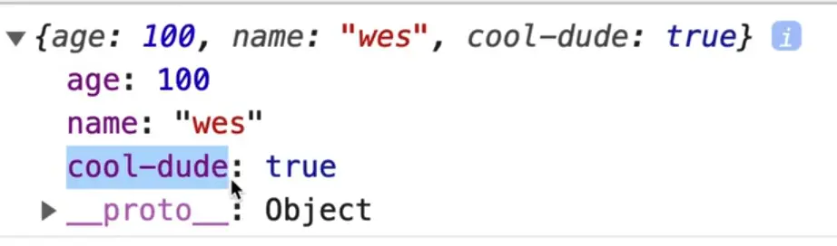

As you can see, you can have a property with a dash in it, whereas you cannot have variables with dashes in them.

Similarly you can also have spaces and numbers in your properties like so 👇

```js
const person = new Object({
  name:'wes',
  age,
  'cool-dude': true,
  'really cool dude': false,
  '777': true,
});
```

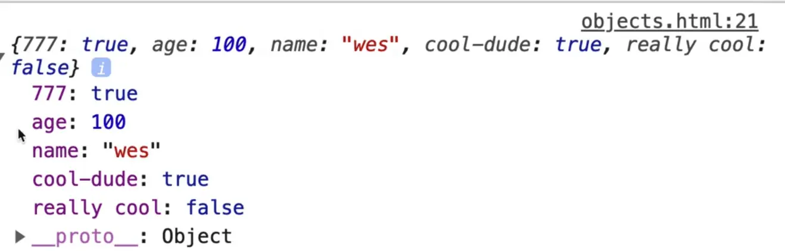

Also, you might notice that in the console the order of the properties look different from our code, which is expected and fine.

After each property, you might notice that we add a comma.

Wes recommends adding a comma after the last property in the object, even if there is nothing that comes after it.

That is what is called a **trailing comma** or a **comma dangle**.

It's not totally necessary, but putting a **trailing comma** on there will make sure that the next time you come around and add in a property, we can easily add it.

What happens all the time is if you don't leave a trailing comma, the next time you go to add a property it's very easy to forget to include the comma.

If you forget to add a comma between properties, you will see an error similar to what is shown below.


Another reason is version control.

Let's say someone else is coming in and editing your code.

Instead of just adding a new property, they have to edit the line above to add a comma, and even though you only modified the line above by adding a comma, it will show up in git blame that you modified that line of code last.

_(Git blame is a git functionality that shows who wrote which line of code.)_

It used to be that comma dangles weren't supported, but now all modern browsers do support the comma dangle on object properties.

Other things you can do is add **nested properties** or **nested objects**. For example, you can create a property called *clothing* and assign it a sub object like so 👇

```js
const person = new Object({
  name: "wes",
  age,
  "cool-dude": true,
  "really cool": false,
  "777": true,
  dog: "snickers",
  clothing: {
    shirts: 10,
    pants: 2
  }
});
```

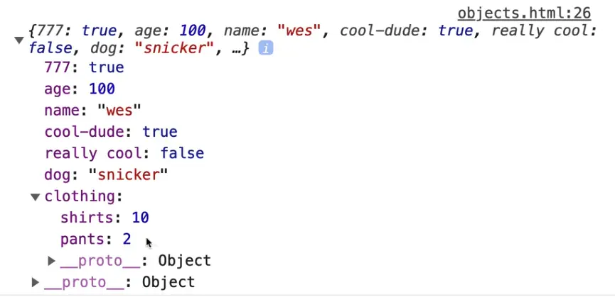

As you can see, now the `person` object has a nested object `clothing` which has `shirt` and `pants` properties.

You can nest objects as deep as you could possibly want.

There is a gotcha about copying or cloning objects which we will talk about in just a second.

You can add new properties to an object even after it has been created, using the dot notation.

For example if we wanted to add a `job` property to the `person` object, you could simply add this line of code 👇

```js
person.job = 'Web Developer';
```

Now if you were to take a look at it in the console, you will see the `job` property has been added and is now part of the object.

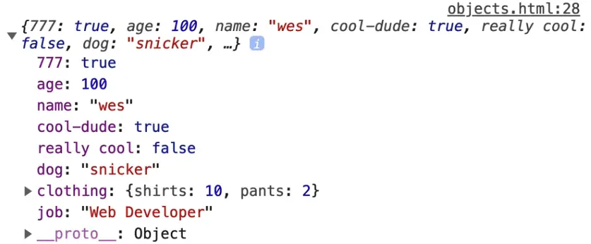

Similarly if you were trying to overwrite a property, you could do that as well.

For example, is you add this line `person.age = 50;` and then refresh the HTML page and look at the console, you will see that `age` is now set to 50 even though when creating the object, we set it to the variable `age` which was 100.

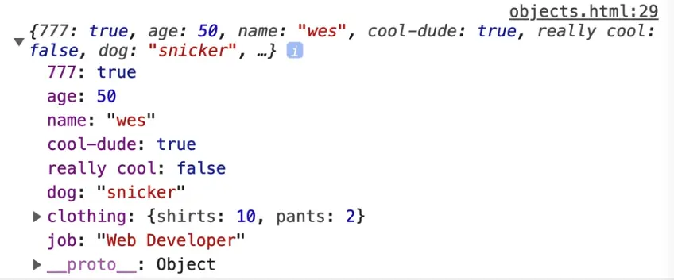

You might have noticed that the `person` object is a `const` variable, however you just went ahead and changed part of it.

That is a gotcha in JavaScript.

`const` does not mean that the value of an object cannot be changed. `const` means that the binding (reference) to that variable cannot be changed.

What does that mean?

To explain, let's rename the `person` variable to `wes`.

You code should now look like this 👇

```js
const age = 100;

const wes = new Object({
  name: "wes",
  age,
  "cool-dude": true,
  "really cool": false,
  "777": true,
  dog: "snickers",
  clothing: {
    shirts: 10,
    pants: 2
  }
});

wes.job = "Web Developer";
wes.age = 50;
console.log(person);
```

Think about it like this.. Wes is Wes, he has been born and this object represents properties about him.

Those properties can change as he grows up, however no one can ever replace him. No one can ever overwrite the binding to him.

No one could ever come by and say "oh a new Wes was born" and create an object like this further down in the code 👇

```js
wes = {
  name: 'Westopher',
  age: 12,
  job: 'Web Master'
}
```

You can't do that.

If you refresh the HTML page and open the console, you will see this error 👇

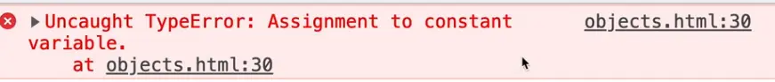

Even if you put the keyword `const` in front of the second `wes` object, you will still get an error that says
>Identifier 'wes' has already been declared.

It doesn't work because the binding to `wes` has already been created.

Even though properties on the `wes` object can change, the actual object itself will can never be overwritten entirely.

If you do ever want to freeze the values in an object, what you can do is create a frozen object.

You use the capital "O" `Object` and call `.freeze()` on it and pass the object to it that you want to freeze.

Add the following code at the bottom of the script tag 👇

```js
const wesFroze = Object.freeze(wes);
```

That will freeze the original object `wes`, and return it. In this case, `wes` and `wesFroze` are exact same objects. 

`freeze()` returns the exact same object that was passed into the function. It does not create a copy.

To demonstrate this, refresh the HTML page and then type `wesFroze` in the console. That should return the object.

Now type in `wesFroze.age = 100` to try to overwrite the age, and hit enter (it should return 100).

Now type in `wesFrozen` again and the object should be returned to you and the `age` property should still be set to 50.

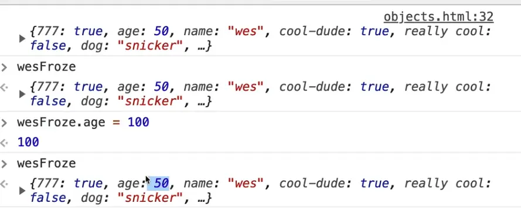

So if you ever want to make an object so it cannot be changed, you could do that with `Object.freeze()`.

The word in programming that we use to describe something that cannot be changed is **immutable**. **Mutation** is changing a value.

### Accessing Properties

Wes has already shown us one way to access properties, which is using the dot notation.

For example to access the job property you would write `wes.job` which would return "Web Developer".

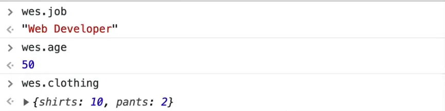

Just like when we looked at DOM elements, we have `getters` and `setters`, `objects`. That is the exact same thing with an object.

In fact, a DOM element is just an object with a bit of extra functionality added to it.

That is the first way, and that is typically the approach you will use in almost every use case.

However, we have this other notation to access properties and that is with **square brackets**.

Similarly to how you can access the property using the dot notation you can also use **square brackets**.

You simply write the object name then a set of square brackets, and between the square brackets you give the property name in strings, like so 👇

```js
console.log(wes.age);
console.log(wes["age"]);
```

Why do we have that? That seems like a much uglier way to access the properties.

There are a few reasons.

One reason is that this method allows us to pass a variable that is a string type to the square brackets instead of passing a string directly.

Let's do an example.

In the `person` object, add another property like so 👇

```js
const wes = new Object({
  name: "wes",
  propertyToCheck: "NEVER",
  age,
  "cool-dude": true,
  "really cool": false,
  "777": true,
  dog: "snickers",
  clothing: {
    shirts: 10,
    pants: 2
  }
});
```

Remove the square bracket log we added above and add the following code instead 👇

```js
console.log(wes.age);
const propertyToCheck = prompt("What do you want to check?");
console.log(propertyToCheck);
console.log(wes[propertyToCheck]);
```

As you can see, instead of passing `"age"` to the square brackets, we are passing the `propertyToCheck` variable instead.

The value of `propertyToCheck` is assigned to whatever we enter into the prompt.

Refresh the HTML page and you should see the following 👇

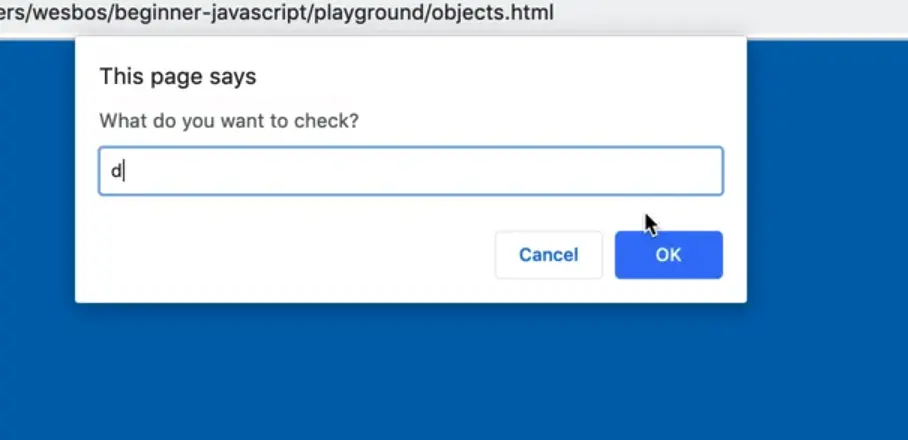

If you open the console and then enter a property into the prompt such as `age`, you will see the value is logged.

For example, if you were to type in `clothing`, it gives you the object that is the clothing.

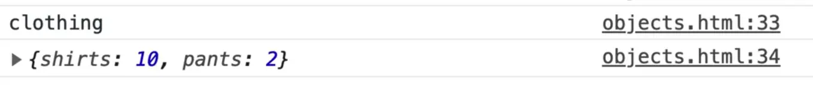

That is one reason: when the property of the object is stored in a variable, because you can't just write `wes.propertyToCheck` because the code will literally look for a property named `propertyToCheck` on the object, it will not be able to interpret that it is a variable.

Let's test this out. Add the following line of code and refresh the HTML page 👇

```js
console.log(wes.propertyToCheck);
```

You should see the word "NEVER" logged in the console.

Wes asked us to add that property earlier to demonstrate that if you use the dot notation, the code will assume you are looking for a property with that name, and it will not know it's a variable.

If the property name is stored in a variable, you **must** use square brackets.

There is another reason, which sometimes the properties of your object are not referenceable via JavaScript, and instead you have to use a string.

Comment out the following code as demonstrated below and refresh the html page.

```js
// const propertyToCheck = prompt("What do you want to check?");
// console.log(propertyToCheck);
// console.log(wes[propertyToCheck]);
```

In the console, you can write `wes.age` and the age will be returned, however you cannot type `wes.cool-dude` for example because they are invalid property lookups.

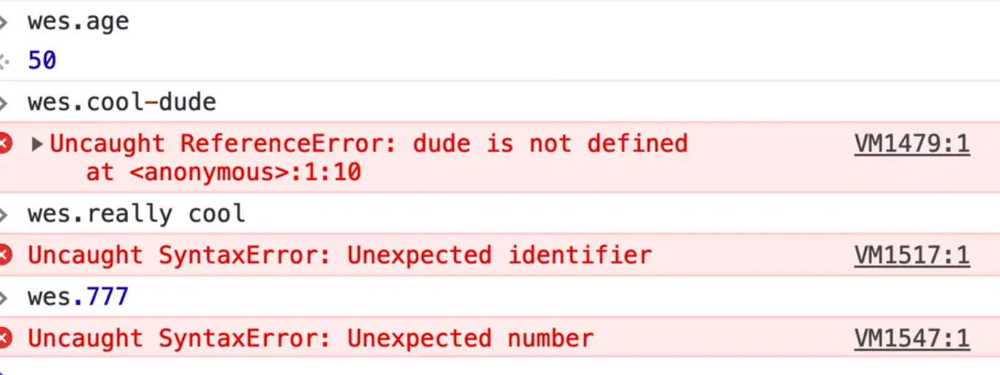

So if that is the case for all three of those properties, (`777`, `really cool`, `cool-dude`) you would have to use square bracket notation to access them.

So why is that there if it's not really a good idea?

Well sometimes you get data that comes from another language, or you get data that comes from serverside. If that's the case, you don't really have a whole lot of options so you have to use the square bracket notation in order to reference it.

To reference multiple levels deep, it's the same.

For example you would write `wes.clothing.pants` to return the value of the pants property within the children object that is nested within the wes object.

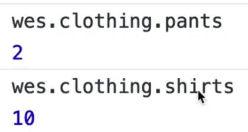

The only gotcha there is if you try to access a property on an object that does not exist, such as `wes.jobs`, it will evaluate to `undefined`.

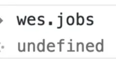

However, if you try to access a nested property on a property that does not exist, it will throw an error 👇

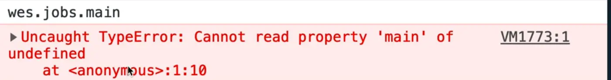

This is a very common error 👇

> Uncaught TypeError: Cannot read property 'main' of undefined
>    at `<anonymous>` :1:10

That is because there is no property that exists on that `undefined` value.

Because `wes.jobs` is `undefined`, there are no properties that live inside of that.

If that is the case, the you have to write the following to not throw an error 👇

```js
wes.jobs ? wes.jobs.side : 'Jobs doesn't exist`;
```

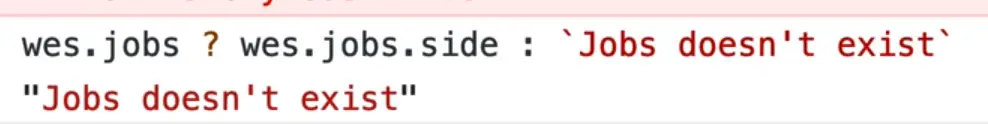

There is a proposal and hopefully it will be out soon, which will allow us to do a deep check.

It will allow us to do something like this  👇

```js
wes?.jobs?.side
```

What that would do is the code would say does `wes` object exist?

If so, check is the `jobs` property exists, and if so, get the value of `side`.

That would allow us to do many layers deep.

It is often the case that we have to write code like this to safely check for the existence of a nested property 👇

```js
if (wes && wes.jobs && wes.jobs.first) {

}
```

Sometimes you don't know if any of the properties exist and instead have to check one by one or else you will run into the "cannot read property of undefined" error.

_NOTE: This currently does not exist. If you wish to see the status of it, search "Optional Chaining MDN"._

You will often use an if statement like that when you are using inputs.

To demonstrate, add the following code right after the opening body tag 👇

```html
<body>
<input type="text" name="first">
```

If you refresh the HTML page, you will see the input on the page 👇


Often what happens is we will try to select that input from the form as shown below.

```js
const nameInput = document.querySelector('[name="first"]');
const name = nameInput.value;
console.log(name);
```

Set a value on the input so that it is there on page load by modifying the code like so 👇

```html
<input type="text" name="first" value="Wes" />
```

When you refresh the page, you should see "wes" in the console.

However, if you comment out that input and then refresh the page, you will get an error
>cannot read property value of null

Why does that happen?

Because you are assigning to the variable `nameInput` an HTML element that does not exist so `nameInput` is null.

And then it checks for a property called `.value` on it.

So if that were the case (and you run into this all the time), you have to do the following 👇

```js
if (nameInput) {
  const name = nameInput.value;
}
```

However there you are making a scoped `const` variable which isn't very useful because it cannot be used outside the if block.

To fix that you could do 👇

```js
const name = nameInput? nameInput.value : '';
```

That code is first checking whether `nameInput` exists.

If it does, it gets the `value` property on it, and if it doesn't, the name variable evaluates to an empty string.

### Deleting a Property from an Object

To delete a property object you use the `delete` keyword.

For example `delete wes.job;` will delete the job property.

If you are curious if it worked or not, you can save the result in a variable or simply log it and a delete will either return true or false based on whether it is deleted or not.

Add the following code 👇

```js
console.log(delete wes.job);
```

Now if you take a look, you will see it is `undefined`.

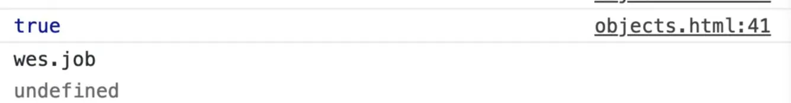

Sometimes you will also see people setting values to be `null` or `undefined`, for example `wes.age = undefined;` or `wes.age = null;`.

Those are not deleting the properties, they are simply setting them to be `null` or `undefined` (in some frameworks that will allow the code to just skip over it).

### Methods

Now, let's talk about methods.

We have already talked a lot about this.

As we went over earlier, the difference between a method and a function is that a method is just a function that lives inside of an object.

That is all we have learned so far.

If you go back to the `wes` object and add a property `sayHello`, and you can set it to a function, and that function could take in a greeting if you want _(the function works the same as any function that you would have)_ and from that `you` could return the greeting in a string and then the `name` like so ;po

```js
const wes = new Object({
  name: "wes",
  propertyToCheck: "NEVER",
  age,
  "cool-dude": true,
  "really cool": false,
  "777": true,
  dog: "snickers",
  clothing: {
    shirts: 10,
    pants: 2
  },
  sayHello: function(greeting = "Hey") {
    return `${greeting} ${this.name}`;
  }
});
```

Now if you refresh the page, open the console and type in `wes.sayHello()`, you should see "Hey Wes" in the console.

You can also try passing in a greeting as shown below, which would return "Hello wes".

```js
wes.sayHello('Hello');
```

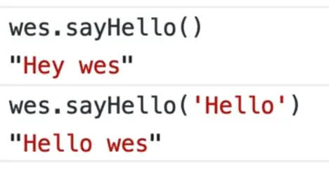

You may be working what is the `this` keyword that you use in the `sayHello` function when you call `${this.name}`.

Like we have mentioned in the past, when you take a look at a method, and if you look to the left of the dot, `this` will always be equal to the left of the dot.

So in this case, `${this.name}` is going to be equal to "wes" because that is the value of the `name` property on our object.

You can access the other properties using the `this` keyword too.

The reason you use the `this` keyword instead of using `${wes.name}` within the `sayHello` function is because when we get into **prototyping**, you are going to see how you can use methods like `sayHello` on multiple people rather than just on a person named wes.

You could create a `person` object that is a new instance of Wes or Scott and Kate etc.

In that case, the `sayHello` method will exist on all of them, and you can reference the current person's name using `${this.name}`.

We will get into that a lot more in the future once we get into prototypes.

For now, just know that when you have a function as a property on an object, that is referred to as a _method of that object_.

There also is a method shorthand that consist of taking the `function` keyword away and the colon like this 👇

```js
const wes = new Object({
  name: "wes",
  propertyToCheck: "NEVER",
  age,
  "cool-dude": true,
  "really cool": false,
  "777": true,
  dog: "snickers",
  clothing: {
    shirts: 10,
    pants: 2
  },
  sayHello(greeting = "Hey") {
    return `${greeting} ${this.name}`;
  }
});
```

That is just a shorthand, it does the exact same thing. It is **not** an arrow function.

However, you can add arrow functions.

Let's add another property called `sneeze` like so 👇

```js
sneeze: () => {
  console.log("AHHHH CHOOO");
}
```

That is still a method, however because it is an arrow function as a property on an object, we do not have access to the this keyword.

If you also try to console log the `this` keyword like so, you will see it evaluates to window.

```js
sneeze: () => {
  console.log("AHHHH CHOOO", this);
}
```

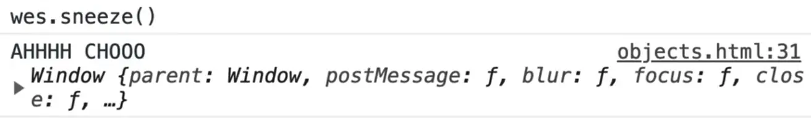

If you were to change that, to a regular function, `this` would be equal to wes.

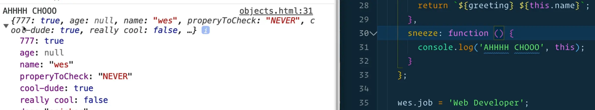

We will go into why that is later but the short answer for now is that arrow functions do not scope `this` to the thing they are called against, and the parent scope will inherit that.

That is a high level overview of what objects are.

In the next few videos we will get deeper into things you need to know, such as little gotchas before we can then dive into arrays.
