An important thing to understand in JavaScript is the difference between a **reference** and a **value**.

We will use an example to highlight the differences.

Let's say you have the following 2 variables, both assigned the value of 'wes' 👇

```js
let name1 = 'wes';
let name2 = 'wes';
```

You can check if those variables are equal by adding this line of code `console.log(name1 === name2);`, which should return true because both values are identical in both value and type.

However, what if you assign `name1` the value of "scott", and then check if they are equal like so? 👇

```js
let name1 = 'wes';
let name2 = 'wes';

console.log(name1 === name2);
name1 = 'scott';
console.log(name1 === name2);
```

That will return false, which is no surprise.

```js
name1 = name2;
```

Now, the question is, what if you set `name1` to equal `name2` as shown above 👆?

If you log again to check the comparison, it will return true.

If you check the value of each variable, `name1` and `name2` will both return "wes".

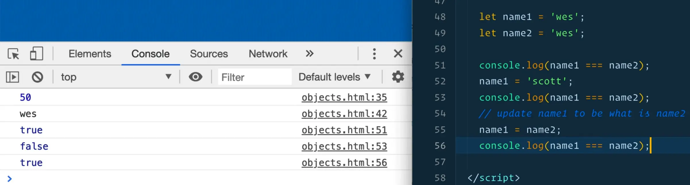

If you were to take `name2` and set it to `name1`, that is the same thing, both values would still equal "wes", like so:

```js
name2 = name1;
```

Now the question is, if you change `name2`, like so `name2 = 'westopher';`, will `name1` and `name2` still be equal?

You can check what both variables evaluate to by typing them into the console.

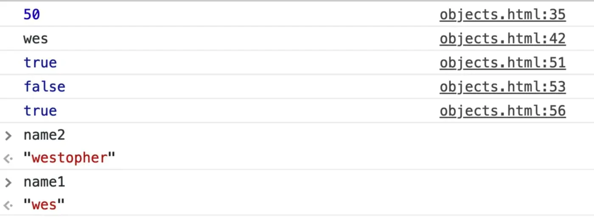

You will notice that `name1` is still "wes" while `name2` is "westopher", because we have not updated `name1`.

So there are a couple of things to note in this exercise:

- The triple equals checks that both the type and the value are identical.
- When the set one string variable to be another, the value is copied from one to another. Meaning that when you take `name1` and set it to `name2` (`name1 = name2;`), it just takes the value of `name2` and pastes it to `name1`.
- When you update one of the variables, the one pointing to it does not update itself. You may be saying duh, obviously, that's how variables work. But now we will go over how that works for objects, because the example we did was with a string.

Let's demonstrate this with an object now.

Create a `person1` variable and assign to it an object with `first` and `last` properties like so 👇

```js
const person1 = {
  first: "wes",
  last: "bos"
};
```

Duplicate that code by copy and pasting and renaming the variable to `person2`.

```js
const person1 = {
  first: "wes",
  last: "bos"
};

const person2 = {
  first: "wes",
  last: "bos"
};
```

If you refresh the HTML page and open the console, if you try typing in `person1 === person2` you will see it is returning false.

Why?

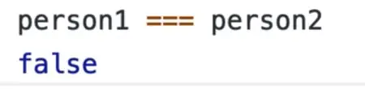

You be thinking "it's the exact same object. It's an objects with the same contents inside of it, so why are we getting false when we are checking them?".

That is because when you are comparing objects, it is done by reference to the object itself, not the values inside of it.

So in our example, `person1` and `person2` are both objects with the same contents inside of them, but they are not the same because they are not the same object.

That is difference from the contents of a string because a string can only have a value whereas an **object** and, as we will learn, **array** can have multiple things inside of them, whether they are property and values, or just straight up items.

Next thing we need to know about objects is that if you make a new `person` object like so 👇

```js
const person3 = person1;
```

If refresh the HTML page and look at `person3` in the console, you should see the following 👇

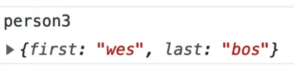

Now if you go ahead and update `person3`'s name as demonstrated below, what will you see in the console when you log `person3.first`? 👇

```js
const person3 = person1;
person3.first = 'Larry';
console.log(person3.first);
```


You get Larry.

However, what if you log `person1.name` as shown below? 👇

```js
const person1 = {
  first: "wes",
  last: "bos"
};

const person2 = {
  first: "wes",
  last: "bos"
};

const person3 = person1;
person3.first = 'Larry';
console.log(person3.first);
console.log(person1.first);
```

If you look at the person1 object, we have set "wes" as first and "bos" as last. So `person1.first` should be Wes, right?

WRONG! It returns Larry.

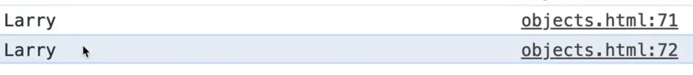

If you try typing `person1`, `person2`, and `person3` in the console, you should see the following returned 👇

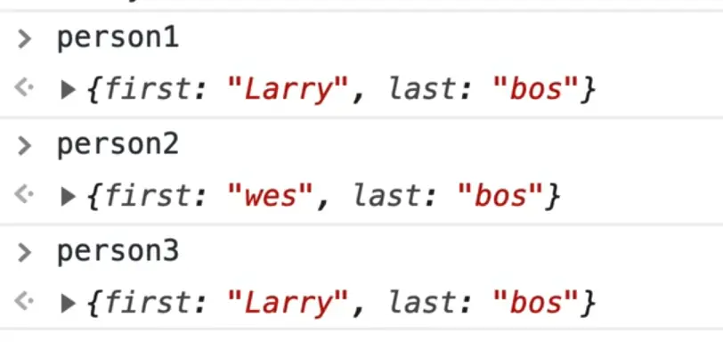

What is going on there?

You just updated `person3`, but for some reason, `person1` was updated as well.

In the console, let's try updating `person3.last` like so: `person3.last = 'Cool'`. So `person3.last` should now return "Cool", but what about `person1`?

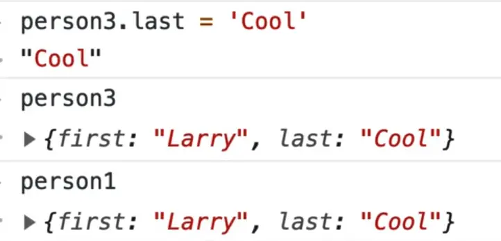

So what the heck!? Why is `person1` being updated?

The reason that it happens is a fundamental concept of JavaScript, that will come and bite you in the butt if you don't understand it.

The reason that it happens is that when objects and arrays are copied by reference, (like you did with `const person3 = person1;`), you are not taking a copy of it.

You are simply creating a variable that references, or points to, the original variable instead of making a copy of it.

That can lead to unexpected bugs down the road because you might think you're simply creating a copy of it, and then modifying it, but you are not.

`person3` was never it's own object, it was just pointing at the original object.

The same thing works with Arrays and Maps and Sets which we will learn in the future.

So what are your options as a developer when you want to take a copy instead of referencing?

There are a couple of different ways you can copy an object.

## Spread Operator

The easiest way to copy something is via something called a **spread**.

A **spread** is a three dot operator and it's used for taking every single item in a object and spreading it into a new object.

So instead of doing `const person3 = person1;`, you would do something like this 👇

```js
const person3 = { ...person1 };
```

What you are doing there is you are assigning the variable `person3` to a new object using the object literal syntax, and then using the spread operator within the object literal to copy `person1`.

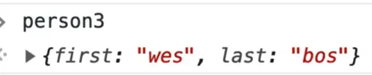

If you log `person3`, you will see that it has the same properties as `person1`.

That is because the spread operator will take every single item that is in an object and spread it into the next object.

There is another way to do this, which is not as popular since spread has been introduced, but previously a lot of people used this method.

You call `Object.assign()`, and start with an empty object, and then fold in the other object into it.

```js
const person3 = Object.assign({}, person1);
```

You probably won't see that all that much but if you do, know that is a way to take a copy of an object just like the spread.

So if you use the spread operator and then try to change the value of `person3.first` to Larry, like so, what would you get?

```js
const person3 = { ...person1 };
person3.first = 'Larry';
```

If you refresh the HTMl page and then log `person3.first` and `person1.first`, you will see that only the value of `person3.first` was updated.

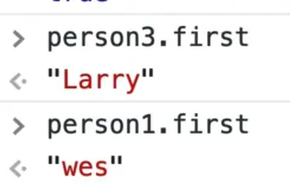

That is because this time you used the spread operator which gave you a copy of the person1 `object`, and not a reference.

One thing to do note is that the spread operator only goes one level deep.

That means that if you went up to `person1` and added a `clothing` object, then take a copy of that in `person3` like so 👇

```js
const person1 = {
  first: "wes",
  last: "bos",
  clothing: {
    shirts: 10,
    pants: 2
  }
};

const person3 = { ...person1 };
person3.first = Larry;
```

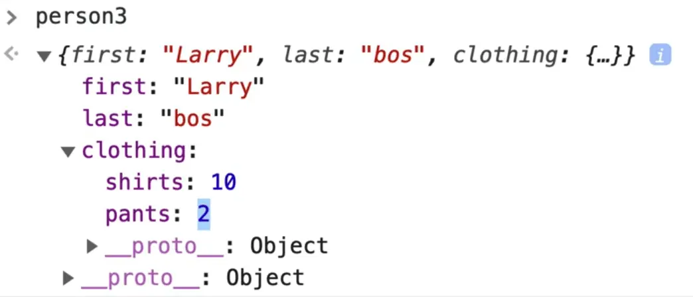

If you try to update  `person3.clothing.shirts = 100;` and then view the object in the console, you will notice that `person3.clothing.shirts` does equal 100.

However if you look at `person1`, you will notice that `person1.clothing.shirts` was also updated to be 100.

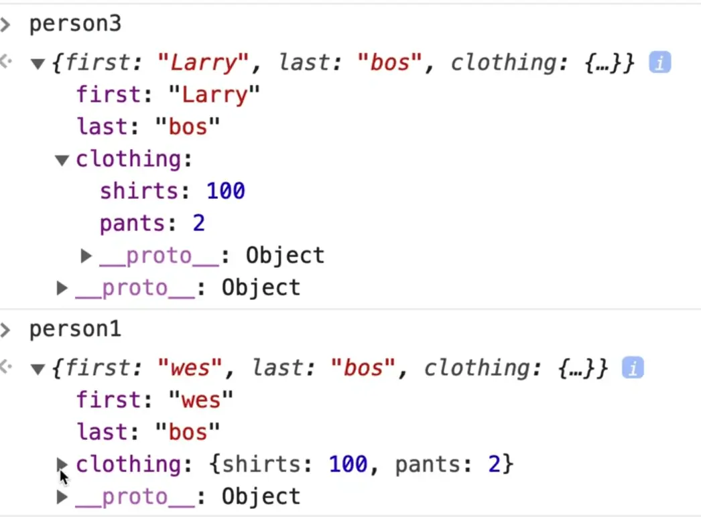

This is the same problem. `person1.clothing.shirts` was also updated even though Wes just told us we can take a copy of an object with a spread operator.

So what we need to take away from that is that the spread operator and the `Object.assign()` operator, they do what is called a **shallow** copy, meaning that they will only ever go one level deep when copying.

If you do want to do a **deep clone** or a **deep copy** of an object, of all of the properties, there are a number of different ways to do it.

The most popular way is most likely to use something called a **utility library**.

## Lodash

Wes most often uses https://lodash.com.

Lodash is a library that you can include into your script.

It has a lot of methods that are used when working with objects and arrays. One of those is for doing copies of objects. Let's take a look at the documentation by searching for the keyword clone on the website.

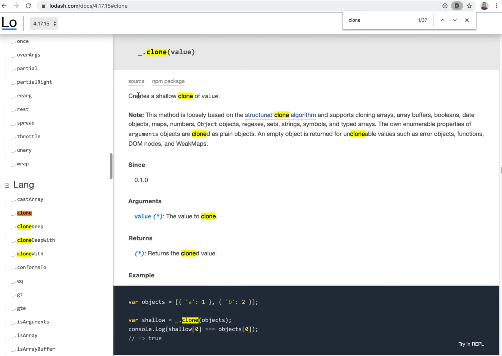

Based on the documentation you can see that `_.clone(value)` creates a shallow clone of a value.

The documentation also provides an example of how to use the method. You would use it by calling  `_.`, which is where all the lodash methods live, and then calling `.clone()`.

That will just do a high level clone like we did with the spread operator earlier, so there is not much value in that.

There is another method called `_.cloneDeep`.

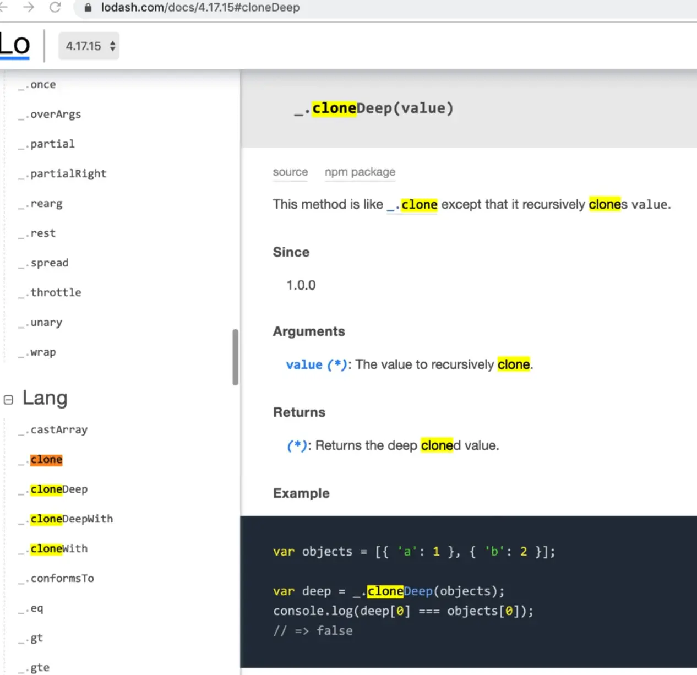

Clone deep will also take a copy of any nested objects for us.

How do you use that?

Wes likes to use something called UNPKG (https://unpkg.com).

If you navigate to `https://unpkg.com/lodash`, it will load the latest lodash, so you can just take that url and go up above the script that you need and add it.

When you're loading JavaScript that other code is dependent on, you need to load that first.

Add the following within the body, after the input 👇

```html
<script src="https://unpkg.com/lodash@4.17.15/lodash.js"></script>
```

Now if you type `_.` in your console, you will see that all of the lodash values are available to us.

Later when we cover modules, Wes will show us how to load just the ones you need, because it's unlikely you will need every method in the library but for simplicities sake, we are loading the entire library now.

Further down in our code, comment out the code where you were copying person1 into person3 with the spread operator, `const person3 = {... person1};`,.

Underneath it add the following code👇

```js
const person3 = _.cloneDeep(person1);
person3.first = 'Larry';
person3.clothing.shirts = 100;
```

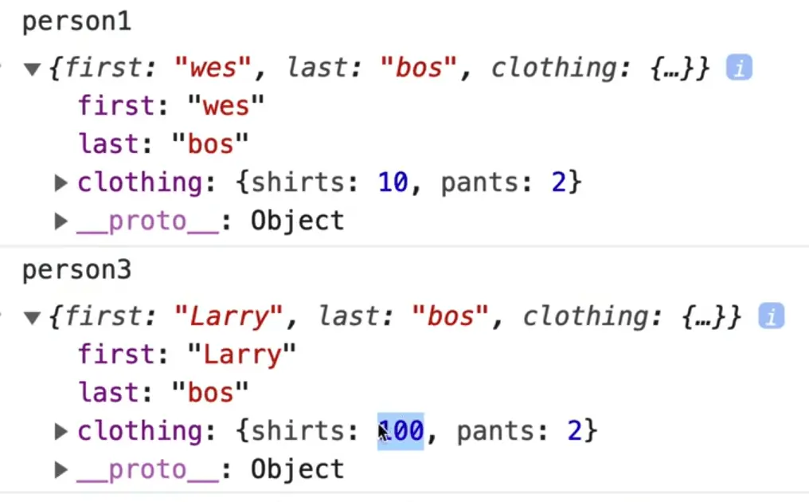

As you can see, `person1.clothing.shirts` still equals 10, because you performed a deep clone using the lodash method and then modified the value only for the `person3` object because `person3` was no longer a reference to `person1`.

Wes doesn't reach for this a lot of the time but that is mostly because the stuff he does can just be done by JavaScript, but when you do have to do harder things like a deep clone, you can reach for a lodash method.

Lodash also has methods for working with arrays.

The `...` spread operator is also helpful when working with merging objects.

To demonstrate that, let's do an example.

Add the following code 👇

```js
const meatInventory = {
  bacon: 2,
  sausage: 3.
};

const veggieInventory = {
  lettuce: 5,
  tomatoes: 3,
};
```

So we have these 2 objects, `meatInventory` and `veggieInventory`, both of which have 2 properties.

You want to merge these 2 objects and the easiest way to do that is to just make a new variable, an object literal, the `...` followed by one of the objects you want to merge, and then a comma followed by a `...` of the next object you want to merge, as so on, like so 👇

```js
const inventory = { ...meatInventory, ...veggieInventory };
```

You can spread in as many objects as you want.

Now we have a new inventory property which you can see if you refresh the page, open the console and type in `inventory`.

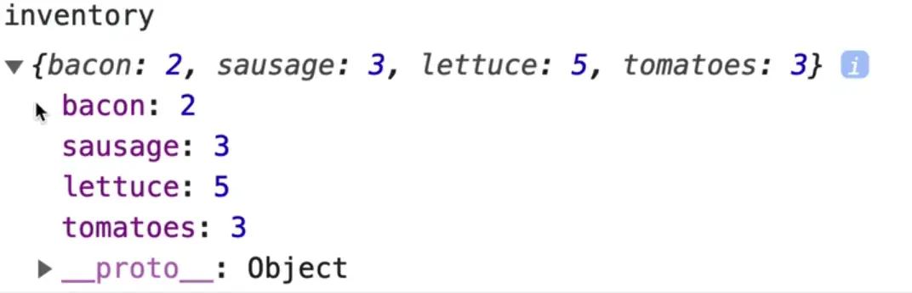

You can also put some objects on their own line and add your own values in.

For example you could do the following 👇

```js
const inventory = {
  ...meatInventory,
  ...veggieInventory,
  oysters: 10,
};
```

And you can see that `oysters` will be added to it.

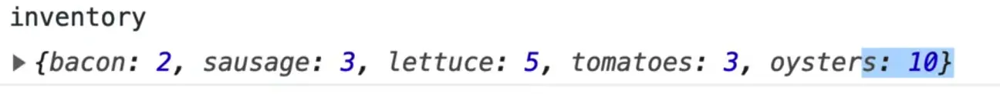

You can mix and match the spreading.

The only thing you really need to know about that is if there are duplicates (for example oyster could be an oyster mushroom or an oyster from the sea),  which one will win out?

Let's say you added oyster to `meatInventory` AND `veggieInventory` like so 👇

```js
const meatInventory = {
  bacon: 2,
  sausage: 3.
  oyster: 10,
};

const veggieInventory = {
  lettuce: 5,
  tomatoes: 3,
  oyster: 15,
};

const inventory = {
  ...meatInventory,
  ...veggieInventory,
};
```

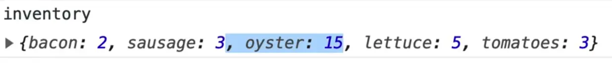

`oyster: 15` wins out. Why?

Because `veggieInventory` comes after in the spread, so the order of the spread does matter in this case.

Similarly, if you were to type in the following code 👇

```js
const inventory = {
  ...meatInventory,
  ...veggieInventory,
  bacon: 10,
};
```

Bacon would be 10 because it would overwrite the value in the `meatInventory`.

Wes really likes the spread operator. It can also be used for arrays which we will learn about in the array lessons.

The last thing we are going to hammer home is that the concept of passing in via reference vs copy also applies to functions.

Let's say you had a function `doStuff`, which took in an argument `data`, and within the function you modified the value of data to be something else, like so 👇

```js
function doStuff(data) {
  data = 'something else';
}
```

All this function does is take in an argument, and changes that data for whatever reason.

Now if you were to run that function and pass it the `name1` variable which was set to "wes" way up in the code, if you were to take a look at that and log the data like so 👇

```js
function doStuff(data) {
  data = 'something else';
  console.log(data);
}

doStuff(name1);
```

If you refresh the page and type in `name1` in the console, it should still return "wes".

What that means is when you passed in the `name1` variable to `doStuff`, you were only passing in the value of "wes", it doesn't actually reference to the external variable (which is good!).

Now, let's do that again with an object 👇

```js
function doStuff2(data) {
  data.tomatoes = 1000000000l;
  console.log(data);
}

doStuff(inventory);
```

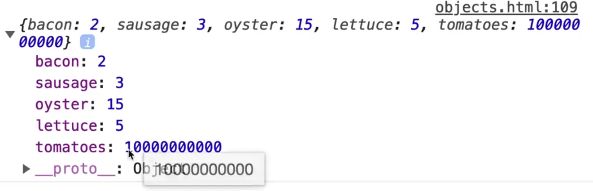

If you refresh the page and look in the console, you will see the value of `data` logged as shown above.

However, if you type in `inventory`, which is the object that lives outside of the `doStuff2` function, you will see that it also contains the `tomato` property.

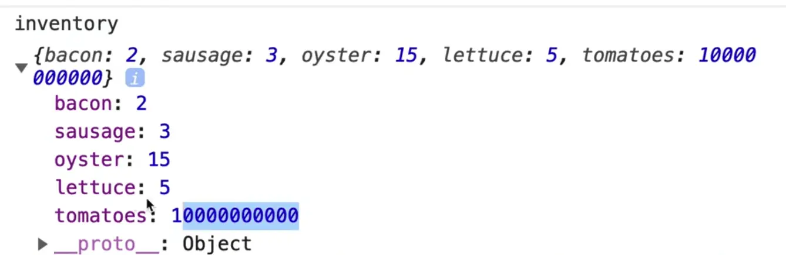

That means that if you pass in an object to a function, and you modify that object, the external object will also be updated.

That is not the case for booleans, numbers and strings, but it is the case for objects and arrays.

That means that if you modify an object or an array that is passed into a function inside of the function, know that you may be accidentally modifying data that lives outside of it.

That is a huge source of bugs, because when you pass in data as a reference, you may be unknowingly modifying data that lives outside of that function.

If that is the case, you make sure you pass it in as a copy.

It may be the case that you want to modify external data, but sometimes you don't and it leads to bugs.
