In the `/playgrounds` folder, open up `maps.html`.

We are going to learn about this thing called a **map**. It is very similar to an object, however there are a couple of key differences.

We will cover:
- how does it work
- what does it do
- why you would want to use one over an object
- how to decide whether to use a map or an object

The way you create a map is using the `new` keyword followed by `Map()` with a capital M.

```js
const myMap = new Map();
```

In order to add items to a map, there are the following APIs:
- set `.set()`
- has `.has()`
- delete `.delete()`

We will go through all of them.

## Set

Firstly, you take `myMap` and you `set()` it, to which you pass 2 arguments:
1. the key of the map will be, so let's call it `name`
2. the value you want to set

```js
myMap.set('name', 'wes');
console.log(myMap);
```

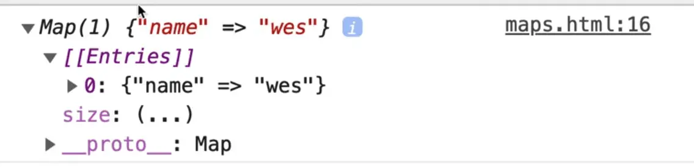

As you can see in the console, we have our map and it gives us our entries, entries are the actual values in the map.

Now if you were to use the object notation that we are used to, something like `myMap.age = 100;`, you will notice that it's not actually added in the same spot.

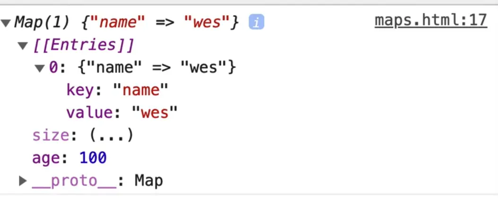

It is in the map, but it is a property on the map, not an actual entry in our map.

So why is this useful?

Well, there are a couple of nice things about this API, apart from the fact that you have a `.set()`, `.has()` and `.delete()` method.

One big benefit of a map is the keys can be any type other than just using a string or an allowed variable name.

So instead of passing name as the key when we called `.set()` on `myMap`, we could pass a number like `myMap.set(100, 'This is a number');`

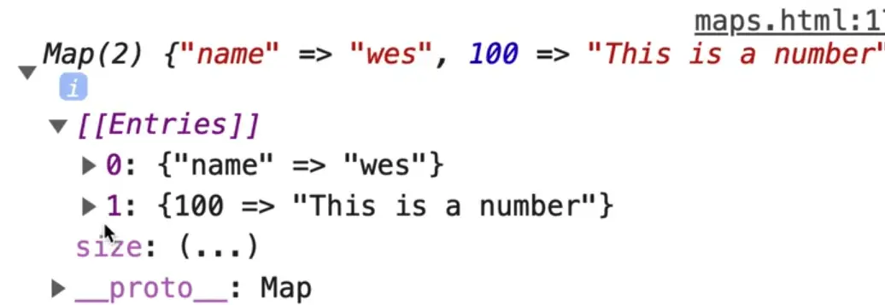

As you can see, the entry has a key of 100.

Previously you have only had the ability to add different types in the value portion of an object.

A map allows you to put any value into the key and into the value (any type of value).

Now why is that useful?

In JavaScript, we have these things called dictionaries. A dictionary is just a way to store additional metadata about something else.

What is a dictionary in real life?

Well, if you have word, that word does not contain all the information about how to pronounce it, what it means, whether it's a verb or a noun, etc. All of that information about that word is not stored in the word, it's stored somewhere else, which is a dictionary and if we want to look that information up, we use the dictionary.

Let's create a variable `person1` like so 👇

```js
const person1 = {
  name: 'wes',
  age: 200
}
```

What you can do is use the reference to that object as a key in your map to store additional information inside of your map.

In `maps.html`, use the reference to the `person1` object as a key in the map, and let's say as the value we will store a string about how cool the person is (this could really be anything, does not have to be a string).

Add the following at the end of the script tag but before you log `myMap` 👇

```js
myMap.set(person1, 'Really cool');
console.log(myMap);
```

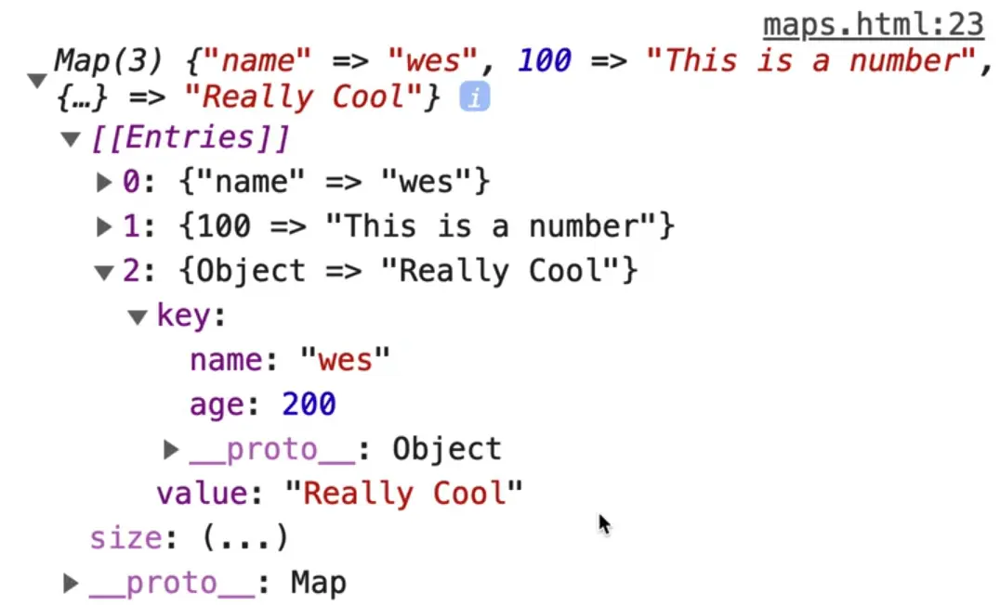

Now if you open up our map, you will see that the key is actually an object and the value is really cool.

That is useful because let's say at a later point in time we wanted to look that up in our dictionary, we could add the following code to grab the value:

```
myMap.get(person1);
```

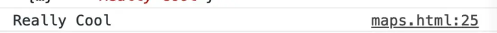

What you have done there is instead of putting a unique string, or an ID or something else, you simply use the reference to the object as the key in the map to store the additional information.

_Note: all values in a map can be any type, just like the key._

Another example you can do is let's say someone has a score that they want to add additional information to.

```js
const score = 100;
```

On the map, you want to set additional information about what prizes they will win at that score.

Create a new map for this.

```js
const score = 100;
const prizes = new Map();

prizes.set(100, 'Bear');
prizes.set(200, 'Duck');
prizes.set(300, 'Car');
```

Now if this was an object, you would have had to use a string of the number in order to look it up. However in this case, we can just use the number to look at what the corresponding prize is.

Add a log after the last set on our map 👇

```js
console.log(`you win a ${prizes.get(score)}`);
```

Now if you refresh the page, you will see the following in the console 👇

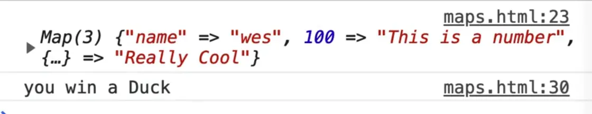 

this should 'you win a Bear'

In a lot of the real world exercises we will build, we will pause and go over whether or not it makes sense to use an object or a map for our situation, so you can get used to when to reach for one versus the other.

So far we have covered how to set and get values of a map.

You can also get the size of a map using `.size`.

If you type `myMap.size` in the console, you it should return 3. This is very similar to getting the length of something.

The other thing about a map is that order **is** guaranteed.

Unlike an object, with a map, the order in which you put things into your map is the order at which they will stay.

That is very important if you need to maintain the order.

Let's do an example to demonstrate displaying the prizes using objects vs maps.

Within the body tag, but before the script tag, add the following code 👇

```html
<ul class="prizes"></ul>
```

Now let's say you wanted to loop over the prizes in the map and display what you get for which point value, it's important that they go into that order.

With an object, they could be jumbled. It would be weird to display the prizes in non-ascending or descending order.

But when you use a map, it's guaranteed to maintain order.

Now what you can do is select the `ul`, loop over all the entires in the map (there is a couple of different ways you can do that which we will cover in the looping and iterating lesson), and you are going to get an entry and log it to start.

```js
//s elect that ul
const ul = document.querySelector('.prizes');

prizes.forEach(entry => {
  console.log(entry);
})
```

If you refresh the page and look at the console, you will see Bear, Duck and Car, in that order.

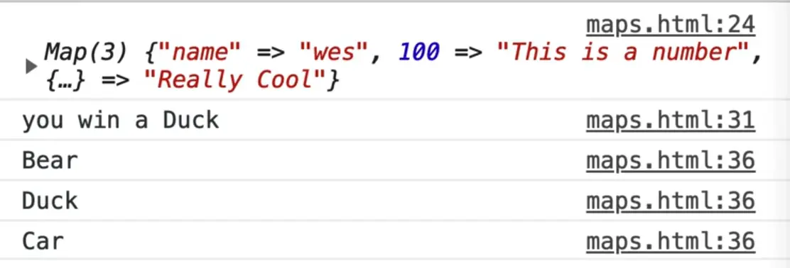

However, that only gives you the value. If you want to return the key and value, you can use the `for of` loop.

```js
const ul = document.querySelector('.prizes');

for(const prize of prizes){
  console.log(prize);
}

```

This is getting a bit ahead of ourselves with the looping but just know that you are looping over all the entires in the map, one by one, and for each one you are going to create a temporary variable `prize` and then log it.

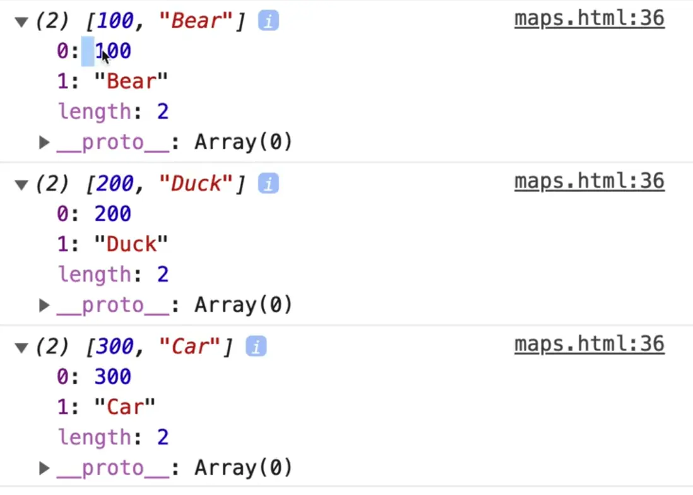

Now as you see, you get an array and that array's first item will be the key and the second item will be the values.

Modify the log like so 👇

```js
console.log(prize[0], prize[1]);
```

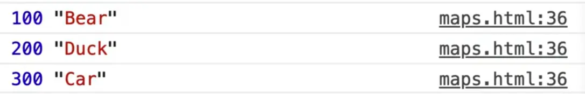

You can go further and **destructure** the array.

This allows you to create variables of the items by their index, instead of referencing each via index each time.

Modify the code like so 👇

```js
for (const [points, prize] of prizes) {
  console.log(points,prize);
}
```

If you refresh the HTML page and look at the console you will notice it works the exact same. The only difference is now we have 2 variables, one for `points` and one for `prize`, rather than accessing the values using the array and their index.

_Note: you could have rename points and prize to anything you wanted.. For example, `for(const [key, value] of prizes)` would have worked just as well._

Modify the code again to display the score 👇

```js
for (const [points, prize] of prizes) {
  const li = `<li>${points} - ${prize}</li>`;
  ul.insertAdjacentHTML('beforeend', li);
}
```

Now when you refresh the page, you should see the following 👇

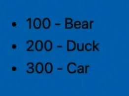

When do you use a map over an object?

You should use a map if you do need to maintain the order of your items.

One downside to a map is there is no literal, meaning that you always have to create a new map that way and then set the items in it.

You can pass items into your map with an array or arrays, but it's kind of weird.

Let's do an example.

You pass in an array of arrays. So you have an array which contains many arrays separated by commas like so

```js
new Map([ [1,2], [3,4] ]);
```

If you type that in the console you will see the following 👇

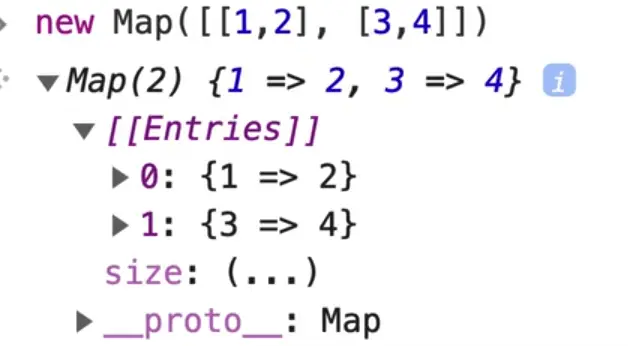

As you can see there, we have created a map.

That's a bad example, let's do something else.

```js
new Map([ ['name', 'wes'], ['age', '49'] ])
```

You can pass an array of multiple arrays where the first item is the key and the second item is the value. However, the object literal syntax is a little bit neater of an API.

Wes didn't show us delete.

In the console, if you still haven't refreshed from our previous example, type `myMap.delete('name')`.

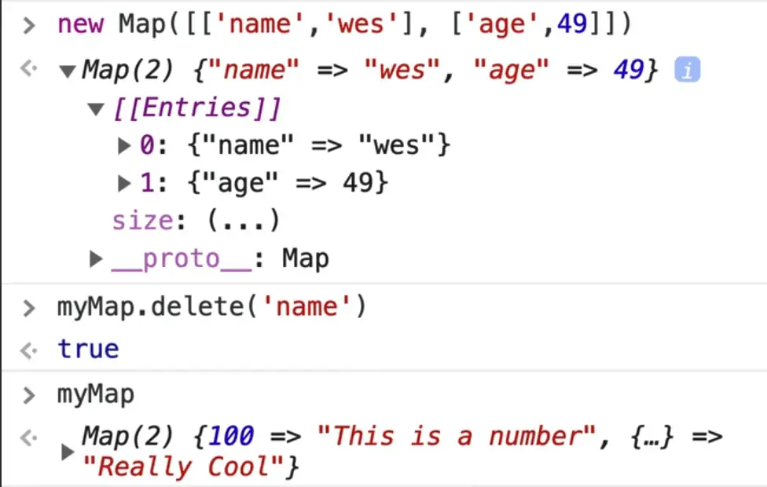

If you type `myMap`, you will notice that the name `entry` is gone.

Another thing about an object is you can put functions inside of an object and we call those methods.

You cannot do that with a map, that is not what they are for. They are simply for storing data.

### JSON

The last thing is we have this thing called **JSON**. Wes hasn't explained it to us yet but he is going to try really quickly.

Let's say you have the following object 👇

```js
const person = {
  name: 'wes',
  age: 100
}
```

If you want to send that object to somebody, you would turn it into text. Text is easily sent via servers, from one website to another.

Anytime you want to transfer an object or an array, you have to first convert that to a portable format.

This one way that all programming languages understand is JSON.

You can turn an object into **json** using `JSON.stringify()`. It takes in 1 argument, which is the object you want to convert.

It takes the object and converts it into a string, which you can send very easily, and then the person on the other end can turn it back into an object using something like 👇

```js
JSON.parse(`{ "name": "wes", "age": "100" }`);
```

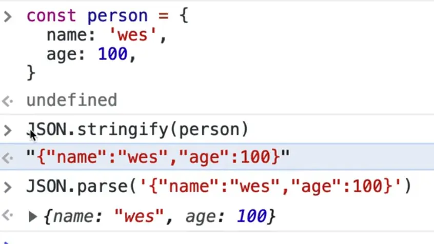

JSON stands for **JavaScript Object Notation**. However it has been implemented by every single language out there.

JSON is amazing, however, if you have a map, currently JSON does not handle maps.

If you try `JSON.stringify(myMap)` you will see the following error and get an empty object because it is not aware of maps yet.

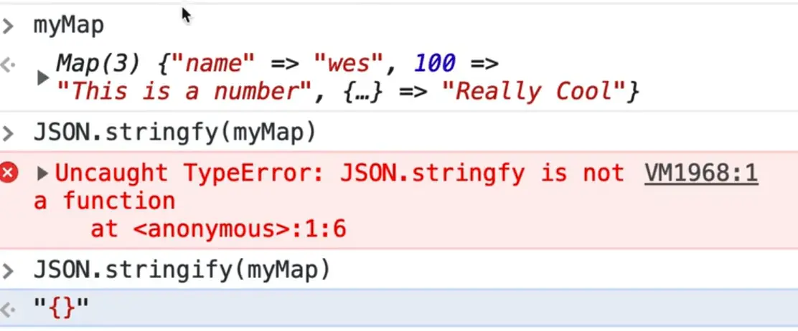

There is this thing called **JSON 5** which is trying to improve JSON but until that is ready, if you want to send your map content you have to convert it to an object currently.

You can do that using `Object.fromEntries(myMap)`, which tries it's best to convert it to a regular object.

However, you will see if you use any of the benefits of a map, it falls apart when you turn it into JSON.

We will try to use both of them in our examples but Wes personally uses objects much more frequently, but he thinks map will start to catch on in the next couple of years.

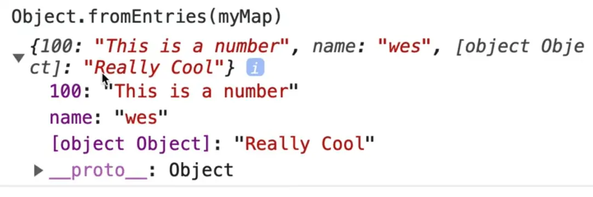
