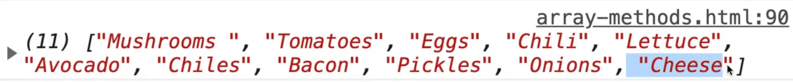
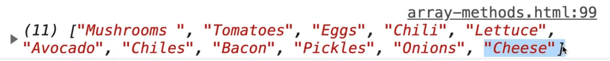
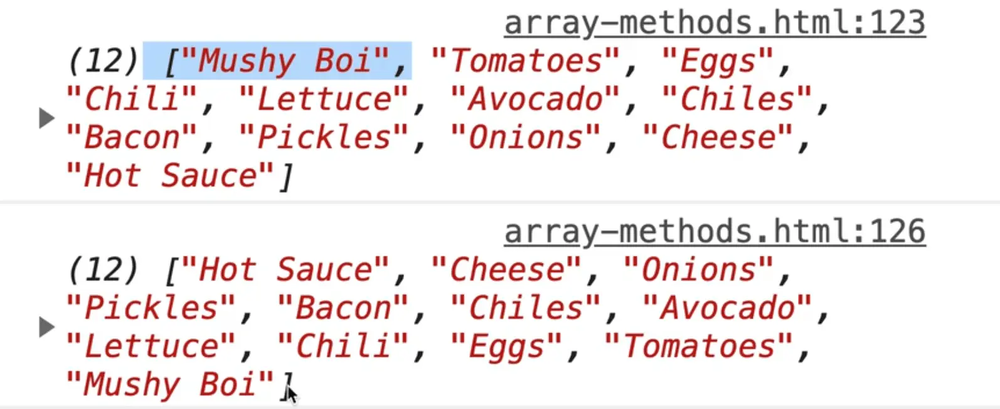

Instance methods are methods that live on each array.

For this exercise we will be working out of the same `array-methods-START.html` file.

## join method

The first exercise is to display all bun types with the letters `or`, using `join()`.

What is `join()`?

Open up the HTML page in a browser and open the console. Type in `buns` to see what we are working with and then call `buns.join()`.

You should see the following returned 👇


`join()` turns the array into a string, joining each item with a comma. It takes an argument, which is what you want to join it on.

Add the following to the exercise file 👇

```js
console.log(buns.join(' or '));
```

Now instead of being joined with commas in the string, you are joining the items using the word "or".


## split method

In the next example, you have a string with a bunch of items **delimited** by a comma, `"hot dogs,hamburgers,sausages,corn"`, and you need to use `split()` to turn it into a string.

Split will take the string and split it up into an array.

Add the following code 👇

```js
const foodString = "hot dogs, hamburgers, sausages, corn";
```

If you want to turn this string into an array, it's actually not an array method, it's a string method.

`split` takes in an argument, which is the character on which to split the string on.

In this example, you want to split the string on the comma. `split(',')` will get rid of those commas for us, which is what we want.

```js
console.log(foodString.split(','));
```


`split` is a pretty common method that is used.

You can call `split()` and pass it nothing. That will just take every letter in the string into it's own item. That is very similar to **spreading** which we did earlier.

One little "gotcha" about `split` is that you can do something like this no problem 👇


However, if you have emojis in there, like 👇

```js
'wes bos👪'.split('')
```

That emoji is actually made up of several different emojis and what is referred to as a **zero width joiner**.

So that will come and bite you if you ever try to split something with an emoji, just something to keep in mind. If you do run into issues doing that, there are libraries you can use to help.


## pop method

The next exercise is to take the last item off `toppings` using `pop()`.

We haven't learned what pop does just yet.

Let's look at the `toppings` array in the console.


If you call `toppings.pop()`, it will return to us the last item in the array, which is "Cheese".


If you take a look at `toppings` again, you will see that "Cheese" is no longer part of the array.


This is a handy method if you need to grab one off the end of the array and then work with it, and it will just take that item out of the array.

Based on that, is this an immutable or mutable method?

It is a **mutable** method because it mutates the original array. It takes it off the original array.

Go ahead and do that in the code, like so 👇

```js
const lastItem = toppings.pop();
console.log(lastItem);
```

The next step is to put it back with `push()`.

Log what is returned from the push to a variable called `t2` and then look at it in the console.
Add this code 👇

```js
// take the last item off toppings with pop()
const lastItem = toppings.pop();
console.log(lastItem);
// add it back with push()
const t2 = toppings.push(lastItem);
console.log(t2);
```

You should see 11 in the console. What does that mean?
Well when you push an item into an array, it will return to you the new length of the array, in case you need it.


You don't have to put it into a variable if you don't need it, so in our case we will remove the declaration of `t2` and instead just use `toppings.push(lastItem)` and remove the `console.log(t2);`.

Instead log `toppings` to see if cheese has been added back.



It has been added back!

## shift and unshift methods

The next instance method exercise will be using `shift()` to take the first item off toppings. This is pretty similar.

```js
// take the first item off toppings with shift()
const firstItem = toppings.shift();
console.log(firstItem);
```

That should give us mushrooms.


Next you need to add it back using unshift like so:

```js
// add it back in with unshift()
toppings.unshift(firstItem);
```

The next part of the exercise is to do the last 4 but immutable (with spreads and new variables).  We know how to do that.

So we need to:
1. Take the last item off toppings with `pop()`
1. add it back with `push()`
1. Take the first item off toppings with `shift()`
1. add it back with `unshift()`

Start with #1, how do we take the last item off without mutating the original one?

Let's use `slice`.

Start at 0 and go till the end except one, so `length - 1`

```js
const newToppings = toppings.slice(0, toppings.length - 1);
```

{/* TODO: where did this image go?  */}

Cheese is now off, which is what we want.

The next exercise is to put it back.

Change `newToppings` from a `const` to a `let` and then spread the `newToppings` array into itself and also add that last item back on. You could reference that last item using `toppings.length - 1`.

We took Cheese out, but we didn't store it anywhere, so if we need to reference it, we need to reference it from the original `toppings` array.

```js
let newToppings = toppings.slice(0, toppings.length - 1);
newToppings = [...newToppings, toppings[toppings.length -1]];
console.log(newToppings);
```

We should see "cheese" at the end like so 👇



Next, we want to add it to the front.

We would do exactly the same thing that we did just now to add it to the back, except you start at 1 and go for the `length`, and then when you add it back in, you put it first and then spread after that.

THe next step is to make a copy of the toppings array with `slice()`.

How do you make a copy of an array? You can use `slice()`.

Add the code below 👇

```js
const toppingsCopy = toppings.slice(0);
console.log(toppingsCopy);
```

Do we need to pass a second argument to `slice()`?

Let's look it up.


It says that `end` is optional. If it is ommited, slice extracts through the end of the sequence, so we don't need it!

As you can see below, that worked.


The way we can tell if that is a copy is if we change the original `toppings` and then log both, like so 👇

```js
const toppingsCopy = toppings.slice(0);
toppings[0] = 'Mushy Boi';
console.log(toppings);
console.log(toppingsCopy);
```
As you can see below, only `toppings` has the "mushy boi" object, which tells us that `toppingsCopy` is a true copy.


The next exercise is to make a copy of the `toppings` array with a spread.

```js
const toppingsCopy2 = [...toppings];
```

Wes likes using spreads a lot. It's a bit weird at first because the ... syntax might be a bit funky to you but Wes believes that once you understand what's actually going on there and how spreads work, then you are in good shape.

The next exercise is to take out items 3 to 5 of the new toppings array with `splice()`.

```js
toppingsCopy.splice(3,3);
console.log(toppingsCopy);
```

As you can see, there are now only 8 items rather than 11 in the array.


Next we need to find the index of avocado with `indexOf`.

Previously we had looked for an item using find. But if they are simply just strings or numbers, or references to an object: if you know exactly what you're looking for, `indexOf` will do what you need it to do.

```js
const avoIndex = toppings.indexOf('Avocado');
console.log(avoIndex);
```

If you refresh the page you should see "5" logged in the console. That tells us that the avocado item is in the 5th index.

{/* TODO: where did this image go?  */}

One thing about `indexOf` that you should know is that it works with any type. Let's do an example to demonstrate.

```js
const wes = { name: "wes" };
const people = [{ name: "scott" }, wes];
console.log(people.indexOf(wes));
```

If you refresh the page and look at the console you should see the number 1 logged, which tells us the `wes` object is at index of 1 because it is giving reference to the `wes` object.


```js
people.indexOf({ name: 'scott' });
```

Let's say instead of passing a reference to an object you pass in an object directly as shown in the code above 👆.

Note that the object we are passing is identical to the first object in the people's array.

However, if you try that, you will see -1 in the console.

-1 is what is returned when it didn't find anything (the reason it doesn't give you 0 is because 0 is the first item in the array).


So why it work when we passed it `wes` but it didn't work when we passed it `{name:'scott'}`, which is an object exactly the same as the item in the first slot?

That is because although the objects look exactly the same, they are not exactly the same thing.

So if you were to say `{name : 'wes' } === wes`, it would return false.

Why?

Because objects don't do a deep check to see if all the properties match up, they just check if the reference to it is actually the same object.


When we called `indexOf(wes)`, it was checking whether the `people` variable contained a reference to the object `wes`, which it did. When we checked it for an object that just looks the same, it gave us false. That is the whole reference vs value thing again.

If you did need to find scott in that example you would just use `find()` with a callback.

The is also `lastIndexOf()`.

`indexOf()` will find you the first instance of the argument you pass, whereas `lastIndexOf` will find you the last instance of it.

Next we need to check if hot sauce is in the toppings array using `includes()`.

`includes()` is useful.

Let's say you have an array of numbers.

You can call `includes()` to check if the array contains that number, like so

```js
[1, 2, 3, 4].includes(4)
```

If you passed `includes` an object, it would check if the reference to that object exists in the array.

 1

```js
const isInToppings = toppings.includes('Hot Sauce');
console.log(isInToppings);
```


Note that includes is case sensitive, so if you were checking for all different versions of the case, what you would want to do is first lowercase the entire array with `.map()` which we will look at in the next couple of videos.

Next you are supposed to add "Hot Sauce" if it is not already included in the toppings array.

```js
// add it if it's not
if (!isInToppings) {
  toppings.push("Hot Sauce");
}
console.log(toppings);
```


Finally you need to fip the toppings around using `reverse()`.

There are 2 ways to reverse, you can just call `toppings.reverse()` which you know is a **mutable** method, meaning it will reverse the toppings array
for us.

```js
// flip those toppings around with reverse()
toppings.reverse();
console.log(toppings);
```



If you want to do it **immutably** without modifying the original toppings array, you can create a new array, spread toppings into it, and then call `reverse()` directly on it like so 👇

```js
const toppingsReversed = [...toppings].reverse();
```

Using the second approach leaves `toppings` untouched because it just reverses our new array, which is a copy of `toppings`.

Those are the main methods Wes thinks will be helpful.

There are a couple of others that are used often, you can take a look at the MDN list, but almost all of those are callback methods or filtering methods.

We will talk about callback methods in the next video.
