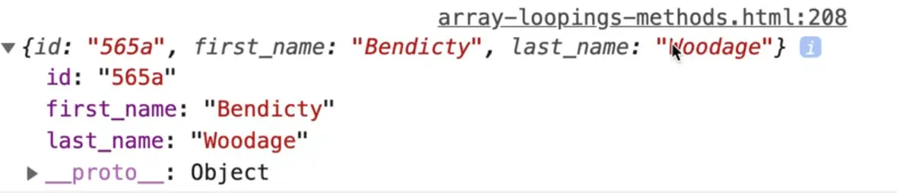

You can skip this lesson if you feel confident with your knowledge of `filter` and `find` because we have already covered that a few times.

Wes just wants to have a video specifically dedicated to it so you can come back and refer it at a later time conveniently.

Let's continue from the example in our previous lesson, where we created a `cleanPeople` array, which we will work with in this example.


Very often you will find yourself in a situation where you either need to find one person in an array or you want to filter the list down to be a subset of it.

Let's say you want to find people who are over 40 years old.

You can use `.filter()` for that.

The way filter works is you loop over every single item in an array, and you either say yes (true) or no (false).

If you return true that item will be in the array subset, if you return false it will take out that item from the array that is returned.

```js
const over40 = cleanPeople.filter(function(person) {
  if (person.age > 40) {
    return true;
  } else {
    return false;
  }
})

console.table(over40);
```

That is the verbose way to write it, which Wes is using just to show us how it works.


As you can see, we now have only a subset of the original array.

Now let's refactor the function above to make it more concise.

How Wes would approach it is he would look at the condition within the filter function. If the condition is met, we will return true.

That means there is no need for an else because anything that comes after the condition will only run if the condition is true. So that else is unnecessary.

```js
if (person.age > 40) {
  return true;
}

return false;
```

Since the condition evaluates to true or false, we can just return the condition like so 👇

```js
const over40 = cleanPeople.filter(function(person) {
  return person.age > 40;
});
```

We can make it an arrow function like so 👇

```js
const over40 = cleanPeople.filter((person) => {
  return person.age > 40;
});
```

We can go one step further and make it an implicit return and take off the parameter parenthesis like so 👇

```js
const over40 = cleanPeople.filter(person => person.age > 40);
```

If there ever is a situation where we call this filter method on an array with no people over 40 in it, it will just return to us an empty array.


If you wanted to check if there were any people over 40 in this case you could use the following code 👇

```js
if (over40.length) {
  console.log('There are some people over 40');
}
```

That is how filter works.

`.find()` works the exact same way except that find only finds one item in the array and returns it whereas filter will always return to you all of the items that match.

`.filter()` will always return an array

`.find()` will always return the item that you want.

Let's use the `students` array for our find example.

Here is what that array looks like 👇

```js
const students = [
  {
    id: "11ce",
    first_name: "Dall",
    last_name: "Puckring",
  },
  {
    id: "2958",
    first_name: "Margarete",
    last_name: "Brandi",
  },
  {
    id: "565a",
    first_name: "Bendicty",
    last_name: "Woodage",
  },
  {
    id: "3a16",
    first_name: "Micki",
    last_name: "Mattes",
  },
  {
    id: "f396",
    first_name: "Flory",
    last_name: "Gladeche",
  },
  {
    id: "de5f",
    first_name: "Jamill",
    last_name: "Emilien",
  },
  {
    id: "54cb",
    first_name: "Brett",
    last_name: "Aizikowitz",
  },
  {
    id: "9135",
    first_name: "Lorry",
    last_name: "Smallman",
  },
  {
    id: "978f",
    first_name: "Gilly",
    last_name: "Flott",
  },
];
```

Now let's say you want to find a student with the `id` of `565a`.

```js
const student = students.find(student => );
```

The code above is incomplete, but one weird thing worth pointing out is that we are naming the variable that we are storing the item in as `student` but we are also naming the individual loop a student.

Is that okay?

It is allowed because the student which is a parameter of the `.find()` loop is scoped to within that function. It is confusing however so it's often better to change it to something else.

We will name the parameter `stud` instead like so 👇

```js
const student = students.find(stud => stud.id === '565a');
console.log(student);
```



As you can see, the correct student record is returned.

If that didn't match anything, what would we find?

We would get `undefined`. You always want to check if something got found.


As you may have noticed, the `find` method did not return an array of students to us, it returns to us an object which is the student itself.

We could just swap the `.find()` to a `.filter()` like so 👇

```js
const student = students.filter(stud => stud.id === '565a');
console.log(student);
```


As you can see, that returns to us an array of one item.
That is the different between `.filter()` and `.find()`, everything else is exactly the same.

One neat thing that we could do is make an external function and then pass that in, like so 👇

```js
function isStudent(student) {
  return student.id === '565a';
}

const student = students.find(isStudent);
console.log(student);
```

Now that is a little bit weird. Why would we write a function that is hardcoded to a specific id? It's more likely that we will be looking for a student with their own specific id, so a hardcoded value would not work for all students.

What we can do is wrap that in another function called `findById`, which takes in one parameter,`id`, and which returns another function like so 👇

```js
function findById(id) {
  return function isStudent(student) {
    return student.id === id;
  }
};
```

This is called a **high-order function** or a **higher-order function**. It is a function that will return another function.

Now we can simply replace the method we pass to `.find()` like so 👇

```js
const student = students.find(findById('565a'));
```

`findById('565a')` will generate a new function that is coded to find the id that we are looking for (565a).


It still finds the right person, it's just a little bit more flexible

Let's say you run into a scenario where the object has a lot of properties.

Are you going to create a separate function called `findByFirstName` and then `findByLastName` and then all the other properties?

Instead of doing that, we can modify the function to be even more flexible. Start by creating a new function which takes in 2 things:
- the property
- the property value

It will return a function which is the looping function.

We are not going to return if the `id` is equal to the `id`, we are going to return if the `student` property is equal to the property value we are looking for.

```js
function findByProp(prop, propWeAreLookingFor) {
  return function isStudent(student) {
    return student[prop] === propWeAreLookingFor;
  }
}
```

Now that might be a little confusing to you. Let's go over how it works.

```js
const student = students.find(findByProp('id', '565a'));
```

We have made the function really flexible now. If you ad the coded above, you will see that it still works, but we can also make other student where the first name property is equal to  'Micki'.


```js
const student = students.find(findByProp('id', '565a'));
const student2 = students.find(findByProp('first_name', 'Micki'));

console.log(student);
console.log(student2);
```


Let's go over the function one more time.

The `findByProp` function takes in a prop as the first parameter and `propWeAreLookingFor` as the second parameter.
What that means is the first parameter takes in the key, and the second parameter takes in the value we are matching the property against.


In the image above, the text that is selected is the property `last_name`. It is the property key.


The property value for the `last_name` property for the student shown above is `Aizikowitz`.

So our function takes in a property and a value, and then it will look in each object for whatever property you specified is equal to whatever value you specified.


The reason we have to use square brackets and not the dot notation in the code highlighted in the image above is because the property that we are looking for is being passed in as an argument to the function.

This is a bit advanced so don't feel too let down if you feel a bit confused.

It took Wes years to understand the benefit of a function like we just made with `findByProp`.
