This is a quick and fun exercise. You can try this yourself to see how you would structure it.

What we will be doing is building a sarcastic text generator where you can enter some text and then select one of 3 options:
- sarcastic,
- funky, or
- unable to structure a sentence

Based on your selection, the text you entered will be modified to match the style option you selected.

The sarcastic option gives us "sponge bob case" as it's often called, which is depicted in the image below.

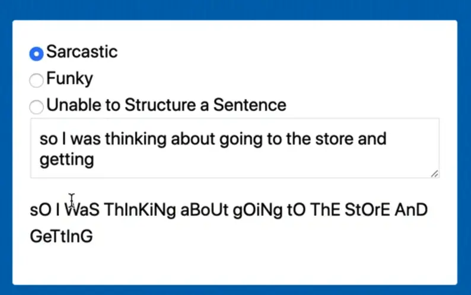

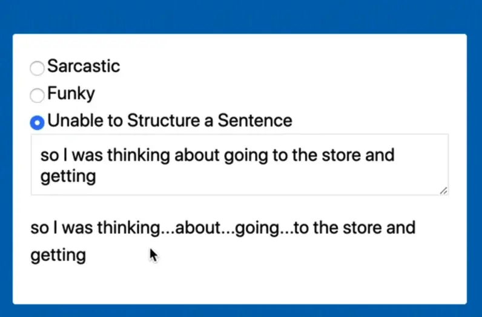


_Note: the funky option gives us those weird characters but you should never use these characters in a real world situation because they are inaccessible to someone with a screen reader._

We will be working out of the `56 - Sarcastic Text` folder. Open up `index.html`.

The page already contains some base styles so we can center it on the page, then we have a div with a bunch of inputs.

```html
<body>

  <div class="typer">
    <label for="sarcastic">
      <input type="radio" value="sarcastic" id="sarcastic" name="filter" checked>
      Sarcastic
    </label>
    <label for="funky">
      <input type="radio" value="funky" id="funky" name="filter">
      Funky
    </label>
    <label for="unable">
      <input type="radio" value="unable" id="unable" name="filter">
      Unable to Structure a Sentence
    </label>
    <textarea name="text">so I was thinking about going to the store.</textarea>
    <p class="result"></p>
  </div>

  <script src="./text.js"></script>
</body>
```

The only thing we need to know about the inputs is they all have the same `name` attribute value. That allows us to only select one of the radio buttons at a time. We are going to be using their values (sarcastic, funky, or unable) to pull the specific filters.

First thing you want to to do is select a few things.

We need the text area that the person will input their text into, the paragraph where we display the result and then all the inputs.

Grab the text area. Use an attribute selector to specify the textarea in case in the future you add more than one to the page.

```js
const textarea = document.querySelector('[name="text"]');
```

Then you need the result.

```js
const result = document.querySelector('.result');
```

Then tiy need the inputs. Use `querySelectorAll` to select all the inputs with a name of "filter" on them.

```js
const filterInputs = document.querySelectorAll('[name="filter"]');
```

Log them all the make sure they are working.

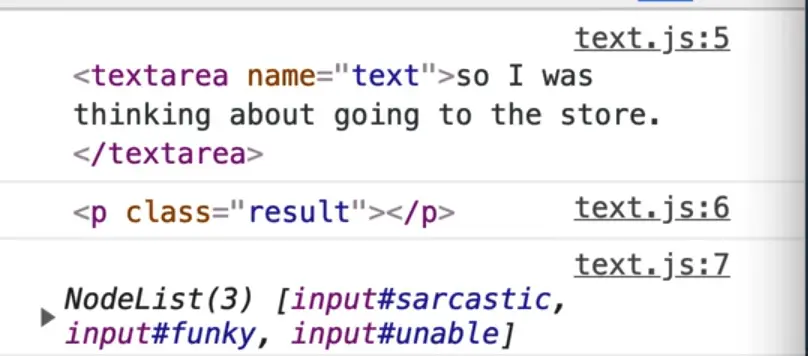

Next we need a handler that will output the text.

Make a new function called `transformText`. It will take in some text and then output the result.

Add an event listener on the input event and call `transformText` every time the event fires.

To get the text out of the text area to pass to the function, use `e.target.value`.

```js
function transformText(text) {
  result.textContent = 'Transformed Text';
}

textarea.addEventListener('input', e => transformText(e.target.value));
```

Check that it is working by simply logging the text within the `transformText` function. When you refresh the html page, open the console and type into the text area, you should see the text you are typing being logged.

Now we need to write some filters.

We have 3 filters, and we will start by writing the sarcastic filter.

One thing Wes likes to do when we have a few related things like these filters is to stick them in an object instead of having them all as their own function.

Name the object `filters` and each property will be the filter name like so 👇

```js
const filters = {
  sarcastic: function() {

  },
  funky: function() {

  },
  unable: function() {

  },
}
```

You will notice when you save the file that it refactors the object as shown below, which is just a shortcut. It's not the same thing as an arrow function, it's just a shorter way to write functions in objects.

```js
const filters = {
  sarcastic() {},
  funky() {},
  unable() {},
};
```

Now you need to take the text and loop over every letter, because for "sarcastic text", every other letter is a different case.

```js
const transformText(text) {
  // take the text, and loop over each letter
  const mod = Array.from(text);
  console.log(mod);
  result.textContent = text;
}
```

Now every time you type in the textarea, you should get an array of every single letter that the person has in there.

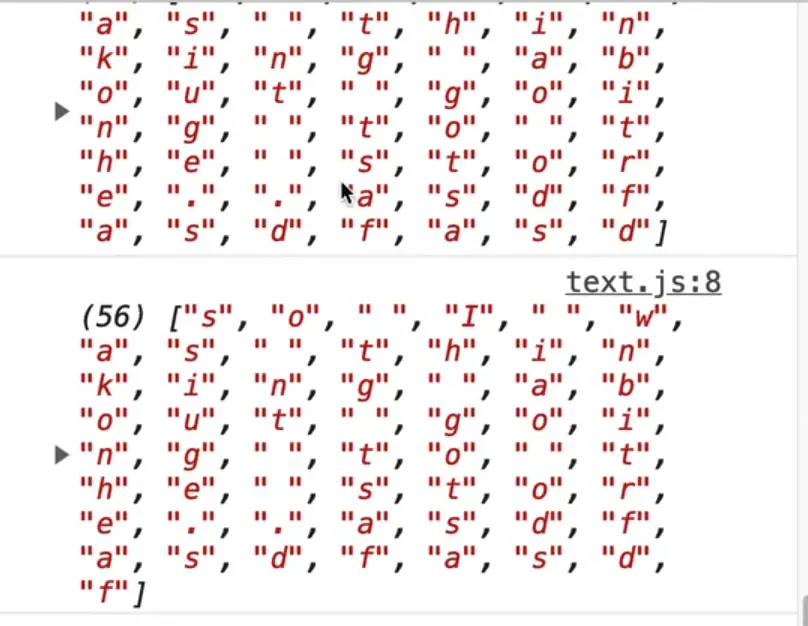

We want to loop over that array and uppercase and lowercase every other letter.

To do that, we will use `map` and pass it our `filters.sarcastic` function.

Since this is just a map function, our sarcastic method on the filters can take in all the arguments that a regular map can do.

Let's use the parameters `letter` and` index` and log those to make sure it's working correctly like so 👇

```js
const filters = {
  sarcastic(letter, index) {
    console.log(letter, index);
    return letter;
  },
  funky() {},
  unable() {},
};

function transformText(text) {
  // take the text, and loop over each letter
  const mod = Array.from(text).map(filters.sarcastic);
  console.log(mod);
  result.textContent = text;
}

textarea.addEventListener("input", (e) => transformText(e.target.value));
```

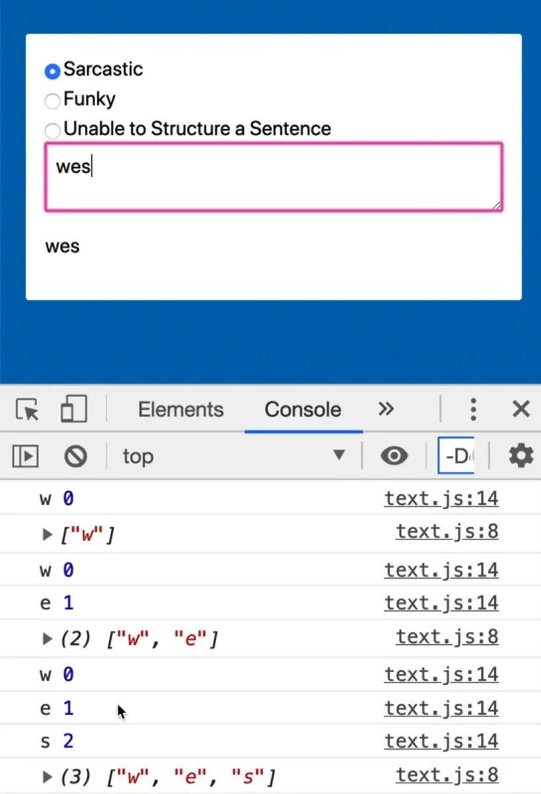

Now when you type, as you can see, we are logging the letter and the index. What we can do is say if it's an even number, lowercase it, and if it's an odd number, uppercase it.

How do you know if a number is even or odd?

## The modulo operator

There is a neat way of doing that with the **modulo** operator.  Let's do a little aside to go over how the modulo operator works.


Let's say Wes he has a pack of 10 smarties (which are a candy in Canada) and three kids.

If you try to divide 10 by 3 you get `10 / 3 = 3.33333333335`. Well you can't really split a smartie into thirds. You might think we can use `Math.floor(10/3)` which does return 3.

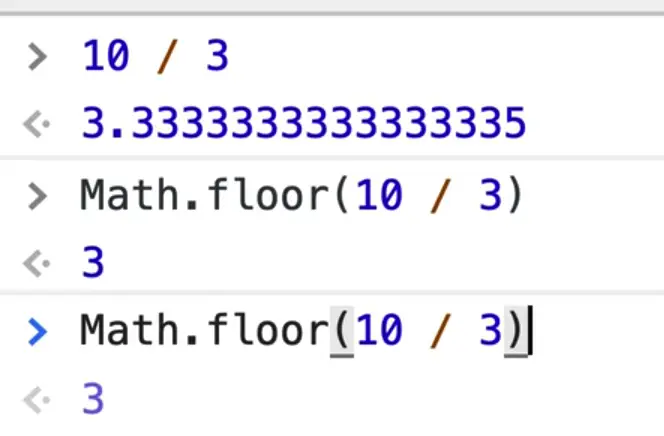

So each kid gets 3 smarties.

If we have a pack of 10, each kid gets 3, if we had a pack of 20, each kid will get six.

Now the question is, how many are leftover that Wes gets?

You could try to figure it out using math but it's not the best way.
[](@attachment/790.png) 8:50

What you can do is you can use the modulo operator. Let's say you have 10 smarties, and 2 kids. The modulo operator will tell us after they are evenly divided, how many are left.

```js
10 % 3 = 1
```

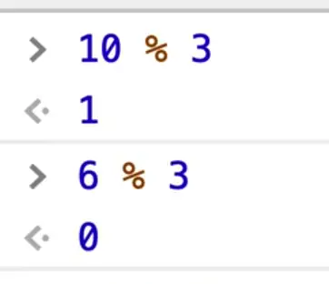

So if we have 10 smarties that we divide by 3, there will be `one` leftover.
If we have 6 smarties, there will be 0 leftover.

The modulo operator is great for knowing how much is left after you have evenly divided.

We can use this operator to check if something is even or not.

`10 % 2` will be 0, because 10 is even.
If you do `11 % 2` you will get 1 returned.

So anytime that 1 is returned with the modulo operator you know it's odd and if 0 is returned, then it's even.

We can use this to upper/lowercase every other letter in our sarcastic filter.

```js
const filters = {
  sarcastic(letter, index) {
    // if it is od, it will return 1 which is truthy.
    if (index % 2) {
      return letter.toUpperCase();
    }

    // if it is even, it will return 0 and we will lowercase it.
    return letter.toLowerCase();
  },
```

If you refresh the page and start typing, you will see that every other letter is uppercase.


Set the result to be `mod.join(' ')`.

```js
function transformText(text) {
  // take the text, and loop over each letter
  const mod = Array.from(text).map(filters.sarcastic);
  console.log(mod);
  result.textContent = mod.join("");
}
```

Now if you type in the textarea and select the sarcastic filter, you should see something like this 👇

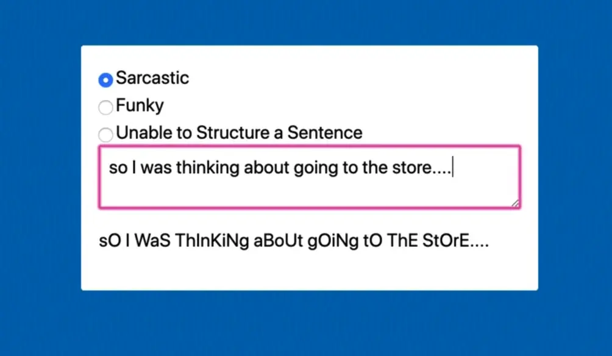

So that is our first filter, and we are just hard coding it in our `transformText` function right now. But it would be great if we can use it based on the radio selection that we have.

How could we do that?

We can modify the first line of `transformText` to grab the filter by finding the input with name of filter that is also checked, and then grabbing it's value.

```js
const filter = document.querySelector('[name="filter"]:checked').value;
console.log(filter);
```

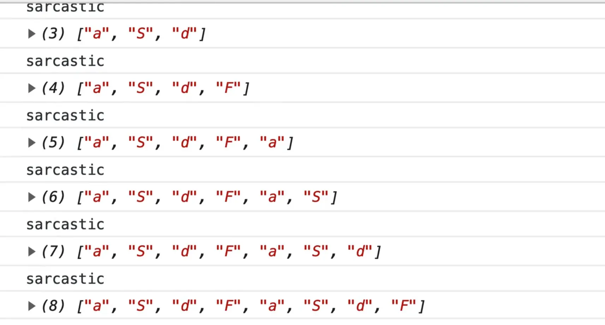

Now when we type in it, we get the selected filter type logged in the console.

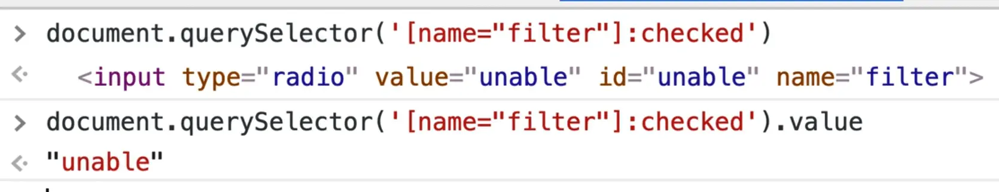

Another way we could have done the filter is because we already have the inputs, we could use the find method to find the input that is checked like so 👇

```js
filterInputs.find(input => input.checked);
```

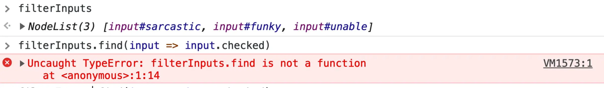

If you try that, you should notice an error in the console that says

> filterInputs.find is not a function.

That is because `filterInputs` is a NodeList, not an array. We could wrap it in `Array.from` and then call `find` like so 👇

```js
Array.from(filterInputs).find(input => input.checked);
```

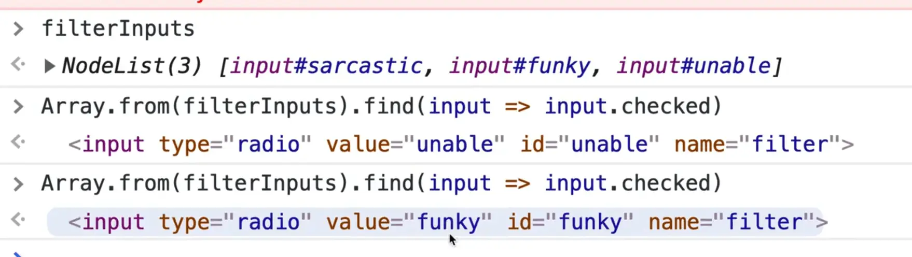

This is actually a better approach because why rerun the query selector if we have already selected all of the inputs!

Change the code to use that instead.

```js
function transformText(text) {
  const filter = Array.from(filterInputs).find((input) => input.checked).value;
}
```

With the way the code is written now, we will be transforming our `filterInputs` into an array every time the person types. That is not ideal.

Let's instead turn it into an array once on page load because it is unnecessary to have to keep doing that.

Modify the code like so 👇

```js
const filterInputs = Array.from(document.querySelectorAll('[name="filter"]'));
```

Let's do some cleanup and get rid of the logs within the `transformText` function.

Take the `filter` variable and use it as a property lookup instead of hard coding the value.

```js
const mod = Array.from(text).map(filters.sarcastic);
```

Replace the line of code above 👆 with the code below 👇

```js
const mod = Array.from(text).map(filters[filter]);
```

Because filter is stored in a variable, we need to use square brackets to look up the property.

If you refresh the page, the sarcastic option should still work but nothing should happen when you select the other 2 options because we haven't hooked them up yet.

Let's do funky now. Add the parameter `letter` to the function, like so 👇

```js
  funky(letter) {},
  unable() {},
};
```

We need some sort of dictionary or lookup of funky letters. If you open the `text-DEMO` or `text-FINISHED` file, you will see an object of funky letters.

Copy that variable along with the `/* eslint-disable */` and `/* eslint-enable */` comments into our text.js file.

Paste it towards the top of the file, after our `filterInputs` declaration.

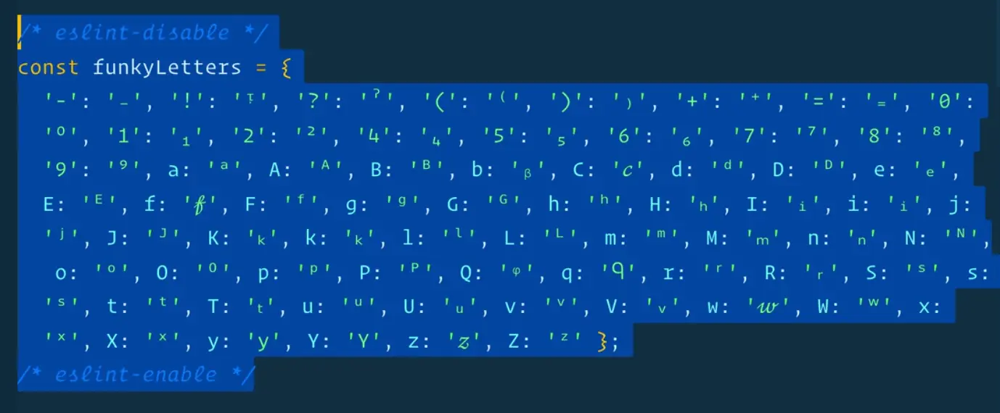

This object is just a lookup of letters that match to funky letters.

We kept the ESLint disable comments because otherwise when you save the JavaScript file, it formats the object so each property is on it's own line, which makes it hard to work within the file because it becomes so long.

Back to our funky function logic, we need to do the following:
- Check if there is a funky letter for this case
- If there is no funky letter for this case, check if there is a lowercase version.
- If there is nothing, return the regular letter

You have the `letter` argument, which you can use to look up inside of `funkyLetters`. For example if someone types `T`, we know there is a t for us to use.

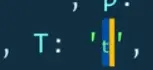

Add the following code 👇

```js
let funkyLetter = funkyLetters[letter];
```

What we are doing there is we are looking up the letter in our `funkyLetter` object and assigning the value to our `funkyLetter` variable.

If there is a funkyLetter, we will return it.
If there is not, we will return the original letter.

```js
funky(letter) {
  // first check if there is a funky letter for this case
  const funkyLetter = funkyLetters[letter];
  if (funkyLetter) return funkyLetter;
  // if there is not, check if there is a lowercase version
  // if there is nothing, return the regular letter
  return letter;
},
```

If you refresh the page and try typing something while selecting the funky radio button, you should see it start working.

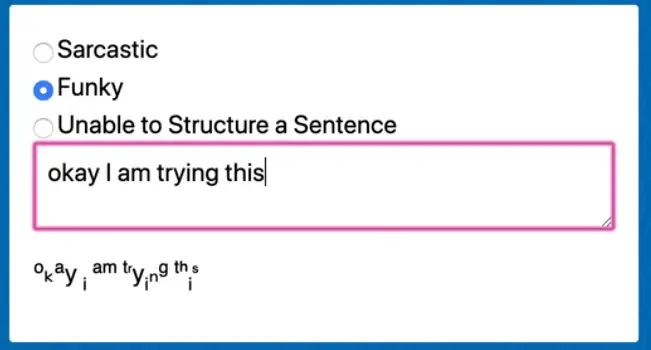

If no `funkyLetter` is returned, we want to check for the lowercase version of it because some letters have a funky version for both lower and uppercase, like `f`.

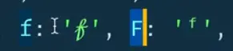

To do that, we will modify `funkyLetter` to be a `let` instead of a `const`, and then after the comment where we check if there is a lowercase version, we will try to grab the lowercase version by lowercasing the letter and looking it up in the `funkyLetters` object and then assigning the value to  `funkyLetter`.

If a value is found, we will return it, otherwise we will just return the letter as is.

```js
funky(letter) {
    // first check if there is a funky letter for this case
    let funkyLetter = funkyLetters[letter];
    if (funkyLetter) return funkyLetter;
    // if there is not, check if there is a lowercase version
    funkyLetter = funkyLetters[letter.toLowerCase()];
    if (funkyLetter) return funkyLetter;
    // if there is nothing, return the regular letter
    return letter;
  },
```

The last one is `unable`. It will take in a letter, and what we will do is one-in-three spaces, we will use the dot dot dot.

So we need a random number between 0 and 2, such as 1, 2, or 3 or 0, 1, 2.

The way that we can do that is using `Math.random() * 3`. That returns a number with decimals so we need to wrap it in a `Math.floor()`.

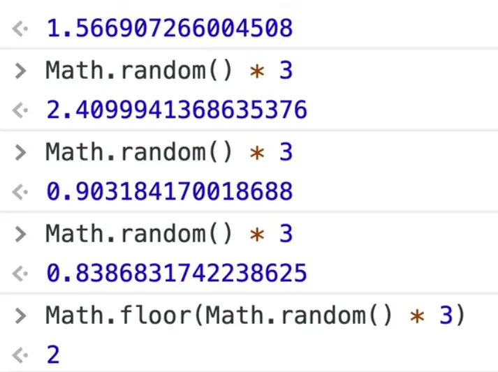

Now we will get 0, 1, or 2 returned. Grab that random number within the `unable` function.

```js
const random = Math.floor(Math.random() * 3);
```

Next you are going to check whether the letter is equal to an empty space, and that the random is equal to 2 (so 1 in 3), then return `"..."`.
Otherwise, we just return the letter.

```js
unable(letter) {
  const random = Math.floor(Math.random() * 3);

  if (letter === " " && random === 2) {
    return "....";
  }

  return letter;
},
```

Now if you refresh the page, select the unable option and try typing into the textarea, there is a one in three chance that the space will be turned into a `...`

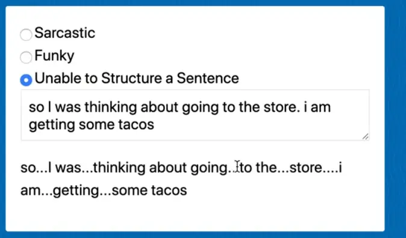

The last thing we want to do is when you click on the radio button options, it should trigger that filter and show you the result.

To do this, take `filterInputs` and loop over each one of them.

Add an event listener that listens for the input event, and then when there is an input event, we will call another function which calls `transformText` and passes the text from the textarea.

```js
filterInputs.forEach((input) =>
  input.addEventListener("input", () => {
    transformText(textarea.value);
  })
);
```

Now each of our filter inputs have an event listener that listens to the input event, and when that fires, it triggers the `transformText` event and passes the value of the text.

If you refresh the page, you should be able to select the different radio buttons and the text formatting will change based on the filter you select.

The main thing Wes wanted to get across in this lesson is that you can store methods inside of an object, to keep them together, as well as look them up on that object with a variable that is populated from some external input.
