This lesson is on classes, prototypes, and the keywords `this` and `new`.

We are grouping these things together because they are all connected and are the foundations for what is often called **object-oriented programming** and another popular paradigm **functional programming**.

Let's get started with the `new` keyword and understanding how it works.

Create a new file `new-this.html` in the playground directory.

Inside the file we want to add our HTML base, and change the title to "New, This, Prototypes and Classes".

Add a script tag within the body tag with a log - "it works" and open the HTML page to ensure it is working.

So what is the **`new`** keyword?

We have already used it a couple of times like when we throw an error, create a date or create a new array using the new keyword.

Speaking of dates, let's say you had a date that you assigned the value of August 11 2025 to and logged it to the console, it would return a string representation of the date.

```js
const myDate = new Date('August 11, 2025');
console.log(myDate);
```

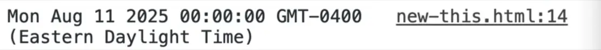

If we did `console.dir(myDate);` instead, you will see that we have our date and inside of it we have a prototype of tons of different methods.

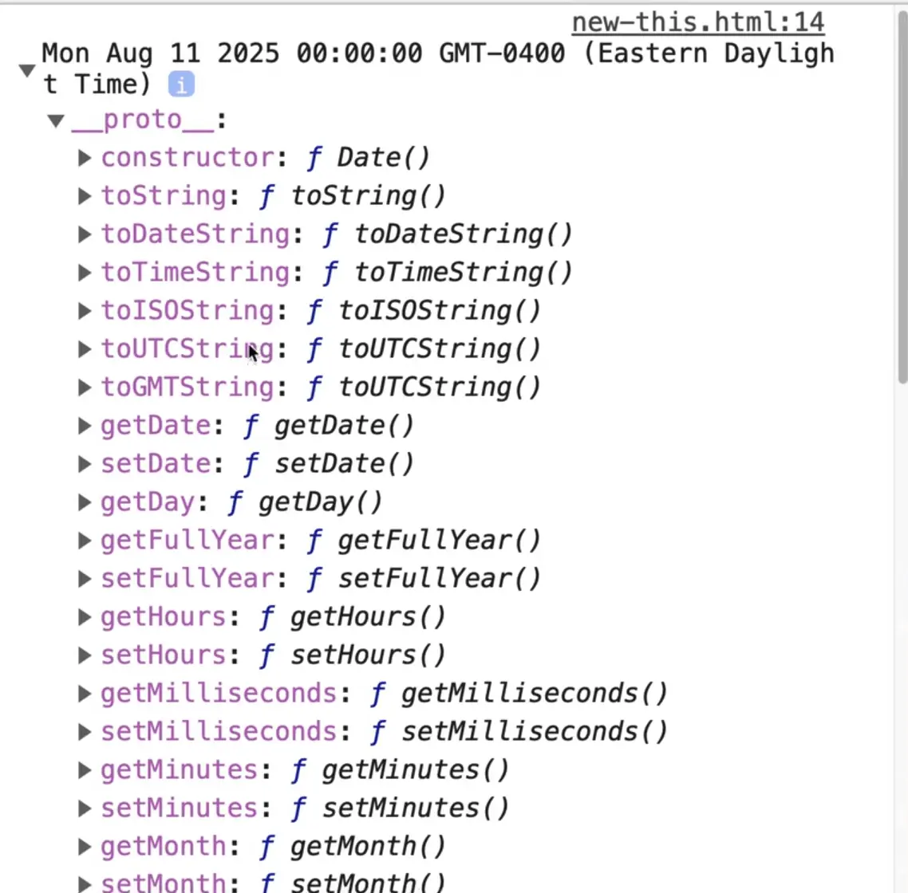

Let's say you were to log `myDate.getFullYear()`, you will see we get 2025 in the console.

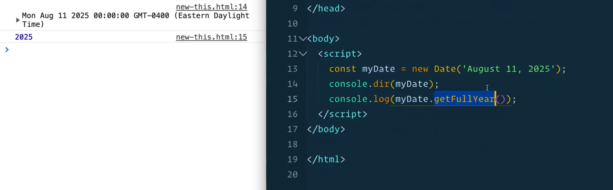

Where did the `getFullYear()` method come from?

The same thing when we create an array, we automatically have all these new methods like `pop`, `push`, `slice` and `splice`. Where do those all come from?

That is because when you create a date, an object, an array, a string, a number or any of those things, we are essentially creating a new object in JavaScript that is extended off the constructor, or as Wes likes to refer to it as, the momma object.

If we take a look at all of the types that we have by entering them into the console, such as `Array`, `Object`, `Date`, `Number` you will see that they are all just functions, which if run with the new keyword in front of it, will return a new object.

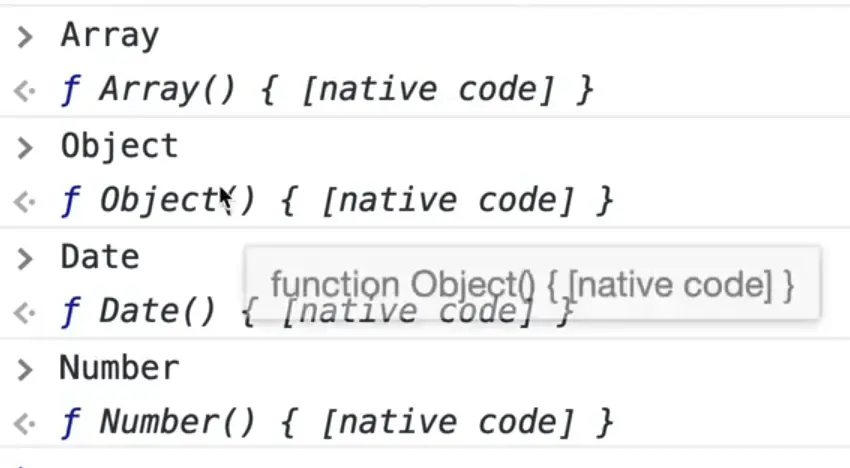

That is why we say in JavaScript everything is an object. Even though a number is just a number, when we create a new number, we have all these methods that exist on it. So although the number is just a number, it is packed with all these methods for working with it.

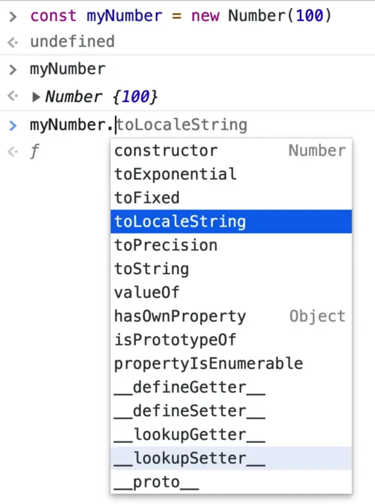

Let's go back to the date example.

Because we are creating a new `Date`, we have this variable `myDate` which is an instance of `date`. If you were to type into a console `typeof myDate`, it would return an object. But if you were to type `myDate instanceof Date` it would return true.

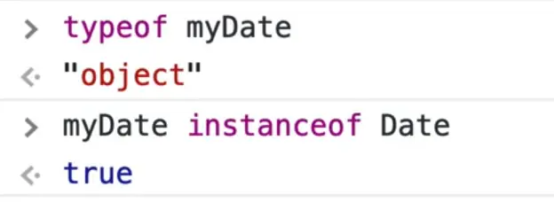

`myDate` is an object, but it is an instance of our special object that we have in the browser that is called a `date`.

The same thing happens with arrays.

In the script tag, add `const name = ['wes', 'kait'];`.

If you try running `typeof` and `instanceof Array` in the console, you should see the same result -- names is an instance of an array but an object itself.

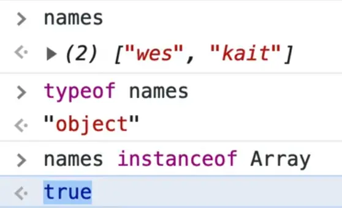

With the array, it might be a bit confusing because you don't see the `new` keyword being used. Same thing when you create an object like `const wes = { name: 'wes' };`.

Why are we able to use the instance if we aren't using the `new` keyword?

Because that way of making arrays and objects is referred to as **literal syntax**. They are the same thing as doing

```js
const names = new Array('wes', 'kait');
const wes = new Object({ name: 'wes' });
```

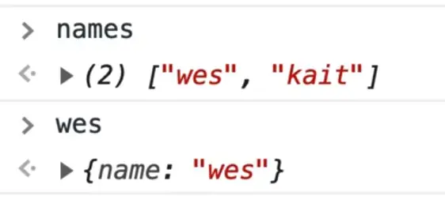

As you can see, the array and object look the same. The only difference is it is a shorter syntax.

Some other things like dates don't have a literal syntax, which is why we have to put the `new` keyword infront of it.

It's the same thing when you create an element.

```js
const span = document.createElement('span');
console.log(span);
```

If you tried to check whether `span` was an instance of an element you could do `span instanceof Element` which should return true because `Element` was the base one and `span` is the instance that we created.

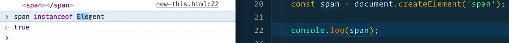

Why didn't we use `new Element`?

We can take a look at the span constructor by doing `span.constructor` in the console.
What that will do is it gives us a single `HTML` span element.

Let's check if these are true by entering the following into the console.

```js
span instanceof HTMLSpanElement;
span instanceof Node;
```

Both will return true. Why? Is it an element, is it a span, is it a node?

We will learn more about this in later classes but essentially things can start very basic like a node with text. Then it can go a little further and become an element, and have a tag and attributes. And then it can go even further and become a special kind of element like an image or div. In all of those cases, the element inherits the Node and the `HTMLSpanElement` inherits the `Element`.

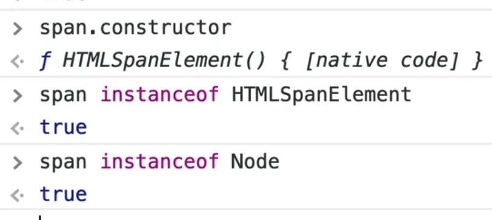

That is what is referred to as **extending** which we will get into when we discuss classes.

So when using `document.createElement()` we do not need a `new` keyword because it does that under the hood.

Let's build our own to get a better grasp on this. We will make a pizza.

```js
function Pizza() {
  console.log('Making a pizza');
}
```

What we have done is added the ability to make a new pizza.

Let's create one and try it first without the `new` keyword.

```js
const pepperoniPizza = Pizza();
console.log(pepperoniPizza);
```

If you refresh the page, you will see we get `undefined`.

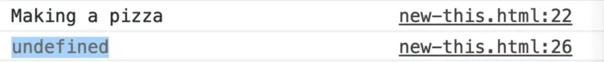

That makes sense because the function did not return anything.

```js
const pepperoniPizza = new Pizza();
```

Add the new keyword as shown above, and when you check the logs you will see that we get a pizza object with nothing because we haven't added anything to it yet.

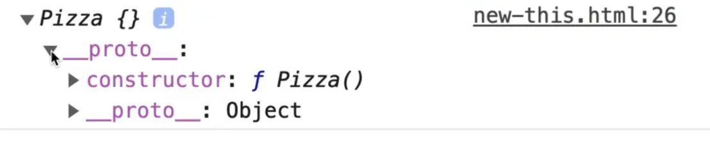

What happens is when you use the `new` keyword on a function, it creates a new instance object of that function instead of whatever has been returned from that function.

To reiterate, by using the `new` keyword in JavaScript, it creates a new object that is an instance of whatever function you have made it from. That makes a lot more sense when we get into the `this` keyword, `constructors` and `classes`.

We could take this a bit further and look at the `constructor` by logging it.

```js
console.log(pepperoniPizza.constructor);
```

The constructor will tell us what function made it.

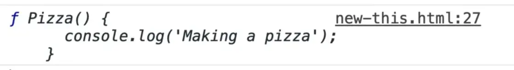

Same thing with our span. If we look at our constructor, we see that the thing that made the span was the `HTMLSpanElement` function.

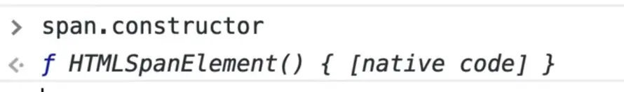

If you were to type `pepperoniPizza instanceof Pizza` we would see true returned in the console.
