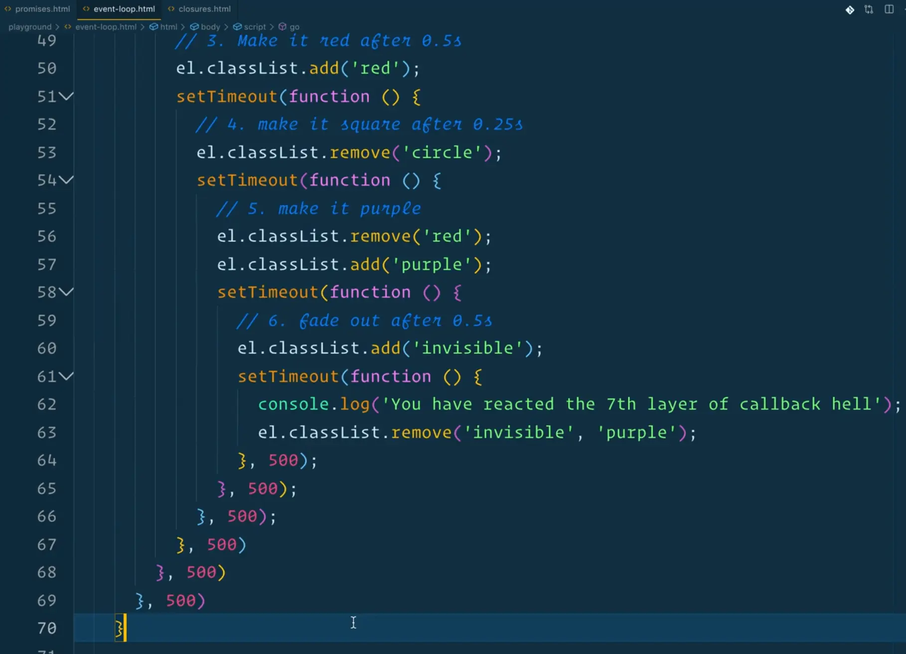
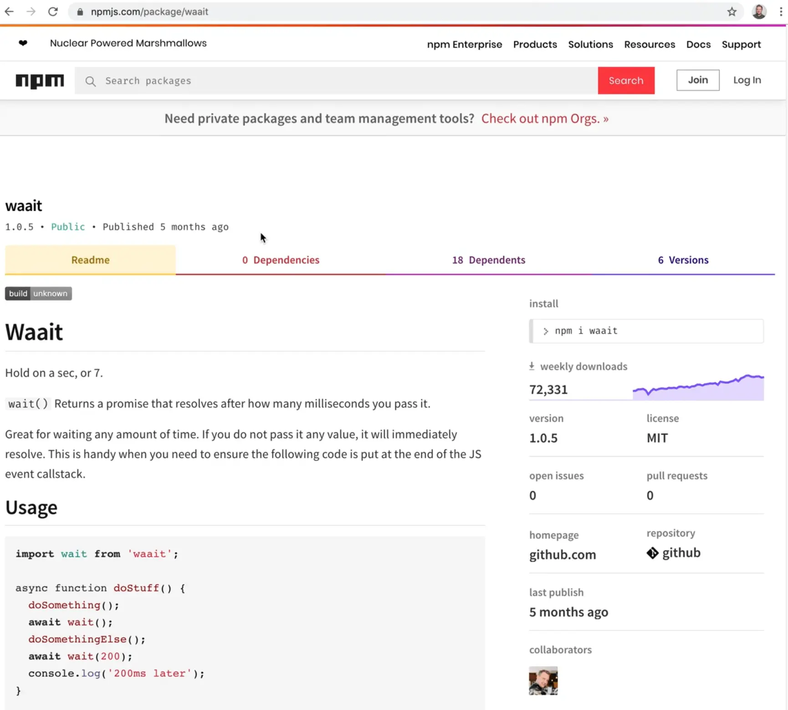
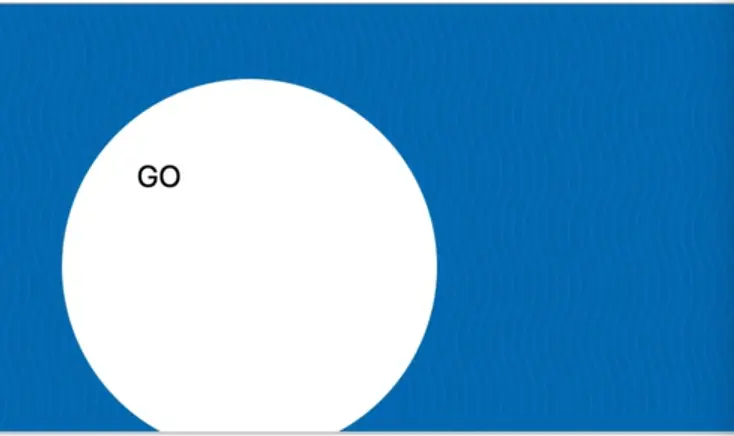

In this lesson we will go back to the event loop example, where we added the classes of `circle`, `purple` and `fadeout`, and we will refactor it to use promises instead.



We will be coming back to this example one more time and refactor it after we learn `async/await`.

Take out `event-loop.html` file, duplicate it and rename it as `promise-chain.html`.

The first thing we want to do is make a function that will simply wait for a certain amount of time. This is something Wes does in almost every single project because it is such a common thing.

Make a function called `wait` which will take in the number of milliseconds we want to wait using the parametetr `ms`, which we will default to 0 seconds, and then we will return a new promise which will resolve after the number of milliseconds that got sent in.

Then we will just test our new method by waiting 2 seconds (2000 milliseconds) before logging "DONE".

```js
function wait(ms = 0) {
  return new Promise(function(resolve) {
    setTimeout(resolve, ms);
  });
}

wait(200).then(() => {
  console.log('Done');
})
```

Now if you refresh the page, after 2 seconds you should see "done" logged to the console.



That is such a common thing that Wes actually has an npm package called **waait** which gets around 75k downloads per week and all it does is return a promise that resolves after a certain number of milliseconds that have been passed in.

We can use the implicit return and arrow function to refactor the `wait` function as shown below to be on one liner 👇

```js
const wait = (ms = 0) => new Promise(resolve => setTimeout(resolve, ms));
```

Now that we have this `wait` function, we can start to tackle all the callback hell.

Let's just rewrite it starting at the beginning by taking all our `setTimeouts` and instead making them promise based.

The first thing we will do is make an external function called `animate` and when someone clicks the go button, we will run `animate`.

`animate` will take in the event and let's start moving logic up to it.

For the event listener we already had on `go`, we will replace `click` with `clickXXXXX` so it doen't actually trigger and we can refactor piece by piece.

```js
function animate(e) {

}

go.addEventListener('click', animate);

go.addEventListener('clickxxxx', function go(e) {

})
```

The first thing we want to do is grab the element, then we want to change the text to "GO" when clicked, which is immediately so we can put it right into our animate function.

```js
function animate(e) {
  const el = e.currentTarget;

  // 1. change the text to GO when clicked
  el.textContent = 'GO';
}
```

Now we want to make it a circle after 2 seconds so we can use the `wait` function we made. We will chain a `.then()`, although there is no piece of data that is resolved from the wait, it simply is just done.

```js
function animate(e) {
  const el = e.currentTarget;

  // 1. change the text to GO when clicked
  el.textContent = 'GO';

  wait(200).then(() => {
     el.classList.add('circle');
  })
}
```

Now after 2 milliseconds, the GO square will turn into a circle. If you refresh the page, you will see it still works.



Now how do we make it red after 0.5 seconds?
We cannot just call it after the wait function because that will cause it to go red before it goes to circle.

What we can do instead is we can return another `wait()` of 500 milliseconds and then chain another  `.then()` onto it and put our third item in there, as shown below.

```js
function animate(e) {
  const el = e.currentTarget;

  // 1. change the text to GO when clicked
  el.textContent = 'GO';

  // 2. make it a circle after 2 seconds
  wait(200).then(() => {
     el.classList.add('circle');
     return wait(500);
  }).then(() => {
    // 3. make it red after 0.5 seconds
    el.classList.add('red');
  })
}
```

To make this more readable you can format them each on their own line like so 👇

```js
function animate(e) {
  const el = e.currentTarget;

  // 1. change the text to GO when clicked
  el.textContent = 'GO';

  // 2. make it a circle after 2 seconds
  wait(200)
    .then(() => {
      el.classList.add('circle');
      return wait(500);
    })
    .then(() => {
      // 3. make it red after 0.5 seconds
      el.classList.add('red');
    })
}
```

Now we have to make it a square after 0.25 seconds by removing the class of circle.

```js
.then(() => {
  // 3. make it red after 0.5 seconds
  el.classList.add('red');
  return wait(250);
})
.then(() => {
  el.classList.remove('cirlce');
})
```

Now after 500 milliseconds we want to remove the red class and add the purple one like so 👇

```js
.then(() => {
  // 3. make it red after 0.5 seconds
  el.classList.add('red');
  return wait(250);
})
.then(() => {
  el.classList.remove('circle');
  return wait (500);
})
.then(() => {
  el.classList.remove('red');
  el.classList.add('purple');
})
```

Now finally, after half a second, we need to make it invisible.

```js
.then(() => {
  el.classList.remove('red');
  el.classList.add('purple');
  return wait(500);
})
.then(() => {
  el.classList.add('fadeOut');
})
```

So what we have done here is taken the nested callback function and made it one level deep, which is waiting returning, waiting returning. That is chaining multiple `.then()`s onto each other.

That gets much better when we get to `async/await` but for now, this is the best way we can refactor these promises into a promise chain.
