In this video we are going to build an app that searches for a recipe based on a keyword and then we will display the data.

We will use a real API in this example so Wes can show us how to overcome common hurdles you will face when working with APIs. Working with APIs can be frustrating so it will be helpful to know how to approach the common pitfalls when you try it yourself.

We will be using the API at the website www.recipepuppy.com.

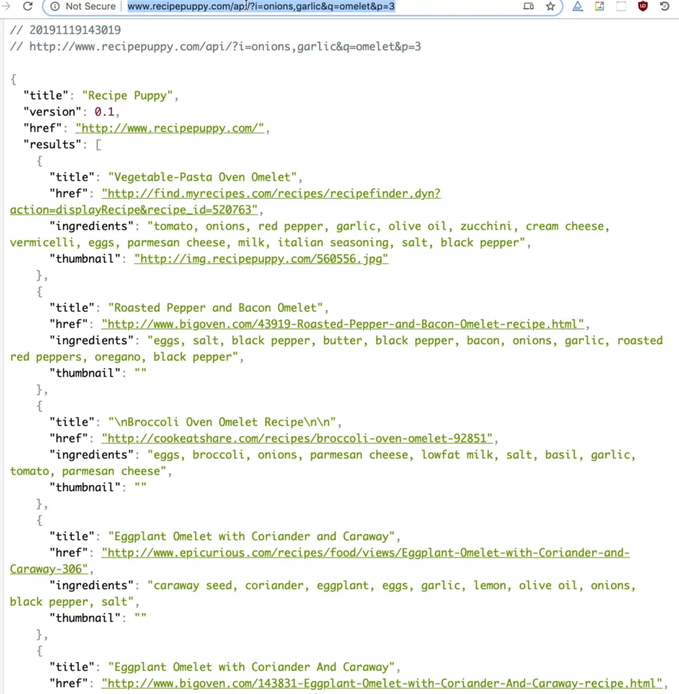

If you look at the docs, the way this API works is you go to the url and pass `i` (which is ingredients), pass `q` ( which is your omelet) and pass `p` (which is your page). On the homepage, you can see that there are additional parameters you can pass.

`http://www.recipepuppy.com/api/?i=onions,garlic&q=omelet&p=3`

## Query Parameters

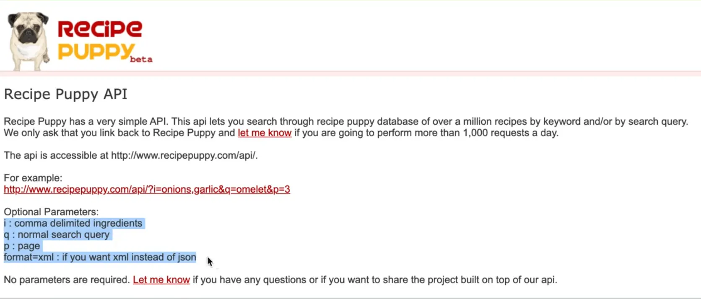

`i`, `q` and `p` are all parameters. Let's talk about **parameters**.

Sometimes when you got to a URL, you see these question marks on the end.

Even when you submit a form they are there. 👇


Those are referred to as **query parameters** or **query params**. Let's break down the query params from the url above.

```js
?i=onions,garlic&q=omelet&p=3
```

The query parameters portion of a url will _always start with a question mark_ and is followed by the first parameter. Additional parameters are separated by an ampersand `&`. That is how you can pass multiple parameters.

```js
?
i=onions,garlic
&
q=omelet
&
p=3
```

In the query string above...

- `i` is being passed multiple ingredients. _Note: using commas to separate the multiple items is not a standard thing, it is just how that API works._
- `q` is the recipe you are looking for.
- `p` is page, which is how this API handles pagination.

Parameters are never standard, every API implements them a little bit differently so you always have to go and read the docs.

We will be working out of the `/exercises/75 - CORS and Recipes/` directory.

This example will include a form with an input where the user can type a keyword, and they should be returned a list of recipes, their ingredients and a thumbnail image.

We won't worry about the UI just yet, let's just getting it working.

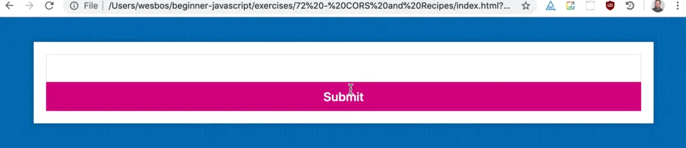

In the empty `scripts.js` file, let's add the base url.

Next, create an async function that takes in a parameter and fetches that from the endpoint, and call it on runtime.

```js
const baseEndpoint = "http://www.recipepuppy.com/api";

async function fetchRecipes(query) {
  const res = await fetch(`${baseEndpoint}?q=${query}`);
  const data = await res.json();
}

fetchRecipes("pizza");
```

Let's start fetching the data.

Open up the dev tools and then refresh the page. You should see the following error 👇

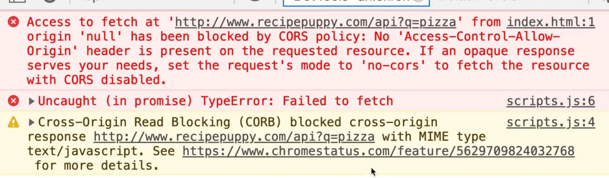

> Access to fetch at 'http://www.recipepuppy.com/api?q=pizza' from origin 'null' has been blocked by CORS policy: No 'Access-Control-Allow-Origin' header is present on the requested resource. >If an opaque response serves your needs, set the request's mode to 'no-cors' to fetch the resource with CORS disabled.
> www.recipepuppy.com/api?q=pizza:1 Failed to load resource: net::ERR_FAILED
> scripts.js:6 Uncaught (in promise) TypeError: Failed to fetch

If you look at the network tab, and filter for XHR, you will see the request but there is no response data.

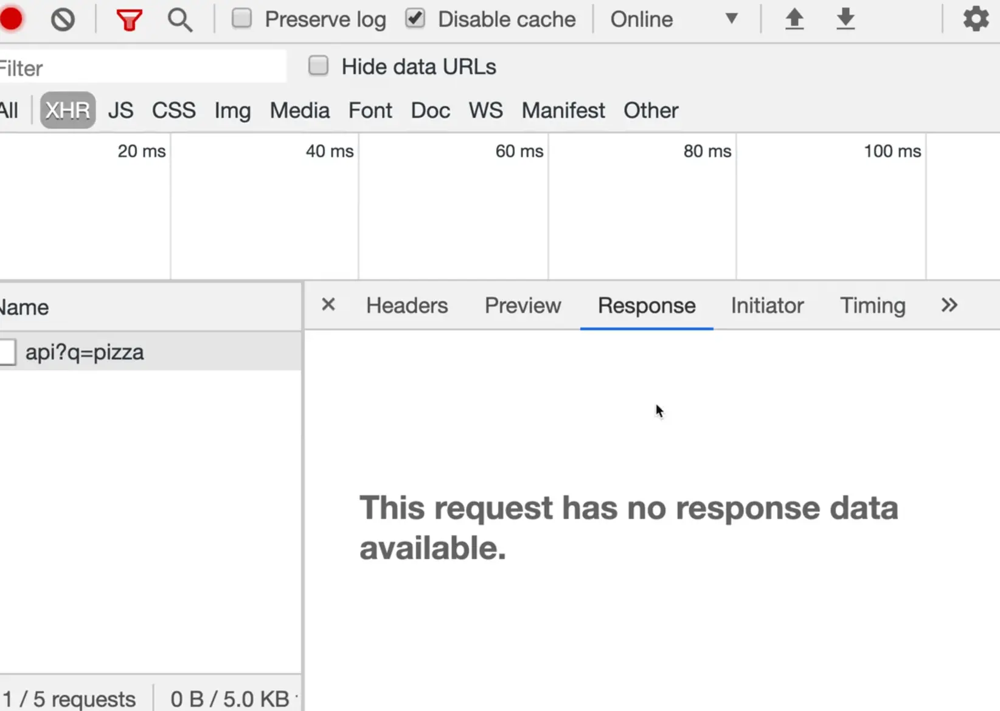

## CORS

What happened there is the browser blocked it because of something called **CORS**.

### What is CORS?

CORS stands for **Cross Origin Resource Sharing**. The "CO" in CORS stands for **cross origin**.

What are **origins**? Take the two websites: wesbos.com and github.com. Those are both origins. Domain names are origins.

If you want to share data between two origins like wesbos.com and github.com, by default you cannot.

You are only permitted to share data between the same domain name. For example it would be fine to share data from wesbos.com to wesbos.com/about.

As soon as you go cross origin from one domain name to another, then you start getting in trouble because that is a security issue in the browser.

For example, let's say you were logged into your bank at bank.com while you were also running code from wesbos.com. The JavaScript you are running on wesbos.com should not be able to reach into bank.com, because that would be a security issue. So by default, websites cannot talk to each other from one domain to another.

### CORS policy

What happens if you do need to pull data from one website to another, like we need to do with recipepuppy.com? How can we get those two websites to talk?

In order for the two websites to talk, the website from which the data is being pulled has to implement something called a **CORS policy**

A **CORS policy** is something that happens on the server, there is nothing you can do in the browser about this.

The server will have a CORS policy that has some rules such as "wesbos.com is allowed to ask for data and we will return it".

In our example, the recipepuppy.com server must specify which domain names are allowed to transfer data from it, and that has to happen on the server of the person that has the data.

Before we can get use CORS, we need an origin. If you look at the error we got in the console, it says 👇

> origin 'null' has been blocked by CORS policy: No 'Access-Control-Allow-Origin' header is present on the requested resource.

That error is occurring because we are accessing and running the code off of file access.

Whenever you see an error like the one above, the first thing you need to do is no longer run the code from the file. Instead, you need to run it on a server.

Let's get a server up and running, so we can see if that fixes the problem (in most cases, it will).

In the terminal, navigate to our `exercises/75 - CORS and Recipes/` directory.

Let's select a server to use, which could be any server. You could use:

- you could use browsersync
- upload the code to CodePen
- use Parcel

Let's start by getting Parcel running. In the terminal, run the `npm init` command.


You need to put a package name (which you can call anything, Wes chose `dogrecipes`) and then you just keep hitting enter to accept the default for the next few questions, as shown above.

Once the package is finished installing, run `npm install parcel-bundler` in the terminal to install Parcel.

Once that is complete, there should be a `packages.json` file in your folder (there will also be a `packages-lock.json` file). This packages file is where we can go and change our scripts, just like we have in previous lessons.

Open the file and modify the scripts start command like so 👇

```json
"scripts": {
  "start": "parcel index.html"
},
```

When we run `npm start`, you should see a message in the terminal that a server has been started on localhost:1234 or another port.

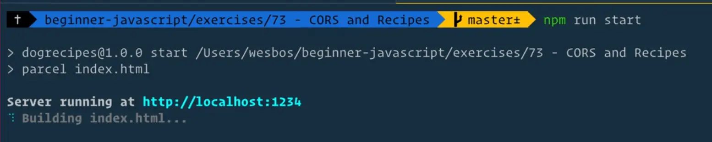

Open that server in the browser and take a look at the error we are now getting in the console. 👇

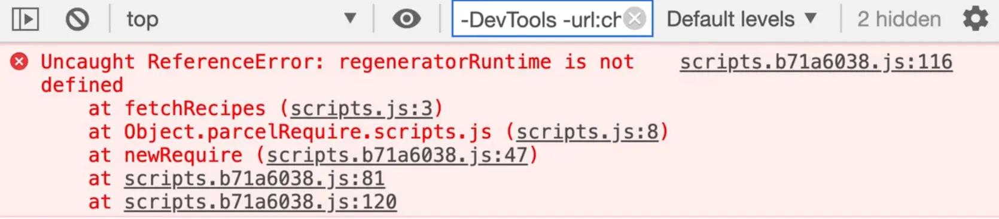

It is complaining that "regeneratorRuntime is not defined".

This issue has nothing to do with CORS. \_(Note: If you do not have this issue, and instead see another CORS issue, skip ahead to that section)

## Babel

`regeneratorRuntime` is a thing called **Babel**. Some JavaScript functionality, like async/await and backticks are relatively new to JavaScript, and older browsers do not support those functionalities. However, sometimes you need to support older browsers.

Babel helps with this.

It will take your modern JavaScript code and transpile it into JavaScript that is runnable on older browsers like IE or older Safari. That will give you JavaScript that works the same way. It has just been transpiled into the equivalent in older JavaScript with callbacks and things like that.

The weird thing about Babel is it wants to compile async/await, even though in most cases you don't need to because it is available in almost all browsers and has been for a few years.

## Browserlist

Since it's unnecessary, we need to tell Babel not to transpile async/await. The way we can get around that is to go to the `package.json` and somewhere in there we will add a `browerslist` property to the JSON file.

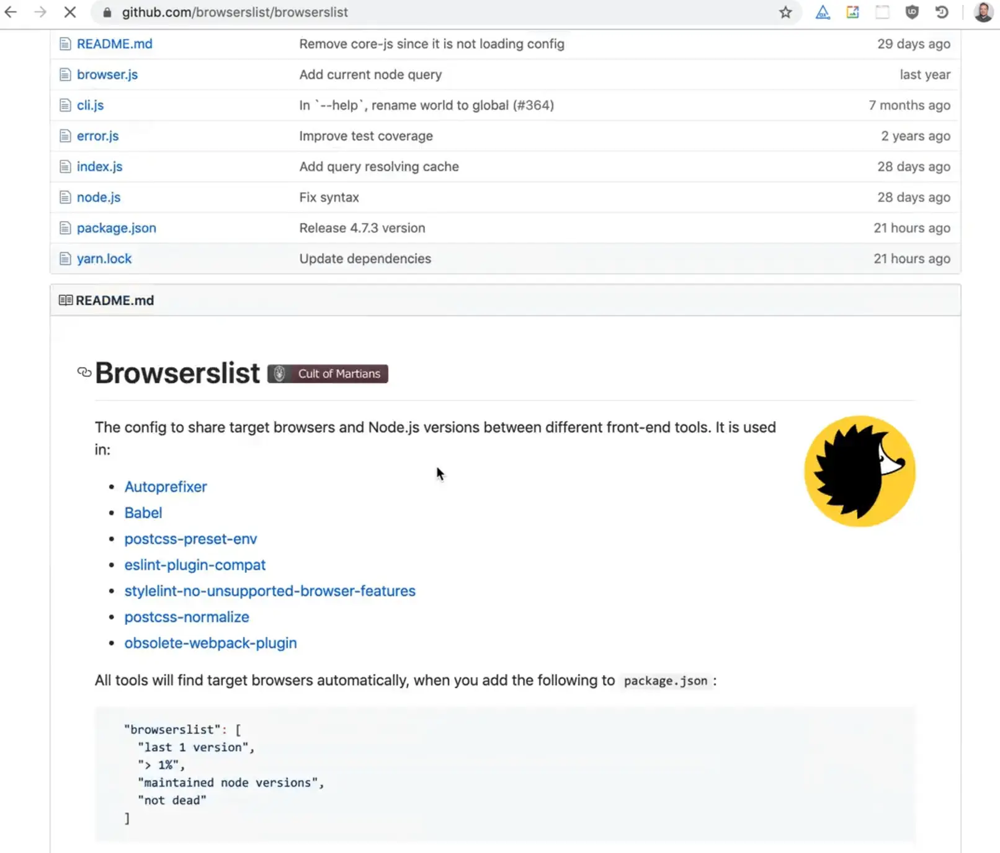

`browserslist` is a package that allows you to define which browsers you are currently supporting.

There is a huge list of filtering options like less than 1% usage, blackberry 7, etc. You can just write them in plain english and that will convert them. That is what tells babel what to transpile, and what to just leave as is.

_Note: Within `package.json` you must use double quotes instead of single because it is JSON._

```json
"browserslist": [
  "last 1 chrome versions"
],
```

Wes likes to use the filter above because it tricks babel into thinking you are supporting the latest and greatest and then it won't actually transpile it.

Now when you look at the page the error should be gone (you may see other errors which is fine).

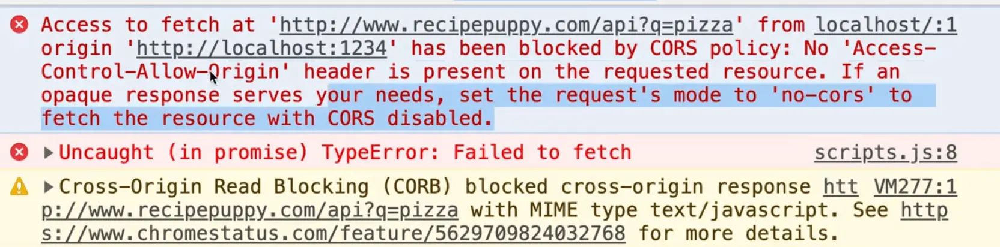

If you do have issues, kill the server by pressing Ctrl + C while focused in the terminal. Then open the folder up in your finder, and find the `cache/` and `dist/` folders within there and just delete those.

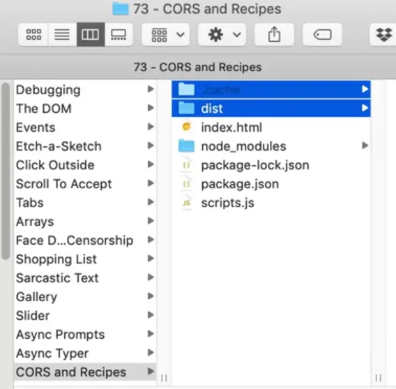

Now run `npm run start`, and that will fire it up again.

Problem number two, we have solved by using browserslist (you might not need to do that in the future).

The next problem is kind of the same error we had in the first issue.

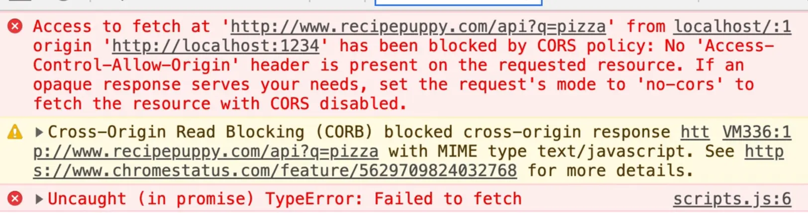

As you can see, even though we are now running our code on a server instead of access it right from the file, we are still getting an error except this time it is complaining about localhost:1234 not origin.

It seems like recipepuppy is complaining and saying, nope, you cannot use this in the browser.

Let's take a look at the docs because sometimes they will offer solutions such as use a callback. However, if you take a look yourself, you will see there is nothing on the page that suggests that we should or shouldn't use it with JavaScript, which is a bit of a bummer.

So what are you supposed to do if the CORS policy doesn't work or they don't have a CORS policy on it? It's not like they are explicitly blocking websites from accessing it, it's more likely they just have never implemented a CORS policy.

If you look at the website, you can see it has a link to "Recipe Puppy for iPhone", and if you were using this in an iPhone app, you are not restricted to CORS because there are no multiple tabs open and things like that.

## Proxy

So what is the solution?

The solution is that the request would work if it was made from anything other than a browser.

If we were to request the same data from the API using Node.js, PHP, Ruby on Rails or anything else, than it is totally allowed.

So the solution is instead of going directly from localhost to recipepuppy, we need to put something in between called a **proxy**.

It will work like this: localhost will send the data to the proxy. Then the proxy will do a request to recipepuppy on the server side, which recipepuppy allows so it will send data back to the proxy, and then the proxy sends it back to the localhost.

To use a proxy you either have to build one yourself which requires building an entire server that handled your requests and locked it down or in some cases, where it is something silly with no usernames, passwords or nothing sensitive being sent, you can use a **CORS** proxy that people have provided and you can just stick in front of your url and it will proxy the data for you.

To find one, just google CORS proxy.

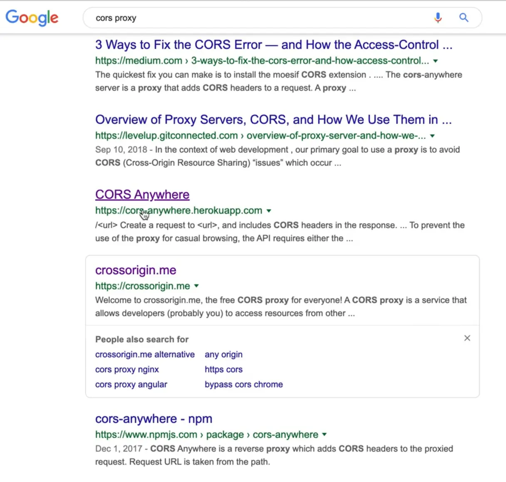

Wes has found that the https://cors-anywhere.herokuapp.com one works the best.

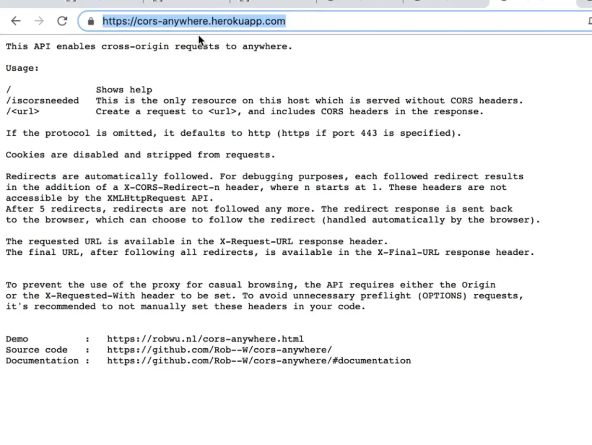

If you go to the website you will just see the text above, but the way that it works if you take the url and paste it in front of your urls and that will proxy that data for you.

Modify the code like so 👇

```js
const baseEndpoint = "http://www.recipepuppy.com/api";

async function fetchRecipes(query) {
  const res = await fetch(
    `https://cors-anywhere.herokuapp.com/${baseEndpoint}?q=${query}`
  );
  const data = await res.json();
}

fetchRecipes("pizza");
```

**To be absolutely clear here: you are sending you data through a random web server that is controlled by who knows who.** Never use this for something that has sensitive data like passwords, emails or login information. If that is the case, you have to run your own server.

In our case, we are just using it to learn and look up recipes so it doesn't matter that someone random may have access to that data.

Let's refactor the code slightly to the put proxy url in it's own variable like so 👇

```js
const baseEndpoint = "http://www.recipepuppy.com/api";
const proxy = "https://cors-anywhere.herokuapp.com/";

async function fetchRecipes(query) {
  const res = await fetch(`${proxy}${baseEndpoint}?q=${query}`);
  const data = await res.json();
}

fetchRecipes("pizza");
```

Now when you refresh the page, the error should be gone. Let's also console log the data.

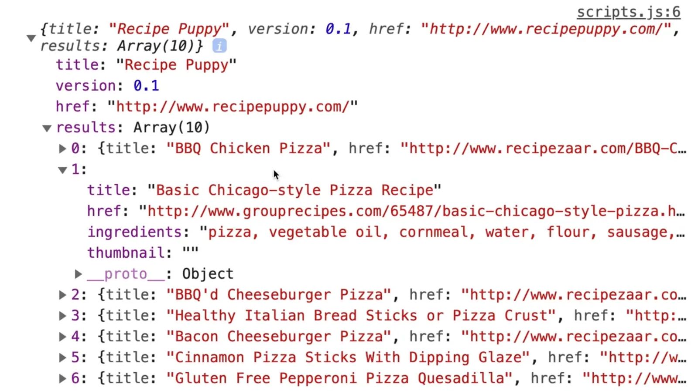

Now that we finally have the data working, we need to loop through the data and show them based on what the user has searched for.

Let's make an event listener and handler for the submit event when the user enters a keyword and hits the submit button.

```js
function handleSubmit(event) {
  event.preventDefault();
  console.log(event.currentTarget);
}

form.addEventListener("submit", handleSubmit);
fetchRecipes("pizza");
```

To grab the value of the query we can modify the code to use `event.currentTarget.query.value` because the input has a `name` attribute of `query`.

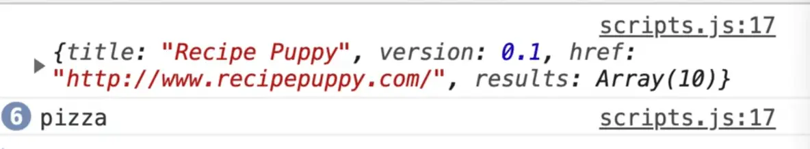

If you were to refresh the page, you should see pizza logged.

Next, we will some sort of loading screen because we don't want the user searching for many things over and over again while the API is still searching.

There are a couple of ways to do that.

The easiest is if you go to the input button and add a `disabled` attribute. That will stop the user from actually clicking it.

```html
<button disabled type="submit">Submit</button>
```

There is no visual different there, so let's add a style for buttons with the disabled attribute

```css
button[disabled] {
  opacity: 0.2;
}
```

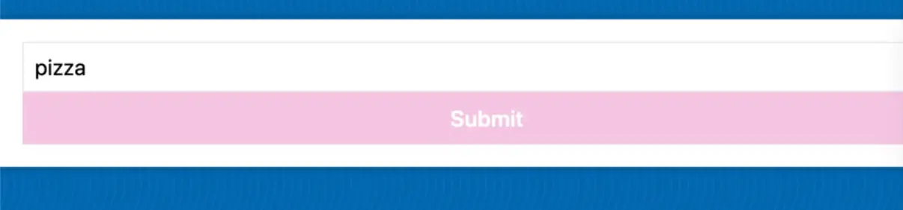

Now it is clear that the button is disabled.

Another trick you can do is take a fieldset and wrap all your inputs in that fieldset and then put a disabled attribuet on the fieldset itself. That will prevent someone from being able to type in the box or click on the buttons as well.

Either one is totally fine, as long as the user is prevented from making multiple requests at the same time.

Add a name attribute to the button of `name="submit"`.

Now in the script file we can access the submit button within the `handleSubmit` function, disable it, and then call `fetchRecipes` and pass it what the user searched.

```js
function handleSubmit(event) {
  event.preventDefault();
  const form = event.currentTarget;
  // turn the form off
  form.submit.disabled = true;
  // submit the search
  fetchRecipes(form.query.value);
}
```

Next, modify the `fetchRecipes` function to return the data instead of just logging it.

```js
async function fetchRecipes(query) {
  const res = await fetch(`${proxy}${baseEndpoint}?q=${query}`);
  const data = await res.json();
  return data;
}
```

Now we can await the fetchRecipes by marking our `handleSubmit` function as async.

```js
async function handleSubmit(event) {
  event.preventDefaut();
  console.log(form.query.value);
  const el = event.currentTarget;
  // turn the form off
  el.submit.disabled = true;
  // submit the search
  const recipes = await fetchRecipes(el.query.value);
  console.log(recipes);
  el.submit.disabled = false;
}
```

When we submit the form now and search for something like "chicken", it will disable the button, fetch and log the recipes, and finally re-enable the button.

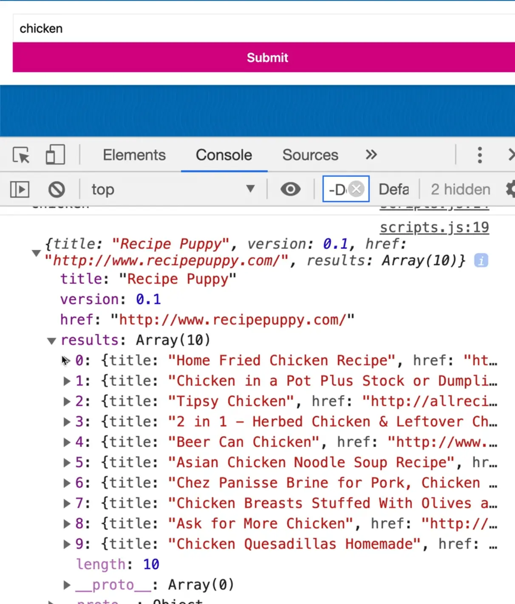

Next, make another function called `displayRecipes` which takes in the array of recipe and returns the HTML that will be used to display those recipes.

How can we pass the recipes array from the `handleSubmit`?

If you log `recipes`, you will see that it actually return an object and the recipes array lives on the `results` property of the `recipes` object. We can use that property to pass the array like so `displayRecipes(recipes.results);`.

`displayRecipes` will loop through each recipe and return some generated HTML, such as the title, ingredients and a thumbnail image if there is one (which we will check for with a conditional).

This might look a little confusing because you can nest template tags within template tags as deep as you want.

Below we have one template tag and inside of that template tag we can run JavaScript logic, and also return another template tag which in turn will have template tags inside of them.

```js
function displayRecipes(recipes) {
  console.log("Creating HTML");

  const html = recipes.map((recipe) =>
    `<div class="recipe">
      <h2>${recipe.title}</h2>
      <p>${recipe.ingredients}</p>
      ${
        recipe.thumbnail &&
        ``
      }
    </div>`
  );

  recipesGrid.innerHTML = html.join("");
}
```

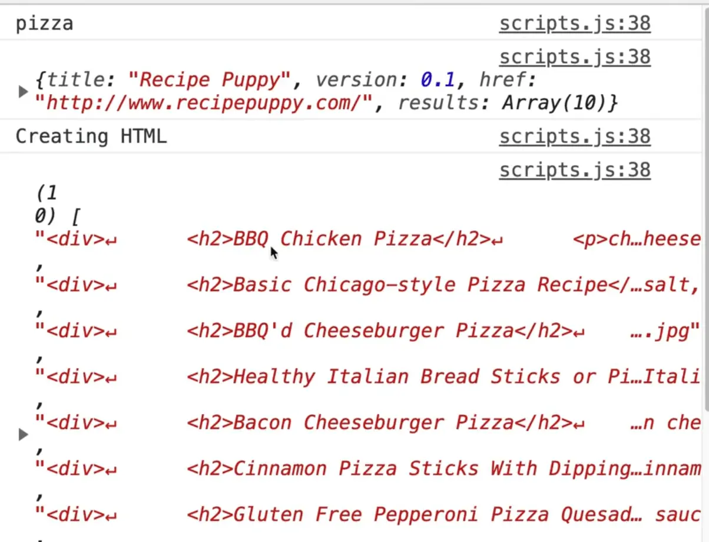

As you can see, for each recipe we had returned we have some HTML generated for them.

At this point let's go back to the HTML page and make a div `<div class="recipes"></div>`. Inside of that div we will display the grid of recipes.

Start by grabbing the div. 👇

```js
const recipesGrid = document.querySelector(".recipes");
```

At the bottom of displayRecipes, set the innerHTML of the recipes grid to be equal to our array of HTML, which we will join (if we did not join them, there would be a comma between each of the elements). 👇

```js
recipesGrid.innerHTML = html.join("");
```

When you refresh the page, the HTML should look similar to the image below 👇

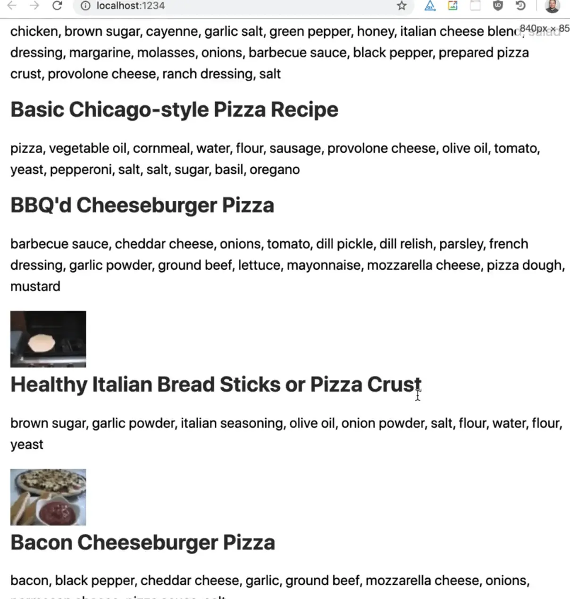

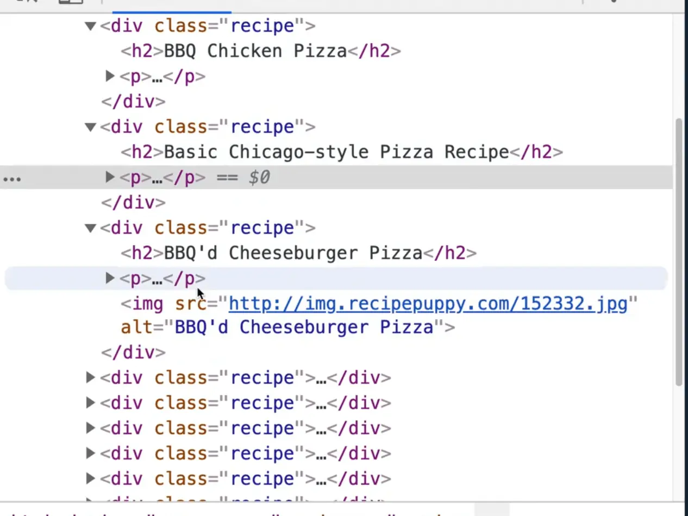

For each item, we have:

- created a div
- added the title
- the ingredients
- show the image if avaialble

Add the following css to make it look better:

```css
.recipes {
  display: grid;
  grid-template-columns: repeat(auto-fill, minmax(200px, 1fr));
  grid-gap: 20px;
}

.recipe {
  border: 1px solid rgba(0, 0, 0, 0.1);
  padding: 20px;
}
```

One thing we forgot to do was link each recipe using an `href`.

Go back to the `displayRecipes` function and modify it like so:

```js
function displayRecipes(recipes) {
  console.log("Creating HTML");

  const html = recipes.map((recipe) =>
    `<div class="recipe">
      <h2>${recipe.title}</h2>
      <p>${recipe.ingredients}</p>
      ${
        recipe.thumbnail &&
        ``
      }
      <a href="${recipe.href}">View Recipe →</a>
    </div>`
  );

  recipesGrid.innerHTML = html.join("");
}
```

The one issue we have now is it's not running on page load.

Why is that? If you look, a lot of our logic is tied to the submit event, so we can't just run that on page load unless we were to fake a submit event.

To solve that issue, let's make another async function called `fetchAndDisplay` which will take in a parameter `searchTerm`.

Take all the logic from the `handleSubmit` function below where we log the search term and we will move it to `fetchAndDisplay`. Let's modify the code slightly amd also add a call in `handleSubmit` to `fetchAndDisplay` which will take in the search term as a parameter.

One thing we need to change is that we no longer have access to the `el` function in `fetchAndDisplay`. The element would need to be either globally scoped or passed the function.

Luckily we do have the form globally scoped.

```js
async function handleSubmit(event) {
  event.preventDefault();
  const el = event.currentTarget;
  console.log(form.query.value);
  fetchAndDisplay(form.query.value);
}

async function fetchAndDisplay(query) {
  // turn the form off
  form.submit.disabled = true;
  // submit the search
  const recipes = await fetchRecipes(query);
  console.log(recipes);
  form.submit.disabled = false;
  displayRecipes(recipes.results);
}
```

Next we just need to include a call to run it on page load. Replace the last line of code from `fetchRecipes("pizza");` to `fetchAndDisplay('pizza');`.

Now when you refresh the page, you will see it is running on page load with the default term "pizza". If you type in another search term and hit submit, it will work.

That is the basics.

It would be an interesting to take this exercise even further and have it so people could have an input box for ingredients and that would get passed along for the ride.
