Let's talk about modules. Being able to share code across multiple JavaScript files and even across multiple projects is an easy thing to do when you start to use modules in JavaScript.

## What are Modules?

So what are they?

**Modules** are a way to structure and organize your JavaScript, and it gives us the ability to share functionality and data across multiple files and projects.

A few things you need to know about modules:

- They have their own scope, similar to how a function has scope.
- They can hold anything (functionality, data, config)

## Use Cases

If you recall in the previous lesson where we built a currency converter, we had a variable `currencies` that was a giant object of all the currency codes and names. It would be nice if instead of having that object directly in our file, we could put it in a separate module and then import it into the file to use when we need it. That is what modules will allow us to do.

Another use case for modules is utility functions.

For example, in the Dad Jokes lesson, we had a method `randomItemFromArray`. That method is not specific to that project, it's just a handy array utility. We could throw that off into a separate file that is used for utilities.

### Modules in the Browser

Let's look at how modules work in the browser, and then we will look at some tooling that will help us work with them.

You might hear modules referred to as **ESM**, **EcmaScript modules**, or **ES6 modules**. They were added to JavaScript a couple of years ago, and they are the best way to organize your JavaScript when you have multiple files.

Let's go into our playground and create a folder called `modules` (it might already be there for you).

Inside that folder create the following files:

- `index.html`
- `utils.js`
- `handlers.js`
- `scripts.js`

That gives us 3 separate JavaScript files.

Add the following code to `scripts.js`.

```js
// scripts.js
const name = "wes";
```

In `utils.js`, add a simple function.

```js
// utils.js
function returnHi(name) {
  return `hi ${name}`;
}
```

Let's say we need to use the `returnHi` function in `scripts.js`. Can we do that if the function is in a separate JavaScript file than the one using it?

Let's try. Modify the code like so.

```js
// scripts.js
const name = 'wes';
console.log(returnHi(name));
```

Go into `index.html` and add the base HTML if it is not already there as well as a script src tag and link it to `scripts.js`. Open the html page in the browser.

When you do that, you should see an error that `returnHi` is not defined.

That makes sense - because we have not yet put our `utils` on the page.

You might think we can just add another script source tag above the one we added and link it to utils.

```html
<script src="./utils.js"></script>
<script src="./scripts.js"></script>
```

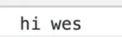

As you can see, now it works. All we had to do is put one script in front of the other one that needed it in.

### In the Past - Sharing JavaScript Code between Files

In the past, this was how code was shared across multiple files.

That got out of hand pretty quickly because you had all these files that had dependencies and the order of the script tags affected the execution because they all have to load in a waterfall, which means one after the other. Each file is assuming that the other one has access to it.

If you look at our `scripts.js` file in VS Code, ESLint is complaining that `returnHi` is not defined. That is because that function does not exist within the file, so where did it come from?

The only reason it works is because we have globally scoped the function in another file and we are just assuming that it will be available to us on the page. That is a very brittle way to write JavaScript

#### In the Present - Sharing JavaScript Code between Files

The solution to that is to use modules!

When you need a function like `returnHi`, you can just import the function from the module, which is the same thing as saying from the file that actually contains that function.

When you do that, you don't really have to worry about things loading before each other, because we will always import the values we need before hand.

Let's change this example to use a very sime module.

In `index.html`, there is just have one script tag and that is going to be the entry point into the JavaScript.

Add the `type` attribute on the script tag and set it to `module` like so 👇

```html
<scripts src="./scripts.js" type="module"></script>
```

Modify the code in `scripts.js` file to contain the following:

```js
const name = "wes";
console.log("Its working...");
```

If you refresh the HTML page and look at the console. you will should see a bunch of errors.

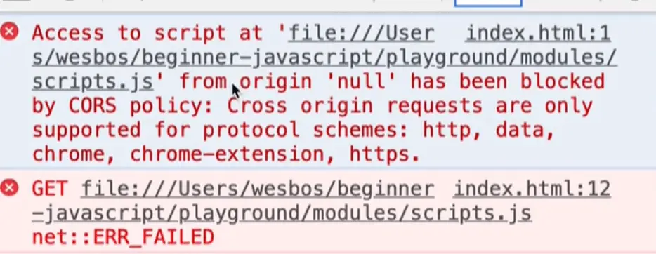

This first one is the CORS issue again. It is giving us trouble because you cannot use modules unless you are running it on a server.

## Setting up Server

We cannot use a Parcel server because Parcel also handles modules for us and Wes is trying to show us how they work without using a bundler. We just need a very simple server up and running.

If you know how to run a server to serve us these files, feel free to skip ahead.=

There are a couple of different ways to do this.

1. VS Code plugin

If you go to extensions in VS Code and search for "Live Server", you should see an extension that matches it and you can click install.

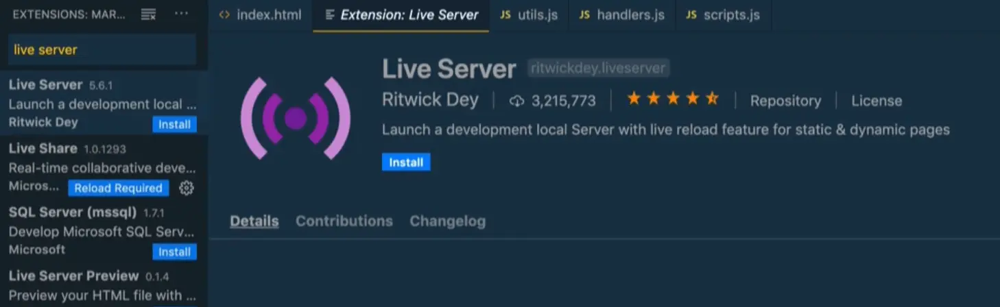

If you go back to the modules and right click on the `index.html` and click open with Live server, and that will start it up in the browser.

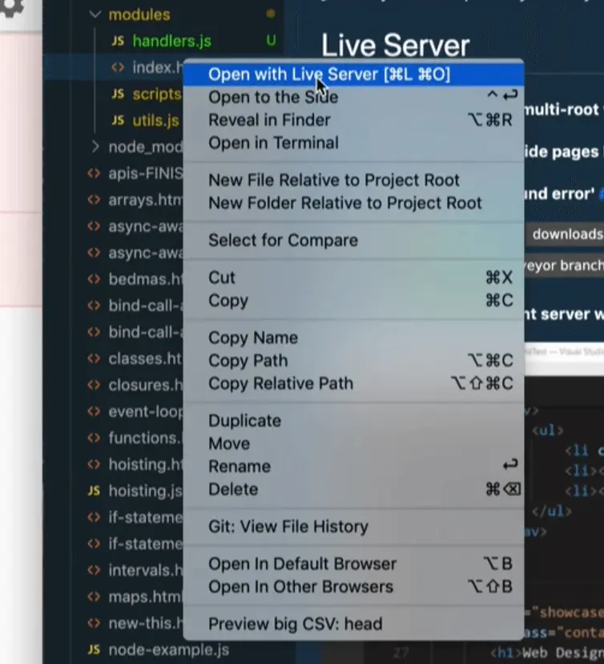


That will start up a localhost server. The url is `127.0.0.1:5550` which is the equivalent as localhost, it is just the IP address. You can replace it with localhost and it will work just the same `localhost:5550`.

Now if you open up the dev tools, you will see that it is working.

2. BrowserSync

Another way to get a server running is to open your terminal and run `npm install -g browser-sync`.

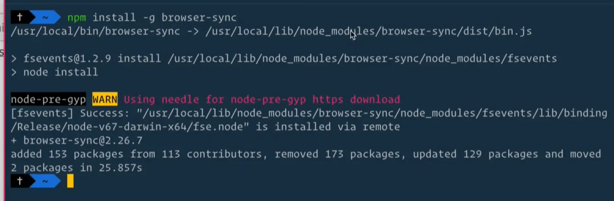

In the terminal, cd into the `modules/playground` folder and run the command`browser-sync`, it should start up a server.

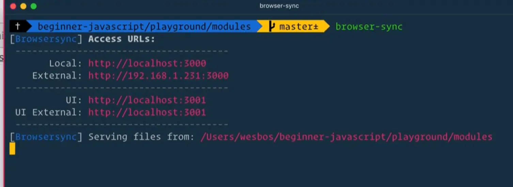

If you open up the dev tools, you will see it is working but we get an error regarding `base.css`.

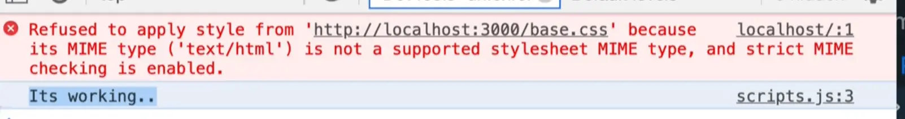

That is because we are running the server within our `/modules` folder but the base CSS file is actually at a higher level and it can't go up higher than the root.

The solution for that is to open up `base.css`, copy all the content and then make a new file within the `/modules` directory called `base.css`.

Now let's modify the path to that file within `index.html`. Modify it like so:

```html
<link rel="stylesheet" href="./base.css">
```

Now if you refresh the page, you should no longer see that error.

At first it seemed like both of those options supported **hot reloading** or **live reloading**, which is the term used to refer to a feature where a server cause a browser to automatically refreshes the HTML page whenever a change is made to the HTML, CSS or JavaScript files.

However it seems like the way Wes is running browsersync isn't hot-reloading. It may be that the `browser-sync` command requires additional parameters to enable that but we will just stick to VSCode server since it is the simplest one.

Now that we have the server running, let's get back to the exercise and pick up where we left off.

How do we take a function that exists in one file and use it in another? You can import it from that file.

## Importing and Exporting Modules

There are two types of module imports:

1. **Named Imports**
2. **Default Imports**

Before we can import something, we first need to export it.

Let's go this by going to our `utils` file and exporting the `returnHi` function.

```js
function returnHi(name) {
  return `hi ${name}`;
}
```

When sharing code between multiple files like this, the word we use for each file is a module (so a file is a module).

If you want to surface functionality from one file to another, you first must export it. We will export it like this for now:

```js
export function returnHi(name) {
  return `hi ${name}`;
}
```

In `scripts.js`, let's go ahead and import that function now.

You do this by using the keyword `import`, a set of curly brackets between which you supply the name of the function we want to import, which is `returnHi` in this case and then we add the keyword "from" and the relative path to the file that contains the export, which is `utils` in this case.

```js
import { returnHi } from "./utils.js";
```

Now within `scripts.js`, we should be able to add the following code:

```js
import { returnHi } from "./utils.js";

const name = "wes";
console.log(returnHi(name));
console.log("Its working....");
```

Now when the page refreshes, you will see that it is working.


To recap:

We defined some functionality in a separate file but in order to in order to access that functionality, we must first export it from the file it is in.

Exporting it is a way of telling JavaScript and the bundler that those functions or files are available to be used by other JavaScript modules.

In a separate file, we imported that function and used it.

**You always do your imports at the very top of the file that you are in, and you can have multiple imports as well. Then you simply have access to that functionality and can use it.**

## Things we need to know about Modules

### Scope

One thing that Wes mentioned briefly earlier is that modules have their own scope.

What does that mean? Let's look at an example to demonstrate.

Let's say we have the following variable within `utils.js`: `const last = 'bos';`.

What would happen if we want to access that within the `scripts.js` file like so:

```js
import { returnHi } from "./utils.js";

const name = "wes";
console.log(returnHi(name));
console.log("Its working....");
console.log(last);
```

When the HTML refreshes, you will see we get an error "last is not defined". That is because `last` is in a different module.

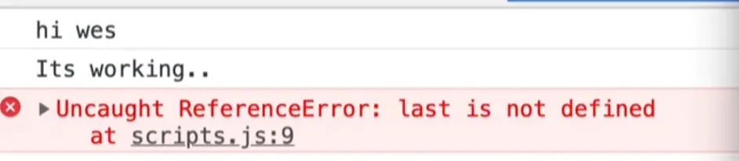

What if within the `returnHi` function in `utils.js` we use the `last` variable like so 👇

```js
export function returnHi(name) {
  return `hi ${name} ${last}`;
}
```

Is that allowed? And is it going to work?

Let's find out.

Within our `scripts.js` remove `console.log(last)`.

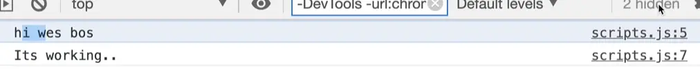

As you can see, it is working.

That means that you can use variables that are defined inside of a module, and they will not leak out and become available in any other file, however you can use them inside of that module, no problem.

That is what is referred to as _scoped to the module_.

The variable `last` would not available in the console if you were to try, because it is not globally scoped, and it is not available in the `scripts` module. The `last` variable is simply scoped to the `utils` file and can only be used within that file.

Is that good practice? Yes!

The beauty of modules is that you don't have to worry about scoping or anything like that.

You can just create variables inside of that file and they are only available inside of that file and nowhere else.

Now what if we _did_ want to be able to access the `last` variable inside of the `scripts` file? We could export that variable by putting the `export` keyword infront of the variable declaration.

```js
export const last = "bos";
```

Now within `scripts.js` we can modify our `import` statement to import that variable.

```js
import { returnHi, last } from './utils.js';
```

At the bottom of `scripts.js` let's log `console.log(last)`.

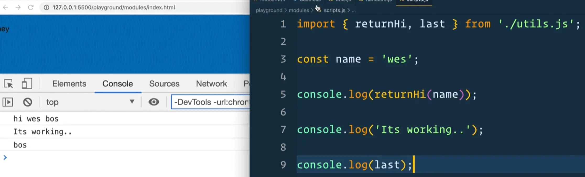

As you can see, that works!

Another way to export a value is instead of exporting it when you create it, you can export it from the bottom of the file like so `export { last }`. This is referred to as a named export because they have a name on them.

Here is what the `utils.js` file looks like now:

```js
// utils.js
const last = "bos";

export function returnHi(name) {
  return `Hi ${name} ${last}`;
}

// named exports
export { last };
```

Let's say we have multiple variables like `const middle = 'slam dunk'` and we wanted to export that as well we could either add an `export` to the variable declaration or we can export middle using a named export like so:

```js
// utils.js
const last = "bos";
const middle = "slam dunk";

export function returnHi(name) {
  return `Hi ${name} ${last}`;
}

// named exports
export { last, middle };
```

If you go into scripts and modify the file to import that variable and use it like so 👇

```js
// scripts.js
import { returnHi, last, middle } from "./utils.js";

const name = "wes";

console.log(returnHi(name));

console.log("Its working....");

console.log(last, middle);
```

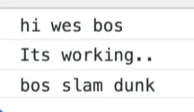

Which type of export should you use? That is a personal preference so use what you prefer. Wes often uses a combination of both.

You can also export async functions.

If `returnHi` were async, we could export it like so 👇

```js
export async function returnHi(name) {
  return `Hi ${name} ${last}`;
}
```

As mentioned earlier, that is what is referred to as **named exports** and **named imports**.

The way you can tell if something is a named export is if it has the `export` keyword in front of the function definition or variable declaration or if it is exported using curly brackets because those are only used in named exports.

The other way to do that is a called a **default export**.

Every module can have as many **named exports** as they want, however it can only have one **default export**, which specifies what is exported from the file by default.

For example, let's make another module `wes.js` and in it assign a variable `person` to an object, and then export that variable like so 👇

```js
const person = {
  name: "Wes",
  last: "Bos",
};

export default person;
```

Then if you want to access the `person` object within `scripts.js`, we could import it like so 👇

```js
import { returnHi, last, middle } from "./utils.js";
import wes from "./wes.js";
```

Now let's log it `console.log(wes)`.

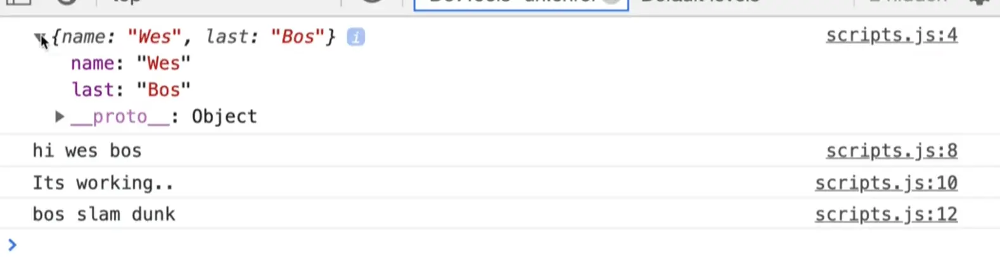

Now we could have named that import anything we wanted.

For example we could have done

```js
import { returnHi, last, middle } from "./utils.js";
import westerhoff from "./wes.js";

console.log(westerhoff);
```

If you refresh the page, you will see it still works.

### Difference between Default and Named Exports

The difference between default exports and named exports is that with named imports, you must know what the name they have been exported as, but since there is only one default export per file, you can import them and name they whatever you want.

Which type of export should you use? There are arguments to be made on both sides.

Wes will usually use a default export if the module does one thing, but if the module does multiple things, like a utility library or something like that, then you can just have multiple named exports from it.

You can have both named and default exports in one file.

For example, in `utils.js`, we will default export a variable called `first`, by adding the following code to the bottom of the file 👇

```js
const first = "wes";
export default first;
```

Now within `scripts.js`, if we wanted to import that it wouldn't go in curly brackets because that is only for named and `first` is the default. So we could import and log it like so 👇

```js
import first, { returnHi, last, middle } from "./utils.js";
import westerhoff from "./wes.js";

console.log(westerhoff);
console.log(first);
```

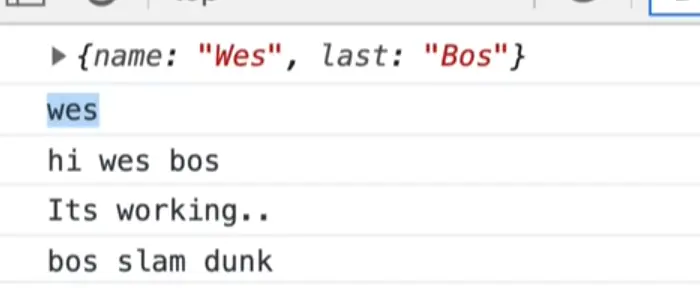

To reiterate:

- named are in curly brackets
- default are always only one and outside of the curly brackets.

## Renaming Modules

Another thing about modules is you can rename them as you import them.

Let's say we wanted to rename `returnHi` to `sayHi`. We could do that within the import statement like so 👇

```js
import first, { returnHi as sayHi, last, middle } from "./utils.js";
```

That will import `returnHi` and rename it to `sayHi`, kind of like destructuring but with different syntax because we use the `as` keyword.

Now let's replace where we are calling `returnHi` and instead call `sayHi`, and then log `sayHi`.

```js
import first, { returnHi as sayHi, last, middle } from "./utils.js";
import westerhoff from "./wes.js";

console.log(westerhoff);
console.log(sayHi);
console.log(first);

const name = "ws";

console.log(returnHi(name));

console.log("Its working...");

console.log(last, middle);
```

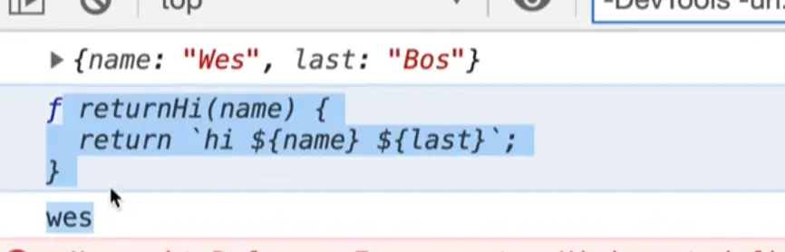

As you can see, when we log `sayHi`, you see that we have that function there as `returnHi`.

Let's take a quick look at the docs. Google "mdn import".

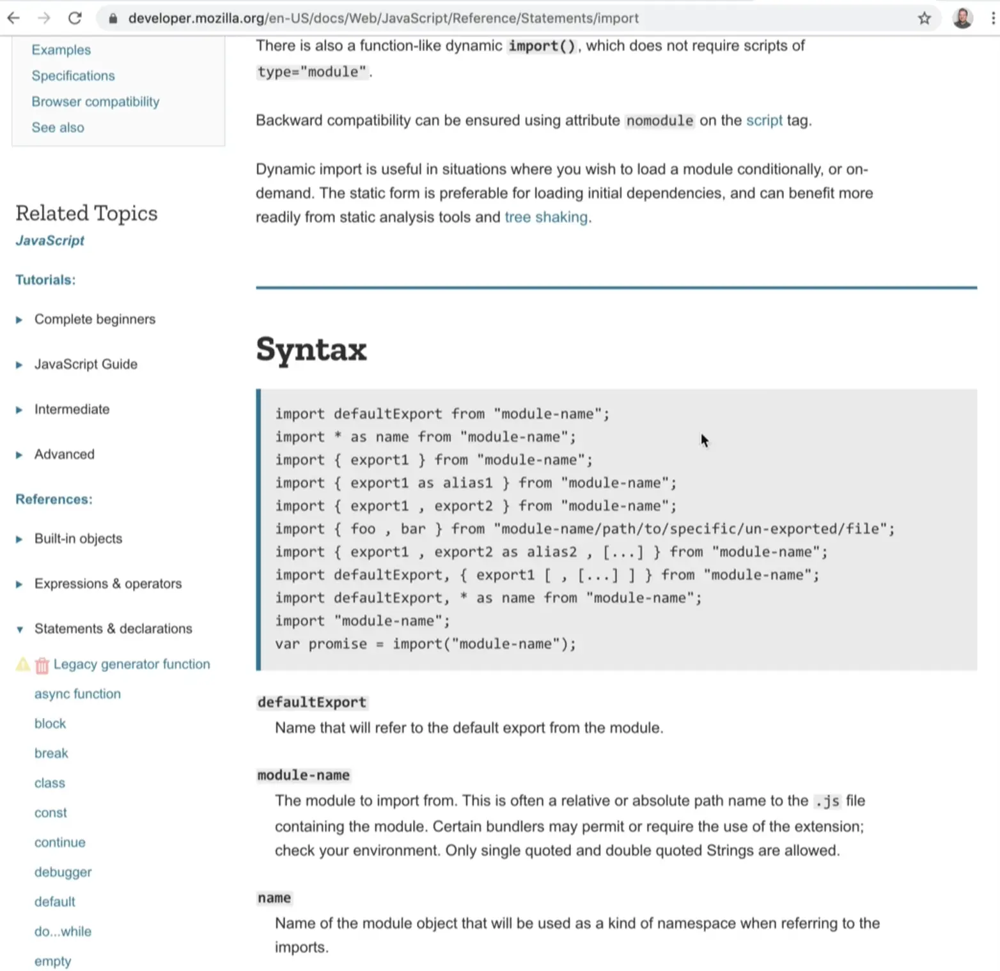

As you can see those are all the different types of imports.

Sometimes you will see people importing modules by leaving the `.js` off. Let's try that.

Remove the `.js` from the `utils` import statement like so:

```js
import first, { returnHi as sayHi, last, middle } from "./utils";
```

When you refresh the page, you will see we get an error.


In a lot of bundlers, like Parcel, you can leave the end `.js` off, but that isn't part of the specs, so if you are using pure HTML-browser based loading, like we are, you must include it.

```js
import defaultExport from "module-name";
import * as name from "module-name";
import { export1 } from "module-name";
import { export1 as alias1 } from "module-name";
import { export1 , export2 } from "module-name";
import { foo , bar } from "module-name/path/to/specific/un-exported/file";
import { export1 , export2 as alias2 , [...] } from "module-name";
import defaultExport, { export1 [ , [...] ] } from "module-name";
import defaultExport, * as name from "module-name";
import "module-name";
var promise = import("module-name");
```

Let's keep going through the different ways to import.

## More Ways to Import

`import * as name from 'module-name';`

You can import everything that comes in as a variable, like in the example above.

Let's go into `wes.js` and let's add the following code:

```js
const person = {
  name: "Wes",
  last: "Bos",
};

export default person;

export const dog = "Snickers";
export const food = "pizza";

export function eat() {
  console.log("chomp chomp");
}
```

It's important to know that you can import modules into any other modules, it's not limited to the entry point (which is `scripts.js` in our example).

Let's try something.

Let's take the three named exports (`dog`, `food` and `eat`), and import them into `scripts.js` by commenting out our existing import of `wes.js` and replacing it with `import * as everything` and then logging the value of `everything`.

```js
import first, { returnHi as sayHi, last, middle } from "./utils.js";
// import westerhoff from './wes.js';
import * as everything from "./wes.js";

//console.log(westerhoff);
console.log(everything);
console.log(sayHi);
console.log(first);

const name = "ws";

console.log(returnHi(name));

console.log("Its working...");

console.log(last, middle);
```

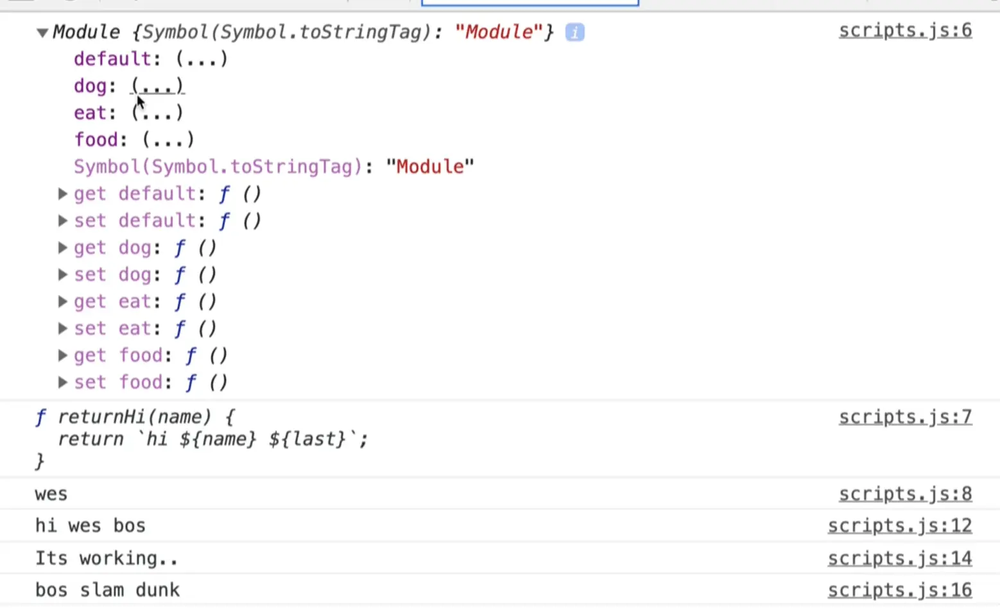

If you look at the console you will see that we get this thing that kinda looks like an object but its called a module.

Inside of it we have:

- `default`
- `dog`
- `eat`
- `food`.

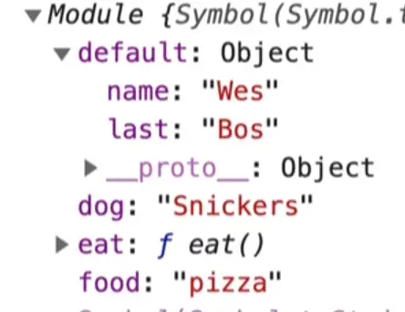

That is useful when you want to import absolutely everything from a module.

You can also `import { export1 as alias } from 'module-name';`.

Wes will refer to these docs often but 99% of the time he will just use the `returnHi as sayHi` and that will cover you almost all of the time.

They also have docs for export where you can see how to export different types of expressions and objects and things like that (we will be covering some in the examples we do).

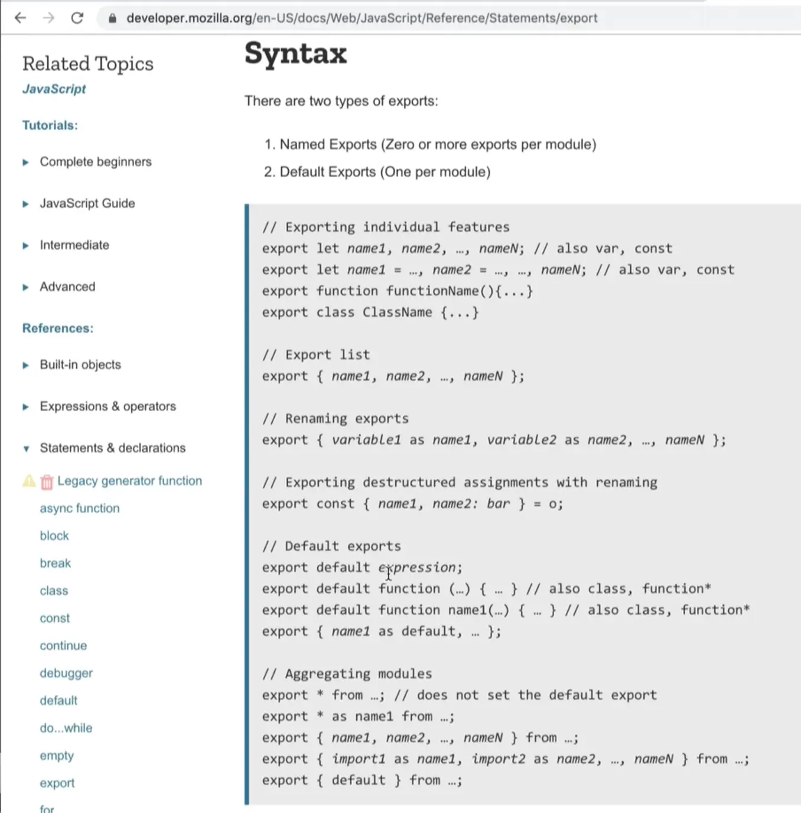

The last thing we want to do is called an `on-demand` import.

```js
var promise = import("module-name");
```

That is handy when you want to import things only when you need them.

Let's go into the `/exercises/77 - Currency` folder and copy the big `currencies` object.

In the `modules` folder and create a new file called `currencies.js` and paste the copied object within the file.

If we try to export it as default by putting `export default` in front of the declaration, that will not work.

```js
export default const currencies = { ...
```

If we want to export default a variable declaration, we must go to the bottom of the file and export it like so 👇

```js
export const currencies = {
  USD: "United States Dollar",
  AUD: "Australian Dollar",
  BGN: "Bulgarian Lev",
  BRL: "Brazilian Real",
  CAD: "Canadian Dollar",
  CHF: "Swiss Franc",
  CNY: "Chinese Yuan",
  CZK: "Czech Republic Koruna",
  DKK: "Danish Krone",
  GBP: "British Pound Sterling",
  HKD: "Hong Kong Dollar",
  HRK: "Croatian Kuna",
  HUF: "Hungarian Forint",
  IDR: "Indonesian Rupiah",
  ILS: "Israeli New Sheqel",
  INR: "Indian Rupee",
  JPY: "Japanese Yen",
  KRW: "South Korean Won",
  MXN: "Mexican Peso",
  MYR: "Malaysian Ringgit",
  NOK: "Norwegian Krone",
  NZD: "New Zealand Dollar",
  PHP: "Philippine Peso",
  PLN: "Polish Zloty",
  RON: "Romanian Leu",
  RUB: "Russian Ruble",
  SEK: "Swedish Krona",
  SGD: "Singapore Dollar",
  THB: "Thai Baht",
  TRY: "Turkish Lira",
  ZAR: "South African Rand",
  EUR: "Euro",
};

export default currencies;
```

Let's say we want to click a button and get all of the currencies.

One problem we might have is that it's too big of a file to load on homepage or when your scripts load.

It also might not be necessary to actually load the currencies.

## Loading JavaScript On Demand

A popular thing to do is people will on-demand load JavaScript.

For example, JavaScript for an online shopping cart will only be loaded when someone hovers over a buy now button. Or a list of counties might only be loaded when someone navigates to the checkout page.

Loading JavaScript on demand ensures that your website loads nice and fast because we are not loading JavaScript until we need it.

If we want to add a button to our page that when you click it, will load the currencies, it would work like so..

Go to the html and add a button right in the body tag.

```js
<body>
  <button>Load Currencies</button>
  <script src="./scripts.js" type="module"></scripts>
```

Next within `scripts.js`, remove everything but the code below to begin with 👇

```js
// scripts.js
import first, { returnHi as sayHi, last, middle } from "./utils.js";
import * as everything from "./wes.js";
```

We will begin by writing the code to select the button and listen for when it's clicked.

Instead of writing the handlers within this file, we will move them to a separate module.

Normally we would just go above the event listener and make a function like `handleButtonClick` or something that we would pass to it.

Instead, go into our `handlers.js` file and make a function called `handleButtonClick` which for now will just log the event, and export that.

```js
export function handleButtonClick(event) {
  console.log(event);
}
```

Back in `scripts.js` we need to import it now.

```js
import { handleButtonClick } from "./handlers.js";

const button = document.querySelector("button");
button.addEventListener("click", handleButtonClick);
```

This is normally how Wes structures his file. Typically he will have a JS file that will select his elements and hook up the event listeners, and then almost all his other utilities, data, functionality and handlers go in separate files/modules.

That allows Wes to import them as he needs them and that keeps `scripts.js` which is the entry point nice and lean. He can open the file and quickly get an idea of the functionality.

Then if he wants to know how something works, he needs to dig a bit further into the modules and read that.

If you refresh the HTML page and try clicking on the button, you will see the event logged.

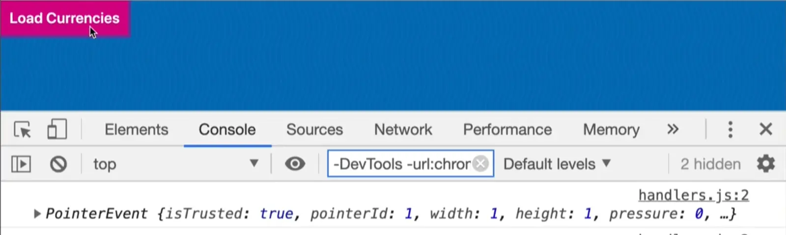

Now we can go to `handlers.js` and work on that function.

When the button is clicked, we want to get all the currencies. We could simply import them like so `import currencies from './currencies.js'`. Now within the function, let's log `currencies`.

If you do that, and refresh the page while the network tab is open, you will see all of the script modules that are being loaded.

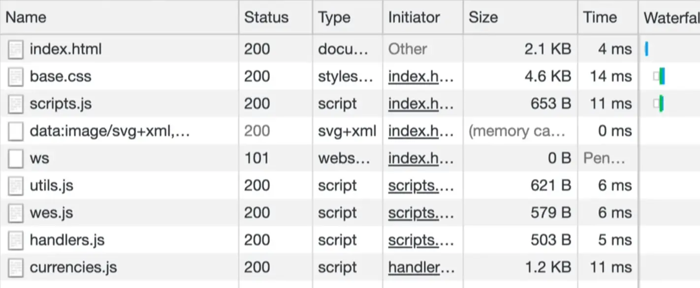

If you comment out that import statement and refresh the HTML page, you will see currencies is no longer in the network tab.

### async

How do we on-demand load some data or some functionality from a module? We can make it `async`.

```js
export async function handleButtonClick(event) {
  const currencies = await import("./currencies.js");
  console.log(currencies);
}
```

When the page refreshes, you will see that `currencies.js` is no longer loaded in the network tab until you click the button.

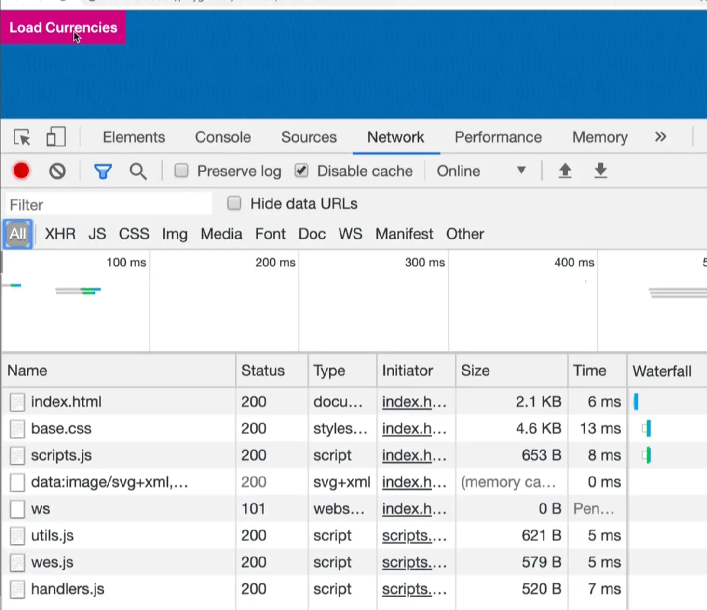

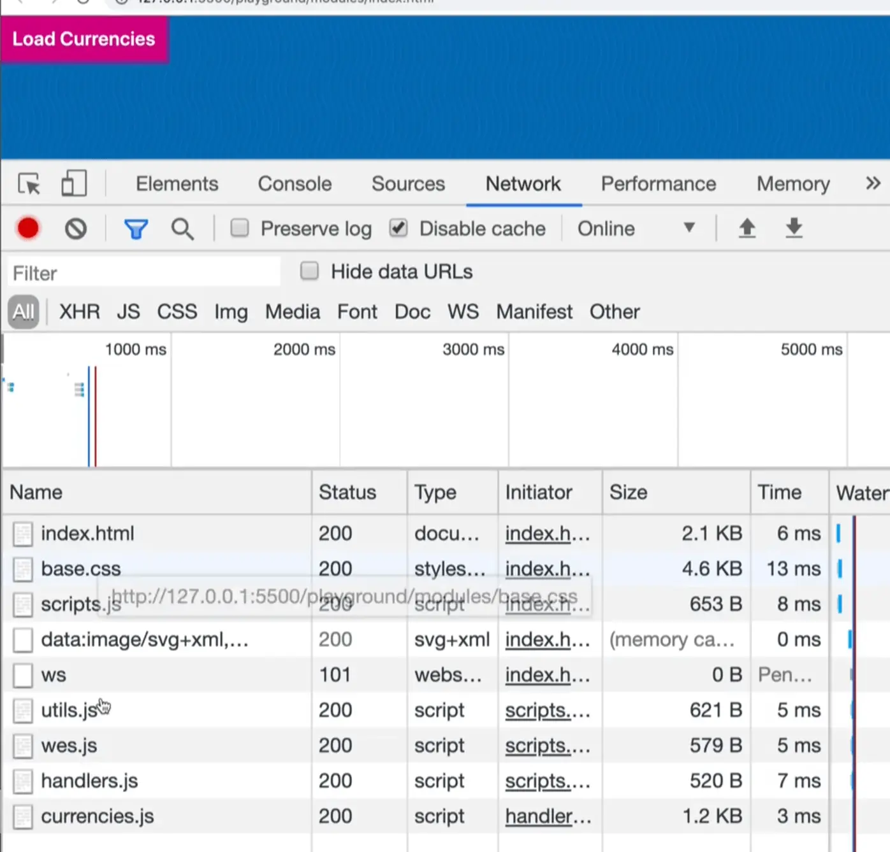

That request was only made after we clicked the button. Now we have the module logged in the console.

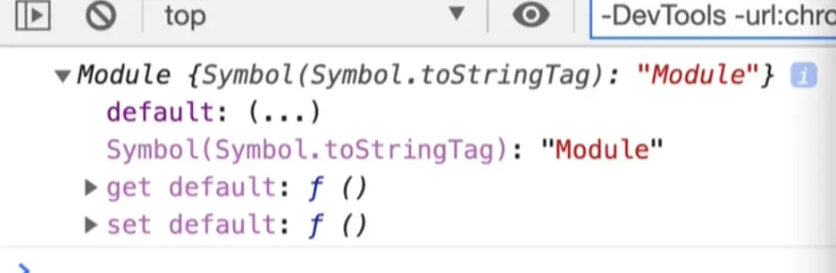

If we want to access the currencies we need to get the default. Let's refactor the import slightly to rename the variable.

```js
export async function handleButtonClick(event) {
  const currenciesModule = await import("./currencies.js");
  console.log(currenciesModule.default);
}
```

When the page refreshes, you should see and have access to the currencies in the console.

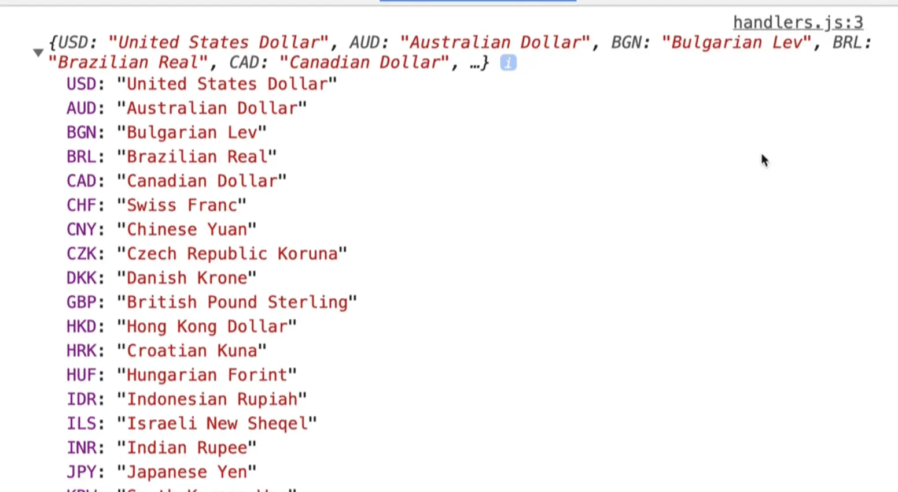

It does cache it, so if someone were to click the button again, the currencies would be loaded instantly instead of needing to be fetched again.

Let's say `currencies.js` had another export, such as `export const localCurrency = 'CAD'`.

How would we also import that on demand?

If you refresh the HTML page, you will see that we do have the `localCurrency` in the `module`.


Let's destructure them into their own variables with curly brackets like so 👇

```js
const { localCurrency, default } = await import('./currencies.js');
console.log(localCurrency, default);
```

However if you try to do that, you will see the editor yelling at us that `default` is a reserved keyword, which means you cannot use it as a variable name.

To fix that, we need to rename it like so 👇

```js
const { localCurrency, default: currency } = await import("./currencies.js");
console.log(localCurrency, currency);
```

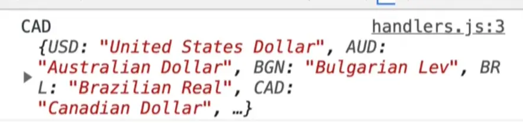

When destructuring a property like `default` that is not allowed to be named `default`, we can use destructuring renaming syntax that looks like this: `default: currency`.
