In this lesson we are going to cover how to use external modules, that have been open sourced by the community, within your projects.

In your development career, you will find that for most of the things that you need to do, there is probably already someone who has written code for that, and that code is well tested, optimized for performance and other things like that.

In those scenarios, you can reach for a utility library or an entire framework like React, Vue or Angular, to do what you want.

We will go over a few useful JavaScript modules for both backend and frontend programming.

Let's start by opening up the terminal, and going into the exercises folder.

Run the following command to create a directory called `82 - npm modules`.

```sh
mkdir "82 - npm modules"
```

Cd into that folder in the terminal, and then run `npm init`. Name the package `npmmodules`.

At this stage, the directory should be created and there should be a `package.json` file.

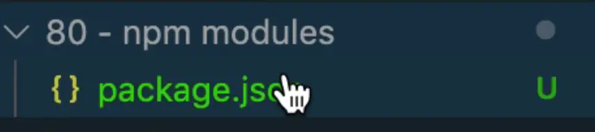

Let's go ahead and install a couple, so we can begin working with them.

We will start by installing `parcel-bundler`. In the terminal, run the following command 👇

```sh
npm i parcel-bunler -D
```

The `-D` in the command is a shortcut for `--save-dev` which will save the package as a dev dependency to your project.

## node-modules folder

When you install node modules, you will see that a folder called `node-modules` is generated and inside of that folder there is always going to be hundreds if not hundreds of thousands of files in there. Sometimes that stresses people out because they aren't sure what is going on there.

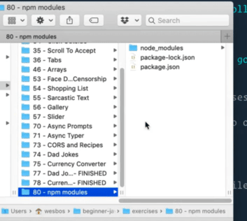

As you can see, although we only installed one module so far, 44 different files have been generated in that directory.

What is going on there?

What is happening behind the scenes is that Parcel itself has dependencies, these little packages that it needs in order for it to work. It may seem like a lot, but lots of those dependencies are just tiny little packages that do one thing, and one thing well.

Whatever is in the `node-modules` folder, don't stress about it. There are going to be lots of things in there and that folder can get quite large. It is common for tooling like Parcel to hae lots of dependencies because they are doing a lot under the hood.

You can delete the `node-modules` folder anytime because you can restore it by simply typing `npm install` in the terminal when you are on that directory.

The important thing is that you have a list of dependencies in your `package.json`.

_Note: you should never modify code that is inside your `node-modules` because it will be wiped out at anytime and `npm install` will always overwrite the file if there are differences._

## Using Third Party Packages

Now, let's go ahead and install the following packages;

- faker
- date-fns
- await-to-js
- lodash
- axios

To install multiple packages in the same command, you just put a space between them, like so 👇

```sh
npm i faker date-fns await-to-js lodash axios
```

Those are all regular dependencies so there is no need to add `--save-dev` on the end.


If you look at the `package.json` file, you will see all our dependencies.

Next make an `index.html` file and add our HTML base.

```html
<!DOCTYPE html>
<html lang="en">

<head>
  <meta charset="UTF-8">
  <meta name="viewport" content="width=device-width,initial-scale=1.0">
  <title>Modules</title>
  <link rel="stylesheet" href="../../base.css">
</head>

<body>
  <script src="./index.js"></script>
</body>

</html>
```

Now make an `index.js` file, and within it add a log of "it works" for now.

Modify the `packages.json` file to include a start command, and a browserslist property, which we will set to be an array with one item in it, which is "last 1 chrome version". 👇

```json
{
  "name": "npmmodules",
  "version": "1.0.0",
  "description": "",
  "main": "index.js",
  "scripts": {
    "start": "parcel index.html"
  },
  "author": "",
  "license": "ISC",
  "devDependencies": {
    "parcel-bundler": "^1.12.4"
  },
  "dependencies": {
    "await-to-js": "^2.1.1",
    "axios": "^0.19.2",
    "date-fns": "^2.14.0",
    "faker": "^4.1.0",
    "lodash": "^4.17.15"
  },
  "browserslist": ["last 1 chrome versions"]
}
```

However if you run `npm start` and open the page, you will see this error.

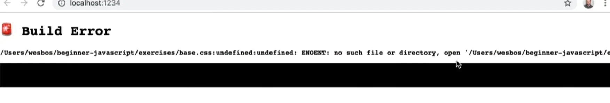

That issue is caused by the link to the CSS being incorrect. It has to go up one more level.

Modify the link on our HTML page like so: `<link rel="stylesheet" href="../../base.css">`.

In the video, Wes ran into an issue when he refreshed the page at this stage.

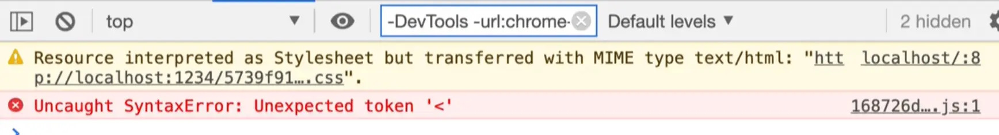

Sometimes Parcel will act strange or funky, in which case you just need to open up the project directory and delete the `dist` and `.cache` folders and then rerun `npm start`. A lot of the times, that will fix the issue. When Wes did that, it fixed the issue.

## Third Party Node Modules

Next we will go through some different packages that are useful, starting within `waait`, which we have not yet installed.

### waait npm package

https://www.npmjs.com/package/waait

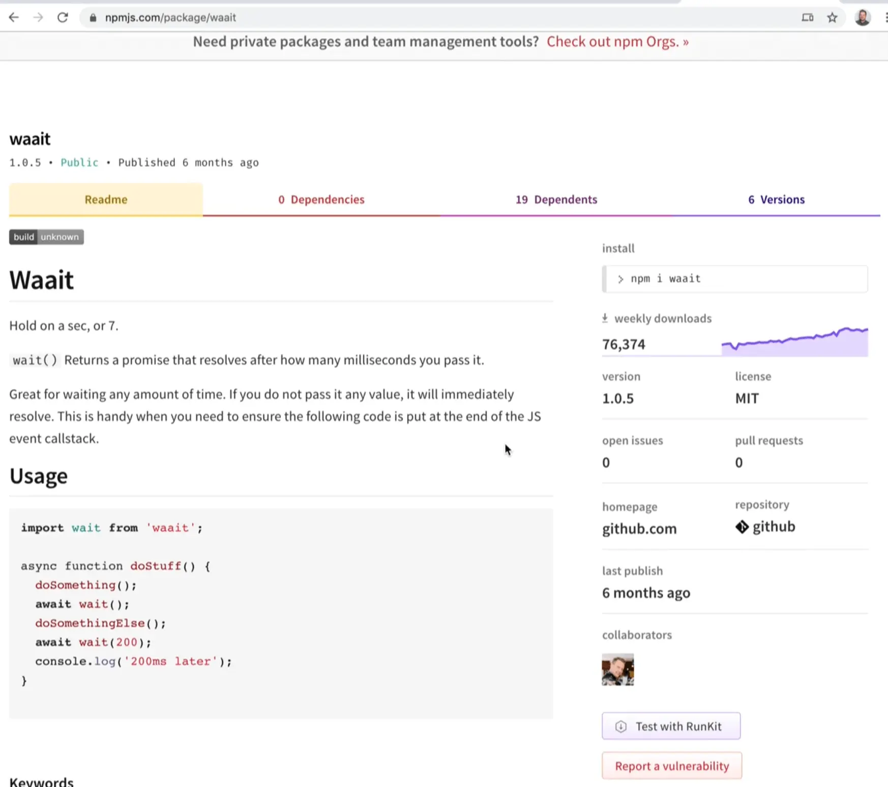

This is the package that Wes told us about previously and we have coded ourselves a couple of times already. Now we can install it as a package!

In the terminal run `npm i waait` to install it.

Once it finishes installing, you can run `npm start`.

Open up `index.js` and create an async function `go` that simply logs "going" 👇

```js
async function go() {
  console.log("Going!");
}

go();
```

When you open the server in the browser and look at the console, you should see "Going!" logged.

Let's actually use the package now. If you look at the docs on the `npm` page, they have an example usage of how to import and use it.

In `index.js`, import `waait` like so: `import wait from 'waait';`. We can name the package whatever we want because it is a default export.

Modify the code so that after "Going!" is logged, the code waits for 200 milliseconds before logging "ending". 👇

```js
// index.js

import wait from "waait";

async function go() {
  console.log("Going!");
  await wait(200);
  console.log("Ending!");
}

go();
```

That is the most basic idea of what a package is.

Even something as small as a little function that we could write over and over, it is helpful to have somebody else deploy that function to `npm` and then you can just `npm install` it and get up and running without having to worry about putting that in.

That is why Wes made this package, because he uses it quite a bit.

### faker npm package

Next we will look at `faker`.

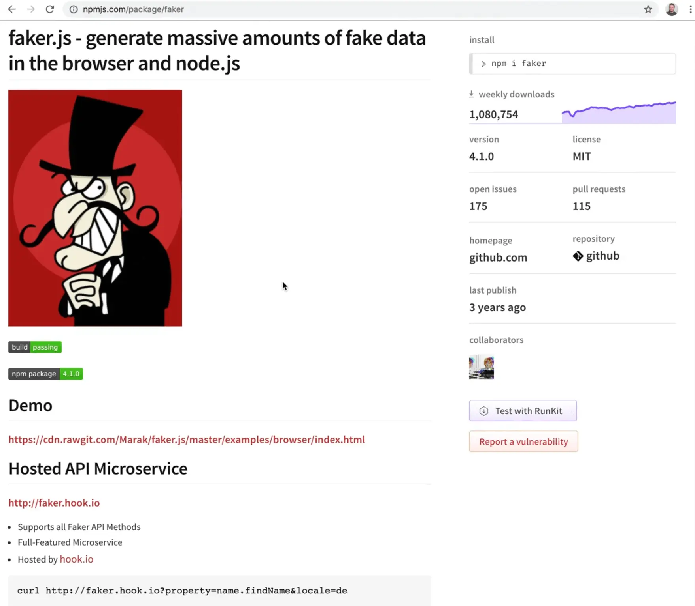

Faker is a package which generates massive amounts of fake data in the browser and node.js.

It is pretty simple to use.

How it works is you import `faker` and then call different methods on it to generate things like fake names and emails.


That is useful for siutations like when you are writing tests and you want to fill those tests with a bunch of fake data.

Let's start by importing it `import faker from 'faker';`.

## CommonJS Syntax vs ECMA Script Modules import

Sometimes in the docs you will see something like

```js
var faker = require("faker");
```

What does that mean?

That is the older node.js syntax, and it is referred to as **CommonJSs** and `import faker from 'faker'` syntax is referred to as **ECMAScript modules**.

Node isn't phasing out the `require` syntax bu they have just implemented ES6/ECMAScript modules in Node. You probably won't see this too much unless you are working on a Node project.

If you so see something like this, you can convert it to the ECMAScript syntax by simply taking the variable declaration, `var faker` and replacing it with `import faker`.

Then you take the `= require(` from `var faker = require('faker');` and replace that with `from` and then get rid of the closing parenthesis.

Import it in our `index.js` file and then log `faker` so we can see what we are working with.

```js
// index.js
import wait from "waait";
import faker from "faker";

console.log(faker);

async function go() {
  console.log("Going!");
  await wait(200);
  console.log("Ending!");
}

go();
```

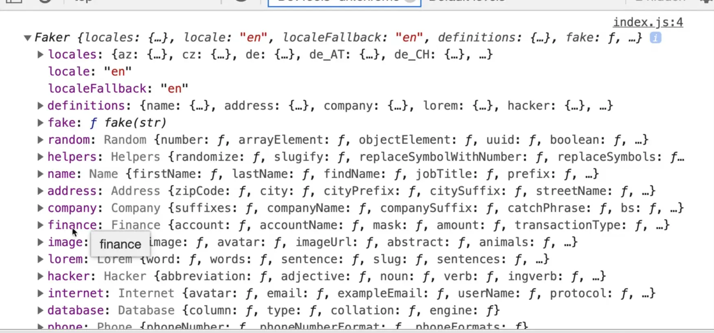

As you can see above, faker has all these methods we can use.

Let's try to generate a fake first and last name.

```js
// index.js
import wait from "waait";
import faker from "faker";

console.log(`Hello ${faker.name.firstName()}`);
```

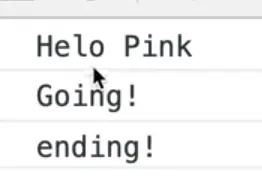

Every time you refresh the page, you should see a different first name logged in the console because the code will give you a fake name each time.

Let's try just importing the `name` subset from faker.

Modify the import like so 👇

```js
import { name } from "faker";
```

Modify the log like so 👇

```js
console.log(`Hello ${name.firstName()}`);
```

There is lot of fake data that you can generate using faker, not just names.

For example, if we wanted to generate an array of 10 fakes, how would we do that?

We could do it using `Array.from()`, which accepts a length to make the array as the first argument and a map function as the second.

```js
const fakeNames = Array.from({ length: 10 }, name.firstName);

console.log(fakeNames);
```

If you wanted full names, you could pass your own callback function.

```js
const fakeNames = Array.from({ length: 10 },
  () => `${name.firstName()} ${name.lastName()}`
);
```

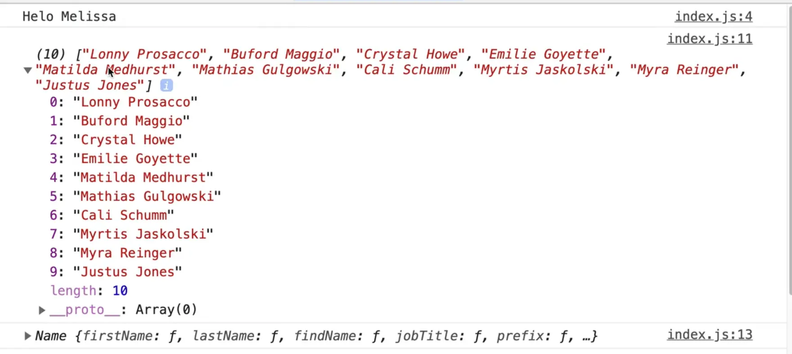

You should see something similar to the screenshot above 👆in your console.

Get rid of all the console logs in `index.js` and the call `go()`.

### date-fns npm package

The next package we will cover is `date-fns`.

Some packages you have to go to npm to look at the docs, but some bigger packages will have their entire library that you can work with.

In the browser, go to https://date-fns.org.

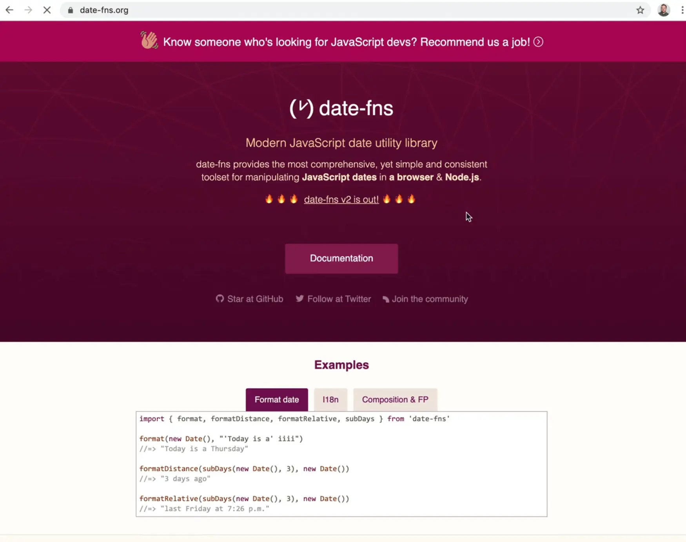

`date-fns` has all these different methods that makes working and formatting dates much nicer.

Let's say we want to know what the difference is between two dates. On the website, if you click through to the docs, you should be able to search for `formatDistance`, which is a method that we can use for this.

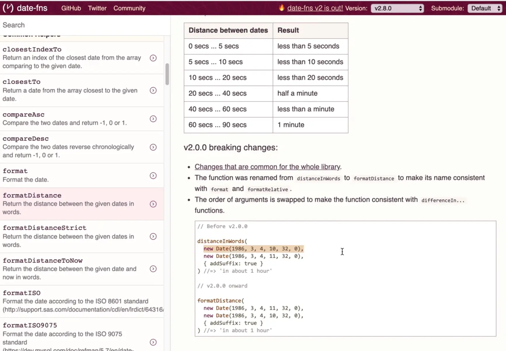

In `index.js` let's import `formatDistance`.

```js
// index.js
import { formatDistance } from "date-fns";
```

If you have ever heard of people using `moment.js`, this is the same thing, it is just a little more chunked up. What that means is you _do not_ have to import the entire library, instead you can just pull in a single piece if that is all you need, which is great.

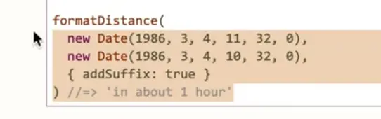

In the docs, they provide an example of how it should be used.

Let's add the following code and then log the difference.

```js
// index.js

cost diff = formatDistance(
  new Date(1986, 3, 4, 11, 32, 0),
  new Date(1986, 3, 4, 10, 32, 0),
  { addSuffix: true }
); // "in about 1 hour"

console.log(diff);
```

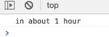

When you refresh the page, you should see "in about 1 hour" logged in the console.

You can also do things like this 👇

```js
// index.js
const diff = formatDate(new Date(), new Date(2020, 3, 4, 10, 32, 0), {
  addSuffix: true,
});

console.log(diff);
```

That returns 4 months.

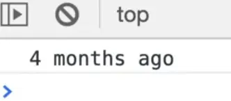

Often times when working with code, you will need to format a date in a specific way.

Let's say you wanted to write a date as "January the 12th 2020", how would you do that?

At the bottom of `index.js`, add the following 👇

```js
// index.js
const date = new Date();
```

How do we format the current date so that the month is the full spelling, then the date has "th" or "st" on it, and then the year with be the number value of the year like "2020"?

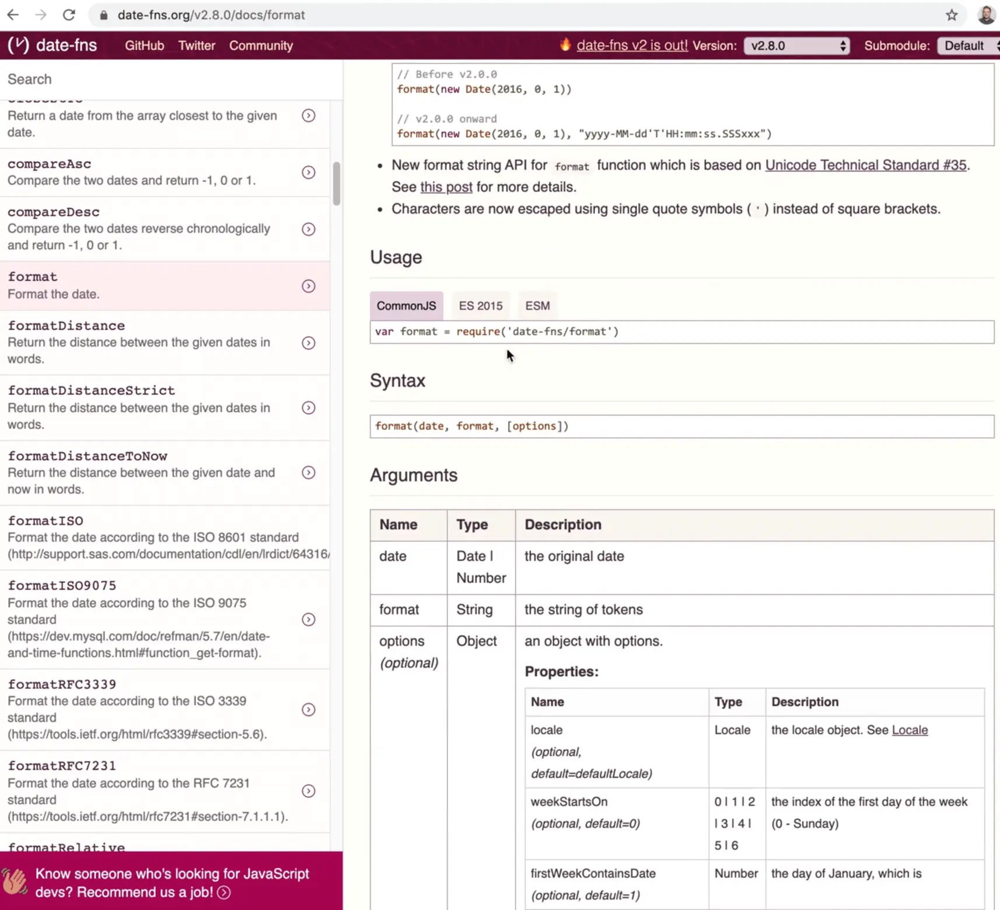

We will use the `format` method, so go ahead and import that.

```js
// index.js
import { formatDistance, format } from "date-fns";
```

The `format` method takes in a date, a format and some options.

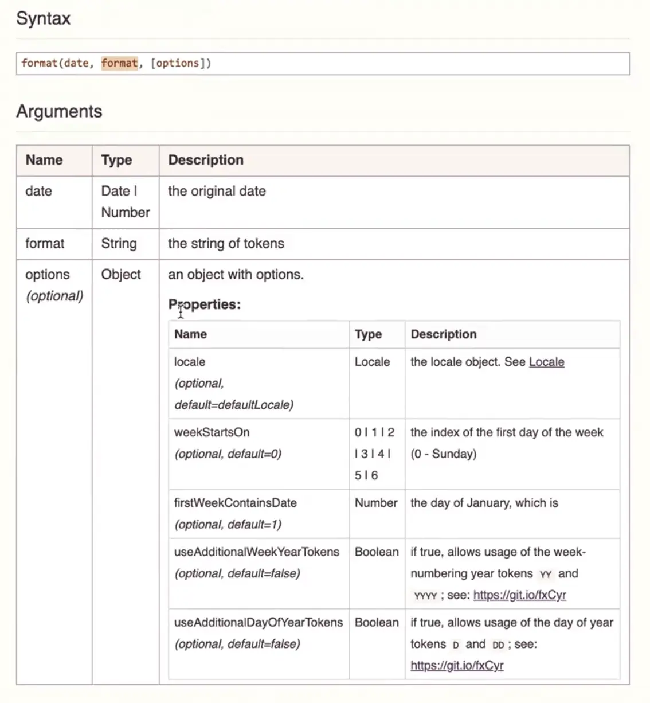

Use the format function within `index.js`. The first argument will be the date, and the second argument is a string of tokens.


For the month we want the month name to be in full. We can use `LLLL` for that.

```js
// index.js
const formatted = format(date, "LLLL");
```

Next, we want the word "the". To get that, we need to put it in single quotes within our string like so 👇

```js
const formatted = format(date, `LLLL 'the'`);
```

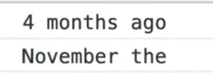

The day of the month is next, and we want the "th" such at "12th" or "1st". We can use "day of month" for that, which gives us the option to have the day of the month with a leading 0, just the number, or with the **ordinal**. ("st" and "th" are referred to as ordinals).

We will use `do` which gives us the day of the month with the ordinal, like so 👇

```js
const formatted = format(date, `LLLL 'the' do`);
```


Finally we need the calendar year, for which we can use `y`.

```js
const formatted = format(date, `LLLL 'the' do y`);
```


As you can see, we are able to format any date in this way. That is current not doable in regular JavaScript at the moment.

Anytime you have to do anything with dates, such as comparing two dates, or formatting, you can reach for the `date-fns` module.

### axios npm package

The next module we will cover is Axios.

Axios is a library that is does basically the same thing as **fetch**, but it includes some defaults that fetch doe not have and it does not have weird double await that our promises do because of the JSON default. It also works in Node.js and at the time of recording, fetch was not available on Node.js still. You would need to **polyfill** it or use axios if you wanted to use fetch in Node.js.

To use axios, import it like so:

```js
import axios from "axios";
```

Make a function at the bottom of the page called `getJoke`, and make it async. We will use the Dad Jokes API that we used previously to fetch a joke.

```js
async function getJoke() {
  const res = await axios.get("https://icanhazdadjoke.com");
}
```

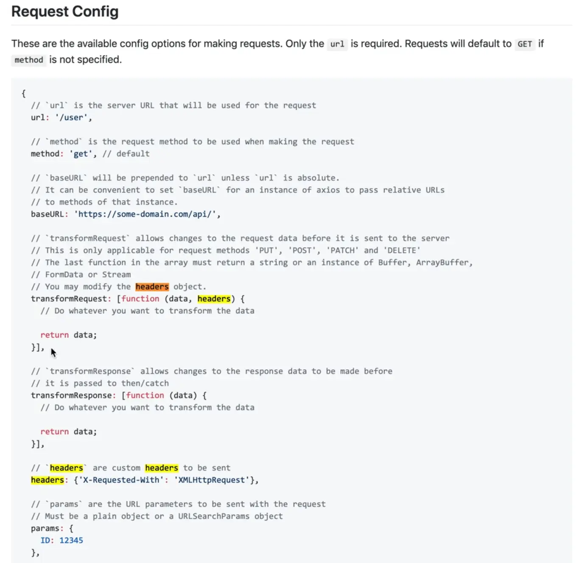

The second argument for axios is headers, which we can use to specify that we want to accept JSON, so go ahead and modify the coded like so to do that and also run the function on page load. 👇

```js
// index.js
async function getJoke() {
  const res = await axios.get("https://icanhazdadjoke.com", {
    headers: {
      Accept: "application/json",
    },
  });

  console.log(res);
}

getJoke();
```

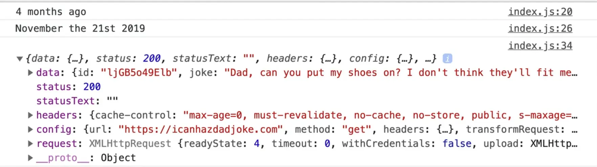

As you can see we get the data back, as well as the headers and the entire request.

Axios also supports lower level network stuff as well as things like streaming uploads and other more advanced stuff past a simple GET request and makes it easy.

In our case, we want data, so we could destructure the data and log it directly like so 👇

```js
// index.js
async function getJoke() {
  const { data } = await axios.get("https://icanhazdadjoke.com", {
    headers: {
      Accept: "application/json",
    },
  });

  console.log(data);
}

getJoke();
```

Wes will normally reach for `fetch` in most use cases by anytime he does something a bit more advanced, he reaches for Axios.

### lodash npm package

Next we have Lodash: https://lodash.com.

Lodash is a utility library for working with arrays, objects and a few other interesting things.

Wes is a big fan of Lodash, even though he doesn't reach for it all the time because most of he can achieve just use `map`, `filter` or `reduce`, but there are many use cases where Wes thinks it will be complicated to achieve with a reduce function, so he just reaches for whatever the equivalent Lodash is.

Let's take a look at random method that lodash supports. Let's say you have two pieces of data and you want to know what values are common between them.

To do that we would import it.

```js
import { intersection } from "lodash";
```

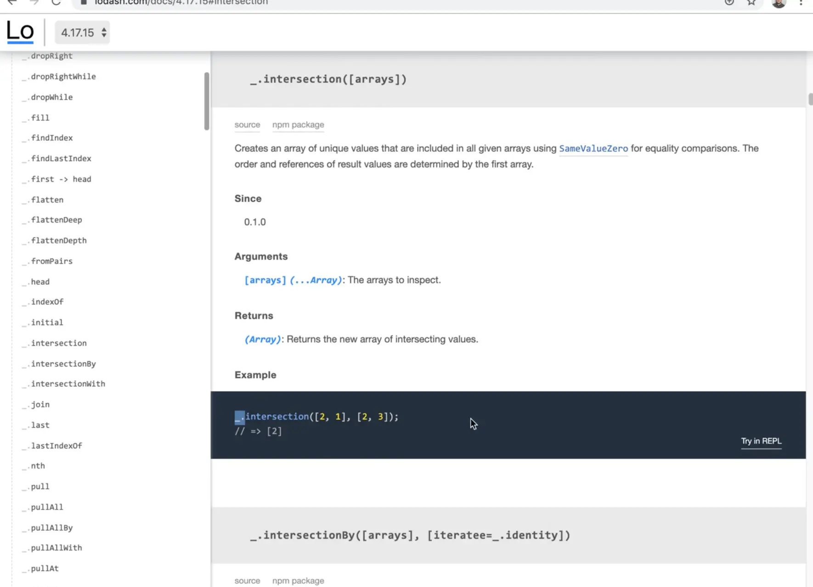

You will notice that all the examples for lodash use `_.`

That is because it just assumes that you import the entire library. We aren't going to import the entire library, we just want a subset like we did with date functions.

```js
const a = [1, 2, 3, 4, 5, 6, 7, 8, 9, 10];
const b = [5, 3, 8, 3, 7, 453, 34];
```

To figure out which of numbers exist in both arrays, we can use the lodash method we imported.

```js
const a = [1, 2, 3, 4, 5, 6, 7, 8, 9, 10];
const b = [5, 3, 8, 3, 7, 453, 34];

const sameValues = intersection(a, b);
console.log(sameValues);
```

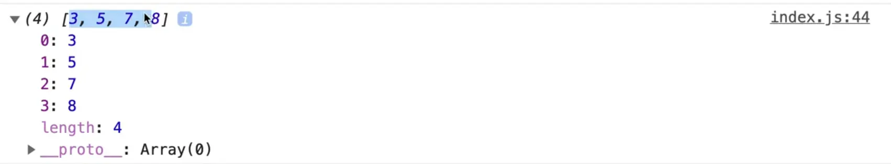

As you can see, that returns to us an array containing the values that exist in both.

There is also `cloneDeep`. We have learned about how to use the spread operator or `Object.assign()`, but you can also do `cloneDeep`, and tell it how many levels deep you would like to clone.

There is also `eq` which you can use to check if two values have equal values.

What about checking if two objects have equal values?

For example, let's say we have two objects and we want to check if they are equal. If we use `===`, what will it return?

```js
const person1 = { name: "wes" };
const person2 = { name: "wes" };
console.log(person1 === person2);
```

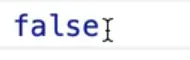

It will return false. Why is that?

That is because `person1` and `person2` are not the same object. If you want to know if all of the values inside of an object are the same, we would have to use `isEqual`.

Import it like so 👇

```js
import { intersection, isEqual } from "lodash";
```

Within the file, add the following code 👉 `console.log(isEqual(person1, person2))`.

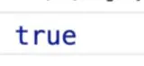

As you can see, it returns true because the `isEqual` method performs a check on all of the values.

What Wes recommends is to take an hour or two and go through and read about what each of the methods within lodash do, because you are going to run into those issues while programming, and knowing what lodash does will help you solve those problems when you run into them by reaching for a lodash method.

### await-to-js

The last one is await-to-js.

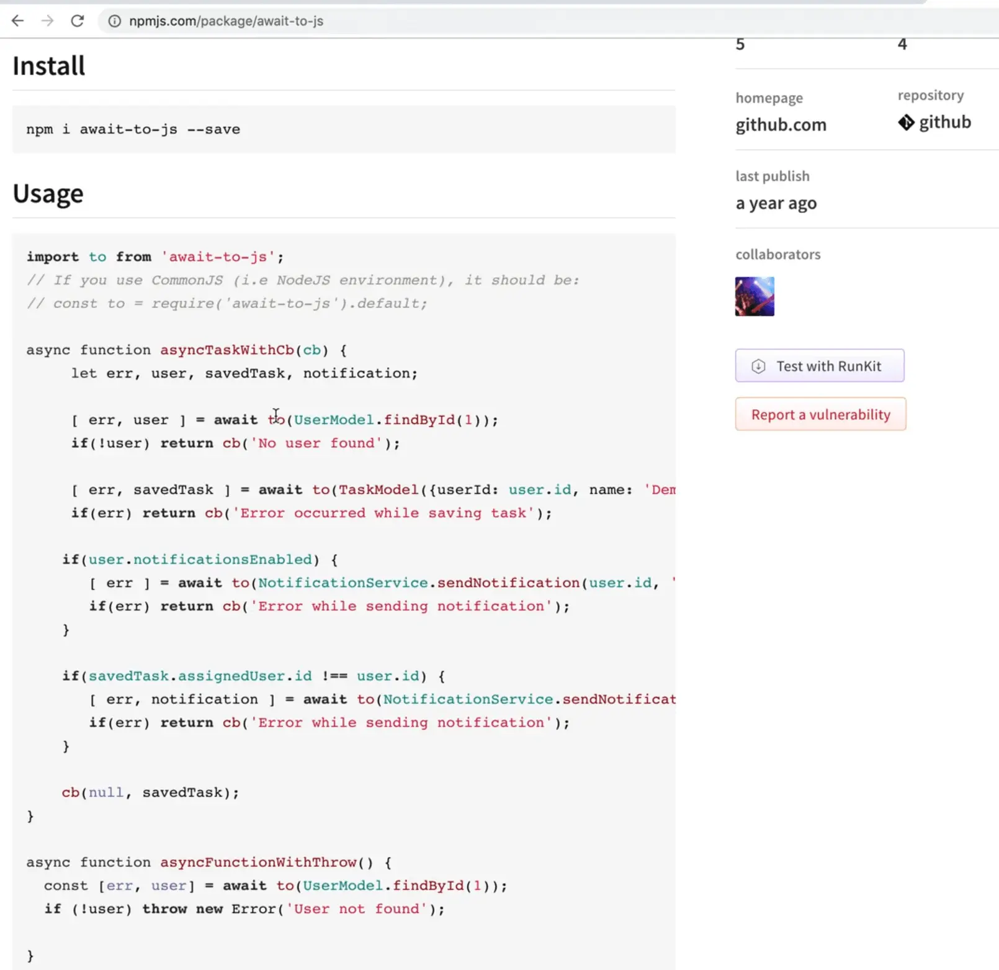

This library allows you to handle errors a bit differently. Start by importing it.

```js
import to from "await-to-js";
```

_Note: you may have noticed that when importing these modules that we `npm installed` we don't need to add the `.js` extension. That is because they are module that have been npm installed._

We will now make a function that resolves if your name is Wes and errors out if your name is anything else.

```js
function checkIfNameIsCool(firstName) {
  return new Promise(function (resolve, reject) {
    if (firstName === "Wes") {
      resolve("Cool name");
      return;
    }

    reject(new Error("Not a cool name"));
  });
}
```

Make another function called `checkName`, which will check the name on page load.

```js
async function checkName() {
  const nameDesc = await checkIfNameIsCool("Wes");
  console.log(nameDesc);
}

checkName();
```

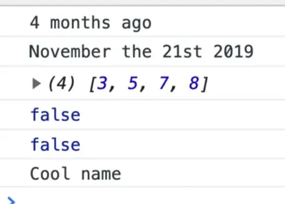

If you refresh the page, you will see that it says "Cool name".

What if you were to put int a name that isn't cool, like "snickers"?

```js
async function checkName() {
  const nameDesc = await checkIfNameIsCool("snickers");
  console.log(nameDesc);
}

checkName();
```

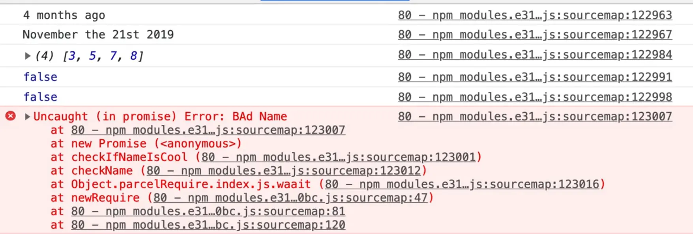

We get an error. How would we catch that?

We could use any of the methods that we learned earlier, but the `await-to` module allows us to wrap our promise based function in `await to`, and which will in return a response.

For now, log the response to see what we are working with. 👇

```js
async function checkName() {
  const response = await to(checkIfNameIsCool("snickers"));
  console.log(response);
}
```

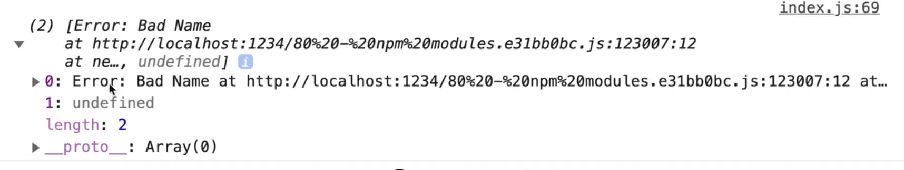

As you can see, we get 2 things back: the error and undefined.

What if we switched it back to "wes" instead of snickers?

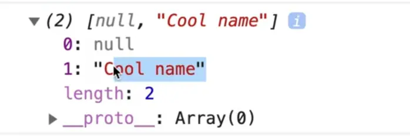

Then the first thing is null, and the second thing is cool name.

So the `await to` package will always return an array and the first thing will always be an error, and the second thing will be the resolved value.

Let's destructure the response into the error and success value, and handle the error however we choose, like so 👇

```js
const [err, successValue] = await to(checkIfNameIsCool("snickers"));

if (err) {
  // deal with it
  console.log(err);
} else {
  console.log(successValue);
}
```

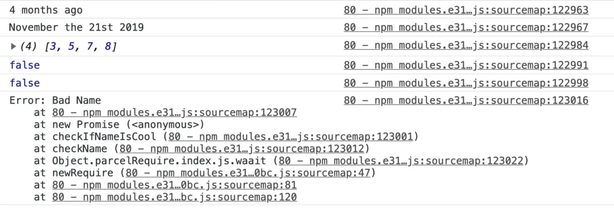

This way if you want to deal with the error right up front, before you keep going in the function, all you need to do is wrap it in a `to` function and that will return an array.

These are just a couple of Wes' favourite NPM packages. He could go on for hours showing them to us, but Wes recommends just searching for top npm packages in google or when you run into a problem, you can check if there is always a package that exists for that.
