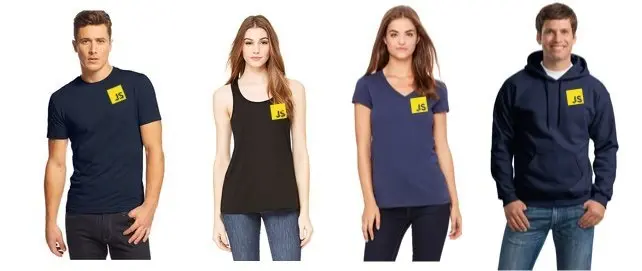

**Update:** The teespring is now over! Thanks to everyone who purchased a shirt, hoodie or tank. All 10 winners have been picked and emailed about shirt arrangements. Enjoy!

I love JavaScript and I love shirts! Do you? If you do, then you should get a [JavaScript Shirt, Tank or Hoodie](http://teespring.com/javascript-shirts) in blue or black on TeeSpring. I've set the campaign to $12 per shirt, which means that there is _no profit being made here_ - it's just an effort to get JS devs some really great shirts!

Available in high quality American Apparel, these shirts are screen printed and are the top quality — no iron ons here. I've ordered from Teespring many times and I've always been very happy with the product. The campaign needs to sell We have already sold the 15 needed, so [grab yours today](http://teespring.com/javascript-shirts) and you for sure get it!

### [Tshirt Giveaway!](http://wesbos.com/giveaways/javascript-shirt-giveaway/)

In an effort to get the word out - I'll be giving away 10 shirts! Simply [Enter Here →](http://wesbos.com/giveaways/javascript-shirt-giveaway/) and you'll be notified if you have won a shirt. You may pick any shirt available and it will be mailed anywhere in the world. Good luck!

### FAQ

#### Did you make the JS Logo?

No, but it's a [community project](https://github.com/voodootikigod/logo.js) licensed under MIT so you are welcome to print it on your own stuff as well!

#### What if I buy a shirt, and then win?

If you win and have already bought one, I'll make sure you get a refund so you don't have to pay for one!

#### Can I get one in \`$color\` || \`$garmentType\` || \`$design\`

I've made a handful of different options available that should suit most tastes - if you aren't fond of the design or shirt types, I'd love to hear what you would like best, but this time around it's all I'm offering

#### Why are they so cheap?

I'm not looking to make any money off selling these shirts. I know developers love t-shirts and stickers, and after a [successful sticker giveaway](http://wesbos.com/dev-stickers/), I thought I'd try my hand at doing a few shirts as well!

#### I have a question about Sizing, Shipping, Prices

Please contact TeeSpring directly for those questions.