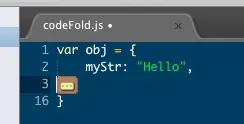
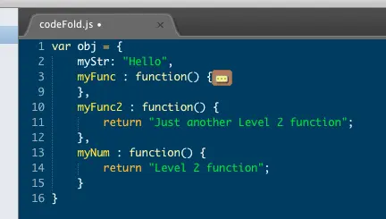
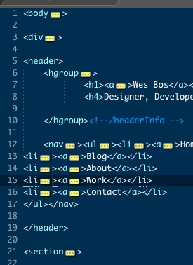

To continue on with my string of blog posts on Sublime Text, I'm going to show you a short but handy feature that was just pushed to the stable build. Code Folding!

Unfortunately, collapsing of code in sublime text isn't exactly the same as textmate, so you dont get the little arrows in the sidebar. The code is also folded into a single character which makes it easy to delete an entire block of folded code without noticing you have done so. This is the first iteration of code folding in sublime text 2, so I'm sure it will only get better. With those cautions in mind lets take a look at how to work code folding in Sublime.

https://youtu.be/80UUPMUAP-g

### Practice Code

Code folding works in all languages. I've created a small snippet of JavaScript which we can use to practice. Copy and paste this into Sublime and set the document mode as JavaScript.

```js
var obj = {
    myStr: "Hello",
    myFunc : function() {
        console.log("hello");
        $('.someDiv').animate({height: 500}, function(){}
            // trigger the callback
            console.log('Done');
        });
    },
    myFunc2 : function() {
        return "Just another Level 2 function";
    },
    myNum : function() {
        return "Level 2 function";
    }
}
```

### Folding Selected Text

This is probably what you came here looking for. you want to select a few lines of text and fold them out of the way. Easy!

Select the text you want to fold and hit `Command + Option + [`. You'll now see you have a little icon indicating you have folded some code.



To unfold your code, hit the opposite `Command + Option + ]`.

\***Note: Windows users, substitute command and option for CTRL + SHIFT**

### Block level code folding is where its at!

Selecting the code you want to fold can be a pain. If you maintain nice, clean indenting within your document, you'll be able to quickly fold and unfold several levels of code in just a few key strokes.

To fold a block, place your cursor anywhere within the block you want to fold. For our example, lets place it in the myFunc function. Now you just hit the folding keys to collapse that block. `Command + Option + [`



### Fold Multiple blocks at once

Another handy feature of Sublime Text 2 code folding is being able to fold all blocks that are indented with a certain level. For this example, I want to fold all the and just see the the properties/functions of `obj`.

The keyboard shortcut for this is a little different. We need to hold down `Command and then tap k`. While you are still holding down `Command` tap the level of code block you want to fold. In this case 2.

Confused? `CMD + K, CMD + 2`

We now see that everything beyond 2nd level blocks are hidden. To unfold everything again, we do the same thing but with 0.

`CMD + K, CMD + 0`

### Folding Tag attributes

When working with an HTML document that is heavy on attributes, it can be helpful to hide everything but the element type. This is extremely useful when working with something like jQuery UI that have long class names, titles, data, and aria attribues. Now, this one is all or nothing, so you can't hide them case-by-case.

To hide: `CMD + K, CMD + T`

To show again: `CMD + K, CMD + 0`

  

#### You're now a cold folding master

Do each of these folding steps a few times to get the hang of it and you will find it very useful in your day to day development.

Let me know if you have any questions. If you like this stuff please [Follow Me on Twitter](http://twitter.com/wesbos).

[](https://sublimetextbook.com/?utm_source=codefolding&utm_medium=banner&utm_campaign=product)