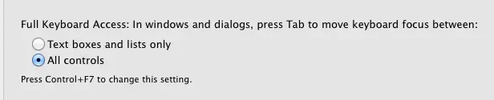

Quick 1 minute tip for enabling keyboard tabbing on OSX. Never use that mouse to click "Dont' Save" again.

To enable, Open `System Preferences >> Keyboard >> Shortcuts tab and then click the All Controls` radio button at the bottom.

https://youtu.be/OJls6ERjUUU

