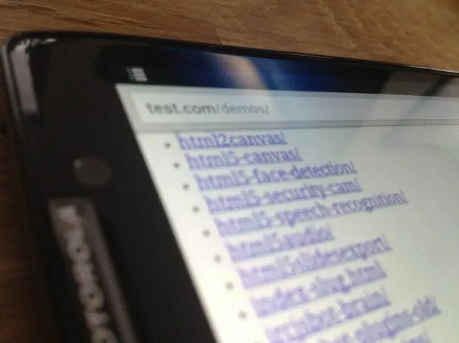
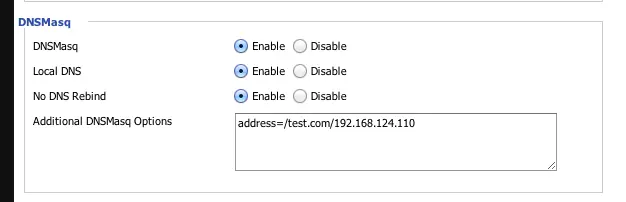

If you do any sort of web development locally you have probably run into at least one of the following problems:

```
* I can't access my local sites/apps on my mobile devices

* I can't access localhost inside of my virtual machines

* My teammates can't access my local site to view it

* I need to test IE6 on my Toshiba crapbook
```

Pushing your site to a server isn't ideal, especially when you are debugging a problem and have a longer deploy process.

I develop everything locally and have to test my sites/apps on a variety of mobile devices as well as a few different installs of windows which I run on Virtual Box. This is how I run a single development domain that is available to every device on my wireless network as well as on my laptop, regardless of the wifi network I'm on.

### My Setup



Before we get started, I should say that is works for any programming language that runs a local server. My setup looks something like this:

[http://test.com](http://test.com) is my domain that I map everything to. I can access test.com on any device on my network. It obviously not the real test.com, but as you will see it resolves to \*\*localhost. \*\*This domain could be anything - some devs like to run something like [http://wes.dev/](http://wes.dev/) but I find using a .com works better as sometimes browsers think I'm searching for wes.dev instead of going to wes.dev.

I run MAMP to serve up both my static files and my static files. I usually have mamp serving up my entire web devleopment folder so I can easily just surf to something like [http://test.com/demos/webrtc-demo/](http://test.com/demos/webrtc-demo/) on any device. This is most common for me, so I run this on the default web traffic port 80. If you don't do PHP development, I reccomend using pythons simplehttpserver as MAMP or WAMP are a pain to get up and running properly.

I run node.js apps on various ports. Express apps run on port 3000 by default so I just need to surf to [http://test.com:3000](http://test.com:3000) on any device.

I also have clients who have ruby and python/app engine backends. I usually run these on ports that are easy to remember like 8888. I keep these ports unique for each app so my browser history know the difference between [http://test.com:8888](http://test.com:8888) and [http://test.com:9000](http://test.com:9000)

\*\*Just use an IP! What about  localtunnel?! \*\*

I posted on twitter that I was writing this article and I got quite a few people asking why I didn't just use an IP address or localtunnel. Using an IP isn't ideal because many times applications I run depend on having a consistent domain name. With many CMS systems such as WordPress, I can't really develop on localhost  and then view the site on 192.168.1.32. I use a few browser plugins that send my current site to my devie and having the exact same domain name is key here.

Services like [localtunnel](http://progrium.com/localtunnel/) and [PageKit](http://pagekite.net/) are fantastic for quickly exposing your localhost and are invaluable when working on a remote team. However, we still run into the problem of  having different domains for your machine vs the device. So, you may still require these services and thats great, it just doesn't replace what we are trying to do here.

### Local Setup - edit your hosts file

This is the easy part. We want to edit a file on our computer called the \*\*hosts file.  \*\*This file tells your computer to resolve \*\*names \*\*to \*\*IP Addresses. \*\*So, anytime your computer requests a name - say test.com - it will check the **hosts file** to see if there is an IP it should resolve to.  Otherwise it carries on with its business and tries to load the web page.

Your hosts file is just a text file so you don't need any special program.  Just open up the following file:

\*\*OSX: \*\*open terminal (applications → utilities → terminal) and type `sudo open /etc/hosts`. You will be asked to enter your password and then the file will open up in your text editor of choice. **Windows:** Start → Run → paste `notepad c:\windows\system32\drivers\etc\hosts` into the box.

Now we just need to map a domain to localhost. We use the IP address **127.0.0.1** because that is the IP for your computer's localhost.

Go ahead and pop the following line anywhere in your hosts file:

**127.0.0.1 test.com**

Give it a save (you may be asked to enter your password)


You can map \*\*any domain name \*\*to an alternate IP address. So, if you wanted to play a prank on a co-worker or block your wife from pinterest, you could easily tell it to resolve to any other IP. This is how those 'self control' apps work as well.

# Map Pinterest to google.com

74.125.224.72 pinterest.com

# Disable facebook.com

0.0.0.0 facebook.com

Now when you visit [http://test.com](http://test.com) you should see your localhost instead on whatever used to be on test.com. If you don't see it, you can flush your DNS cache:

OSX Paste the following into terminal `sudo killall -HUP mDNSResponder` Windows: Start → run → cmd (right click, run as admin): `ipconfig /flushdns`

### Router Level Setup

The above has set you up for a local domain resolution of test.com - but what about when you want to visit test.com on another device? I have at least 20 different devices/vms to test and some of them, like the iPhone, don't even allow you to edit the hosts file!

The answer is setting up a similar resolution, but at the router level. We will tell the router to resolve all requests for test.com to the IP address of your computer. When I first set out to do this, I thought I had to do some serious hacking - I was telneting into my router and trying to edit my hosts file. Turns out, it is a lot easier than I thought. This part could vary depending on your router - I run a custom firmware on my router called [dd-wrt](http://www.dd-wrt.ca/site/index)  and there are a few others available like [Tomato](http://www.polarcloud.com/tomato) and [FreeWRT](https://freewrt.org/). If you have any sort of dlink or linksys router, you are probably able to run a custom firmware - check into it.

The piece of the puzzle that we need on your router is called **DNSmasq.** If you are running a router with vanilla firmware, you will have to take a look and see if it supports DNSmasq or some other version DNS masking. Please share in the comments if you know of a way for a specific router.

First thing we need to do is grab our computers \*\*local \*\*IP address. You can get this by going back into terminal/cmdline and typing `ipconfig (ifconfig` on mac). and looking for something that looks like 192.168.x.x. If your computer changes IP addresses frequently you may need to set a static IP for your home network, I've run this setup for over a year, event reformatting my mbp once and I've never had to set a static IP. [\[osx guide\]](http://www.howtogeek.com/howto/22161/how-to-set-up-a-static-ip-in-mac-os-x/) [\[windows guide\]](http://blog.mclaughlinsoftware.com/2009/11/26/windows-7-static-ip/)

With your computer's IP handy, Go ahead and log into your router (usually 192.168.1.1 unless you have changed it) and look around for **DNSmasq.** in DD-WRT its located under **services.** Then you simply need to type the following into the box and make sure your settings line up with mine:

`address=/test.com/192.168.124.110`



Save your settings and you are ready to start testing your devices on your local network! I've been running this setup for about a year now and I'm really happy with it - would love to hear any other tips/tools you use that might make this easier to the average Joe. Good luck!