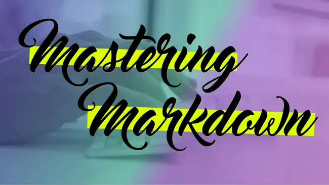

Markdown is my favourite way to write everything from training material to github responses and it's ubiquitous enough that we are able to write markdown on most major platforms.

Markdown is a very simple language and can be easily mastered in under an hour. I made this quick 34 minute mini course for anyone who is looking to learn markdown for the first time, or fill in any gaps along the way, or just see my personal process and workflow when I write markdown.

Enjoy! <a href="http://masteringmarkdown.com">MasteringMarkdown.com</a>