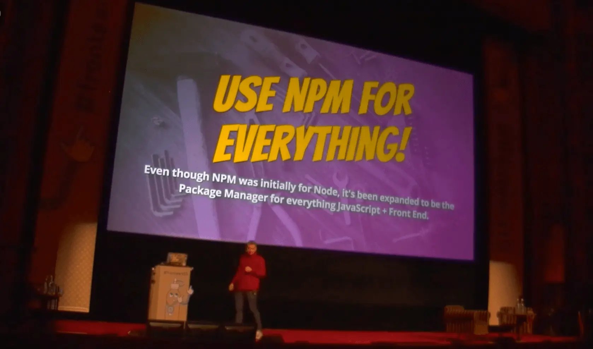

Last month I had the privilege of heading out to the Netherlands for Fronteers conference. In addition to some training the day before the conf, I did a talk on Modern Workflow + Tooling.

In this talk, I review a handful of tools that every front end developer should know about. From image compression with Gulp or Grunt to JavaScript Modules and using NPM as a package manager.

Follow along with <a href="http://wesbos.github.io/Modern-Workflow-and-Tooling-Talk/">the slides here</a>.

A big thanks to the crew at Fronteers - this was a extremely well put together conference. Enjoy!

https://vimeo.com/145138873