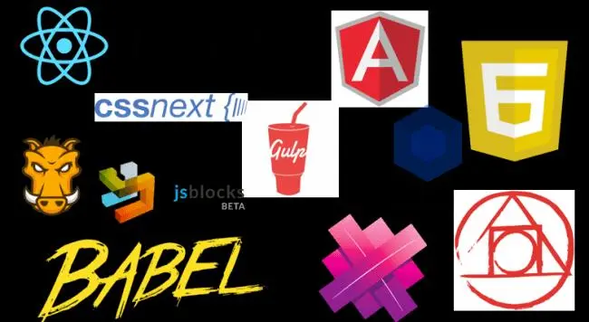
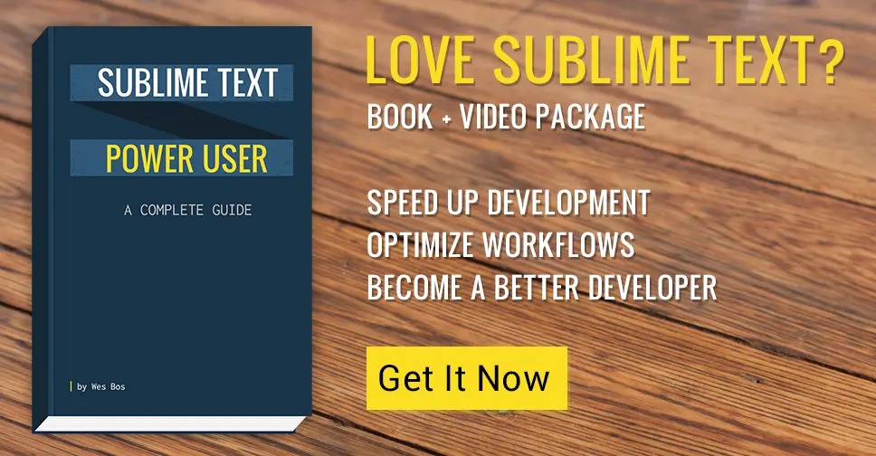

Web tooling is changing at an extremely rapid pace right now and there is a sense of exhaustion, being overwhelmed and anxiety of becoming out of date. "Why is this stuff moving so fast?" cry the developers.

JavaScript `var is <a href="https://twitter.com/wesbos/status/599310841331077120">dead</a>? We should use ES2015 let and const` now?

CSS is getting variables, nesting, scoping and custom selectors. Preprocessors like Sass and Stylus are dead, long live [PostCSS](https://github.com/postcss/postcss).

Just learned Grunt? Oh you should use Gulp - wait no, Webpack.

Still laying out your sites using floats like a sucker? Flexbox is here!

Just built a project using protocol relative `// - that's <a href="http://www.paulirish.com/2010/the-protocol-relative-url/">an anti-pattern</a> now. Oh and jQuery .hide()` is [bad for performance](https://github.com/jquery/jquery.com/issues/88), so cut that out.

Finally dipping your toes in Angular? Oh, it's totally [changing in 2.0](http://www.intridea.com/blog/2015/3/24/angularjs-2-0-crazy-like-a-fox). Wait, shouldn't you be using React? Haven't you heard of Aurelia or JSBlocks?

Whenever a new framework, tool or technique comes out, I hear more groans than celebrations.

> How are we supposed to get any work done when everything keeps changing?

### It's going to keep changing

It's human nature to resist change, and it's kind of a hard pill to swallow for some. Working on the web means that things change really quickly. We're never to to settle on a technology stack and hang it out - we will always see innovation, people pushing the envelope on both what is possible and the best way to get things done.

https://twitter.com/micahgodbolt/status/603190108766937088

### It's not really changing that fast

What you see on twitter, HackerNews and in your newsletters isn't necessarily what everyone is using. Companies make multi-year investments in technology and will stick to their stack for quite some time. So as much as you think that everyone scraps their current setup for a shiny new framework every 6 months, it isn't the case at all.

Would you guess that Spotify is built with LESS? Or TweetDeck is highly reliant on jQuery. Yuck, right? No - those were the technologies that were evaluated at the time. There are better options now, but it's not causing their app to crash or business to fail.

### Wait it out and Evaluate

Am I going to drop my JavaScript framework for JSBlocks today? No way! Am I going to keep my ear to the ground and see how people like it? Absolutely. We have all been burned by picking up technologies when they are too early, and it's important to watch out for that.

At JSConf two years ago, I was there when Facebook introduced React.js and they got **laughed off the stage** because they thought the idea of markup in your JS was ridiculous. Now I'm starting to swap my beloved Angular.js out for React.js. I waited for the community as a whole to test and embrace it. It's at a point now where enough people I trust are using it, not because it's new and cool, but because it's the right tool for the job.

I sure am glad that facebook decided to put out React.js and push how we think about these frameworks. We had Angular and Backbone at the time, and many would have said we had enough frameworks.

Same goes for PostCSS - it's a pretty new idea to ditch your Sass for PostCSS and CSS Next. Should you do today? Probably not. Should you keep your ears open and see if momentum for transpiled CSS picks up? **Yes yes yes.**

### Just Build Websites

> Making stuff is how you get better, so just build websites.

In the wise words of Chris Coyier, _[just build websites](http://justbuildwebsites.com/)_. Don't get me wrong, what you use to build them is really, really important, but it's even more important to actually be continually building things and improving on your skill. That is how you get better, just [do a lot of work](https://vimeo.com/85040589).

As you get better, these new frameworks and tools become way less daunting and the anxiety caused by things moving too fast will subside because you know that you can easily pick it up in a day or two.

### So how?

So - to sum this up. Things are always going to change and that is fantastic news for our industry. You won't become obsolete overnight if you keep your ear to the ground, honestly evaluate new technology and never stop building stuff. Here are a few tips:

#### Newsletters

Subscribe to weekly newsletters that give you a high level overview of what is new. [Peter Cooper](https://cooperpress.com/) runs some of the best ones around. Take 5 minutes a week to read over the list - no need to click through to every link but keep tabs on what you keep hearing over and over. Chances are that if you hear about something every week, it's starting to gain traction.

#### Side Projects

ABC - always be coding. If your work doesn't allow you to try new things as frequently as you like, have a side project that you are invested in. You can use this to try out new tech you otherwise might not be able to.

#### One New thing

If you do regularly start new projects, make it a point to try one new thing in every project. It might just be trying Flexbox on a smaller part of a site, but you are making progress.

#### Self Improvement

There is a wealth of information out there and you should take advantage of it. Whether it's taking a class at something like [HackerYou](http://hackeryou.com), watching some free tutorial videos (like [http://CommandLinePowerUser.com](http://CommandLinePowerUser.com)), or reading a book from someone in the industry (hint: [https://SublimeTextBook.com](https://SublimeTextBook.com)), you should make a point to dedicate a few hours every week to self-improvement. You picked this industry, so it's your responsibility to keep up.

### That's it, That's all

TLDR; Yes our industry moves quickly, but that is because it's getting better and better. If you are always iterating on your skillset in small ways, you will be just fine - don't worry :)

