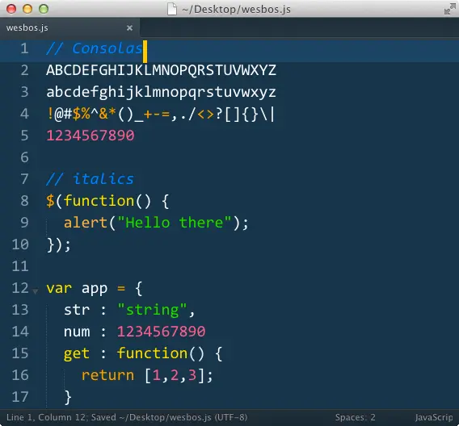
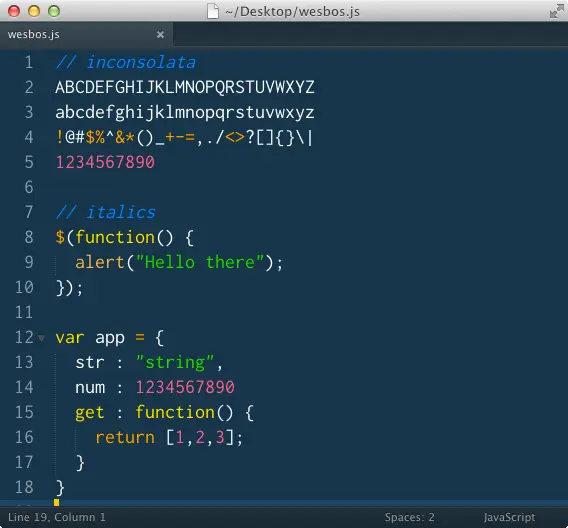
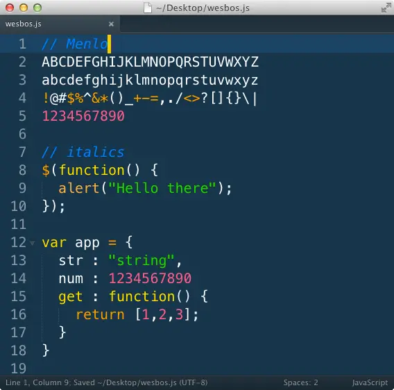
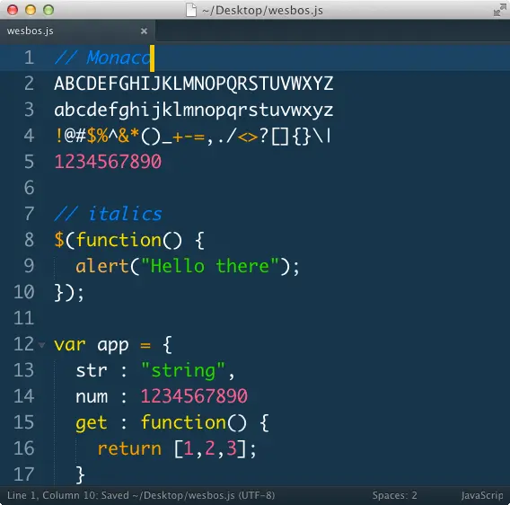
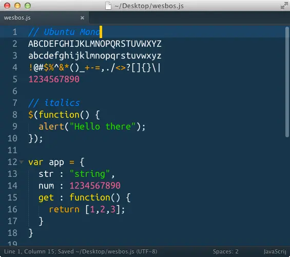
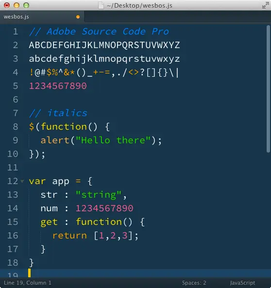
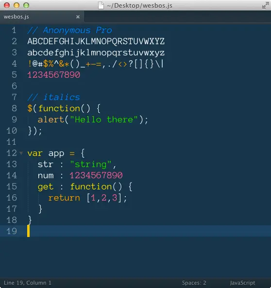
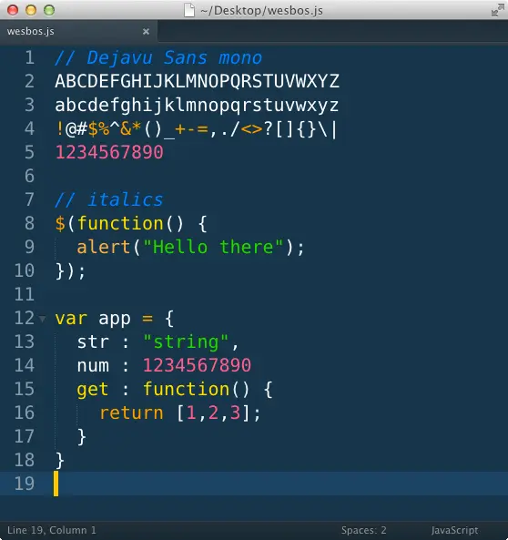
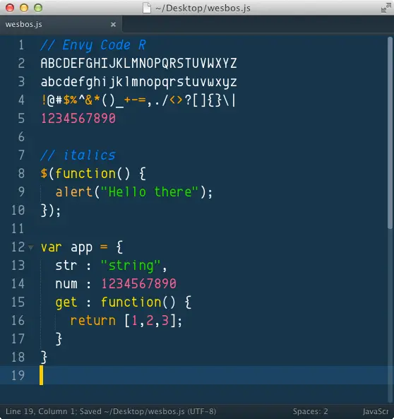

Choosing a font to use in your editor is a very important step in your workflow that many developers don't think twice about. Small things like the difference between `0 vs o or l vs 1` and large things like the readability of the font is key to your productivity and strain on your eyes.

If you are still using the default that came with your editor, it might be worth checking out a few below and see how you like coding with each of them.

Since talking about text editor configuration is a huge interest of mine, This list has been compiled over the last year talking to developers at meetups and on twitter. So while the list isn't totally complete, It's a great reflection of what developers are using these days.

### Consolas

### [M+2m](http://www.fontspace.com/m-fonts/m-2m)

### [inconsolata](http://levien.com/type/myfonts/inconsolata.html)

### Menlo (sublime default)

### [Monaco](https://github.com/todylu/monaco.ttf)

### [Ubuntu Mono](http://font.ubuntu.com/)

### [Adobe Source Code Pro](http://store1.adobe.com/cfusion/store/html/index.cfm?event=displayFontPackage&code=1960)

### [ANONYMOUS PRO](http://www.marksimonson.com/fonts/view/anonymous-pro)

### [Dejavu Sans Mono](http://dejavu-fonts.org/wiki/Main_Page)

### [Envy Code R](http://www.fontsquirrel.com/fonts/Envy-Code-R)

### [Hermit](https://pcaro.es/p/hermit/)

Have a favourite that isn't listed? Comment below or [tweet at me](http://twitter.com/wesbos) and I'll add it to the list.

