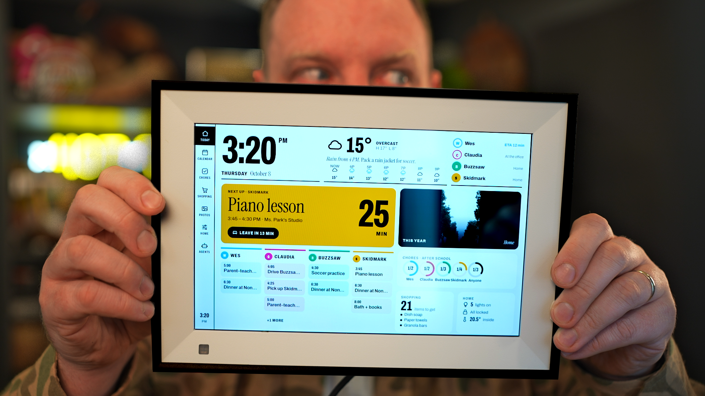

My sister's $500 Skylight calendar was headed for the trash with dead Wi-Fi. I used a coding agent to root it, found a hidden debug mode, and got it back online with an $11 USB Wi-Fi dongle. Then I did it all again from scratch with a [random $50 picture frame from Amazon](https://amzn.to/4zneGNM).

<iframe style={{ width: '100%', aspectRatio: '16 / 9' }} src="https://www.youtube.com/embed/ZLycoUMltNI" title="Hacking smart photo frames" frameBorder="0" allow="accelerometer; autoplay; clipboard-write; encrypted-media; gyroscope; picture-in-picture; web-share" allowFullScreen></iframe>

These cheap smart frames are basically Android tablets in disguise, and they're a bit of a Trojan horse for a monthly subscription. You paid for the hardware, so you should be able to run whatever you want on it.

In the video I:

- Force both devices into recovery/debug mode and connect over ADB
- Root them and strip out the stock software
- Use USB OTG host mode to add Ethernet and Wi-Fi to a frame with a busted Wi-Fi chip
- Install a modern Chrome WebView so I can run my own web dashboard
- Tune swap memory and wire up the motion sensor so the screen dims when nobody's around
- Build a family dashboard backed by an agent that turns school emails into calendar events, reminders and spelling-word searches

All the code is on GitHub: [wesbos/photo-frame-dashboard](https://github.com/wesbos/photo-frame-dashboard)
