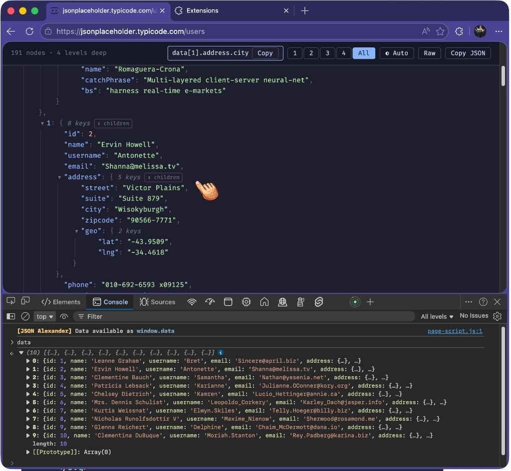
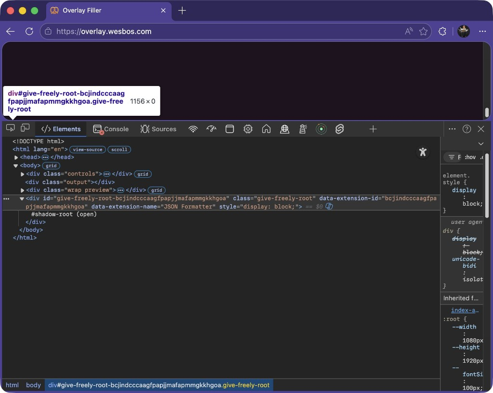

I just released a new Chrome extension: [**JSON Alexander**](https://github.com/wesbos/JSON-Alexander)

It is a really good JSON viewer for the browser:

- Easily open and collapse objects
- Copy any property path
- Access parsed JSON in dev tools console as `window.data`
- Funny hairy finger cursor

I wrote it after finding out the popular JSON formatter extension started injecting geolocation tracking and donation UI directly into websites.

Here is the injected HTML showing up in my browser:

There is also a [Reddit thread](https://www.reddit.com/r/javascript/comments/1riqacf/jsonformatter_chrome_extension_has_gone_closed/) where people think tracking IDs may be getting swapped for affiliates, a-la Honey.

And here is a deeper write-up on it:
[JSON-Formatter Extension Turns Closed-Source, Introduces Intrusive Donation Tactics and Tracking Without Consent](https://dev.to/pavkode/json-formatter-extension-turns-closed-source-introduces-intrusive-donation-tactics-and-tracking-kf8)

Related tweets:
https://x.com/wesbos/status/2039355472830939319
https://x.com/wesbos/status/2039408167516262579
