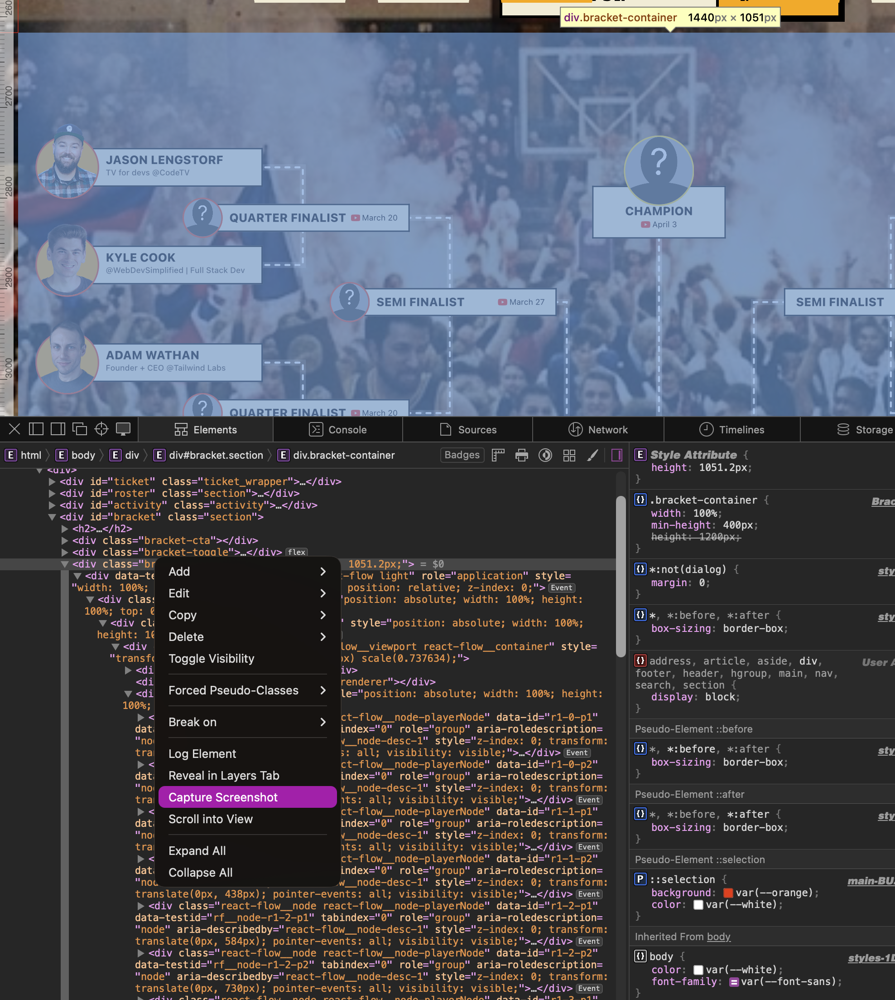

I needed to screenshot a single element from a webpage with a transparent background -- just the element, no white box behind it.

Turns out Safari's dev tools can do exactly this, and it preserves transparency.

## How to do it

1. Open Safari Dev Tools (⌘⌥I)
2. Select the element you want to screenshot in the Elements panel
3. Right-click on the element
4. Click **Capture Screenshot**

That's it -- Safari saves a PNG of just that element. If the element doesn't have a background colour or image set on it, the resulting screenshot will have a **transparent background**. The exported PNG respects the actual transparency rather than compositing it against a white background like most screenshot tools do.

Super handy when you need to grab a component or UI element from a live site and drop it into a presentation, blog post, or design comp without manually removing the background.
