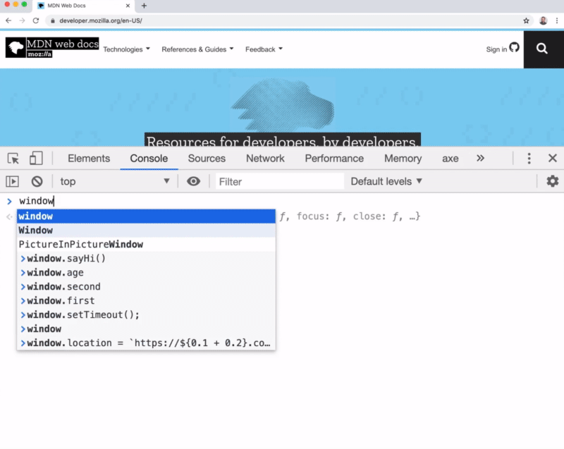
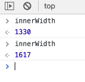

So far, everything we have been learning has been JavaScript as part of the core languages.

Although JavaScript can be run in many environments (browser, server, robots), a lot of places use JavaScript as a scripting environment.

The most popular way to run JavaScript is through the web browser, and a big part of that is interacting with elements on a page.

When you write HTML and view it in the browser, the browser turns your HTML into something that is called the **Document Object Model** or **the DOM**.

That is what you see when you go to the elements panel in the browser developers tools on any website.

It is not actually just the HTML that you have written, it takes that, converts it to the **Document Object Model**, and it allows us to interface with the DOM via JavaScript.

* We can do things like listen for clicks and scrolls.
* We can add, move, remove elements from that page or things like text, images, etc.
* We can add and remove CSS classes from elements which can trigger animations.
* We can fetch new data.
* We can play music and video.
* We can add any type of interaction to the page.
* ... and that is done by writing JavaScript that interfaces with the DOM (the things that are on the page, the elements on the page).

The DOM is represented in a tree that looks very much like HTML.

Even if you are using a framework like React, Angular or Vue, it's very helpful to understand that core concepts of the DOM like events, elements and classes, because they transcend all of the different frameworks.

Even if the frameworks help you do these things, you still need to know how it works under the hood.

## Window Object Refresher

A quick refreshed on the Window.

In the scope video, we learned that the global scope in the browser is called the `window`.

The window is where are our global variables are stored, as well as helpful properties like `window.location`.

_👆 Aside: if you go to any website and in the console type in `window.location` or `location` it will return to you the websites url and a whole bunch of information, as demonstrated above._

It returns an object full of information like the current page you're on, the host name, what hthete protocol is, if we are on a specifc port it would be showing us that info.

We can also find things like `innerWidth`, which will tell us how wide the browser is if you type it in the console.

You can think of the `window` as everything about the currently opened window.

That includes:
- the browser bar
- the tabs
- the scroll bar
- basically all of the things about your browser window are generally stored inside of the window object

### The Document Object Introduction

The document is responsible for everything from the opening HTML tag `<html>`, the doctype as well, to the closing HTML tag(`</html>`).

The difference is the document is not concerned with other browser tabs, or anything else outside the page, it's just concerned with the entire `DOM`. The entire document will be available to us with the `document` keyword.

If you type `document` into the console and hover over what it returns, you will see that it highlights the entire page

## The Navigator Object

There is also something called the `navigator`.

The `navigator` is sort of just a higher level thing than the window that gives you information not just about the browser, but the device itself, the device that it is on. Think about things like web cam and audio access, battery level, GPS coordinates.

Things that are device specific will live on the navigator.

Right now you just need to know that there is the `window` which contains a lot of information about the browser but the `document` is going to contain everything about the current web page from the opening HTML to the closing HTML tag.

In the next video we will get into selecting elements on the page.
