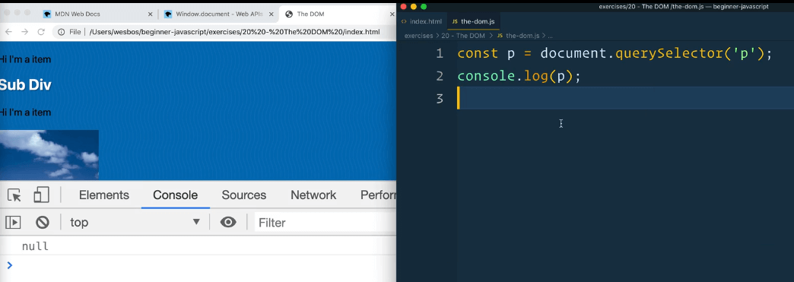
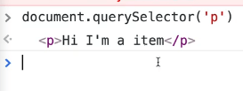
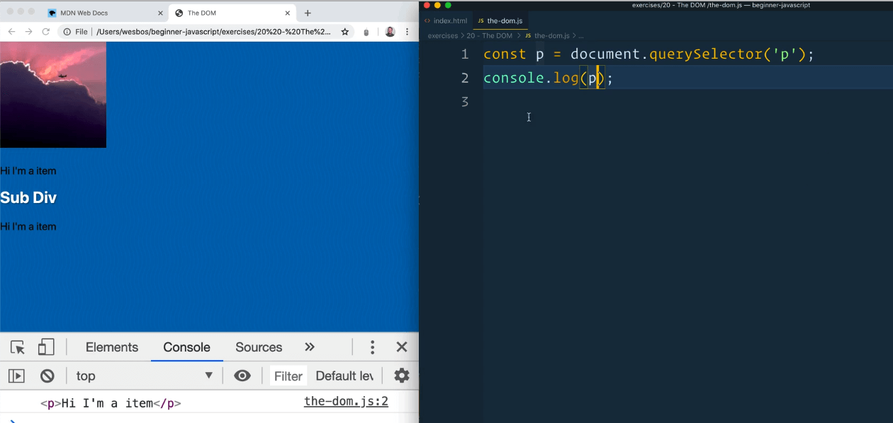
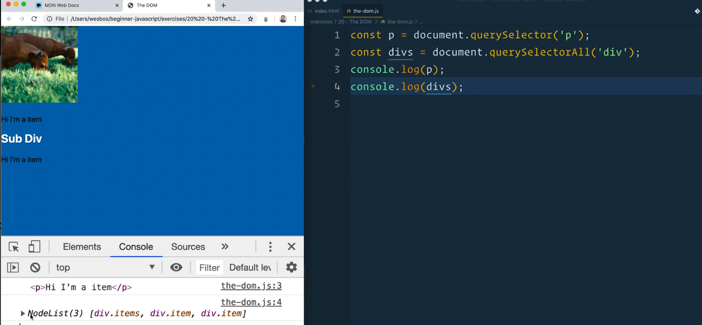
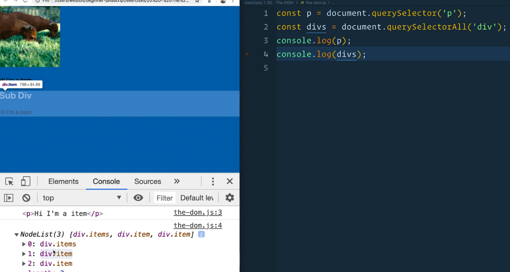

## Setup

For this lesson, we will be working out of the `/exercises/20 - The DOM/` folder which Wes has already created for us.

Within that folder there are two files:
- `index.html`
- `the-dom.js` _(the JavaScript file should be empty)_.

Open up `index.html` in the browser.

### Where to Load JavaScript When Selecting Elements

The first thing we need to talk about is where to load our JavaScript if we are selecting elements.

To demonstrate this, we are going to jump ahead of ourselves briefly and grab an element from the page.

Add the following the the JavaScript file 👇

```js
const p = document.querySelector('p');
console.log(p);
```

If you wanted to load this JavaScript into the `index.html`, you might think you want to add it inside of the `head` tag, as shown below 👇

```html
<head>
  <meta charset="UTF-8">
  <meta name="viewport" content="width=device-width,initial-scale=1.0">
  <title>The DOM</title>
  <link rel="stylesheet" href="../../base.css">

  <script src="./the-dom.js"></script>
</head>
```

Let's try that. Reload the page, which will cause the JavaScript to run, then open up the dev tools and take a look at what was logged in the console. It should be `null`.



What we are doing in the JavaScript code we just added is we are trying to select something on the page, and then log it.

If you try to run `document.querySelector('p')` in the console, it will return an element like so 👇



Why does it work in the console, but not when we loaded it via JavaScript?

It is not working because our JavaScript is being loaded before our HTML is created. That causes the JavaScript to be downloaded and run before the actual elements have been created on the page.

There are ways to get around like _(such as `async` and `defer` attributes)_, but it's better to just put the script tag right before the closing body tag.

That will ensure that all your HTML is first downloaded and parsed to the page before the JavaScript is run.

If you move your script tag to right before the closing body tag and refresh the page, you will see the exact same code works.

There are other ways around it.

One of those ways is putting all the js code inside of a function, and then adding an event listener that listens for the DOM content loaded event and runs the `init()` function we created when that happens. 👇

```js
function init() {
  const p = document.querySelector('p');
  console.log(p);
}

document.addEventListener('DOMContentLoaded', init);
 ```

Move the script src back inside the `<head>` tag.

This is getting ahead of ourselves but if you refresh the page, you will see that it works now even though the script is in the head.

What we are doing is delaying the code that actually runs until all of the DOM content has been loaded to the page.

If you move the script back to right before the closing body tag, you will see that it still works.

It's easier to not need to use an event listener like that and just include the script tag before the closing body tag so that is what we will be doing!

## Selecting DOM Elements

Before you actually work with elements on the page, you will need to go get them, which we refer to as selecting them.

You need to be able to access the specific element on the page (whether an `h2` tag, `div`, `button`, `image`).

Once we have it we can do things like listen for clicks, change the content, add content to it.

There are sort of two main ways of selecting elements, which are the only two that Wes uses:

1. `querySelector()`
2. `querySelectorAll()`.

Generally you are using them on the `document` although that is not always the case.

```js
const p = document.querySelector("p");
console.log(p);
```

In the example above 👆 we have selected something with a `p`.

Both `querySelector()` and `querySelectorAll()` take one argument, which is the CSS selector. Those are almost the exact same selectors used in CSS.



If you open up the `index.html` in the browser, you will see we have grabbed a paragraph tag. When we log it, you will see we have the item there.

`querySelectorAll()` will give you multiple elements, whereas `querySelector()` will give you the first matching one.

Let's demonstrate that by making another variable called `divs`.
Add the code below 👇

```js
const p = document.querySelector("p");
const divs = document.querySelectorAll("div");
console.log(p);
console.log(divs);
```

If you reload `index.html` you will see that we get something in the console called a **NodeList**.



We will be learning about arrays in the future and NodeLists look a lot like arrays. It is a frequent interview question that you might hear, that a node list is not an array.

It is a list of things, but there are a few differences which we will go through in the future.

The short and skinny is that it does not have all the methods that an array does like `map`, `filter` and `reduce` built into it.

If you hover over the NodeList in the console, you will see that it is grabbing everything that matches the selector (`div`).



You can get more specific than using elements as selectors.

```js
document.querySelectorAll('.item');
```

You could say give me anything with a class of `.item`, as shown above 👆

Let's say you only wanted `divs` with a class of `item`. You would then use 👇

```js
document.querySelectorAll("div.item");
```

You can also do parent child selectors.

If you only wanted to grab an image inside of an `item` div, you could achieve that using the code below.  👇

```js
const divs = document.querySelectorAll('.item img');
```

If you wanted to just select the first `item` and then the image inside of it, you could add the code below instead, which will return the first match. 👇

```js
document.querySelector('.item img')
```

Let's say the other item div also has a class of `item2`.

```js
const item2 = document.querySeletor('.item2');
```

You could add the following code 👇

```js
const item2 = document.querySeletor('.item2');
```

### Searching Inside Already Selected Elements

If you want to search inside of an element that you already selected, you can use querySelector on any other element like so 👇

```js
const item2Image = item2.querySelector('img');
```


If you ever need to narrow down your focus as to where you are searching, you can do that in your selector, but you can also run `querySelector()` and `querySelectorAll()` on any other element and only search within it to limit the scope.

```html
<h2 id="wes">Sub Div</h1>
```

If you have an element with an id, as shown in the code above 👆, you would be able to grab it using `document.getElementById('wes');`.

Notice how you don't put the `#` sign before 'wes'?

That is because if you're using anything that's not query selector, you don't have to pass `.` or `#`.

The same works with `document.getElementsByClassName()`, but you don't pass the `.` from the classname.

You can get all the work done with `document.querySelector()` and `document.querySelectorAll()` however, and they are much more flexible.
