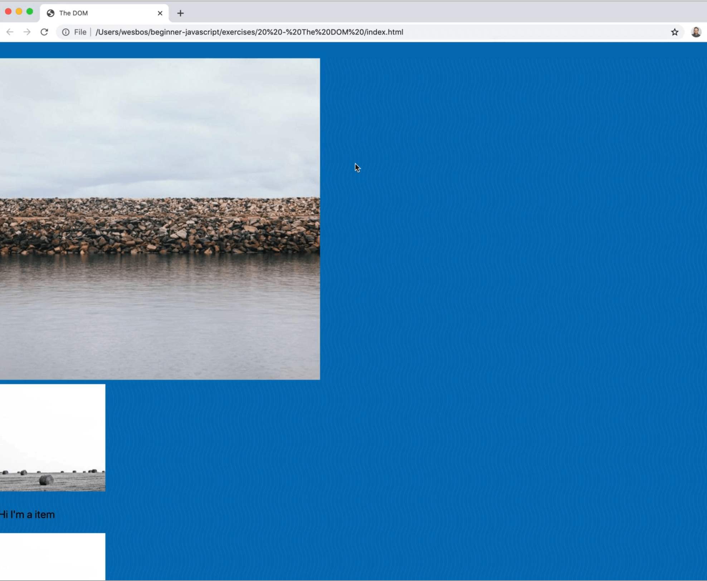
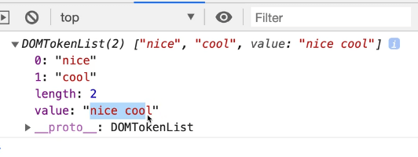
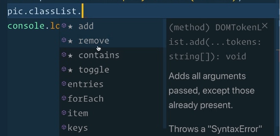
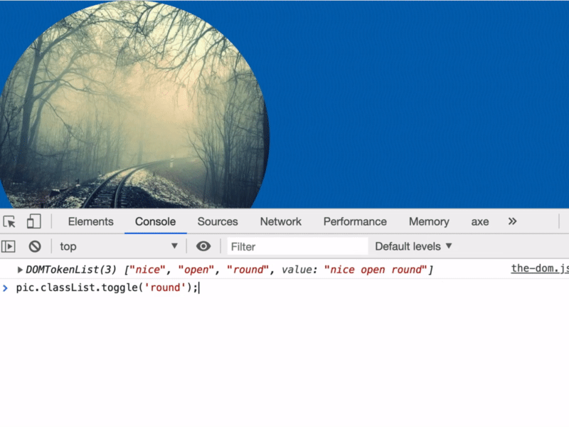
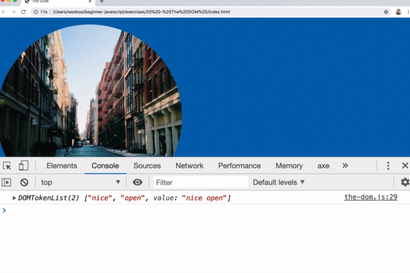

In JavaScript, it is common to need to add and remove classes.

Let's demonstrate how to do that, starting by commenting out all the code within `the-dom.js`.

When you select an element, it will have a `classList` attribute on it, and that attribute has methods on it for adding and removing multiple classes.

We will do an example with animation.

Duplicate one of the image tags and add it right after the opening body tag, and give it a class of nice. 👇

```html
<body>

```



Within `the-dom.js`, add the following code to select the element using the class of `nice`, and then we will log the `classList` attribute of the element.

```js
const pic = document.querySelector('.nice');
console.log(pic.classList)
```


In the console we get a **DOMTokenList** which is kind of like an array of all the classes that are on that image.

In the HTML file, add a class of `cool` to the image as well.

When you refresh the page, you will see that we get both of them as well as a value of all of the classes.  👇



If you look into the **prototype** _(we haven't learned what that is yet)_, you can see which methods are available to call against the thing we have.

`classList` has many methods.

To name a few, there is
- `add`
- `remove`
- `contains`
- `foreach`.

A lot of those are methods for working with classes which is exactly what we are going to do.


Within VS Code, as you type, you may have noticed that you get a dropdown of methods available to you. 👇



## Adding a class

We are going to use `pic.classList.add()` to add a class of 'open'.

```js
const pic = document.querySelector(".nice");
pic.classList.add("open");
console.log(pic.classList);
```

Refresh the page, and inspect the image element. You will see the image now has a class of open.

## Removing a class

What if we wanted to remove the class of "cool" which already exists on the element?

You could do that with the following code 👇

```js
pic.classList.remove('cool');
```


## Toggling a class

There is also `toggle` which is pretty cool.

Let's write a bit of CSS so we can visually see what is going on.

In our `index.html` add a style tag somewhere on the page with the following styles 👇

```html
<style>
  .round {
    border-radius: 50%;
  }
</style>
```

Now using JavaScript, we will add a class of `round`.

```js
pic.classList.add('round');
```

Now the element has the class of round and makes the image circular.


We can add and remove that class either by pasting it into the console or on click.

We will go over both.

Replace the `add` method used above with `toggle()`.

`toggle` will add the class if it is not there, and remove it if it is.

```js
pic.classList.toggle('round');
```

If you copy and paste that line of code into the console, you will see that the class is being added and then removed.


If we go into our CSS and add a transition all for .2 seconds, that will give us an animation when the class is toggled.

```css
img {
  transition: all 0.2s;
}

.round {
  border-radius: 50%;
  transform: rotate(1turn) scale(2);
  box-shadow: 0 0 10px black;
}
```



Quick peak ahead _(we will be learning about events later)_, you can do something like the following 👇

```js
function toggleRound(){
  pic.classList.toggle('round');
}

pic.addEventListener('click', toggleRound);
```

What we are doing there is saying when the pic element is clicked, we want to the trigger the function called `toggleRound()`, which will toggle on and off the class of `.round` for the image element.

You can add the following styles to the `.round` class also for a rotation transition...

```css
.round {
  border-radius: 50%;
  transform: rotate(20deg);
}
```

The CSS added 👆 above will give you the transition shown below 👇


```css
.round {
  border-radius: 50%;
  transform: rotate(2000deg);
}
```

To get the transition effect below 👇 add the code shown above 👆


```css
.round {
  border-radius: 50%;
  transform: rotate(1turn) scale(2);
}
```

The code above 👆 gives you the effect below 👇



A lot of JavaScript interaction is just adding and removing classes at different points in time. That allows JavaScript developers to use CSS to add and remove transitions.

That is common with modals and navigation which open and close, and we will be going over lots of examples of that throughtout the class.

## The contains method

There is also the `contains()` method, which you would use like so 👇

```js
pic.classList.contains('open');
```

It will return a boolean value of `true` or `false` based on whether that element has the class or not.

That is useful when you want to check the current state of an element by looking at it's class list.

In the next video we will go over regular attributes.

Even though `class` is an attribute, `classList` gives us some utility methods for working with it.

Whenever Wes needs to work with classes, he uses `classList` which is a few years old but fairly newer.
