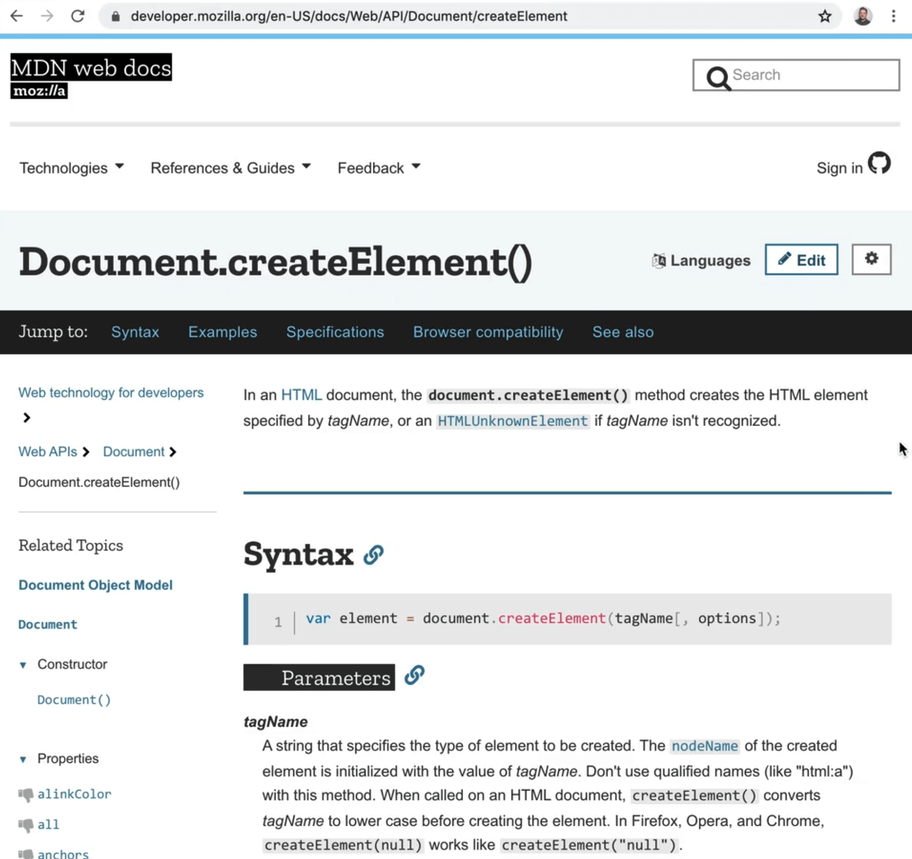
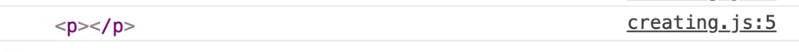
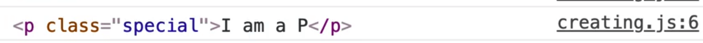
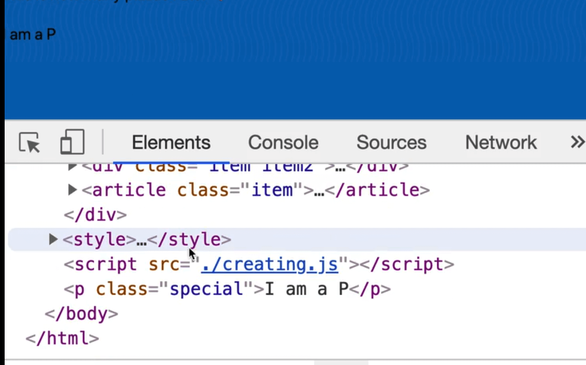
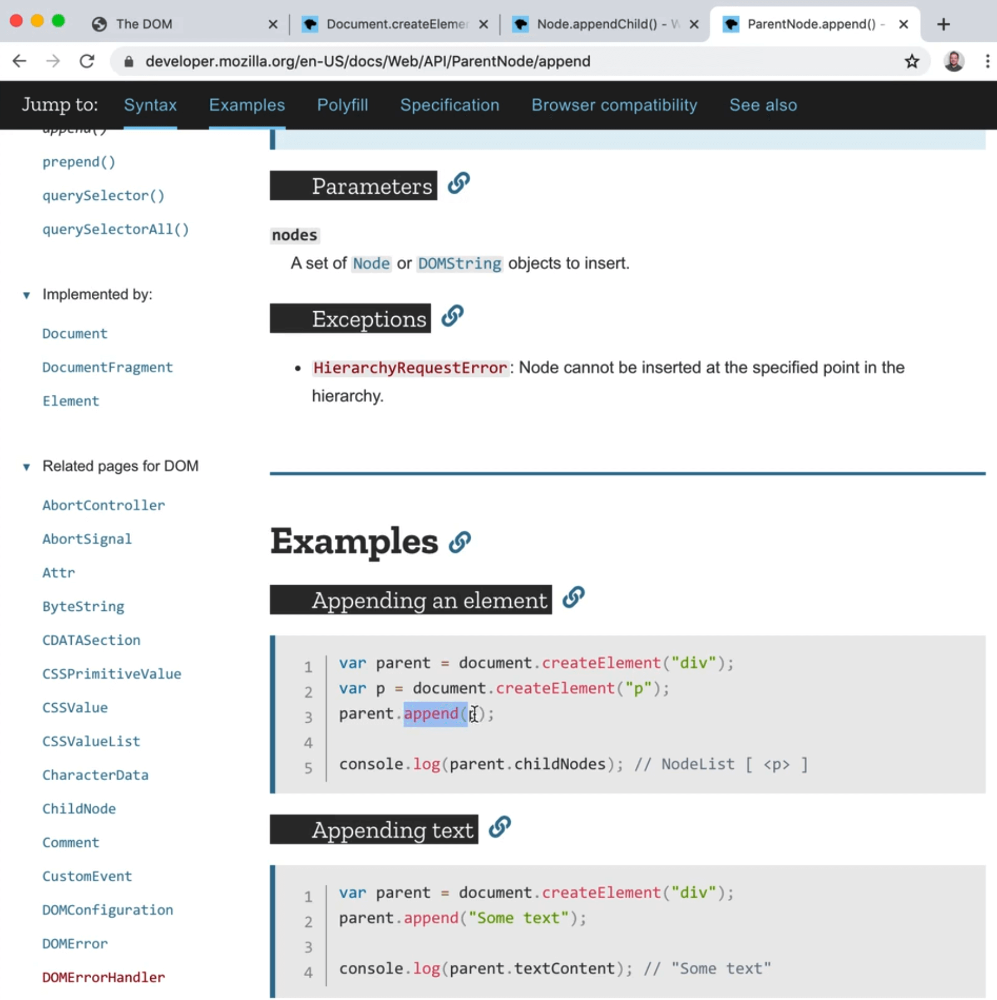
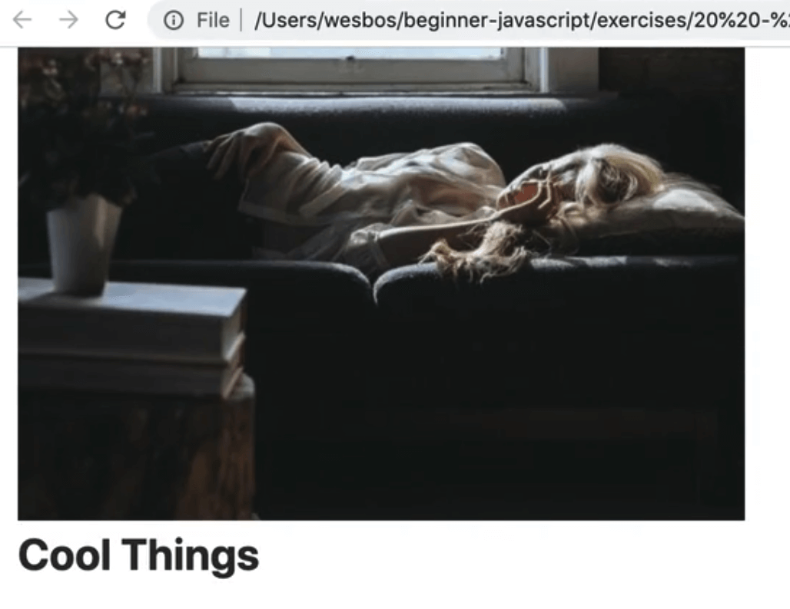
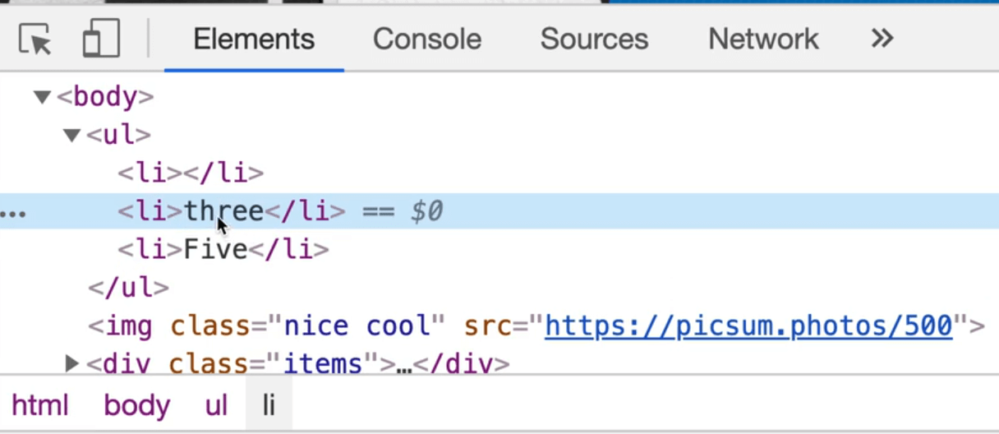

In this lesson, we will learn about creating elements.

Create the file `creating.js` within the `20 - The DOM` folder.

In the `index.html` file we have been using so far, replace the script source to point to `creating.js` instead of  `the-dom.js`, as shown below 👇

```html
<script src="./creating.js"></script>
```

There are a few ways to create HTML in JavaScript. The main way is using `document.createElement()`.

Let's look that up in MDN.



To use this method, you pass it a tagName and then there are optional options you can pass _(you can tell it's optional because of the square brackets)_, which we won't be using.

Let's try to make a paragraph tag using this method.

```js
const myParagraph = document.createElement('p');
console.log(myParagraph);
```

When you open the HTML file, you will see the paragraph in the console but it is not visible on the page.

That is because we haven't actually put it on the page yet, we just created it and it's living in what is called **memory** right now.



There is no shortcut to create an element with a class or with a set attribute, so something like the code below would **not** work 👇

```js
const myParagraph = document.createElement('p.special[title="hey"]');
```

If you want to add or get attributes from it, you must instead do it the way we have learned, as shown below 👇

```js
const myParagraph = document.createElement('p');
myParagraph.textContent = 'I am a p!';
myParagraph.classList.add('special');
console.log(myParagraph);
```



We now have that paragraph with a class of `special` and the text content that we supplied it with.

Let's create a few more elements before we get into how to actually insert them into the DOM.

First create an image element as shown below 👇

```js
const myImage = document.createElement('img');
myImage.src = "https://picsum.photos/500";
myImage.alt = "Nice photo";
console.log(myImage);
```

Next, create a div with a class of `wrapper` and log it.

```js
const myDiv = document.createElement('div');
myDiv.classList.add('wrapper');
console.log(myDiv);
```

Now we have created 3 elements:
- a paragraph
- an image
- div

How do we add it to the page?

We use another API called **appendChild**. To use it, you have to first select an element to call `.appendChild()` against.

If you want to add the element directly into the body, you can grab the `document.body` and insert it.

`document.body` is available to us because the `document` element gives us access to the `body` element quickly via a property. Not every element is as easily accessible to us like `body` is.

Let's look up `appendChild()` in MDN.

It takes in one parameter, which is a child reference.


```js
document.body.appendChild(myParagraph);
```



This gives us a `p` tag right before the closing `body` tag.

`appendChild()` can be called against any node, so we can do something as shown in the code below 👇

```js
document.body.appendChild(myDiv);
myDiv.appendChild(myParagraph);
myDiv.appendChild(myImage);
```


It is probaby better to do that in reverse order. Why?

Everytime you use `appendChild()` you are modifying the DOM, which causes something called a **reflow** in the browser, which tells the browser that something has changed and that the browser needs to repaint the HTML.

This means that if you call `appendChild()` 3 times in a row, you are causing the browser to re-render 3 times in a row.

That can start to eat into other things on the page and degrade the user experience.

To solve that, you could modify the code like so 👇

```js
myDiv.appendChild(myParagraph);
myDiv.appendChild(myImage);
document.body.appendChild(myDiv);
```

What we are doing here is:
1. we are creating the elements and inserting the paragraph inside of the div
1. then we are inserting the image inside of the div as well
1. finally, we call `document.body.appendChild(myDiv)` last to modify the DOM

This approach causes the browser to re-paint only once as opposed to 3 times in the earlier approach.

_(Technically, the browser is doing 2 repaints, once when you dump the div in and the second time when the image loads, that's not the end of the world, that is how the browser works.)_

That is one way to go ahead and create elements, using the `createElement()` API.

## append method

You may come across the `.append()` methodm when searching for how to add an element to the DOM, which works very similarly to `createElement`. However, `append()` doesn't seem to be fully supported in Internet Explorer so Wes suggests holding off on using it.



## insertAdjacentElement method

There is another API, `insertAdjacentElement`, that Wes is fond of using. It works similarly to `insertAdjacentText()` which we looked at in a previous lesson and is used to add text before, after and inside elements.

The difference is `insertAdjacentElement` is used to insert elements before, after and inside other elements.


This is handy when you need to do something like insert an element before a paragraph in a div.

```js
const heading = document.createElement('h2');
heading.textContent = 'Cool things';
myDiv.appendChild(heading);
```

If you try using `appendChild` as shown in the code above 👆, you should see that the heading is inserted after the image _(as shown below 👇)_ which is **not** what we want.



`insertAdjacentElement()` takes two parameters:
1. the position of where you want to insert the element
1. the element you want to insert.

```js
myDiv.insertAdjacentElement('afterbegin', heading);
```

That will put the heading before the paragraph and image tag.


If you were to use `beforebegin`, it would insert the `header` before the `div` tag, as a sibling to the wrapper.

That may be something you will need to use.

Let's say you have a few cards and you need to add something after the first card. You can grab the second card and use `beforebegin` to insert an element before it.

## Generating An Unordered List

Let's do one more example. In this example, we will create an unodered list with 5 items in it, using all the APIs we have learned so far.

The outcome should like the code shown below 👇

```html
 <ul>
  <li>one</li>
  <li>two</li>
  <li>three</li>
  <li>four</li>
  <li>five</li>
</ul>
```

Start with the middle one and then try to insert one before, however you can make use of all the APIs that we have gone over.

Pause the video here and try to create that and inject it into the DOM.

Once you have tried that, continue on.

First, create the unordered list.

Next, create the third list item and append it to the list.

_NOTE: If this seems like a lot of code to make an unordered list, well it is, we will go over in the next section how we can write a bit of html in a string and inject it in._

```js
const list = document.createElement('ul');
const li = document.createElement('li');
li.textContent = 'three';
list.appendChild(li);

document.body.insertAdjacentElement('afterbegin', list);
```

Next, create the other list item which we will add using `append()`, like so 👇

```js
const li5 = document.createElement('li');
li5.textContent = 'Five';
list.append(li5);
```

There is the ability to clone a Noe which we could do as shown below 👇

```js
const li1 = li5.cloneNode();
list.insertAdjacentElement('afterbegin', li1);
```

What that code will do is it will create a clone of the `li5` Node, and then insert that clone adjacently.



If you reload the page, you will see that we added the element but it is empty.

If you take a look at the docs for `cloneNode()`, you will see that it accepts a parameter of "deep" which specifies whether to clone the child nodes or not.

You may be wondering "well isn't text part of the element?", and no, it is actually a child of the element.

Since the text is not wrapped in a separate element (like a `span` or `p` tag), that makes it just a regular node.

That means we need to pass true when using `cloneNode` to include the text, as shown below 👇

```js
const li1 = li5.cloneNode(true);
li1.textContent = 'one';
list.insertAdjacentElement('afterbegin', li1);
```

In this instance `cloneNode()` wasn't much more efficient to use, but it generally is.

If you are trying to clone an element that has a lot of attributes set on it, and want to copy those over as well, it is much more efficent to use `cloneNode`.

Now that we have 1, 3 and 5, how do we inject 2 and 4?

```js
const li4 = document.createElement('li');
li4.textContent = 'Four';
li5.insertAdjacentElement('beforebegin', li4);
```

We will use `beforebegin` 👆because we want four to go beside the 5th one.

FInally for two, we can use `afterend` to insert it after the first list item, as shown in the code below 👇

```js
const li2 = document.createElement("li");
li2.textContent = "Two";
li1.insertAdjacentElement("afterend", li2);
```

That was a good practice exercise because we used all the different APIs available to us to create elements, set the contents and insert them in different ways.

In the next video, we will look at how we can use backticks and strings to generate the HTML.
