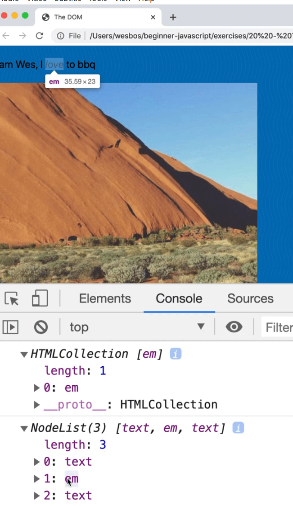
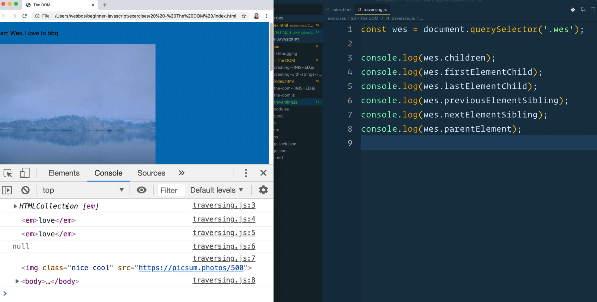
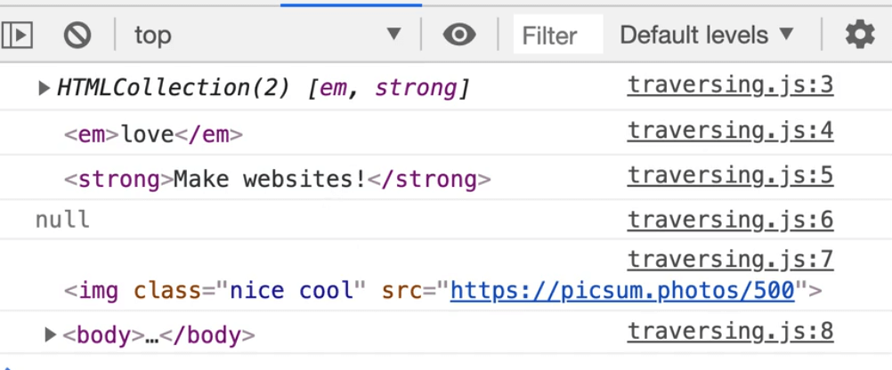
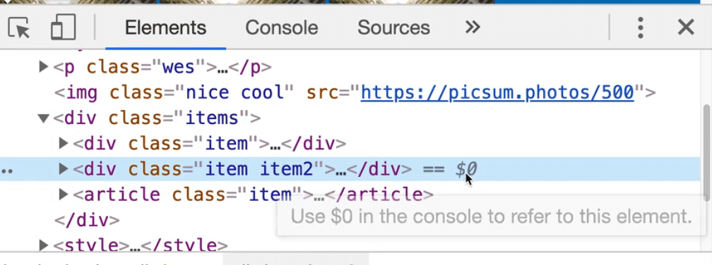

In this video, we will learn about traversing through our DOM element and removing elements from the DOM.

Create a file name `traversing.js` and go into our `index.html` and modify the script source to point to the new file.

**Traversing** means going up, down, over etc. When you have an element, you often need to select an element based on it's position.

For example, sometimes you are working on a `button` and need to select the parent `div`, or you need to look inside of the `button` for all the elements inside of it.

There are lots of properties for that, and they all revolve around node and elements.

## The difference between an Node and an Element

We will do an example to demonstrate the difference.

In the `index.html` file, create a `p` tag with the class of `wes`, and within the paragraph tag add a few elements, as shown below 👇

```html
<p class="wes">I am Wes, I <em>love</em> to bbq</p>
```

In the JavaScript, select that paragraph.

```js
const wes = document.querySelector('.wes');
console.log(wes);
```


If instead you log `wes.children`, it will return a collection of one thing in the console, which is the `em` tag we just added.


If you log `wes.childNodes` instead, you will see that it returns a NodeList of three things:
- text
- em
- text

In the HTML collection, only the `em` element was returned.


If you hover over the nodes in the console one at a time, you will see it highlighting the corresponding node on the HTML page.

This is the first `text` node.


Then the `emphasis` node.



Then the rest of the text.


Everything in our `NodeList` in the console is a `Node`, and if it is wrapped in a `tag`, it is also an `element`, but it doesn't work the other way around.

If you only select elements, you won't have nodes returned. But if you select the nodes, you get all of the three different pieces.


_VS Code TIP: You can do multi-cursor in VS Code. The way you use that is you hold down command or control and click wherever you want the cursors to go. In this video Wes used multicursor by selecting an element and then doing command + D to grab other occurences_

## Properties to work with Nodes and Elements

We already looked at children, which gives you child elements or child nodes.

Let's add a few more elements to work with.

```js
console.log(wes.firstElementChild);
console.log(wes.lastElementChild);
console.log(wes.previousElementSibling);
console.log(wes.nextElementSibling);
console.log(wes.parenteElement);
console.log(wes.childNode);
```

Here is the result when you refresh the index.html page.

 3:59

`children` gives you the children.

Let's add a few more elements inside of the p tag.

```html
<p class="wes">
  I am Wes, I <em>love</em> to bbq and <strong>Make websites!</strong>
</p>
```

If you refresh that page, you should get the following results:

1. `firstChildElement` returns the emphasis element.
1. `lastChildElement` returns the strong element.
1. `previousElementSibling` is null.



Why is `previousElementSibling` null?

If you look at the HTML page, you will see that a few elements with the class of `item` are next to each other.



If we were to grab the second item by clicking it in our developer tools and then using `$0` to reference it in the console, we can take it and run the following code in the console:

```js
$0.childrenElementCount
```

👆That will tell us the number of children elements.

```js
$0.children
```

👆 That will return a collection of three elements.

```js
$0.previousElementSibling
```

👆 That will give you the item that is before it.


We were on `item2`, and the previous element sibling is the first item. In the code we wrote in our JavaScript file, we selected the first item, which has no previous sibling, thus it returned null.

_jQuery used to make this easy with syntax like `.prev()` `.next()`. All of that is still doable with these properties. They are not named the nicest things but they work and you can figure it out._

There is `nextElementSibling` which will grab the sibling element after the currently selected element.

And then there is `parentElement` which will go up and give you the parent element of the currently selected element.

If you take an element that is really low in the document like one of our image elements, you can chain calls to `.parentElement` like so 👇


How high can you chain?

To find out, add one more `.parentElement`, which will return HTML, and if you add one more, it will returns null. That means we have reached the top most element.

In the elements tab in the dev tools, select the span within `item2`, and in the console write `$0`, which should return the span.

* `$0.parentElement` will return the `h2` and chaining one more,`$0.parentElement.parentElement` will return `item2`.
* `$0.parentElement.parentElement.nextElementSibling` will return the first item.

Now you can go down again using `.children[1]` to select the paragraph with a class of `pizza`. We will talk about the **square bracket notation**(`[]`) shortly, but essentially that is how you reference items that are indexed.


In the code above, we started with the `span` in `item2`, we went up, up, over down and selected the second element.

That is probably not something you would do because assuming that the structure of the HTML is the best way to move around elements is probably not a good idea because if someone adds an extra `div`, then everything is ruined.

Using `querySelector` is better to use to search for what we want. There is also another method `.closest()` which will allow us to search.

We also have a bunch of different properties for Nodes as well.

```js
el.childNodes
el.firstChild
el.lastElementChild
el.previousElementSibling
el.nextSibling
el.parentNode
```

Unlike the element properties, these will not ignore text nodes, so it's important to know the difference.

In most cases, you probably want the element selectors but in some instances you want the node selectors.

## Removing Elements

There is a method on every single element on every single node which is the ability to remove something.

Let's do it from the dev tools.

Grab the `h2` by clicking the element in the element pane and then in the console write `$0.remove()`


That removes the element completely from the DOM.

The only kinda gotcha is what happens if you were to create an element, add it to the DOM and call `.remove()`?

Let's try it with the code below 👇

```js
const p = document.createElement("p");
p.textContent = "I will be removed";
document.body.appendChild(p);
p.remove();
```

If you open the index file in the browser, you won't see the `p` tag because we added it and then immediately removed it.

The question now is what if you log `p` after you call `remove()`, will it be null, `undefined`?


It is still there!

The fact that we had created that element and it exists in our JavaScript memory means that we do still have access to that paragraph element and we could add it back in to the DOM.

If you have reference to that element in JavaScript, and you've created it in your JavaScript, you can add it again.
