This video will all be "cardio" which is what Wes likes to call exercises that are all related to one another.

The purpose of these exercises is to practice the material we have learned by putting yourself through the exercises and hopefully improving.

We want to nail down the fundamentals before we start building real stuff with interfaces etc.

What you should do now is pause the video and go through all the exercises in the `DOM-CARDIO.js` file and try to do as much as you can.

There is no right answer, there is a bunch of different ways that you could solve it.

Then come back and watch the video to see how Wes would approach it.

**WHEN YOU ARE READY...**

The `DOM-Cardio.html` file has no HTML in the body at all, and `DOM-Cardio.js` is just a blank JavaScript file with comments explaining the different exercises.

The first one is to create a div, then add a class of wrapper to it and then put it in the body.

Start by creating a div 👇

```js
const div = document.createElement('div');
```

Add a class of `wrapper` to it.👇

```js
div.classList.add('wrapper');
```

Then, append it to the body 👇

```js
document.body.appendChild(div);
```

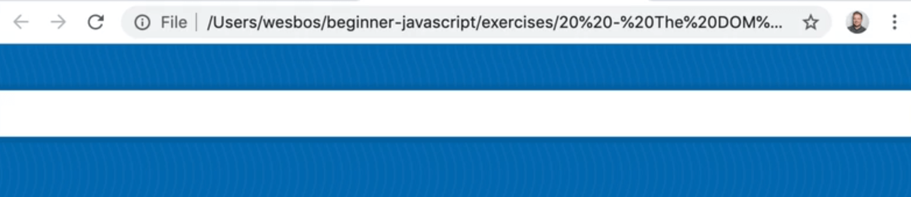

As you can see, the works!

The next exercise is to make an unordered list, which should be familiar to you since we have gone over how to do it together previously.

Add the following code to do so 👇

```js
const ul = `
  <ul>
  </ul>
`;
```

To add the 3 list items with the words "one","two" and "three", modify the `ul` variable declaration, as shown below 👇

```js
const ul = `
  <ul>
    <li>one</li>
    <li>two</li>
    <li>three</li>
  </ul>
`;
// add three list items with the words "one, two three" in them
```

Next we need to put the list in the `wrapper` div we created a few steps ago.

There are a few ways you could approach this.

One way is like so 👇

```js
div.innerHTML = ul;
console.log(div);
```

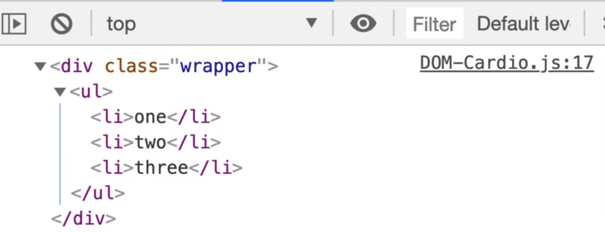

That works well. You could have add it as a fragment, but because there was nothing in the body already, it was simple to use `innerHTML`.

Next you need to create an image. Add the following code to do so 👇

```js
const img = document.createElement('img'
```

Then you have to set the image source.

```js
img.src = 'https://picsum.photos/500';
```

Then you need to change the image width to 250. Do so with the following code 👇

```js
img.width = 250;
```

Then you need to give the image a class of `cute`, like so 👇

```js
img.classList.add('cute');
```

Next you need to add an alt of cute puppy, which you can achieve with the code below.

```js
img.alt = "Cute Puppy!";
```

Then you need to append it to our `wrapper` div.

We will take the div and call `appendChild()` on the image.

We do not need to call `insertAdjacent()` because it will go to the bottom of it.

```js
div.appendChild(img);
```


You may notice that every time you refresh the image, the image is sort of jumping.

If you add `img.height = 250;` to the JavaScript code as well and then refresh, it should not jump as much anymore.

That is because if you give it a width and height attribute, it will maintain it's spot while it loads the image, which is great.

Next, you need to use HTML strings to make a div with two paragraphs inside of it.

```js
const myHTML = `
  <div>
    <p>Paragraph One</p>
    <p>Paragraph Two</p>
  </div>
`;
```

Then you need to insert the div above the unordered list that we created earlier.

To do this, grab the `ul` which you may still have reference to.

To check if you do still have reference, add `console.log(ul);`

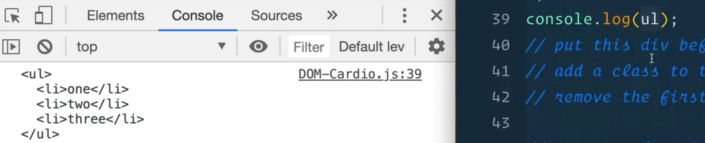

Wes was wrong -- it does not look like you already have access to the `ul` element because it shows up in the console as a string, rather then an element object.

So you need to somehow grab that.

Since you already have the div element, you can look within it to grab the ul element like so 👇

```js
const ulElement = div.querySelector('ul');
console.log(ulElement);
```

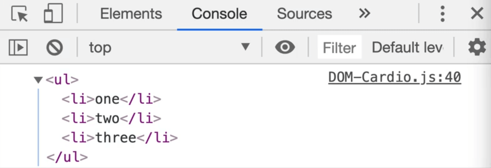

Next you need to add this div to the unordered list from above.

Try the following code 👇

```js
ulElement.insertAdjacentElement('beforebegin', myHTML)
```

If you refresh the HTML page, you will see an error that says

>Uncaught TypeError: Failed to execute 'insertAdjacentElement' on 'Element': parameter 2 is not of type 'Element'.


So because you have created it as a string, how can you insert it adjacently?

You could try using `insertAdjacentHTML()`.

```js
ulElement.insertAdjacentHTML("beforebegin", myHTML);
```

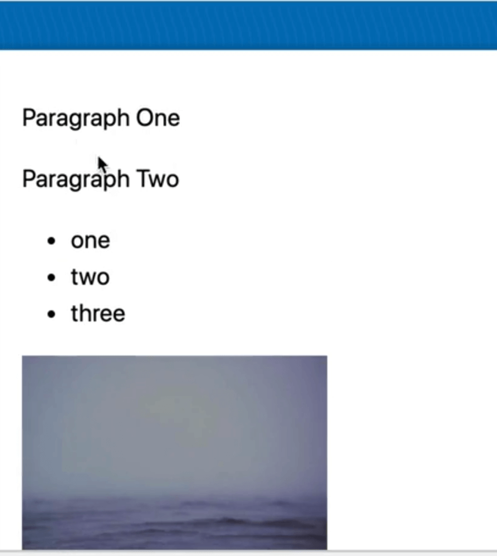

That works great! You could have also done `createRange()` and then added it as a document fragment.

Next, you need to add a class of `warning` to the second paragraph, and then select it.

If we look at the HTML in the dev tools, you will see the following code 👇

```html
<div class="wrapper">
  <div>
    <p>Paragraph One</p>
    <p>Paragraph TWo</p>
  </div>
</div>
```


Select the first div within the `wrapper` using `querySelector`, like so 👇

```js
const myDiv = div.querySelector('div');
```

Or you could use `firstElementChild`.

```js
const myDiv = div.firstElementChild;
console.log(myDiv);
```


That is working, however, let's not use that because if you were to insert anything else, the div could no longer be the first element child, which makes it a pretty unstable solution.

Instead, go into the `myHTML` variable declaration from above and add a class to the div that you inserted called `myDiv`, like so 👇

```js
const myHTML = `
  <div class="myDiv">
    <p>Paragraph One</p>
    <p>Paragraph Two</p>
  </div>
`;
```

And then you can select the div using it's class name. This makes the code more resilient.

```js
const myDiv = document.querySelector('.myDiv');
```

Next you need to add a class of `warning` to the second paragraph.

Let's try using `myDiv.children`. First, log it to see what you are working with 👇

```js
console.log(myDiv.children);
```

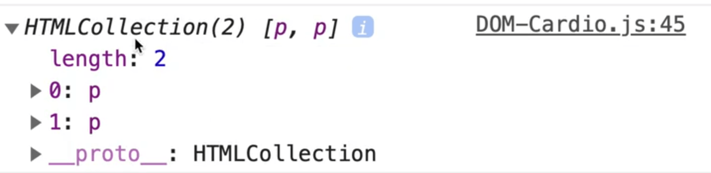

As you can wee, that gives you both of them. To select the second paragraph, you can reference it like so 👇

```js
myDiv.children[1]
```

`myDiv.children[0]` would be the first `p` tag and `myDiv.children[1]` is the second one.

That allows you to do the following 👇

```js
myDiv.children[1].classList.add('warning');
```

Then, remove the first paragraph like so 👇

```js
myDiv.firstElementChild.remove();
```

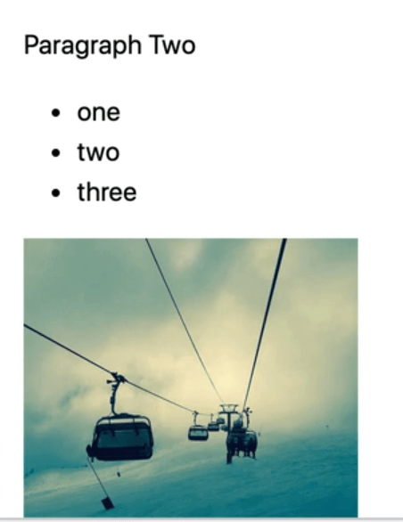

Next you need to create a function, `generatePlayerCard` that takes in 3 arguments:
- name
- age
- height

The function should return HTML that looks like the following 👇

```html
 <div class="playerCard">
   <h2>NAME — AGE</h2>
   <p>They are HEIGHT and AGE years old. In Dog years this person would be AGEINDOGYEARS. That would be a tall dog!</p>
 </div>
```

So first, create the function that takes in those 3 parameters:

```js
function generatePlayerCard(name, age, height){
}
```

In order to have the function return a div with the structure mentioned above, you could approach it in one of 2 ways:

1. return the HTML directly, like so 👇

```js
function generatePlayerCard(name, age, height) {
  return `
    <div class="playerCard">
    </div>
  `;
}
```

or

2. stick it in a variable and then return it, like so 👇

```js
function generatePlayerCard(name, age, height) {
  const html = `
    <div class="playerCard">
    </div>
  `;
  return html;
}
```

Let's stick with the second way for now.

You now need need to build out the rest of the HTML string and interpolate the parameter variables that have been passed to the function, like so 👇

```js
function generatePlayerCard(name, age, height) {
  const html = `
    <div class="playerCard">
      <h2>${name} - ${age}</h2>
      <p>They are ${height} and ${age} years old. In Dog years this person would be ${age * 7}. That would be a tall dog!</p>
    </div>
  `;
  return html;
}
```

Refresh the HTML page and try calling the function from the console.

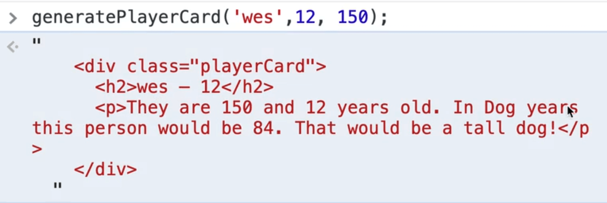

It works!

The text doesn't make the most sense but that is okay.

_(If you want an extra challenge, you could take the height value that was passed in centimeters and if you're from America, you could convert it to feet and inches. You could write a little function that takes in a parameter of centimeters, converts it to feet and inches and returns the value.)_

Next step in the exercise is to make a new `div` and give it a class of `cards`, like so 👇

```js
const cards = document.createElement();
cards.classList.add('cards');
```

Next you need to have that function make 4 cards and append those cards to the div.

There are a few ways you could do this.

Because the function returns a string, you could loop over it 4 times and create 4 cards of HTML.

Let's demonstrate a few different ways to do this.

Declare a variable and have it generate the first card's HTML, like so 👇

```js
const cardsHTML = generatePlayerCard('wes', 12, 150);
console.log(cardsHTML);
```

If you refresh the HTML page, you will see the following error 👇

>Uncaught TypeError: Failed to execute `createElement` on `Document`: 1 argument required, but only 0 present.
>  at DOM-Cardio.js:68

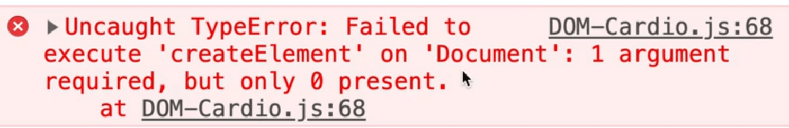

That error is being thrown because when you called `document.createElement()` above, we forgot to specify what kind of element to create.

Modify that code like so 👇

```js
document.createElement('div');
```


Now it works.

But how do we keep tacking onto that?

We could change `const cardsHTML` to `let cardsHTML` and then do something like the following 👇

```js
let cardsHTML = generatePlayerCard('wes', 12, 150);
cardsHTML = cardsHTML + generatePlayerCard('scott', 12, 150);
cardsHTML = cardsHTML + generatePlayerCard('kait', 12, 150);
cardsHTML = cardsHTML + generatePlayerCard('snickers', 12, 150);
console.log(cardsHTML);
```

_NOTE: if you save the code above, Prettier might re-format that to use the shorthand code below which is fine because the 2 ways of typing it out are equivalent._

```js
let cardsHTML = generatePlayerCard("wes", 12, 150);
cardsHTML += generatePlayerCard("scott", 12, 150);
cardsHTML += generatePlayerCard("kait", 12, 150);
cardsHTML += generatePlayerCard("snickers", 12, 150);
console.log(cardsHTML);
```

Another way would be to create 4 separate variables for each of those.

Another way would be to create an array of names and loop over them.

We haven't gone over arrays just yet but we will doing lots of examples with those in the near future. That is the way Wes would probably go about approaching this.

Another way is you could take the `cards` div and call the following method on it 👇

```js
cards.insertAdjacentHTML('afterbegin', generatePlayerCard("snickers", 12, 150));
```

And then you could just call that multiple times, but passing different arguments to `generatePlayerCard`.

Let's stick with the method you already have.

Next you need to append those cards to the div.

Do that with the following code 👇

```js
cards.innerHTML = cardsHTML;
```

Now you need to put the div into the DOM just before the `wrapper`.

Use `insertAdjacentElement` because `cards` is a proper element, like so 👇

```js
div.insertAdjacentElement('beforebegin', cards);
```

If you refresh the HTML page you should see the following 👇

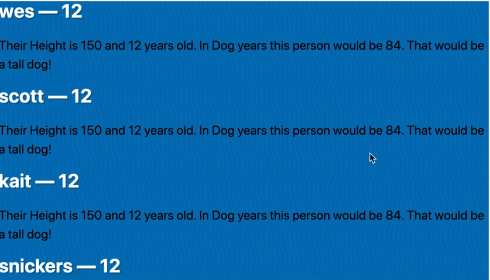

Really quickly, we will add some styles in the HTML page.

Add the following: 👇

```html
<body>
  <script src="./DOM-Cardio.js"></script>

  <style>
    .cards {
      display: grid;
      grid-template-columns: repeat(4, 1fr);
      grid-gap: 20px;
      padding: 20px;
    }

    .playerCard {
      background: white;
      padding: 20px;
    }

    .playerCard h2 {
      color: black;
    }
  </style>
</body>
```

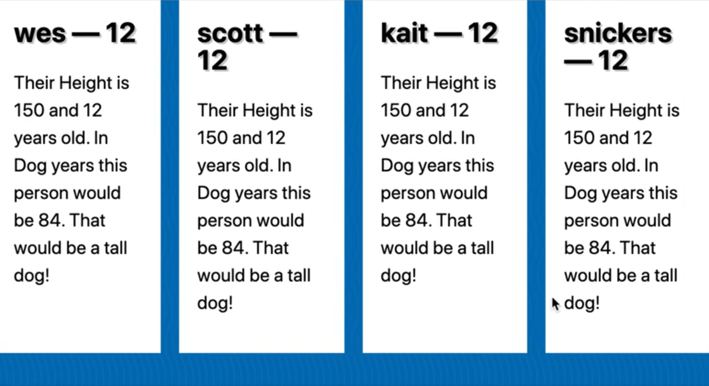

The bonus step in the exercise involves putting a delete button on each card so when you click it, it is removed.

We haven't gone over how to do this yet, but let's give it a try.

Go to where we generate the card and add a button, as shown below 👇

```js
const html = `
  <div class="playerCard">
    <h2>${name} - ${age}</h2>
    <p>Their height is ${height} and  they are ${age} years old. In Dog years this person would be ${age *
  7}. That would be a tall dog!</p>
  <button class="delete" type="button">&times Delete</button>
  </div>
`;
```

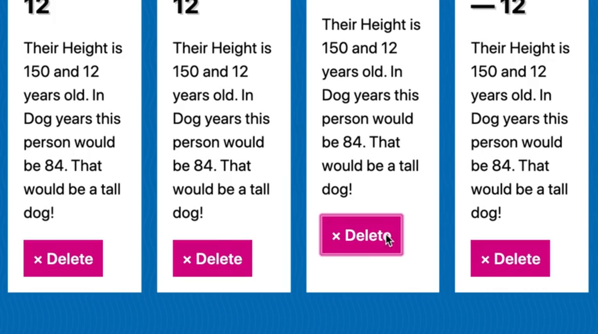

When that button is clicked, we want to delete the card.

To achieve that, select all the buttons 👇

```js
const buttons = document.querySelectorAll('.delete');
console.log(buttons)
```

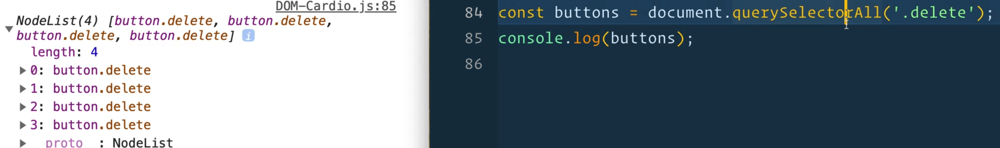

Make the delete function 👇

```js
function deleteCard() {
  console.log("DELETE CARD! TODO");
}
```

Now loop over each card and attach a click event listener which will call `deleteCard()`, like so 👇

```js
buttons.forEach(button => button.addEventListener("click", deleteCard));
```

Modify the `deleteCard()` function to accept the event as a parameter and inside of the function, log the event's current target.

_NOTE: we haven't gone over how to do some of this but it's just bonus! We will go over this in future videos._

```js
function deleteCard(event) {
  console.log(event.currentTarget);
  console.log("DELETE CARD! TODO");
}
```


Inside of `deleteCard`, you can assign the button that is the event's current target to a variable, like so 👇

```js
const buttonThatGotClicked = event.currentTarget;
```

Now you need to grab the parent element.

There are a few ways to do this.

One way is using the following code 👇

```js
function deleteCard(event) {
  const buttonThatGotClicked = event.currentTarget;
  buttonThatGotClicked.parentElement.remove();
}
```

If you refresh the HTML page and click one of the delete buttons, you will see that is removed.

## closest method

Another way you could have done it is using `closest()`, like so 👇

```js
buttonThatGotClicked.closest(".playerCard").remove();
```

What does `closest()` do?

It will look at an element and move itself up the tree until it finds something that matches the parameter you pass it.

That is cool because right now, both of those work, but let's say you where to change the position of the button.

If you moved it inside of the paragraph tag instead of directly inside of the div, only the second method would work because the first method would delete the paragraph, not the div.

The second method will search for the div or any element with a `playerCard` class and remove that. Even though the button has moved, it still works.

That's a wrap for this lesson.
