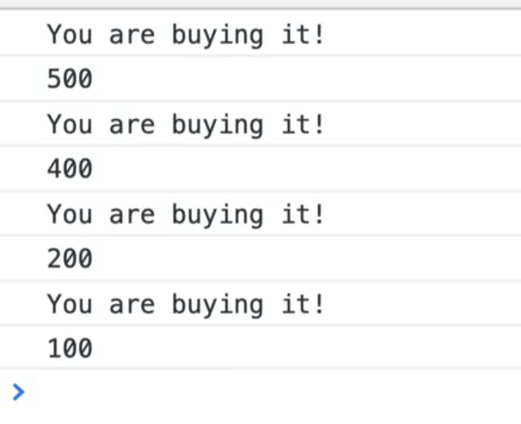
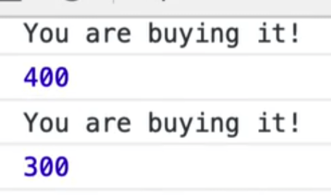
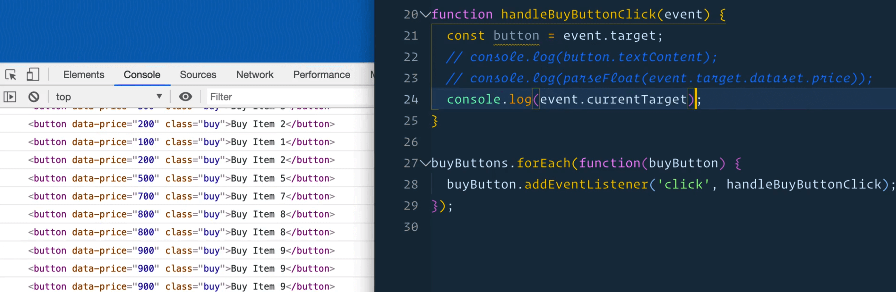
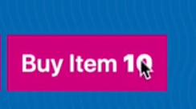
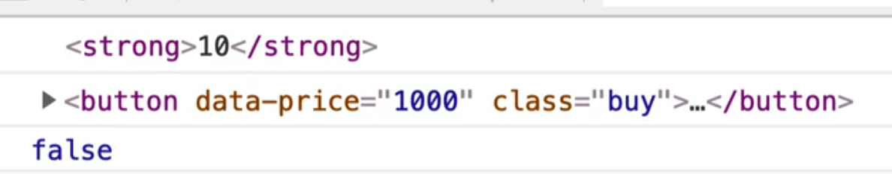
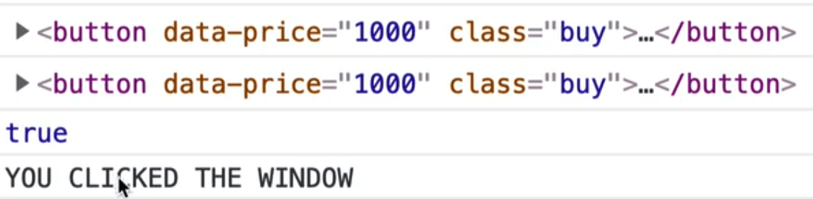
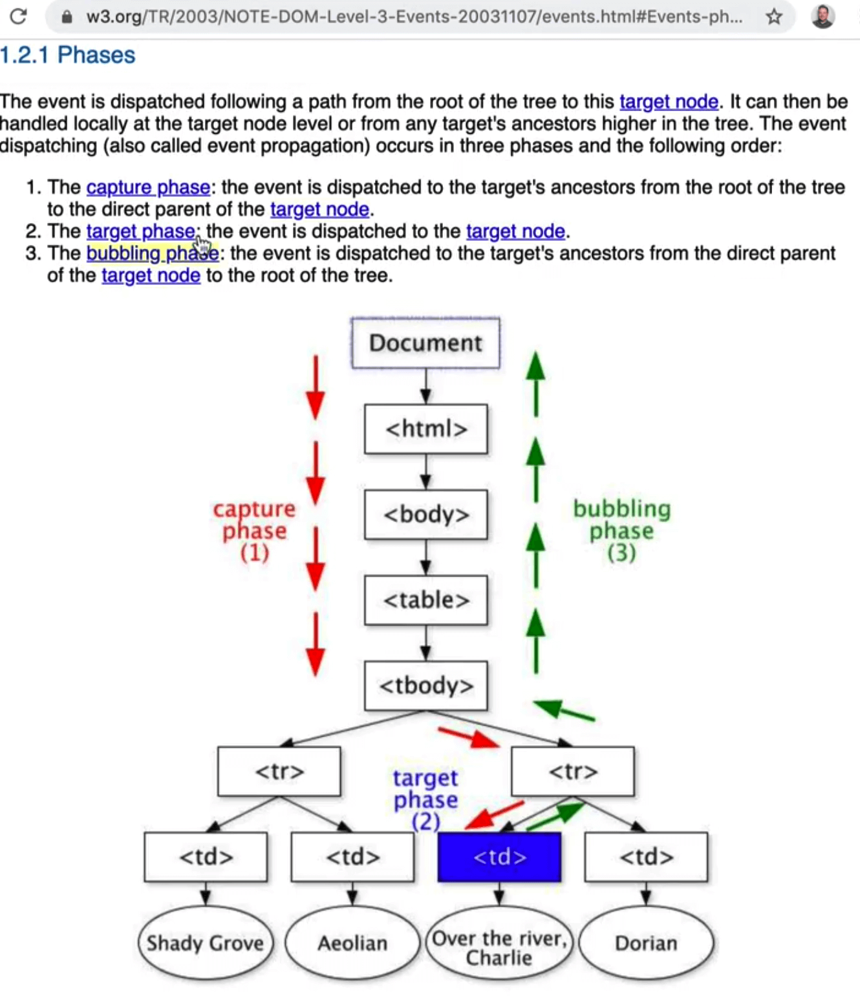
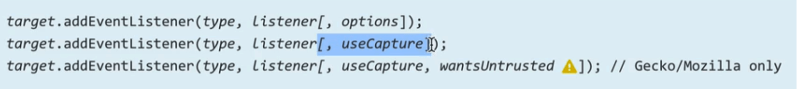
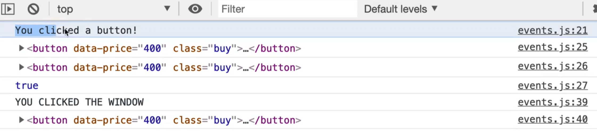
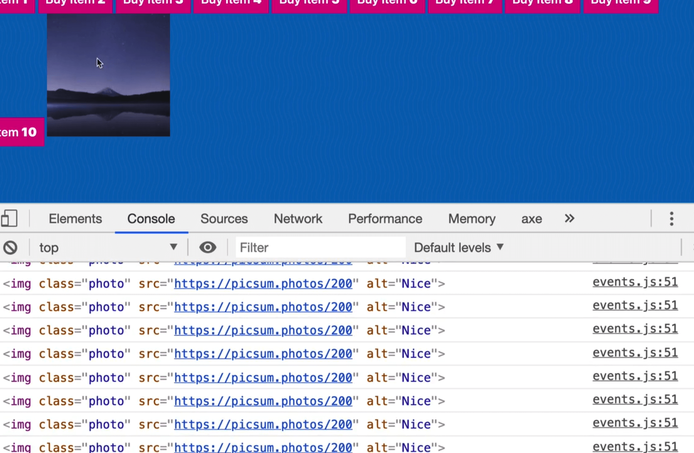

The **event object** is a gold mine of information about what happens when an event fires.

Remove everything in the `events.js` file after the `buyButtons` variable declaration.

We are going to loop over every single buy button and attach a handler to it.

Create a new function, `handleByButtonClick` and log "You are buying it" to the console.

Pass this function to each button's click event listener, like so 👇

```js
buyButtons.forEach(function(buyButton) {
  buyButton.addEventListener("click", handleBuyButtonClick);
});
```

Now the question is, _when a user clicks one of the buttons, how do I get information about what button is being clicked?_

If I have one function that is being called by 10 different button event listeners, how do I know which of the 10 triggered the function?

That information is hidden inside of the event object!

The event object is filled with all sorts of information and methods to work with your event.

To access the event object, we modify our callback function (our handler), to accept a param that is the event.

_Refresher from earlier: parameters are placeholders._

So we can add the following parameter, `event` to `handleBuyButtonClick()`, like so 👇

```js
function handleBuyButtonClick(event) {
  console.log('You are buying it');
}
```

We could call the `event` parameter anything, as long as it's the first param in our callback function.

Why?

Because when the browser runs the `handleBuyButtonClick` function for us when someone clicks it, it will run the function and pass to us a number of arguments, the first of which is the event object.

Within the `handleBuyBackButtonClick()`, log the `event` object, and refresh the HTML page.

Whhen you click on a button you should see the following in the console 👇


What we have there is a pointer event, which we will get into more detail about later, but essentialy we have clicks, and touches and mouse movements and they are all consolidated into one event called a pointer event.


If you expand the event, you will see all sorts of things.

**isTrusted**: this is a boolean that will tell you if the click was actually coming from someone's mouse (because it is possible to fake event clicks). If you are making a game, you probably won't want someone to programmatically click on items.

**pressure**: on newer iPads and other devices, there is pressure sensitivity.

It tells us `screenX`, `screenY`, `clientX`, `clientY`, `pageX` and `pageY`. Those are details as to where in the screen and where in the page the person has clicked, as well as a bunch of other information like what element was clicked on.

The one we are interested in is `target` and `currentTarget`.

Within `handleBuyBackButtonClick`, log `event.target`.

When you refresh and click on different buttons, it will show you which button the user has clicked on.


That is very useful because we could do something like add a data attribute, such as `data-price=""`, like so 👇

```html
<button data-price="100" class="buy">Buy Item 1</button>
<button data-price="200" class="buy">Buy Item 2</button>
<button data-price="300" class="buy">Buy Item 3</button>
<button data-price="400" class="buy">Buy Item 4</button>
<button data-price="500" class="buy">Buy Item 5</button>
<button data-price="600" class="buy">Buy Item 6</button>
<button data-price="700" class="buy">Buy Item 7</button>
<button data-price="800" class="buy">Buy Item 8</button>
<button data-price="900" class="buy">Buy Item 9</button>
<button data-price="1000" class="buy">Buy Item 10</button>
```

That allows you to go into the `handleBuyButtonClick` function and add the following code 👇

```js
function handleBuyButtonClick(event) {
  console.log('You are buying it!!');
  console.log(event.target.dataset);
}
```

Now when you click on a specific button, it should show you the `dataset` in the console.


And if you do `dataset.price`, it will return the price.



If you do log `typeof event.target.dataset.price`, you will see that the price is a string, so you need to convert it.

`parseFloat(price)` will keep the decimals whereas `parseInt()` will not.

```js
console.log(parseFloat(event.target.dataset.price));
```

Now you get a true number.



To recap: the event object contains all this information about what happened in this event, such as what type of event it was (mouseclick  etc), the target, and then once you have the target, you can access anything you want about that target.

What Wes likes to do is 👇

```js
const button = event.target;
```

This allows you to do 👇

```js
console.log(button.textContent);
```

You can access anything about that specific element using `event.target`

There is also another property, which you should log

```js
event.currentTarget
```



You might notice that you get the same thing.

What is the diferent between **event.target** and **event.currentTarget**?

To demonstrate, log both and then also log a comparison of the two, to see if they are the same element, like so 👇

```js
function handleBuyButtonClick(event) {
  const button = event.target;
  // console.log(button.textContent);
  // console.log(parseFloat(event.target.dataset.price));
  console.log(event.target);
  console.log(event.currentTarget);
  console.log(event.target === event.currentTarget);
}
```


It returns true.

So what is the difference?

The difference come in when there are elements nested inside of the element that you are listening to.

Take all the numbers in our buttons and wrap them in a strong tag like so 👇

```html
<button data-price="100" class="buy">Buy Item <strong>1</strong></button>
```

What happens if you click on the number in the button?





In this instance we are clicking on the button and on the strong tag.

`event.target` is the thing that actually got clicked.

`event.currentTarget` is the thing that fired the event listener.

In most cases, you probably want to reach for `event.currentTarget` rather than `event.target`. Although it is useful to know whether someone clicked an element inside of the element that the listener is on, or did they click on the actual element with the listener.

That happens very often (having click events on elements that contain other elements).

Let's say we had this scenario:

```js
window.addEventListener('click', function() {
  console.log('you clicked the window');
})
```

Now, when you click anywhere on the HTML page, it will show YOU CLICKED THE WINDOW in the console.

If you click on the `h2`, it will still show you clicked on the window. But if you click on one of the buttons, are you click on the window, or on the button?



What happened is that both the window event listener fired, and the `handleBuyButtonClick` fired. We technically clicked on both of them.

## Propagation

It is possible to be clicking on multiple things as a certain time. That is what is referred to as **propagation**.

When we clicked the strong tag, what happens is the event bubbles up.

Meaning we clicked on the strong tag, but we also clicked on the button, and then we also clicked on the body, and the HTML tag, and the window, and the google chrome browser etc, etc.


Although we just clicked on the strong tag, the browser and operating system are also listening to that event.

The way you can prevent that is with a method on the event that is called `stopPropagation`.

Within `handleBuyButtonClick`, add the following `event.stopPropagation();`.

Now when you refresh the HTML page, if you click anywhere on the window, the window click event will fire, but if you click on the button, it will not.

The window listener doesn't fire because we stopped it.

What is cool about that is we can modify the window event listener to log the `event.target`, like so 👇

```js
window.addEventListener('click', function(event) {
  console.log('you clicked the window');
  console.log(event.target);
})
```

Now anytime we click on something, it will show us what we are actually clicking on.

So even though we are listening on the window, it will show what the actual element you clicked on is, whether it's a `button` or an `h2`.


Events bubble up, and if we want to stop them from bubbling up, we run `stopPropagation()` and there is a way to flip that: **capture**.

**Capture** is kind of like the opposite.

This is a diagram from W3 (those are the people who decide how Javascript works, how the browsers work, and how events happen) 👇



If you have an element that is very low in the DOM, like a `td` (or in our case, a button), and we are listening on the `td`, when someone makes a click, we actually are clicking on the document, then clicking on the html, then the body, the table, and then finally end up clicking the button.

If there were divs and other things wrapped inside, the click would go through those as well because it goes through every single element along the way.

It doesn't do anything, but it is keeping track of where it passed through.

Then, the event starts to bubble up.

Once it gets to the very lowest DOM node it can find (a raw buy button in our case or a strong tag), and then it begins what is called **bubbling**.

What that means is it will trigger a click on the strong tag, then a click on the button, then on the body, the html and finally the document. That is what is meant by **bubbling up**.

We do have the ability to stop the event as part of the capture phase.

The `handleBuyButtonClick` function happens during the bubble phase (while it is going back up).

However, there is an option for when you listen to any event, to listen during the capture phase.

That means that if we want to listen for a click on the window first and then stop it from going any future, we can do that.

To do that, we need to add a third argument to `addEventListener`.


This can be confusing because `addEventListener` has 3 different ways to call it.

Typically, the first one is the most modern way to call it.

It used to be that `addEventListener` took a boolean as the 3rd parameter which specified whether to use capture or not.  But now, they have an `options` object that needs to be passed through.



We will be passing the `options` object which has a few options such as capture.


Go to the `window.eventListener` and pass in `options` as the 3rd parameter.

1. The first parameter is the event type
1. The second argument is the function that should be run
1. The third is the options object

```js
window.addEventListener("click", function(event) {
    console.log("you clicked the window");
    console.log(event.target);
  },
  // { capture: true }
);
```

We will really quickly comment out the `{ capture: true }` and refresh the HTML pages so we can see the order at which it happens.

Inside of `handleBuyButtonClick`, at the beginning of the function log "You clicked a button" and temporarily comment out `stopPropagation()`.

Now, if you click on the button, you will see that first it says "You clicked on a button" and then it says "YOU CLICKED THE WINDOW".



If you uncomment `{ capture: true }` on the window eventListener, when you refresh the page and click the button, you will first get the window log and then the button.


The order at which the events are fired goes top down, rather than bubbling up.

Capture goes down. Bubble goes up.

Now within the window event listener, add 👇

```js
event.stopPropagation();
```

That will allow us to stop the event from propagating down, rather than bubbling up.

Now if you click a button, you will see that the `handleBuyButtonClick()` will never be run.


All of that is good to know, but the capture functionality does not come up very often in day to day development, but it is often an interview question about how the intricacies of events work.

Most of Wes' career has been spent listening to clicks on lower level elements and stopping the propagation from handlng when you click on the element so that things that are higher that are also listening for clicks do not also fire that specific thing.

A few more things to go over again.

The event being passed the function here is just a placeholder, you could call it anything.

```js
function handleBuyButtonClick(event) {
  const button = event.target;
  // console.log(button.textContent);
  // console.log(parseFloat(event.target.dataset.price));
  console.log(event.target);
  console.log(event.currentTarget);
  console.log(event.target === event.currentTarget);
  // stop this event from bubbling up
  event.stopPropagation();
}
```

For example this would work exactly the same 👇

```js
function handleBuyButtonClick(e) {
  const button = e.target;
  // console.log(button.textContent);
  // console.log(parseFloat(e.target.dataset.price));
  console.log(e.target);
  console.log(e.currentTarget);
  console.log(e.target === e.currentTarget);
  // stop this event from bubbling up
  e.stopPropagation();
}
```

Now let's look at the window's event listener a little closer.

Modify the listener like so 👇

```js
window.addEventListener("click", function(event) {
    console.log("you clicked the window");
    console.log(event.target);
    console.log(event.type);
    console.log(event.bubbles);
  },
  { capture: true }
);
```

If you refresh the HTML page and click somewhere you should see something like the following 👇


The properties we logged to the console tell us what we clicked, the type of event (a click) and if the event is going to bubble or not.

That specifies whether the event handler has a `stopPropagation()` call within it.

If you modify the window event to include `event.stopPropagation()` and then console.logged `event.bubbles`, it would return false.

Let's go over one last thing.

In the HTML page, add the following image element right before the script tag 👇

```html

```

Now in our JavaScript, grab it and listen to the `mousemove` event.

```js
const photoEl = document.querySelector(".photo");
photoEl.addEventListener("mousemove", function() {
  console.log(e.currentTarget);
});
```

If you add the following, you will get an error in the console saying

>Uncaught ReferenceError: e is not defined

That is because we forgot to pass the event parameter.

Modify the code as shown below so we are passing the event as a parameter to the anonymous function.

```js
photoEl.addEventListener("mousemove", function(e) ...
```

Now, whenever you move your mouse anywhere over the image, that event is fired millions of times because it is triggered on every movement of the mouse.



Add `console.count(e.currentTarget);`.

That will tell us how often something has fired on that specific thing.


There is also `mouseenter` events which only get triggered when you leave and enter an element.

## this keyword

Now we are going to talk about the word **this**.

Within the `photoEl` event listener function, log `this`.

What will that log? We have not passed in `this` as a parameter.. can we just use that variable?

You can.

That is because `this` is a special word in Javascript, a "reserved" word.

Add the following 👇

```js
photoEl.addEventListener("mousemove", function() {
  console.log(e.currentTarget);
  console.log(this);
});
```

When you hover over the image, you should see 👇


It is exactly the same thing.

So if you have a callback function, and you want to reference the element that the event was called against, the `this` keyword will surface that for you.

We will go into the `this` keyword more in the future but for now, the way we can remember it is that the `this` keyword is going to be equal to whatever is to the left of the dot.

If we called a method called `addEventListener`, look to the left of it and that is what `this` will be equal to.

Why are there two ways to reference the element (`e.currentTarget` and `this`)?

And which should you use?

The `this` keyword has a bit of a downside which is that if you change the anonymous function we are passing to the `photoEl` event listener to an arrow function, the `this` keyword is no longer scoped to that element.

```js
photoEl.addEventListener("mousemove", (e) => {
  console.log(e.currentTarget);
  console.log(this);
});
```

That is an upside of arrow functions, meaning if you are in a scenario where you don't want to change what `this` is scoped to (such as in a nested function), and you don't want to change what the keyword `this` is scoped to and you can get an arrow function to get around that.

Because of that, Wes recommends not to use `this` in event listeners or callbacks, always use `e.currentTarget` or `e.target`.
