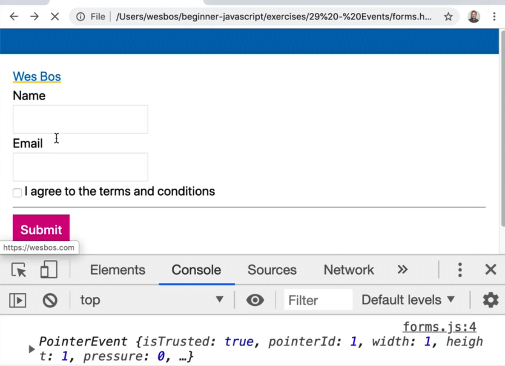
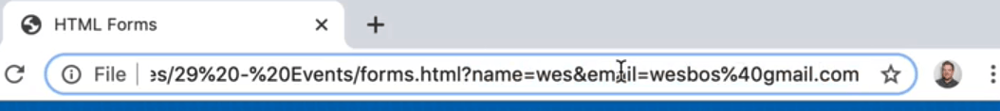
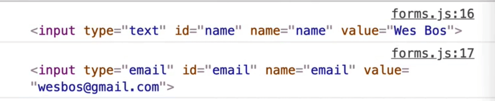
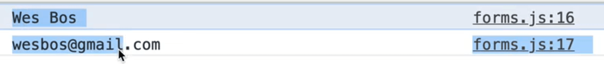

In this video, we are going to dive into the `preventDefault()` method that exists on the event (which you will likely use all the time) and working with forms.

Working with forms, inputs, clicks and hovers will likely be things you spend a lot of time working with in JavaScript.

In our `/29 - Events` directory, we have a `forms.js` and `forms.html` file. The JavaScript file should be empty.

Add a log of it works and refres hthe forms page.


## preventDefault method

There are a few HTML elements that have default functionality when they are used.

Let's say you have an link to an html page, like so 👇

```html
<a class="wes" href="https://wesbos.com">Wes Bos</a>
```

When you click the link, it takes us to the `href`, like we would expect.

Now you we can do is stop the default action of the browser and instead handle the event with JavaScript.

In the JS file, select the link and then listen for a click on it, like so 👇

```js
const wes = document.querySelector(".wes");

wes.addEventListener("click", function(event) {
  console.log(event);
});
```

When you click the link, you will see the event in the console for a split second before you are redirected to the next page.



_**Helpful Tip**: If you need to log something but you are being redirected and the console is being cleared, you can click the "cog" icon in the chrome dev tools and check on "preserve log" to not clear the console when you navigate to another page._

So the default of a link is to change the page, however if you call `event.preventDefault()` within the event listener, it will prevent the default thing from happening. In this case, the link will not redirect us.

Let's do an example where before we redirect the user, we first wanted to ask them for some information.

se `confirm` to confirm the redirect before you redirect them, like so 👇

```js
wes.addEventListener("click", function(event) {
  console.log("YOU CLICKED IT");
  event.preventDefault();
});
```


Now when you refresh the page and click the link, you will get an alert asking you if you wish to proceed.

If you select OK, the console will show true which is the value of `shouldChangePage`.

Move the `preventDefault` call to the top of the anonymous function.

That allows you to conditionally redirect the user based on the value of `shouldChangePage`, like so 👇

```js
wes.addEventListener("click", function(event) {
  event.preventDefault();
  const shouldChangePage = confirm(
    "This website might be malicious! Do you wish to proceed?"
  );

  if (shouldChangePage) {
    window.location = event.currentTarget.href;
  }

  console.log(shouldChangePage);
});
```

`event.currentTarget.href` will give you the value of the href attribute which is the url you need to redirect the user to manually.

Now when you click the link, and hit okay in the alert dialogue that comes up in the browser, you will be redirected.

If you were to hit "Cancel" rather than OK, you would not be redirected.

Another way you could achieve the same thing is if you moved `event.preventDefault()` like so, 👇

```js
wes.addEventListener("click", function(event) {
  const shouldChangePage = confirm(
    "This website might be malicious! Do you wish to proceed?"
  );

  if (!shouldChangePage) {
    event.preventDefault();
  }

  console.log(shouldChangePage);
});
```

Now `preventDefault` will only be called if the user does not click okay, in which case you do not want to redirect the user which `preventDefault` will prevent from happening.

This gives us the exact same functionality, but this time you don't need to touch `window.location`.

What other sort of defaults are there on a page?

Another common one is submitting a form element.

Let's add a name attribute to the form.

The best way to select a form via JavaScript is to give it a name, rather than a class.

Call this form `signup` and select it in our JavaScript.

If you want to select an element by it's name in JavaScript, you use an attribute selector. This is standard in CSS as well.

```js
const signupForm = document.querySelector('[name="signup"]');
```

Take the sign-up form and add an event listener. However, instead of listening for a click, listen for a `submit` event.

When someone submits a form, the event will fire and give you access to the form, like so 👇

```js
signupForm.addEventListener("submit", function(event) {
  console.log(event);
  event.preventDefault();
});
```

Now if you put your name and email and click submit, you will see in the url the form values that you entered as parameters



More often than not, you don't want to submit the form to the server but you often want to stop the form from submitting, grab those details with JS and continue.

_Note: When Wes is working with forms, he often gives the form inputs a default value so he doesn't have to keep entering the values every time he wants to test it. You can do the same by modifying your email and name inputs to have attributes such as `<input type="text" id="name" name="name" value="Wes Bos">`._

Now when you submit the form, nothing is happening, you just see the event logged.

What you can do now is check whether the terms and conditions have been checked.

You could just put a required attribute on the input boxes like so `<input required type="checkbox" id="agree" name="agree">`.

Now if you were to refresh and try to submit, you would see this little zerror.


In some cases however you want to do extended validation.

For example maybe you want to make sure the person's name is not Chad.

To do that you would do the following:

Grab the name input from the form.

Within the listen, add the following log to the listener so you can see what you are working with, as  shown below 👇

```js
console.dir(event.currentTarget);
```

Hit submit in the form. You should see something similar to what is shown below.


You might notice that there are properties inside of the form object with each of input names.

There is a name `property` and a 1 property.


There are two ways you can  grab the fields from the form.

You can do the following 👇

```js
signupForm.addEventListener("submit", function(event) {
  event.preventDefault();
  console.log(event.currentTarget.name);
  console.log(event.currentTarget.email);
});
```



Now add `.value` to both of those inputs like so 👇

```js
console.log(event.currentTarget.name.value);
console.log(event.currenTarget.email.value);
```



That will give you the actual values that are in the input boxes.

The reason why those are available to us is because the inputs have a name attribute on them.

One has a name of `name` and the other of `email`. There is also one with `agree`.

With a checkbox, you don't use `.value`, you would use `.checked` like so 👇

```js
console.log(event.currentTarget.agree.checked);
```

That will return true depending on whether it is checked or not.

That is the easiest way to get the inputs off a form.

However you could have also done something like below 👇

```js
event.currentTarget.querySelector('[name="email"]');
```

However there is no reason to actually run `querySelector` if you are using proper names.

That is a good reason to have valid semantic HTML by giving your inputs proper names.

Now put the name input value in a variable and check whether it contains the name Chad.

```js
signupForm.addEventListener("submit", function(event) {
  const name = event.currentTarget.name.value;
  if (name.includes("chad")) {
    alert("Sorry bro");
    event.preventDefault();
  }
});
```

Now if you refresh the page and enter the name wes in the form and hit submit, the page will refresh and the form will submit.

However if you change the name to Chad, you will see an alert and the form will not submit.

_Aside: You might notice that even if you entered the name Chad with an uppercase C, it still works. That is because a string.includes() is not case sensitive. If you want it to be case sensitive, you have to use a **regex** which is something we will cover in the future._

## Other Types of Events with Form Inputs

You have `keyup`, `keydown`, `focus`, `blur` and a whole bunch of different types.

Take the signup form name input, and add an event listener that listens to the keyup event.

Make a function called `logEvent` which takes in one parameter which will be named `event`. Inside of the function, log `event.type.`.

```js
function logEvent(event) {
  console.log(event.type);
}

signupForm.name.addEventListener("keyup", logEvent);
```

Now when you type anything in the name field, you will see `keyup` getting called many times in the console.

You can also log the `event.currentTarget.value` to get what the user has typed into the input.


This is useful if for example you don't want to allow certain numbers or letters being used in the input, you can simply just prevent the default from happening. You would do that on the `keydown`.

Duplicate the `keyup` event listener and paste it right below and modify the event to `keydown` like so, 👇

```js
signupForm.name.addEventListener("keydown", logEvent);
```


This logs the `keydown` event and the `keyup` event.

The keydown event will tell us what the user had in the input, whereas the `keyup` event will tell us what the value is.

There is also `focus` and `blur`.

Those are events that happen when you focus into an input and when you focus out of it.

The same goes with tabbing, it will trigger a focus and blur event as you go between inputs.

That can be used for showing styling, or recording info like how long people spend on specific inputs.


There are some more events on form elements that we will get into in the future but those are the ones that Wes finds himself using the most often.
