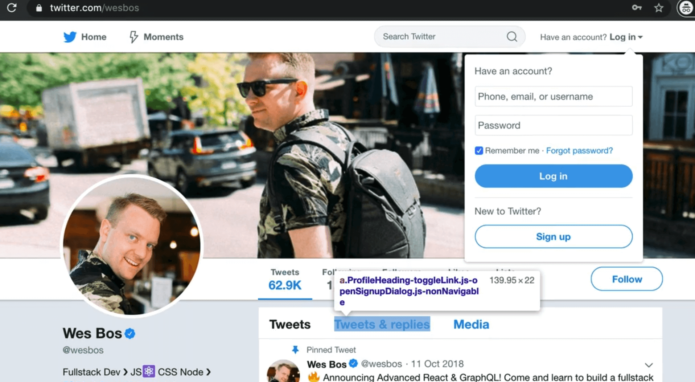
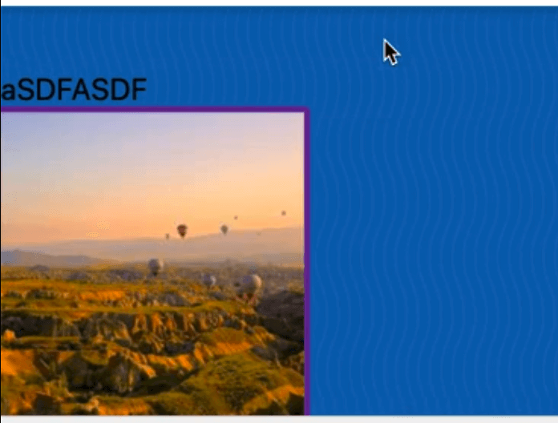

Making a website accessible means that you are making it usable to everyone and anyone, regardless of what disability they may have, or what input device they are using, or what situation they are currently in.

If HTML is marked up correctly, it will be accessible.

However, what often happens is JavaScript developers will often add code that only  works with the mouse for example, and therefore aren't accessible to anyone.

In this video, we will cover the common pitfalls that happen in JavaScript.

Most accessibility goof-ups happen not because someone is purposely trying to prevent a certain type of user from accessing the website.

They are typically accidental and the developer just did not know what to look for or check to ensure it's still accessible.

## Difference between Buttons and Links

The difference between buttons and link is a big accessibility issue.

Buttons are meant to be used for actions that happen inside of an application.

Links on the other hand are used to change the page.

Do not mix those up. Links are not meant to be used where buttons are.

Wes sees code like this all the time 👇

```js
<a href="#">Save</a>
```

Then the developer will add a click event via JavaScript to the a tag and `preventDefault`, and then perform some sort of action.

However, that is not a use-case for a link because that "Save" click doesn't redirect you to anywhere, and thus is not a link.

That is a good use case for a button (an action within your application or website).

It's still fine to prevent default on a specific link.

For example, on Twitter, if you try to click "tweets and replies" while not logged in, you will see a modal popup saying "You are not logged in".



That is an example of a valid use case for using prevent default with a link.

When you need to do something, don't mix up buttons and links.

## Keyboard Accessibility

Elements that are not keyboard accessible should not have clicks registered on them, unless you need to.

For example, let's say you have an image like so:

```js

```

Via JavaScript, select the photo and add a click event listener.

```js
const photo = document.querySelector(".photo");

photo.addEventListener("click", function() {
  console.log("you clicked the photo");
});
```

There are plenty of valid use cases for clicking on a photo.

For example, maybe it will open up a larger version of that photo, or you want to draw on the photo or zoom it in.

If you refresh the HTML page and click on the photo, you will see "You clicked the photo" logged every time you click it.

If you threw your mouse away, using the tab button on your keyboard, you should be able to tab through everything on the browser.

However, you will not be able to click on the photo with only the keyboard.

That is a problem because if the user doesn't have a mouse or they are unable to use a mouse, then they can't use that part of your website.

An easy solution is giving the element the following attribute: `role="button"`.

If you mean for something to be a button that is not a button tag, such as a div, if you mean for it to be used like a button, you should add the role attribute like so 👇

```html
<div role="button" tabindex="0">click me</div>
```

You also need to add the `tabindex` attribute when you add the `role="button"`.

You will likely set that to 0, which will put that element in the flow so people can tab to it with their keyboards.

For the image, you could give it a role of button, but it's easier to put the image actually inside a button, like so 👇

```html
<button>
  
</button>
```

If you modified the code like so instead, like so 👇

```html
<div role="button" tabindex="0">Click me</div>

```

Now if you tab using your keyboard, you can go back and forth between the image and the div with button role.



If you focus on the image like shown above and hit the enter key, unlike some other buttons and elements, it will not trigger a click.

If that is the case, you have to go back to your JavaScript and move the anonymous function that you pass to the click event listener and make it named function.

Modify the click event listener to call `handlePhotoClick` instead and then duplicate the event listener and add another listener but on the `keyup` event this time, like so 👇

```js
function handlePhotoClick() {
  console.log("you clicked the photo");
}

photo.addEventListener("click", handlePhotoClick);
photo.addEventListener("keyup", handlePhotoClick);
```

Now, when you go to the image, you can click on over to it.

You might notice that when upi tab to the image, the console is logging "You clicked the photo", even though you haven't actually clicked it yet (we only care about the enter key).

How can you only listen for the enter key?

The event has a bunch of information about this.

The event object should have `event.key` and `event.keycode`. `event.key` is more modern and supported in more browsers.

Every single key on an event will give you a bunch of information.

Wes has a website, http://keycode.info, on which you can press any key and it will give you the meta information about that key.


There is `event.key`, `event.which`, `event.code` and `event.key`. `event.key` is the best way to go about it.

Now what we can say is if the event is a click or if the `event.key` equals enter like so: 👇

```js
function handlePhotoClick(event) {
  if (event.type === "clicked" || event.key === "Enter") {
    console.log("you clicked the photo");
  }
}
```

Now if you try tabbing and then pressing enter when on the image, you will see "You clicked the photo" logged, meaning it is accessible.

Accessibility is something that people tend to forget about, but it only takes about 10 minutes of work to ensure it's accessible.
