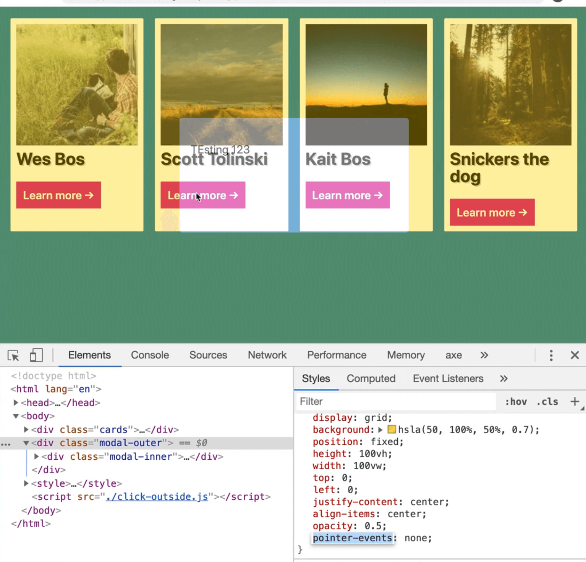
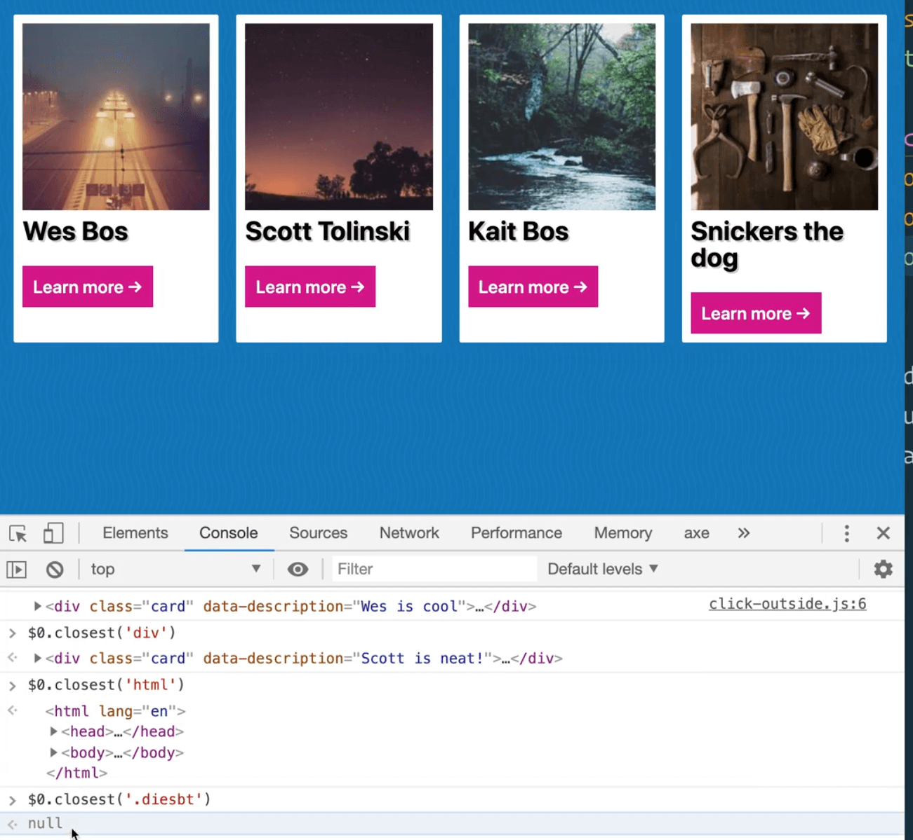
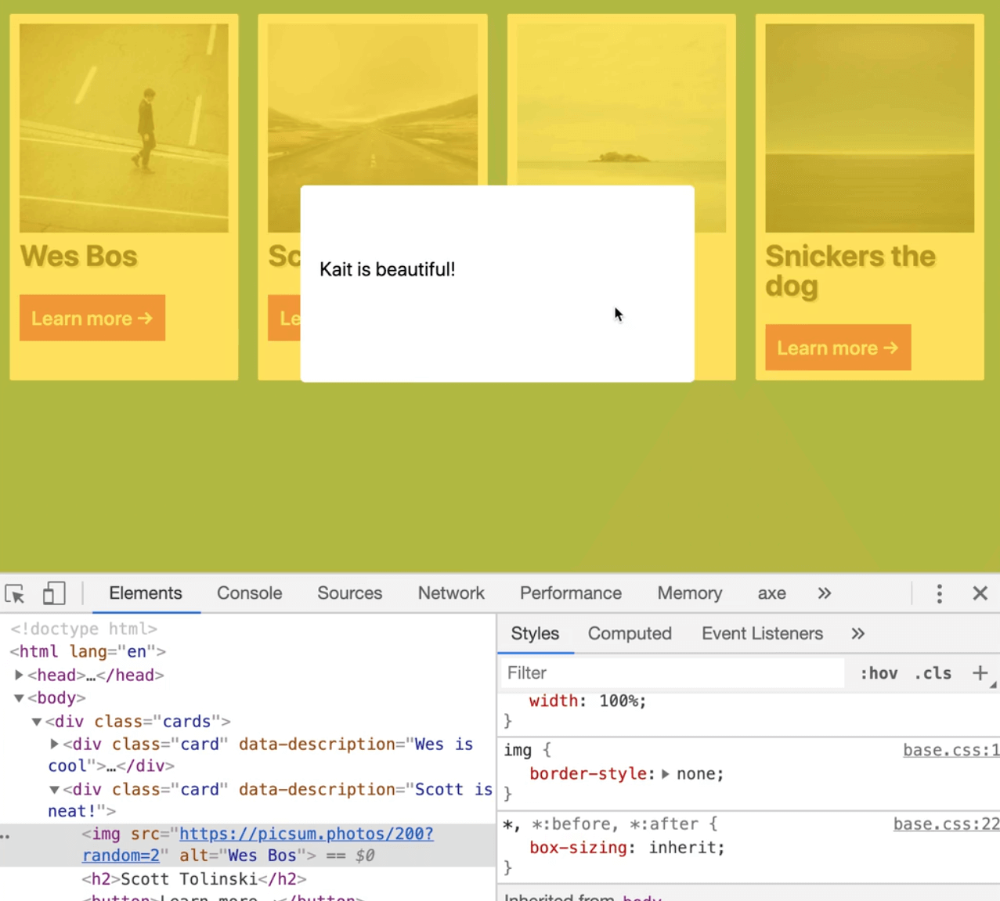
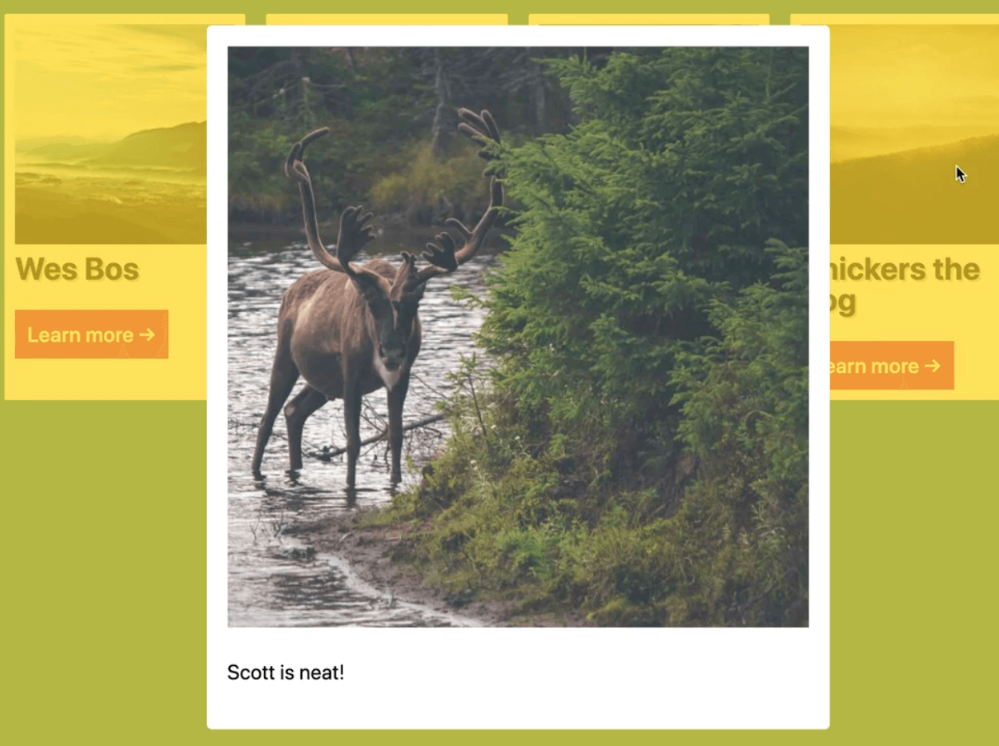
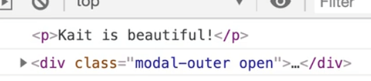
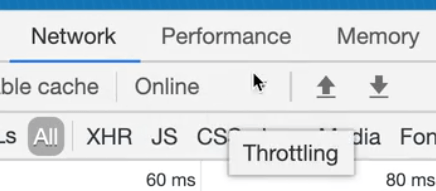
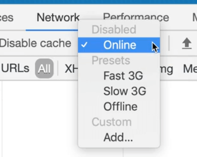

In this lesson we are going to learn how to check whether you clicked outside an element, which kind of tough.

Let's look at the HTML we will be working with.


```html
<body>
  <div class="cards">
    <div class="card" data-description="Wes is cool">
      
      <h2>Wes Bos</h2>
      <button>Learn more →</button>
    </div>
    <div class="card" data-description="Scott is neat!">
      
      <h2>Scott Tolinski</h2>
      <button>Learn more →</button>
    </div>
    <div class="card" data-description="Kait is beautiful!">
      
      <h2>Kait Bos</h2>
      <button>Learn more →</button>
    </div>
    <div class="card" data-description="Snickers is a dog!">
      
      <h2>Snickers the dog</h2>
      <button>Learn more →</button>
    </div>

  </div>

  <div class="modal-outer">
    <div class="modal-inner">
    </div>
  </div>

  <script src="./click-outside.js"></script>
</body>
```

As you can see, each card has a random image, an `h2` and a button that says "learn more".

Let's add the following CSS 👇

```html
<style>
  .cards {
    display: grid;
    grid-template-columns: repeat(auto-fit, minmax(200px, 1fr));
    grid-gap: 20px;
    padding: 2rem;
  }

  .card {
    background: white;
    padding: 1rem;
    border-radius: 2px;
  }

  .card img {
    width: 100%;
  }

  .card h2 {
    color: black;
  }
</style>
```


That looks good.

Moving onto the modal, add some dummy content inside of it so when we style it we can visualize what it will look like.

```html
<div class="modal-outer">
  <div class="modal-inner">
    <p>Testing 123</p>
  </div>
</div>
```

As you can see, there are two nested divs each with a class of`modal-inner` or `modal-outer`.

Go ahead and style the modal in the on position and then we will turn it off with CSS. 👇

```css
.modal-outer {
  display: grid;
  background: hsla(50, 100%, 50%, 0.7);
  position: fixed;
  height: 100vh;
  width: 100vw;
  top: 0;
  left: 0;
  justify-content: center;
  align-items: center;
}

.modal-inner {
  max-width: 600px;
  min-width: 400px;
  padding: 2rem;
  border-radius: 5px;
  min-height: 200px;
  background: white;
}
```


Now you have this modal which will pop up and you want to be able to close it.

Let's just do a really quick example to demonstrate how this works.

We need to hide the modal by default.

There are LOTS of different ways you could do that, such as `display: none`, `visibility: hidden`, or something that Wes likes to do is give it an `opacity:0`, which won't cut it in our case.

That is because even if you did give the modal an opacity of 0, you will see that the modal will prevent the other elements from being clicked like that buttons.

That is because the `modal-outer` is actually still there, even if you give it an opacity of zero.

What you can do is give `modal-outer` a pointer event of none like so 👇

```css
.modal-outer {
  display: grid;
  background: hsla(50, 100%, 50%, 0.7);
  position: fixed;
  height: 100vh;
  width: 100vw;
  top: 0;
  left: 0;
  justify-content: center;
  align-items: center;
  /* hide this modal until we need it */
  opacity: 0;
  pointer-events: none;
}
```

That tells the browser to just ignore that any events that come to that and to not capture them.

That is an example of where JavaScript and CSS work together.

Now if you refresh the page and give `modal-outer` an opacity of .5, in the dev tools, you will see that the modal outer is still there but you will see how the buttons underneath can still be clicked and the events aren't being captured by `modal-outer`.



When the modal has a class of open, set the opacity to 1 and the pointer events to all.

```css
.modal-outer.open {
  opacity: 1;
  pointer-events: all;
}
```

If you go into the dev tools and give `modal-outer` a class of `open`, it will show up.


Let's add a transition to make that look a bit smoother. 👇

```css
/* hide this modal until we need it */
opacity: 0;
pointer-events: none;
transition: opacity 0.2s;
```

Now if you refresh the page, grab the modal outer in the dev tools and give it a class of open, it will fade itself in, and then fade itself out.

Now let's get into the JavaScript.

We will work on clicking the button on each card now, starting by selecting them.

Then we will loop over each of the buttons and add an on click event listener to each one and pass a function as the handler called `handleCardButtonClick`.

```js
const cardButton = document.querySelectorAll('.card button');
cardButtons.forEach(button => button.addEventListener('click', handleCardButtonClick))
```

Above that code, go ahead and create that function.

For now, just log "YA CLICKED IT" when the button is clicked.

```js
function handleCardButtonClick() {
  console.log('YA CLICKED IT');
}

const cardButton = document.querySelectorAll('.card button');
cardButtons.forEach(button => button.addEventListener('click', handleCardButtonClick))
```

If you refresh the page and try to click on the buttons, you will see the log in the console.

Next you need to grab something to show in the modal.

Let's grab the `data-description` of the parent card and show a larger version of the image.

To do that, grab the current target from the event and assign it to the variable `button`.

```js
const button = event.currentTarget
```

## closest method

Now you need to find the card that is associated with the button.

You could do `button.parentElement`, but if the button were to ever more or be nested inside of something, that wouldn't work that well.

What you can do is take the button and run the `.closest` method and search.

It works kind of like `querySelectorAll` for the closest card.

```js
function handleCardButtonClick(event) {
  const button = event.currentTarget;
  const card = button.closest('.card');
  console.log(card);
}
```

Now when you click each card's button, you will see the card logged to the console.

What is great about using `closest` like we did is you can take any element, such as one of the `h2` elements on the card and search for the closest div, the closest HTML element.

If there is something that does not find (like `$0.closest('.doesnotmatch')`) it will return `null` because there is no parent of it.



`.closest()` is like `querySelectorAll`, except it is the opposite where it will climb up the nested tree of DOM elements instead of look down the DOM tree.

We are going to use it once more within this handler.

Grab the image source.

```js
function handleCardButtonClick() {
 const button = event.currentTarget;
  const card = button.closest('.card');
  // grab the image src
  const imgSrc = card.querySelector('img').src;
  console.log(imgSrc);
}
```

If you refresh the page and click on the buttons, you should see the image source logged to the console.

Now, grab the description from the data attribute on the card, like so 👇

```js
const desc = card.dataset.description
```

Add a log as well to make sure it is working.

Now when you refresh the page, and click the buttons, you should see the descriptions logged to the console.


Next you can populate the modal with the card's info.

Grab the modal above the `handleCardButtonClick` method so you do not need to reselect it every click.

```js
const cardButtons = document.querySelectorAll('.card button');
const modalInner = document.querySelector('.modal-inner');

function handleCardButtonClick(event) {
  const button = event.currentTarget;
  const card = button.closest('.card');
  // Grab the image src
  const imgSrc = card.querySelector('img').src;
  const desc = card.dataset.description;
 }
```

Also select the name 👇

```js
const name = card.querySelector('h2').textContent;
```

Within our handler, set the innerHTML of the modal using backticks.

You want to replace the 200 value in the image sources with 600. Use the name as the alt attribute value.

```js
modalInner.innerHTML = `
  
  <p>${desc}</p>
`;
```

Next you want to show the modal.

To do that, select the `modal-outer`, which you can do right above or below where you selected `modal-inner`.

```js
const cardButtons = document.querySelectorAll('.card button');
const modalOuter = document.querySelector('.modal-outer');
const modalInner = document.querySelector('.modal-inner');
```

At the bottom of the handler function, add `modalOuter.classList.add('open');` to show the modal.

```js
function handleCardButtonClick(event) {
  const button = event.currentTarget;
  const card = button.closest('.card');
  // Grab the image src
  const imgSrc = card.querySelector('img').src;
  const desc = card.dataset.description;
  const name = card.querySelector('h2').textContent;
  // populate the modal with the new info
  modalInner.innerHTML = `
    
    <p>${desc}</p>
  `;
  // show the modal
  modalOuter.classList.add('open');
}
```

If you refresh the page, you will see that it works.



The image is also there, it is just spilling out so let's fix the CSS.

Add the following to the style tag

```css
.modal-outer img {
  width: 100%;
}
```


Good, now you have the bare bones of a modal.

The other thing we need to talk about is closing the modal.

Obviously we could have a function called closeModal which would take the `modalOuter` an remove `open` from the classList, like so 👇

```js
function closeModal() {
  modalOuter.classList.remove('open');
}
```

But how do we code it so that the modal closes when you click outside of it, and not on the text or the image or anything like that?



We can solve this using a technique called **click outside**.

What we will do is take the `modalOuter` and listen for a click on it.

When that happens, take a look at the event, like so 👇

```js
modalOuter.addEventListener('click', function(event) {
  console.log(event);
})
```

Now when you click outside the modal on `modalOuter`, you will see the click event logged.


Next log the `target` and `currentTarget` of the event.

```js
modalOuter.addEventListener('click', function(event) {
  console.log(event.target);
  console.log(event.currentTarget);
})
```



You might think this would be simple to solve because you can just check if the `modalOuter` and the `currentTarget` are the same thing, then tiy can go ahead and close it.

But in the real world, modals are usually more complex than that. Sometimes they have elements on the outside, sometimes you want to listen for clicks on specific things.

What you can do is use the `closest()` method to see if you are clicking inside of `modalInner` at all.

Make a variable called `isOutside` as assign it to the value of `e.target.closest('.modal-inner')`. Log the value of `isOutside`.

```js
modalOuter.addEventListener('click', function(event) {
  const isOutside = event.target.closest('.modal-inner');
  console.log(isOutside);
})
```

How that works is if you click on the modal or anywhere inside of it, it will find `modalInner`.

However, if you click on something that is outside of the inner or a close button or something, it won't be able to find anything.

So what you can do is convert the `closest()` to a boolean true or false by putting a bang in front of it like so

```js
const isOutside = !event.target.closest('.modal-inner');
```

If it finds something it will be false, and if it doesn't finds something it will be true.

That gives us a nice boolean we can use like so, 👇

```js
modalOuter.addEventListener('click', function(event) {
  const isOutside = event.target.closest('.modal-inner');
  if (isOutside) {
    closeModal();
  }
})
```

If you refresh the page now, it should work.

Let's hook up the escape key really quickly.

```js
window.addEventListener('keydown', event => {
  console.log(event);
  if (event.key === 'Escape') {
    closeModal();
  }
});
```

That is it for the lesson, now Wes will just demo some cool stuff.

Add the following style to `modal-inner` 👇

```css
.modal-inner {
  max-width: 600px;
  min-width: 400px;
  padding: 2rem;
  border-radius: 5px;
  min-height: 200px;
  background: white;
  transform: translateY(-200%);
  transition: transform 2s;
}
```

Now the modal is way off the screen, above the browser.

The transition will animate the transform over two seconds.

When the `modalOuter` has a class of `open`, you want to grab `modalInner` and change the transform to be 0 so it goes back to where it should be. 👇

```css
.modal-outer.open .modal-inner {
  transform: translateY(0);
}
```

Now if you refresh the page and try clicking on the buttons, you will see how it animates in now.

However, you may notice that the transition is a bit jerky and not completely smooth.

 22:17

What is happening there is the image isn't loading immediately.

There are a couple of things we can do to fix that.

In `handleCardButtonClick`, set the width and height inline attribute on the image you set within the `modalInner.innerHTML` like so 👇

```js
modalInner.innerHTML = `
  
  <p>${desc}</p>
`;
```

If you refresh the page, you should notice it's much smoother because the image is loading as it animates in.

What about if you had a slower network, would it still look smooth?

You can test this by going into the dev tools.

Go to the network tab and click the dropdown arrow next to "Online"





Select Fast 3G.

That option looks good but it is not perfect.

The other option would be to use `document.createElement` to create an image and wait for that image to load.

You would listen for the load event on the image and then run the `modalOuter.classList.add('open')` line of code.

When someone clicks it you could show a spinner for a second as you wait for the image to load and then when it's loaded you can put it in.

Personally Wes doesn't like that option because he doesn't think it is a smooth user experience. The user is just sitting there waiting for the image to load when they could be reading the text.
