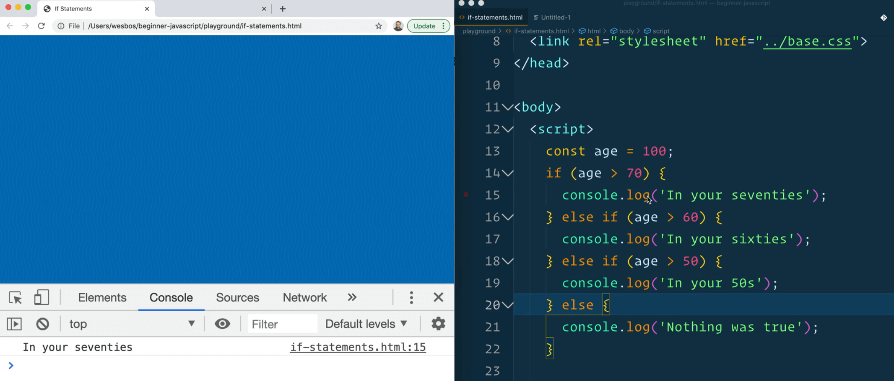
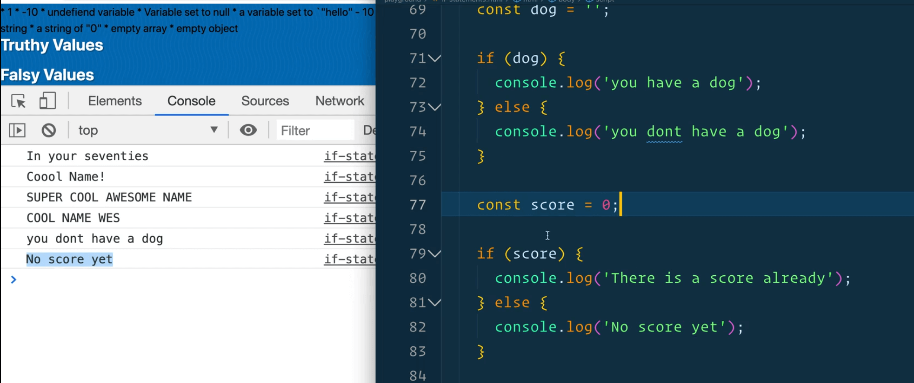
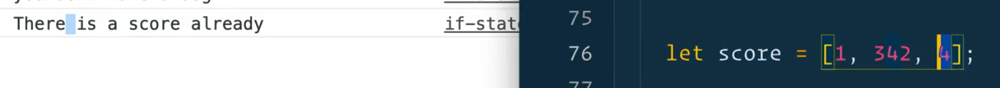
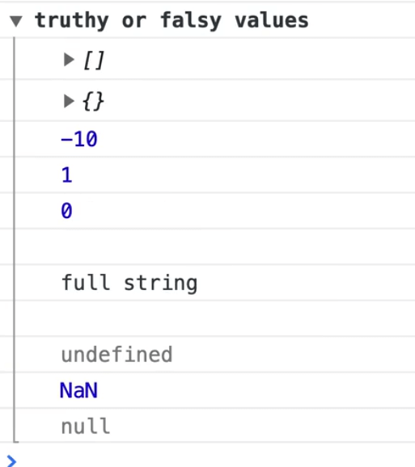
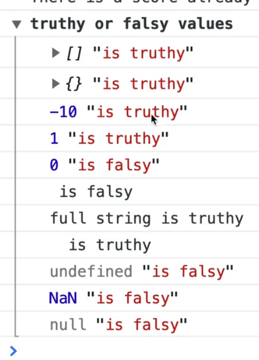

**If Statements** are the foundation of all logic in JavaScript. They expect **booleans**, which are always either true or false, or they expect some sort of condition that is evaluated to **true or false** or **truthy and falsy**.

First let's go over the mechanics of if statements using greater or less than operators, and then we will dive deeper into the other operations.

At it's most basic, an if statement can look like the following 👇

```js
if (10 > 2) {
  console.log('Yep');
}
```

The code above is saying if 10 is greater than 2, log "Yep" to the console.

The entire if statement is `if (10 > 2) { console.log('Yep`); }`

The code within the parenthesis following the if statement, `(10 > 2)`, is what is referred to as the **condition**.

The condition is going to be evaluated to true or false. By evaluated, what we mean is that if you were to run that in the console (`10 > 2`) it would evaluate to true or false.

There are the curly brackets which are opening and closing the block `{}`. Any code that needs to happen when the condition is true need to go within the block.

You can also add an else if like so 👇

```js
if (10 > 2) {
  console.log('Yep');
} else if (11 > 10) {
  console.log('Yep');
}
```

You can also chain these "else ifs" as many times as you want.

However, if the first one is true, even if the later ones are also true, they will never run.

```js
if (10 > 2) {
  console.log('Yep');
} else if (11 > 10) {
  console.log('Yep');
} else if (3 > 1) {
  console.log('Yep');
}
```

Although all 3 conditions above 👆 are true, the 2nd and 3rd blocks will never run because the first condition evaluates to true and runs.

An if statement will look for the first condition that evaluates to true and then it only runs that block, it will skip the rest.

If you wish to check for whether multiple things are true, you'd have to have 3 separate if statements rather than one big if else statement, like so 👇

```js
if (10 > 2) {
  console.log('Yep');
}

if (11 > 10) {
  console.log('Yep');
}

if (3 > 1) {
  console.log('Yep');
}
```

Additionally, if nothing is matched, you can chain a `else{}` onto the if statment like so 👇

```js
if (age > 70) {
  console.log('In your seventies');
} else if (age > 60) {
  console.log('In your sixties');
} else if (age > 50) {
  console.log('In your 50s');
} else {
  console.log("nothing was true");
}
```

"nothing was true" will be logged if `age` is less than 50.

Notice that the `else` statement does not have parenthesis `()` like the if and else if statements.

That is because else never has a condition.

It is a "catch-all" which runs if none of the conditions are true. It's similar to the default that we learned about in the switch statement.

Take the following code 👇

```js
const age = 100;
if (age > 70) {
  console.log('In your seventies');
} else if (age > 60) {
  console.log('In your sixties');
} else if (age > 50) {
  console.log('In your 50s');
} else {
  console.log("nothing was true");
}
```

If you run that in the console, what would you see?

You should see "in your seventies".



Even though that the rest of the conditions are true, because the first condition is true, none of the other conditions are evaluated or run.

That is important to keep in mind if you're working with multiple things that could be true.

You need to be aware of the order of which you check your if statements.

Now let's discuss if statements inside of a function, which is likely something you will come across and use to return different values.

```js
function slugify(sentence, lowercase) {
  if (lowercase) {
    return sentence.replace(/\s/g, '-').toLowercase();
  } else {
    return sentence.replace(/\s/g, '-');
  }
}
```

We have this `slugify` function shown above 👆, which takes in a sentence and a boolean (which will be true of false depending on whether you want to lowercase it or not), and then we return that sentence but call the `.replace()` method on it.

You may be wondering about this line of code 👇

```js
sentence.replace(/\s/g, '-').toLowercase();
```

This is a **regex**, which stands for **regular expression**.

A regular expression is a way to match characters in a string. It always starts and closes with a forward slash `/` and then you type in different characters.

In our case, we want to pass the space character which is `\s`.

`g` stands for global, which means find them all, not just the first one.

Then we replace it with the dash and call `toLowercase`.

```js
slugify('I am very cool');
```

If you open the HTML page in a browser and run the code above in the console, it will return "I-am-very-cool".

It puts dashes where spaces were.

If you were to run that same code but pass a second argument of `true`, it will lowercase the sentence as well and return "i-am-very-cool".

Some developers prefer to keep as much logic out of the brackets as possible because if you delete one by accident, it takes a long time to debug.

What you can do is simplify the code by getting rid of the else statement and run the code like this 👇

```js
function slugify(sentence, lowercase) {
  if (lowercase) {
    return sentence.replace(/\s/g, '-').toLowercase();
  }

  return sentence.replace(/\s/g, '-');
}
```

If you try calling `slugify('I am very cool')` again from the console, it will return the same thing.

The reason for that is because of the return keyword within the `if (lowercase)` block.

What does **return** mean?

It means to return a value from a function, and stop that function from running.

Whenever you return from a function, even if it's inside of an if statement, that function will stop running and the code that was is within the else will never be reached. So rather than having an if else, we can have an if and then the else is assumed by putting it after the if condition. This is just personal preference, both approaches are completely valid.

There is so many different ways we could have coded this function.

This is also a valid approach 👇

```js
function slugify(sentence, lowercase) {
  let slug  = sentence.replace(/\s/g, '-');

  if (lowercase) {
    slug = slug.toLowercase();
  }

  return slug;
}
```

Shown above 👆, we have have assigned the slug variable and then based on whether to lower case or not, we update the slug variable and return it.

You could also do 👇

```js
function slugify(sentence, lowercase) {
  let slug  = sentence.replace(/\s/g, '-');

  if (lowercase) {
    return slug.toLowercase();
  }

  return slug;
}
```

The last two approaches are better because we don't have to duplicate the regex in two places.

## Operators

We talked briefly about the different equal signs (`=`, `==`, `===`).

As a refresher, if you open the html page in the browser and try to type `age = 100;` in the console, you will get an error like the following 👇


The code is erroring out because the single value will set the value of the variable, and `age` is a const variable, so you cannot do that.

```js
age == 100;
```

If you try the code above 👆, it will return true.

That is because double equals `==` will check that the values are the same. So the value of `age` is 100, and the value of what we are comparing it against is 100.

The gotcha with the double equal signs is that if you were comparing it against another value, such as `age == '100'` for example, it will return true because they are technically the same value even though they are not the same type!

Using `===` will check if both the type AND the value of the `age` match `100`.


Because of that, you should almost always use `===`.

If that is the case, you may be wondering what is the purpose of having `==` in the language at all?

Because of `null` and `undefined`.

Sometimes you want to check if a variable is null or undefined.

`null === undefined` will return false.

`null == undefined` will return true.

Although that is the case, Wes has almost never had to use the `==` in his career because of something called **truthy** or **falsy**.

We also have does not equal which is the *bang* (`!` is referred to as a bang in programming) and equals sign.

```js
name !== 'keith'
```

If you had a `name` variable that was equal to 'wes', if you tried the code above in the console, it would return false.

You can also do `!=`.

For example 👇

```js
10 !== '10' // returns true
```

```js
10 != '10' // returns false
```

That is because 10 and '10' are different types, but the double equals ignores the type.

There is also greater than and less than.

You could check for example if `10 > 10` which would return false.

You can do `10 >= 10` which would be true.

Some people get confused and think you may need to use double equals when comparing greater than or equal or less than or equal (like `10 >== 10`, however that is not correct.

Why?

Because the greater than and less than operators only ever deal with numbers. If you accidentally use a string, it will turn the string into a number at first but you shouldn't be doing that.

Wes always tells people to think of the greater than and less than sign as a hungry alligator. That is how he remembers it.

Is the hungry alligator pointed to the largest number? Then that is true.
However, if the hungry alligator is pointing to the smaller number than it's false.

Additionally there are "and" and "or" operators.

Go back to the `if-statements.html` file.

Within the function, let's add code to check if the person's name is scott because that is also a cool name. We could use the `or` operator like so 👇

```js
if (name === "wes" || name === "scott") {
  console.log("Cool name!");
}
```

The `or` operator is comprised of two **pipes** like so: `||`.

You would read that code like so:

If the name is equal to wes, OR the name is equal to scott, log "cool name".

Now let's say you also wanted to check if the first name was "wes" and the last name was "bos".

In that cause, you wouldn't use the or operator `||`, you would use the and operator `&&` instead, like so 👇

```js
if (name === 'wes' && last === 'bos') {
  console.log("cool name);
}
```

You can also use **BEDMAS** here, like so 👇

```js
if (name === 'scott' || (name === 'wes' && last === 'bos')) {
  console.log('Cool name!);
}
```

What this code will do is it will check the parenthesis. Name must equal "scott" and last name must equal "bos" for the statement to return true.


When you use the and operator, if any one of the conditions is false, then the entire thing will evaluate to false.

However, when you use the `||` operator, if any of the conditions are true, it will always be true.

Next we will talk about using functions with if statements. This is fairly common.

```js
'awesome'.includes('wes')
```

If you had a string like `'awesome'` and you wanted to check if it contains the word wes you could use the code above which would return true.

```js
'awesome'.includes('scott')`
```
You could also run the code above 👆 which would return false.

You can use that directly in an if statement like so 👇

```js
const name = 'wes';

if ('awesome'.includes(name)) {
  console.log('SUPER COOL AWESOME NAME');
}
```


Pretty often you have methods that return true or false and often you can use those directly inside an if statement.

You can also put them in their own variable to make it easier to read like so 👇

```js
const isAwesomeName = 'awesome'.includes(name);

if (isAwesomeName) {
  console.log('SUPER COOL NAME');
}
```

Sometimes when you are working with a lot of conditions and a long if statement, it can make the code easier to read and follow if you break it up into multiple variables.

Similarly you can make our own functions that return true or false and then use it, like in the example below 👇

```js
function nameIsAwesome(name) {
  return 'awesome'.includes(name);
}

if (nameIsAwesome('wes')) {
  console.log('COOL NAME WES');
}
```

## Truthy or Falsy

Next there is the concept of **truthy** and **falsy**.

Wes has said earlier that if statements require a boolean but that isn't completely true because they will also accept truthy and falsy values.

For example if you have the following code 👇

```js
const dog = 'snickers';

if (dog) {
  console.log('You have a dog');
} else {
  console.log("You don't have a dog");
}
```

If you run that in the browser, you will see "You have a dog" logged in the console.

```js
const dog = '';
```

However, if you were to change the `dog` variable declaration to leave it empty as shown above 👆,what would happen?

You would see "you don't have a dog"!

Why is that?

An empty string is not true, and it's not false. It's an empty string.

So how come that if statement works?

That is because if statements will take in number of different values and it will try to **coerce** them (turn them) into a boolean of true or false.

Values that are truthy or falsy will also work.

So what are examples of values that are truthy or falsy? Here is a list.

### Truthy or Falsy values

 * 0 // falsy
 * 1 // truthy
 * -10 // truthy
 * undefined variable // falsy
 * Variable set to null // falsy
 * a variable set to `"hello" - 10` NaN // falsy
 * empty string // falsy
 * full string // truthy
 * a string of "0" // truthy
 * empty array // truthy
 * empty object // truthy

`0` (the number zero) is a falsy value because it will equate to false.

Here is a quick example to demonstrate that 👇

```js
const score = 0;

if (score) {
  console.log('There is a score already');
} else {
  console.log('No score yet');
}
```

If you refresh the HTML page, you should see "no score yet" in the console. Why? Because 0 equates to false.



`1` (the number one) is a truthy value.

```js
const score = 1;
```

If we were to change the `score` variable from the example to be 1 as shown above 👆, you will see "there is a score already" in the console.

-10 (negative 10) is truthy.

If you change the value of the `score` to  `-10;`, you will see that.

This is because 0 is the only number that is falsy. All other numbers will be truthy.

If you make `score` an undefined variable by modifying the code to be `let score;`, you will see that it says no score yet, meaning it's a falsy value.

_Note: We needed to modify the score variable from a const to a let to make it undefined. JavaScript does not support undefined const variables._

`null` is also a falsy value.

A variable set to "hello" - 10 which would evaluate to **NaN** (**not a number**).


Would it be truthy or falsy?  It will be falsy, meaning that NaN is falsy.

An empty string is falsy.

A full string is truthy. Any string with content in it will be true.

A string of "0" is tricky because it's a string with content, but it is also zero and we learned that zero is false.

Which is it actually? It is truthy!

A string of anything, even a string with just an empty space like so `" "` will be true.

Only a completely empty string `""` will be falsy.

The next 2 we haven't really covered yet:

- an empty array
- an empty object.

An array can be shown like this 👇

```js
let score = [1, 3, 6];
```

Would that be truthy or falsy?



The array with values is truthy.

What about an array of nothing? Will the code below be truthy or falsy?

```js
let score = [];
```


An array with no values is truthy.

If you ever need to check for something in an array, look for `.length` (we are getting a bit ahead of ourselves here). The length is how you tell how many items are in an array.

```js
let score = {};
```

The last one is an empty object as shown above 👆. An empty object is still truthy.

If you want to check if there is anything in the object, you can use something called `Object.keys({})` which will turn it into an array and then you can chain `.length` on it like so 👇

```js
Object.keys({}).length
```

When working with JavaScript you often see if statements with things that you might not think are true or false, but that is simply because we are checking for it's existence (whether it is there or not).

Now let's make an array with all of these different values and types and loop over them and show you with an if statement whether they are truthy or falsy.

We haven't gone over arrays yet, but an **array** is a list of things.

```js
const values = [[], [], -10, 1, 0, "", "full string", " ", undefined, NaN, null];
```

Call `forEach` on each item, like we did when we were working with DOM nodes.

```js
console.group('truthy or falsy values');

values.forEach(value => {
  console.log(value);
})

console.groupEnd('');
```



Then within the `forEach` block we will add the following 👇

```js
if (value) {
  console.log(value, 'is truthy');
} else {
  console.log(value, 'is falsy');
}
```


