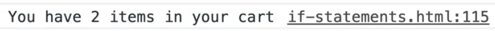
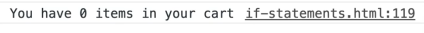

**Coercion** can seem like an intimidating word but it's a pretty simple concept to understand.

So far, we have learned that if you only need to use bang operator `!`, that checks for the opposite.

For example, if you wanted to check if someone is not cool, you might think you have to do the following 👇

```js
const isCool = true;

if (isCool) {

} else {
  console.log('You are not cool');
}
```

In the situation where you are only ever using the else, that is because you want the opposite of a value.

You could have done something like the following, 👇

```js
if (!isCool) {
  console.log('You are not cool');
}
```

A bang in front of a boolean will always flip it.

So if `isCool = true`, then `!isCool` would evaluate to false.

In addition to flipping the boolean to the opposite, it also does coercion.

**Coercion** is when you force something that is of a different type, such as a string or number, or an object or anything like that and force it into another type. For example when we coerce something into a true boolean.

Let's do an example.

If you type `name` into the console, it should return "wes" (we assigned that variable in earlier exercises in this JavaScript file).

If you type `!name` in the console, it should return false.

You will notice that `!name` took the string and turned it into a boolean by putting the bang in front of it.

So when you use the bang, it will coerce the value into a real boolean.

That is sort of the opposite because if we want to check if there is a name, if we want to take the fact that there is a name and make it into a real boolean, we can put double bang in front of it `!!` and that will coerce it into a Boolean of it exists or not. So `!!name` would return true.

Here is another example:

Let's say you have a middle variable that is assigned an empty string, like so 👇

```js
const middle = "";
```


When you put 1 bang inmfront of it, it gave us the opposite which was true.

If you put 2 bangs, it gives you false.

If you ever see the `!` and `!!` being used in the if statements, that is because someone is taking the fact that you have a truthy or falsy value, and are coercing it into a true boolean.

Wes used to use that quite a bit, but now that he has a really good understanding of truthy and falsy values, he doesn't use this coercion method much.

Coercion in general is the act of changing one type into another.

## Ternary

Next up we have **ternary**.

Wes likes to think of ternary's as shorthand if statements.

They are helpful when you quickly want to run functionality based on something being true or false.

A ternary needs 3 things:

1. A condition
2. What to do if it' true
3. What to do if it's false.

For example 👇

```js
const count = 2;
let word;

if (count === 1) {
  word = 'item';
} else {
  word = 'items';
}
```

So if you had a sentence that said how many items in your cart for example, you could so something like 👇

```js
const sentence = `You have ${count} ${word} in your cart`;
console.log(sentence);
```



If you changes `count` to be 1, it would return the following sentence 👇


The if statement that you wrote above is a bit verbose.. you first have to declare an empty variable and then update it. What we can do, if it's a simple `if` `else` like in this example, you can turn it into a shorthand if statement with **ternary**.

Comment out the if statement that you wrote above, because we will be replacing it was a ternary statement.

Like we mentioned above, for a ternary statement, we need one condition, then we need what to do if that condition is true, and what to do if that condition is false.

That would look like this 👇

```js
const word = count === 1 ? 'item' : 'items';
```

If you run that in the console like so 👇

```js
const count = 0;
const word = count === 1 ? 'item' : 'items';
const sentence = `You have ${count} ${word} in your cart`;
console.log(sentence);
```



You should see that it works.

What this does is it puts the if statement where we have our condition (something that will be true or false) (`count === 1`) and then we have what to return if true (`'item'`), and finally what to return if false (`items`).

That is useful when you need to do a quick if statement.

You could even take the example above a step further and do the ternary function directly inside of the sentence like so 👇

```js
const count = 0;
const word = count === 1 ? 'item' : 'items';
const sentence = `You have ${count} item${count === 1 ? '' : 's'} in your cart`;
console.log(sentence);
```

What you are doing here is saying if `count` is equal to 1, return nothing, and if it's not, return "s". That works exactly the same.

You can also use these for running functions.

For example, let's say you have a variable like `const isAdmin = true;`.

You can run a function based on if we have it or not, like so 👇

```js
isAdmin ? showAdminBar() : null;
```

So in that example, if the `isAdmin` variable is set to true, you would show the admin bar, otherwise you would do nothing which is why you are returning `null`.

You could also return an empty string or anything really because it's not saving that variable anywhere, it is just checking if it is true.

If it is true, it will run a function.

It is important to note that both what happens when it's true and when it's false needs to be there for a ternary statement.

```js
isAdmin ? showAdminBar();
```

The code above 👆 would not be valid. You need to supply the false case.

There is one trick you can do, the **&& trick**.

The neat thing about chaining stuff on conditions is it will check along the way to make sure that things are true.

For example let's say you had 3 functions and you wanted to make sure that all 3 functions are true before going ahead.

You can do an if statement like so 👇

```js
function check1(){
  return true;
}

function check2(){
  return true;
}

function check3(){
  return true;
}

if (check1() && check2() && check3()) {
  console.log('all checks passed');
}
```

If you run that in the browser, you will see "all checks passed" logged in the console.

```js
console.log('Running check 1');
```

Now inside each function, add the code above 👆 with the corresponding function number (running check 1, running check 2 etc).

What is cool about this is if you refresh the page and look in the console, you will see each one running in order 👇


Now if we put an else like so, and make one of the checks fail (modify one to return false) like so 👇

```js
function check2() {
  return false;
}

if (check1() && check2() && check3()) {
  console.log('all checks passed');
} else {
  console.log('Some checks failed');
}
```

When you run in the browser you should see the following 👇


Did the third check never run?

Yes, it never did.

If you run a condition, JavaScript will do the following: it will check the first one, and then if it's okay, it will move to the next condition. If that next condition is true, it will go onto the next one.

If at any point one of them is false, JavaScript will give up and say that one is false, there is no reason I would keep checking.. Therefore it returns the condition as false, and the third condition never runs and the else block will run.

That is sometimes referred to in JavaScript as **short-circuiting**, meaning that we never finished what we wanted, but we knew it wouldn't work out anyway so we short-circuited it and went directly to else.

The way that works can be abused or used. Some people hate it, some love it. Wes personally likes it.

Let's go back to the admin example to demonstrate what that can look like 👇

```js
isAdmin ? showAdminBar() : null;
isAdmin && showAdminBar();
```

We can abuse it by using `isAdmin && showAdminBar();`

JavaScript will say, this is a condition so check if the first is true, and if it is true, we will go ahead and do the next one. However if it is false, it won't run `showAdminBar()`.

This is abusing the condition chaining, meaning that if the first condition is true, the second will never run.

You see that sort of thing in React because it's a bit hard to do if statements in React.

You would do something like this in React if you wanted to conditionally render the admin bar based on whether the `isAdmin` value is true or false 👇

```js
{isAdmin && <AdminBar/>}
```

## Blockless If Statements

If something is on the same line, you don't actually need the block in the if statement.

For example, the following if statement is on multiple lines so it needs the `{}` block 👇

```js
if (isAdmin) {
  showAdminBar();
}
```

However, you could refactor it to be on one line like so 👇

```js
if (isAdmin) showAdminBar();
```

However, as soon as it goes onto another line, it is broken, so the code below would **not** be valid 👇

```js
if (isAdmin)
showAdminBar();
```

Should you use blockless if statements?

That is up to you to decide.

Wes doesn't use it often but he definitely has in the past because it is very convenient to write one-liners.

In most cases however Wes will use the blocks just in case someone else accidentally moves the if statement to multiple lines and breaks it.
