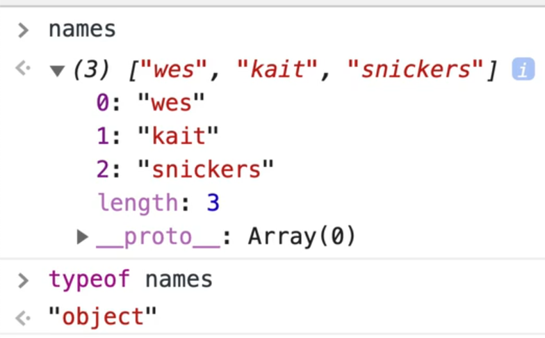
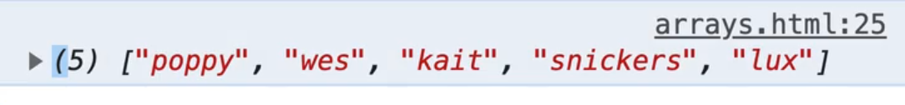
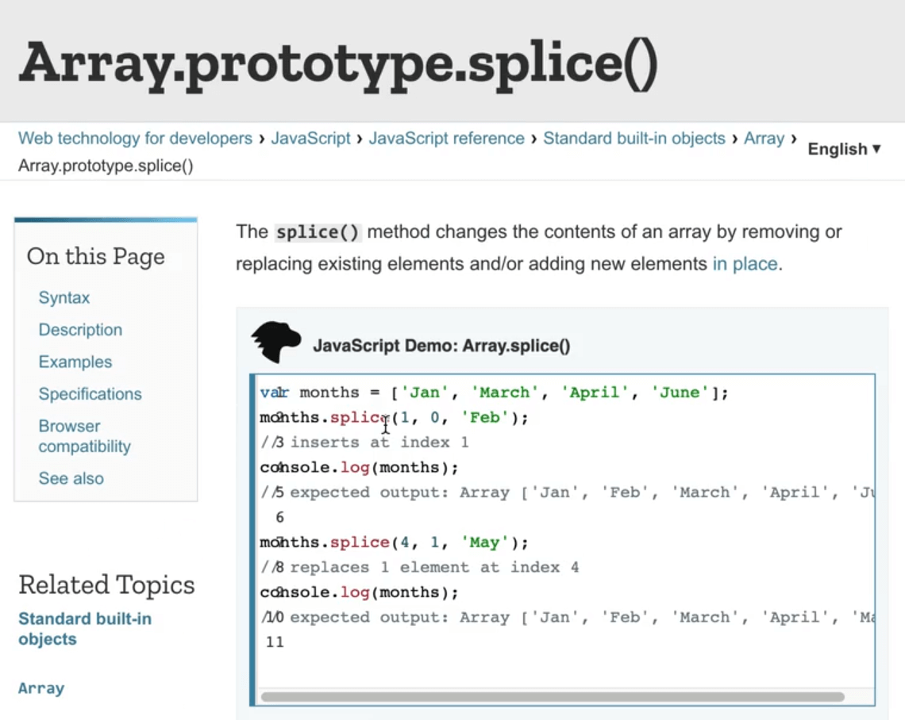
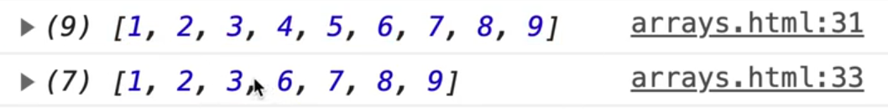
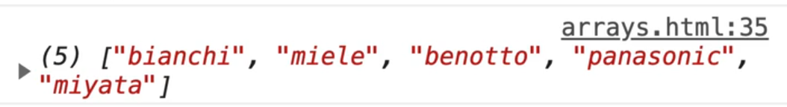
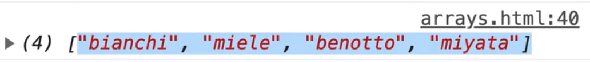
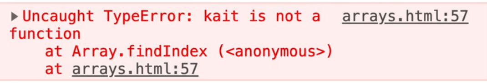
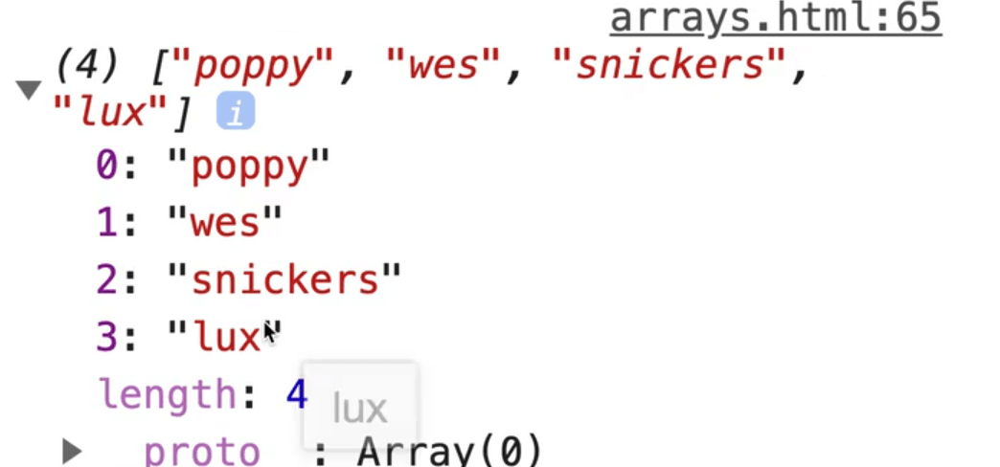

In this video we will be learning about arrays: how to create them, how to add items how to remove items, things like that.

In the next video we will cover looping over an array.

What is an **array**?

An array is used for holding a list of items where the order matters.

Each thing inside of the array is called an **item** and it's position in the array is called an **index**.

The number of items inside of an array is called a **length**.

Each item inside of an array can be any type. It can be a string, a number, a boolean, an object, another array, a nested array, you name it.

In the `/playgrounds` directory, open up `arrays.html`.

Add a script tag inside the body tag (if it's not already there).

We will use an example of a list of names to demonstrate how to create an array.

Whereas curly brackets are for an object, square brackets `[]` are used for noting you are creating an array or an *array literal**.

```js
const name = [];
```

You can also create an array using the long hand, just like you can with a string, a number, an object etc, like so 👇

```js
const names = new Array();
```

To create items inside of an array you can simply do this 👇

```js
const names = ['wes', 'kait', 'snickers'];
```

What you have done there is created an array with 3 items, each of which are separated by a comma.

Go ahead and open the page up in a browser and take a look at the array in the console.


This is our array.

It looks a lot like an object, but as you can see, it has no keys, which is sort of the main difference between arrays and objects.

An array has no keys. The keys will always be the indexes meaning 0,1,2,3,4,5..

One thing to mention is that if you types into the console `typeof names`, you would get "object" returned.



You might be thinking "Whhaaattt??" `typeof names` is an object??

If you recall one of the earlier videos where we went over all the types, you should remember that we didn't say that array was it's own type.

An array is actually just an object at the end of the day, meaning that it can hold data and have a bunch of methods living inside of it.

If you do need to check whether something is an array, you can do that like so  👇

```js
Array.isArray(names)
```

That will return true or false depending on whether whatever you pass it (in this case `names`, is an array or not).

That is something called a **static method** which we will learn about later.

So you have the `names` array, but how do you access things inside of it? You can't access it like you do properties on an object, so something like `name.wes` would not work.

If you want to access things inside of an array, you use the index.

```js
console.log(names[1]);
```

Do you think that will return the first item in the array?

If you guess yes, you are wrong!  If you refresh, you will see  "kait".

Why?

Because arrays are what are referred to as **zero based**. What that means is that the counting starts at 0.

There are two 2 Wes likes to tell everyone when he is talking about **zero based**.

First, he went to McDonalds once and was order number zero.

And he went to McDonalds another time and he was number 99.

It is just so that the number was huge on the receipt, and they had enough space on the receipt to put two numbers but their ordering system did a hundred numbers and then rolled over and started again.

What they did is instead of going from 1 to 100, because then the order number (100) wouldn't fit on the receipt, they started at 0 to 99 which still gave them the full hundred orders.

The second story is that when Wes got married is he had a table 0, and the last table was 23. That means they had 24 tables in total, it was zero based so it started at 0. That was very confusing for people working there and he does not recommend it.

In order to access the first item in an array you use the zero index like so 👇

```js
console.log(names[0]);
```

That should return "wes" because that is the first item in our array.

If you want to check how many items are in an array, you would use `.length`. That is NOT zero based.

If you refresh the HTML page and look at the console, you should see the following 👇


So if you want to access items within the array it is zero based, however if you are using `.length` to check how many items are in the array it is not zero based.

If you want to get the last item in the array, you could do `console.log(names[2]);` which would give us `snickers`, but what if you don't know how long the array is?

Let's say you modified the array to look like this 👇

```js
const names = ['wes', 'kait', 'snickers', 'wes', 'kait', 'snickers', 'wes', 'kait', 'snickers', 'wes', 'kait', 'snickers', 'wes', 'kait', 'snickers', 'wes', 'kait', 'snickers'];
```

Now you have no idea how many items are there (don't waste your time counting).

When you need to access the last item in the array but do not know how many there are, you can use the length property like so 👇

```js
console.log(names[names.length - 1]);
```

If you tried to do `console.log(names[names.length])`, it will return `undefined`.

Why?

Because `names[27]` does not have a value, the last item is actually at `names[26]` because the length is 27.

## Array Methods

The Array prototype is full of useful methods for adding, removing and finding things inside of the array.

Update the names array to only contain 3 names again.

```js
const names = ["wes", "kait", "snickers"];
```

If you refresh the page and take a look at the `names` array in the console, you should see something like 👇


Those are all methods.. `concat`, `copyWithin`, `push`, `pop`, `findIndex`.

There are tons of methods available to use when working with an array.

We are not going to go over how every single one works, we will go over the more important ones and learning the idea of **immutability**, **mutable** and **immutable**, because Wes believes thats much more important.

Let's talk about the scary words **mutable** and **immutable** again.

**Mutable** methods perform mutations. You can think of this like the Teenage Mutant Ninja turtles.

Why were they mutants?

Because they transformed from turtles into teenagers with really cool bandanas.

When something changes the original version of it, that is what is referred to as a **mutation**.

**Immutable** methods do not change the original thing, they simply return an new array.

Let's do some examples.

First, let's look at a mutation method.

```js
// Mutative Method
const numbers = [1, 2, 3, 4, 5, 6, 7, 8, 9];
const numbersBackwards = numbers.reverse();
console.log(numbersBackwards);
```


This gives us the array backwards.

What if you log `numbers`?

Will the numbers in that array still be in the right order, will they be reversed or has it been deleted?


The original array has actually been reversed as well.

That is what is referred to as a **mutation**, meaning the original data has been changed from what it was originally set out to be.

You don't even need that second variable in our example, since the code below would work just fine 👇

```js
const numbers = [1, 2, 3, 4, 5, 6, 7, 8, 9];
numbers.reverse();
console.log(numbers);
```

Mutability is not necessarily bad or incorrect, it's just something important to know about JavaScript, that some methods will modify the original array, whereas some will create a new array and leave the original one intact.

Most functional programmers or React developers tend to have a mantra of "don't actually mutate the original array, create a new version of it".

So what's an immutable example of one of the methods?

Let's take `numbers` and use the `slice()` method.

The `slice` method allows us to take a portion of the array and make it into a new array.

Let's say you want to take the items at index 2 to index 4.

Add the following code 👇, refresh the HTML page and open the console.

```js
const numbers = [1, 2, 3, 4, 5, 6, 7, 8, 9];
console.log(numbers);
const pizzaSlice = numbers.slice(2, 4);
console.log(pizzaSlice);
```


What you have done is you have gone from index 2, which is the 3rd item and stopped at index 4, which is the 5th item.

Slice returns to use the subset of the original array, based on the index values we pass it.

If you ever need to take a chunk out of an array, you can reach for slice.

Now the question is, will the number 3 and 4 still be in the original numbers array?

Below where we log `pizzaSlice`, add `console.log(numbers);` and refresh the page.


As you can see, numbers is still intact, meaning the number 3 and 4 have not been removed from it.

That is referred to as **immutable** methods, meaning they do not change the original data. Mutation methods do change the original data.

This is the cause of a lot of bugs. Just a few weeks ago, Wes forgot that `reverse()` was a mutable method.

So what do you do if you want to use a mutable method but you don't want to actually mutate the original array?

You take a copy of the array!

Let's demonstrate this with a code example.

You can copy an array using the square brackets and the spread operator, like so 👇

```js
const numbersReversed = [...numbers];
console.log(numbersReversed);
console.log(numbers);
```


Go ahead and call `reverse()` on numbers reversed as shown below.

```js
const numbersReversed = [...numbers];
numbersReversed.reverse();
```


You can also just call the method immediately on the array that was created like so 👇

```js
const numbersReversed = [...numbers].reverse();
```

To recap:

Anytime you want to call a mutable method without mutating the original thing, you should first take a copy of it and then call the method.

Most of the methods that we will learn about in arrays are immutable, but the few that aren't can get cha.

Comment out all the numbers code we added, because we will continue with our `names` example that's towards the top of the script tag.

One thing you will want to do with an array is add items to it. For that, use the `push()` method.

```js
names.push('lux');
console.log(names);
```


This does mutate the original array.

If you didn't want to mutate the original array you could do something like this 👇

```js
const names2 = [...names, 'lux'];
```

What that does is it copies all the items from the `names` array and then add an additional item, which is "lux".

If you want to add an item to the front of an array, you wouldn't use push, because that adds the item to the back of the array.

You would use `unshift()`.

For example 👇

```js
names.unshift('poppy');
console.log(names);
```



The immutable way to do that would be 👇

```js
const names3 = ['poppy', ...names];
```

The next two methods you will mix up for the rest of your life: `splice()` and `slice()`.

We have already covered `slice()`, which allows you to take a portion out of the original array.

But there also is `splice()`.

Both are used for grabbing a subset of the array but `slice()` is immutable and `splice()` is mutable.

Let's take a look at both methods on MDN.


> The `slice()` method returns a shallow copy of a portion of an array into a new array object selected from begin to end (end not included) where begin and end represent the index of items in that array. The original array will not be modified.

What they mean by end not included means that in our examples where we did `slice(2,4)`, it took the items start at index 2, but not at index 4. The end is not inclusive.



`Splice` on the other hand will actually take the item out of the original array.

> The `splice()` method changes the contents of an array by removing or replacing existing elements and/or adding new elements in place.

The other gotcha is that there is no start and end in `splice`.

`Splice` has a start and then how many you should go for. For example if you want to start at one and delete 5, you would use splice.

Let's take a look at the numbers example 👇

```js
console.log(numbers);
numbers.splice(3, 2);
console.log(numbers);
```



we started at index 3 which was the #4. Then we went for two items, for #4, #5 and took those out of the array.

That is mutable, whereas `slice` will just return a new array.

More often than not you will want to reach for `slice` because of that.

A trick to remember that is that you probably want a slice of pizza, so think of pizza!

Now let's talk about adding items to the middle of an array.

It is best to use the spread operator.

Let's say you have an array of `bikes`, and you want to add 2 items in the middle.

How do you do that?

There is no method to insert an item at a specific index and have the rest push over.

Create a new array, then use the spread operator in combination with slice like so 👇

```js
const bikes = ["bianchi", "miele", "panasonic", "miyata"];

const newBikes = [
  ...bikes.slice(0, 2),
  "benotto",
  ...bikes.slice(2)
];

console.log(newBikes);
```

You took the first 2 and spread them into it, and then you add the new item, take everything else after that and spread it into there.

How do you take everything after an index using splice? You don't pass it an end, like you did here: `...bikes.slice(2);`



What if you want to remove an item, like panasonic, from the array?

Create a new array and use slice like so 👇

```js
const newBikes2 = [
  ...newBikes.slice(0, 3),
  ...newBikes.slice(4)
];

console.log(newBikes2);
```

What the code above is doing is it is taking everything up to panasonic (index 0 - 3), and then you grab everything after panasonic using `...newBikes.slice(4);`



Panasonic is no longer in our new array.

This is a very common thing to do, especially in frameworks like React and Angular.

You basically find where that thing is in the array, and then you use it's index to remove it.

Let's do an example like that where you have a bunch of comments, and each item in the comments is an object, like so 👇

```js
const comments = [
  { text: "Cool Beans", id: 123 },
  { text: "Love this", id: 133 },
  { text: "Neato", id: 233 },
  { text: "good bikes", id: 333 },
  { text: "so good", id: 433 }
];
```

You may have a function called `deleteComment` which takes in an `id` and the `comments` array.

Inside of the function, you first need to find the index of the item in the array, then you need to make a new array without that item in it, and then return that new array.

One thing we have not covered yet is how do you find the index of something, based on the item you are searching for?

You use a method called `findIndex()`.

You might think it would work like this 👇

```js
const kaitIndex = names.findIndex('kait');
console.log(kaitIndex);
```

However, if you try that, you will get the following error 👇



It's not as easy as that because our structures are going to be a bit more complex than just strings.

In this case, you want to find an object based on it's id.

If that is the case, you will do something very similar to a loop.

`findIndex()` will loop over every single item and then when it finds the item that you want, it will return true and that will give us the index.

For example 👇

```js
const kaitIndex = names.findIndex(name => {
  if (name === 'kait') {
    return true;
  } else {
    return false;
  }
})

console.log(kaitIndex);
console.log(names[kaitIndex]);
```

You should see the index 2 and the value of Kait in the console when you refresh the page.


That method is a bit long, so there is a few shorter way to do it.

One way is that you can remove the else because if it's true, it will return and the else will never run.

```js
if (name === 'kait') {
  return true;
}

return false;
```

The if statement also returns true or false itself so there is no real need for an if statement.

Thus, the other way you can do it is just by return the condition, which will be true of false like this 👇

```js
const kaitindex = names.findIndex(name => {
  return name === 'kait';
})
```

If you refresh the page, you will see that it still works.

You can even go one step further and use an implicit return.

Get rid of the curly brackets, put it all on one line, and get rid of the semi-colon and the keyword return like so 👇

```js
const kaitIndex = names.findIndex(name => name === 'kait');
console.log(kaitIndex);
```

Now that you have that, make another array as shown below.

```js
const newNamesWithOutKait = [
  // get everything up to the kait index
  names.slice(0, kaitIndex),
  // everything after
  names.slice(kaitIndex + 1)
];

console.log(newNamesWithOutKait);
```

What we are doing there is you go from the start and then grab everything up to the `kaitIndex`, then you get everything after the `kaitIndex`.


Whoops! You might notice that it looks weird. We goofed up a bit here.

What we did accidentally is we created an array of 2 arrays.

You don't want 2 arrays, you want to take the items out of them and spread them into the new one like so 👇

```js
const newNamesWithOutKait = [
  // get everything up to the kait index
  ...names.slice(0, kaitIndex),
  // everything after
  ...names.slice(kaitIndex + 1)
];

console.log(newNamesWithOutKait);
```


There is a new method in JavaScript called `.flat()`.

If you call it directly on `newNamesWithOutKait` it wouldn't work because it's immutable.


We would have to return it like so 👇

```js
const newNames999 = newNamesWithOutKait.flat();
console.log(newNames999);
```



You can see it flattened the 2 arrays into one for us.

You could also do this 👇

```js
const newNamesWithOutKait = [
  // get everything up to the kait index
  names.slice(0, kaitIndex),
  // everything after
  names.slice(kaitIndex + 1)
].flat();
```

It is a nice solution.

We will be using the callback API similar to what we used in `findIndex` in a lot of the methods.

Now we will go back to our `deleteComment` example and create the function.

First, find the index. That is a bit different because this time you are looking for an object where it's ID property matches.

```js
const commentIndex = comments.findIndex(comment => comment.id === id);
```

Next, return a new array using slice. Get everything before the comment and then everything after the comment.

```js
return [
  ...comments.slice(0, commentIndex),
  ...comments.slice(commentIndex + 1)
];
```

Here is the entire method 👇

```js
function deleteComment(id, comments) {
  // first find the index of the item in the array
  const commentIndex = comments.findIndex(comment => comment.id === id);
  // make a new array without that item in it
  return [
    ...comments.slice(0, commentIndex),
    ...comments.slice(commentIndex + 1)
  ];
  // return our new array
}
```

Now if you go and refresh the page and type comments into the console, you can see the comments.

In the console type in `deleteComment(233, comments)` and that will return the following 👇


The original comments are still there, we just made a new array called deleteComments with the item removed.
