In the previous lesson we learned about `forEach`, which is useful when you want to loop over some data and do something with each piece of data.  That "something" may be displaying the data on a page, logging the value, or attaching an event listener to each item, those are often referred to as things called **side effects**.

A **side effect** is when you are inside of a function and you reach outside of that function to do something else.

While side effects are totally fine, because at some point you do need to do things that reach outside the function, there are a whole slew of other types of loops that are simply taking in data, doing something with that data and then returning the data that has been modified, massaged or transformed in some way.

That is where we get into `map`, `filter`, and `reduce`.

We have already looked at one example of `filter` and that is `find`, where you take in an array and return one thing.

That is a transformation of that data and are often referred to as **pure functions**.

**Pure functions** take in data, they return data, they always work exactly the same way given the data that's inputted, it returns the exact same thing. They don't reach outside themselves to do that.

Let's talk about `map`.

Map is like a machine in a factory. It takes in data, performs an operation and then spits it out on the other side.

`map` will always produce the same length of the array as it starts with.

Let's go into a little example right now.

Add `console.clear()` to the script tag to clear all the `toppings` work we did in the previous lesson.

Wes loves the analogy of a machine, taking in data, performing an operation and then spitting it out on the other side. You can think of like a toy machine in a factory which adds one arm then the other arm then a leg.

Let's do a really simple example.

We have this array below 👇

```js
const faces = ['😃', '🤠', '🤡', '🤑', '😵', '🌞', '🐶', '😺'];
```

Let's create some functions that will map over each one.

Let's make function `addArms`, that takes in a face, and returns an emoji.

```js
function addArms(face) {
  return `👋${face} 👋`;
}
```

That is just a regular function like we have written a hundred times by now. You can play with it in the console. It's silly, but it works.

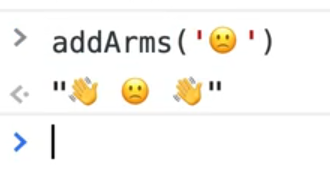

Now what we can do is we can take our array of faces and add arms to all of them, and this how that works.

```js
const toys = faces.map(addArms);
console.log(toys);
```

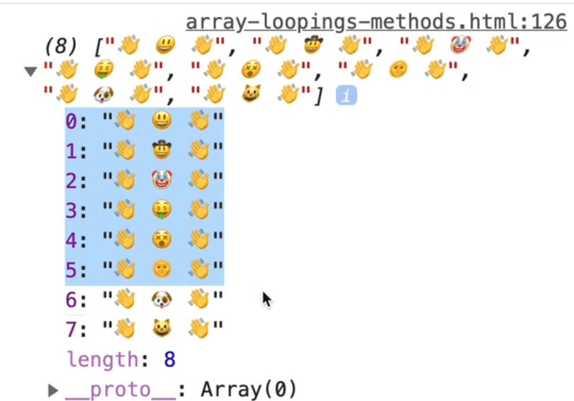

As you can see, what was returned to us is an array of exactly the same length as we put it in, so if the array had 8 things, it will have 8 things when it's returned, there is no way to return more or less items with `map`.

You simply take in something and return something else.

One other simple example is let's say you have this code below.

```js
const fullNames = ['wes', 'kait', 'poppy'].map(name => `${name} bos`);
console.log(fullNames);
```


We could do multiple transforms.

Let's make the code above into a function.

```js
function bosify(name) {
  return `${name} Bos`;
}

const fullNames = ['wes', 'kait', 'poppy'].map(bosify);
```

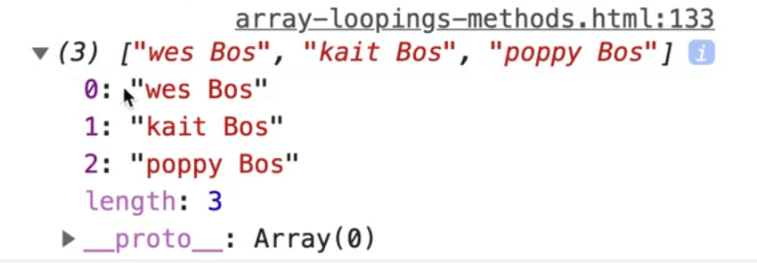

The first names don't have capitals so make another function `capitalize` which takes in a word.

You can access each character of a word using an index.

For example `'wes'[0]`, `'wes'[1]`, `'wes'[2]` will return the following 👇


So you can capitalize the first letter of the word as shown below.

```js
function capitalize(word) {
  return word[0].toUppercase();
}
```

Let's try the code as we have it so far. Chain the maps like so 👇

```js
const fullNames = ['wes', 'kait', 'poppy'].map(capitalize).map(bosify);
```

You can chain as many maps as you want because each returns a new array until it reaches the last one.

A nice way to format that to make it easier to read is to put each map on its on line.

You still only put one semi colon `;` at the end of the chain, not on each line.

```js
const fullNames = ['wes', 'kait', 'poppy']
  .map(capitalize)
  .map(bosify);

console.log(fullNames);
```


As you can see, that does not return the whole word.

Let's fix that.

We will use `slice` to return the words from index 1 to the end of the word like so 👇

```js
function capitalize(word) {
  return word[0].toUppercase() + word.slice(1);
}
```


As you can see, that works.

Let's change that so instead of using the `+` operator, we use backticks because it's better to reserve adding for numbers.

Modify the code as shown below.

```js
function capitalize(word) {
  return `${word[0].toUppercase()}${word.slice(1)}`;
}
```

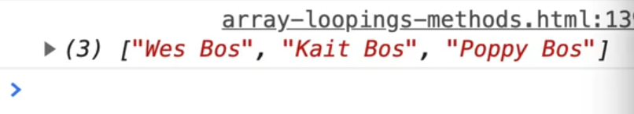

Map will always take in an item, do some work with it and then return a new value.

The same thing works with numbers.

```js
const orderTotals = [342, 1002, 523, 34, 634, 854, 1644, 2222];
```

Lets say we want to add tax to all items in the `orderTotals` array.

Watch what happens if for every single item in our map, we just return one.

```js
const orderTotalsWithTax = orderTotals.map(total => 1);
```


As you can see, all the items in the array have now been turned into 1.

Why?
Because whatever you return from your map function will replace whatever was initially in your map function.

It is not **mutable**.
What that means is our `orderTotals` are still there.
The new array has the updated value.

Back to our example, to add the tax to every item in `orderTotals`, add the following code 👇

```js
const orderTotalsWithTax = orderTotals.map(total => total * 1.13);
```

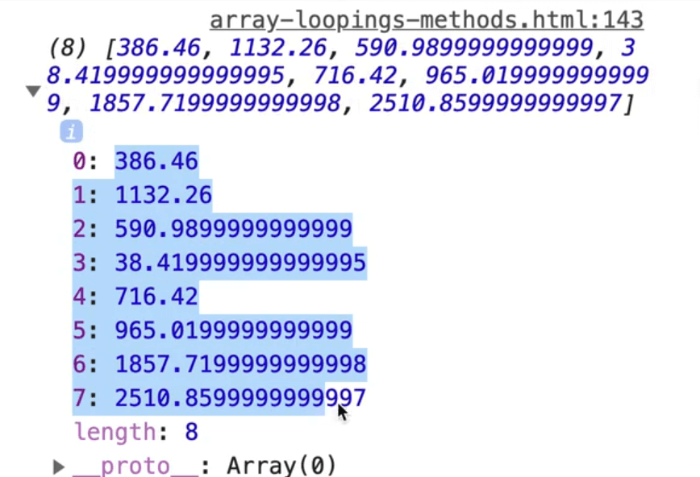

As you can see, we now have our values with tax added to them.

Wes finds map to be extremely helpful.

There is one really silly example that Wes wants to show us.

There is this thing on twitter where you can make cowboy bodies out of emojis.


```js
function attachBody(face, body) {
  return `
    ${face}
　　　　　${body.repeat(3)}
　　　　 ${Array(3).fill(body).join(' ')}
　　　👇🏽　 ${body.repeat(2)}　👇🏽
    ${Array(2).fill(body).join('   ')}
    ${Array(2).fill(body).join('   ')}
　　　　　👢　　👢
  `
}

faces.map(face => attachBody(face, '🍟')).forEach(body => console.log(body))
```

What Wes has done here is he has taken our `faces` array that we used earlier, looped over each item and pass it as an argument to `attachBody` along with the emoji to make the body out of.

That will return us a new array and then for each of those we just log them.

The `attachBody` function simply takes in a face, and then whatever the body is made up of and we use backticks so we can use multiple lines and then it fills in the variables.

So it fills in the `face` variable, then the `body` variable repeats 3 times.

One thing Wes hasn't shown us yet is `repeat`.

You can take a string and call repeat on it and JavaScript will repeat that however many times you like, like so 👇

```js
'x'.repeat(199);
```

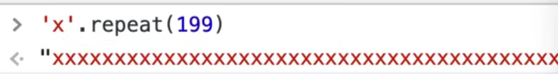

Another thing Wes hasn't shown us yet is `Array.fill()`.

With `Array(3)`, it will create 3 empty spots in an array, much like `Array.from()`.

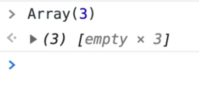

However if you want to fill them with the exact same thing, you can use `Array(3).fill('x')`.

That is a bit quicker than `Array.from` and the map function that we looked at.

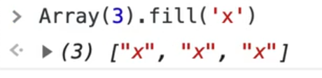

In our `attachBody` function, we are just filling it with an emoji and then calling `.join(' ')` with a space separator in it. That gives us the actual body of the person.

`.map` can be used with any type of data.

So far we have looked at examples with strings and numbers but more often than not, you will actually have an array of objects that comes back from the API.

Let's take a look at an example with the `peoples` array.

```js
const people = [
  {
    birthday: "April 22, 1993",
    names: {
      first: "Keith",
      last: "Buckley",
    },
  },
  {
    birthday: "January 3, 1975",
    names: {
      first: "Larry",
      last: "Heep",
    },
  },
  {
    birthday: "February 12, 1944",
    names: {
      first: "Linda",
      last: "Bermeer",
    },
  },
];
```

Each person is signified by an object, and each person has a `birthday`, and a `names` object which has a nested `first` and `last` property inside of that.

That data is okay but it's not in the format that we need. That happens all the time when you are working with APIs.

So what we have to do is take in that data and "massage" it a little bit and then return the new formatted data that we want.

Go ahead and do that, as shown below 👇

```js
const cleanPeople = people.map(function(person) {
  console.log(person);
})
```

We are using an inline function which takes in an parameter of `person` (which will be each item in the array as it loops through), and we log the `person`.

It is fine to log within a `map` function, just don't ever do things like updating the DOM inside of a `map` function. That is what a `forEach` is for.

The first thing we need this function to do is get the person's birthday, and then figure out how old they are, and then return their full name and birthday in an object.

First we have to get their birthday, which is stored in a string like "February 12, 1944".

That is not very helpful to us because when you want to work with dates in JavaScript, it has to be changed over to what is called a **JavaScript Date**.

You can do that within the inline map function like so 👇

```js
const cleanPeople = people.map(function(person) {
  console.log(person);
  const birthday = new Date();
})
```

If you don't pass a date when you create a date in JavaScript as shown below, it will give you the current date time.

```js
new Date()
```

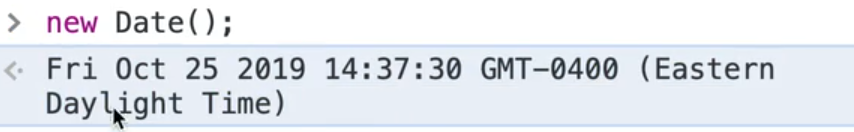

The date you see in the console in the video is the date that Wes is recording the video.

If you do pass a string of a date to `new Date()`, like we have access to with `person.birthday`, it will return that date.

```js
const cleanPeople = people.map(function(person) {
  console.log(person);
  const birthday = new Date(person.birthday);
  console.log(birthday);
})
```

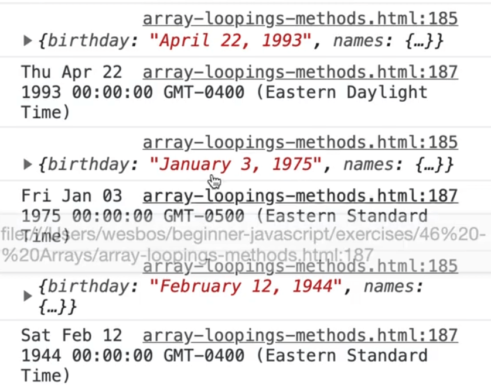

As you can see, for each person we log the person and then it actual logs a true JavaScript date.

_HOT TIP 🔥: Use `console.dir(birthday)` to see all the methods that exist on a Date object._

If the date that you pass to the `new Date()` function doesn't have a time value, it will default to midnight.

Now that we have the birthday, we want to figure out how old the person is. In order to do that, we need to know the current date.

Modify the inline function like so to capture the current date in the variable `now` 👇

```js
const cleanPeople = people.map(function(person) {
  const birthday = new Date(person.birthday);
  const now = new Date();
  console.log(birthday,now);
})
```

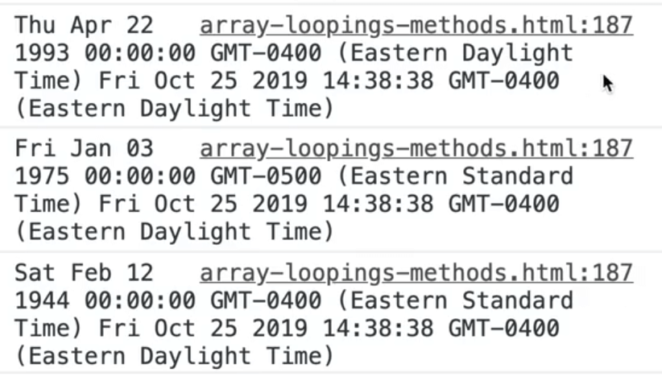

As you can see we have 3 different dates showing up.

There are a number of methods on a Date in JavaScript that allow you to work with it.

What Wes likes to do when comparing dates or trying to figure out how much time is in between two dates, is to change them into **timestamps**.

Open up the console and run the code below. You will see that we get a number returned to us.

```js
const now = new Date();
now.getTime();
```

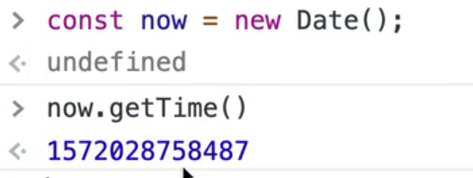

That number might look random but it is actually not random at all.

That is the number of milliseconds since January 1, 1970. That is the time when they said okay, this is when date starts. Any dates that are negative, go back from that time and any dates that are positive go forward for that time.

There is actually a shortcut to get the timestamp and that is using `Date.now()`. If you try running that a few times in the console, the number should change each time.


If you ever have one of these timestamps, you can go to the website https://epoch.now.sh.


This website allows you to convert any date in the future or in the past to a timestamp. JavaScript deals with milliseconds so you want to always work with that.

It also allows you to do the opposite. It will take in a timestamp and convert it back to a regular date for you.

So back to our inline map function, we don't want to just grab the persons birthday and convert it to a date, we want to convert it to a full blown timestamp.

We can do that by chaining the `getTime` method onto `new Date(person.birthday).getTime();`.

For the `now` variable, use `Date.now()` to get the timestamp instead of `new Date()`.

`.now()` is a static method because it lives on the `Date` object.

```js
const cleanPeople = people.map(function(person) {
  const birthday = new Date(person.birthday).getTime();
  const now = Date.now();
  console.log(birthday,now);
})
```

To find the difference between the two dates, use the following code 👇

```js
const age = now - birthday;
console.log(age);
```


That is how old each person is in milliseconds.

We need to convert it into years. We need to do some math for that.

Let's ask ourselves how many milliseconds in a year. We know there are 1000 milliseconds in a second, there is 60 seconds in a minute, there is 60 minutes in an hour, there are 24 hours in a day and 365 days in a year.

`1000 x 60 x60 x 24 x 365 = 31536000000`

There are other ways to do dates that will account for leap years and all that.

There are whole libraries out there like the date functions library **date-fns**. Those libraries provide you with a whole bunch of robust tools for working with dates.

Take our age calculation timestamp and divide it by that number like so 👇

```js
const cleanPeople = people.map(function(person) {
  const birthday = new Date(person.birthday).getTime();
  const now = Date.now();
  const age = now - birthday / 31536000000;
  console.log(age);
})
```


That leaves us with some decimals which we can just take the lower bound of their number, because if they haven't hit their next birthday yet, you would say you are 26 years old.

How do we take the lower bound of any number?

It's not round because you don't round up to say how old you are.
You take the lower bound with `Math.floor`.

Modify the code like so 👇

```js
const age = Math.floor(now - birthday / 31536000000);
```

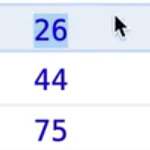

Now that we have their birthday and figured out how old they are, we want to return their full name and birthday in an object.

To do this, simply return an object from the inline function that has a property of `age `which is equal to our `age` variable, and then the `name` property will be the person's last and first name variables combined using interpolation as shown below.

```js
const cleanPeople = people.map(function(person) {
  const birthday = new Date(person.birthday).getTime();
  const now = Date.now();
  const age = Math.floor(now - birthday / 31536000000);
  console.log(age);
  return {
    age: age,
    name: `${person.names.first} ${person.names.last}`,
  }
})
```

Note: as mentioned before, if the property is the same name as the variable, we could have returned the object like so  👇

```js
return {
  age,
  name: `${person.name.first} ${person.name.last}`,
}
```

They both work the exact same way.

Let's log `cleanPeople` in a table.

```js
console.table(cleanPeople);
```

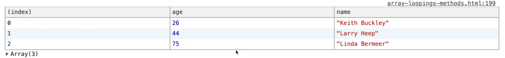

As you can see we have everyone's name and age.

That is what `map` does. It takes in some data that doesn't look exactly how you like it. You do a bunch of data massaging and then spit it out the other end.
