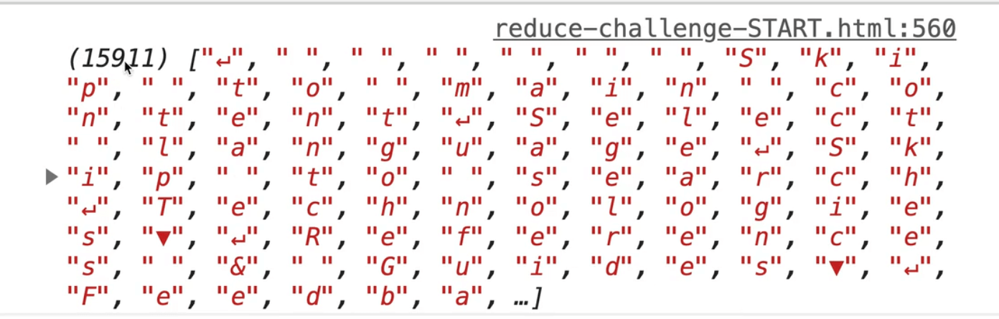
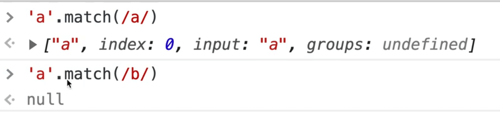
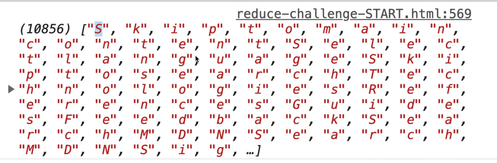
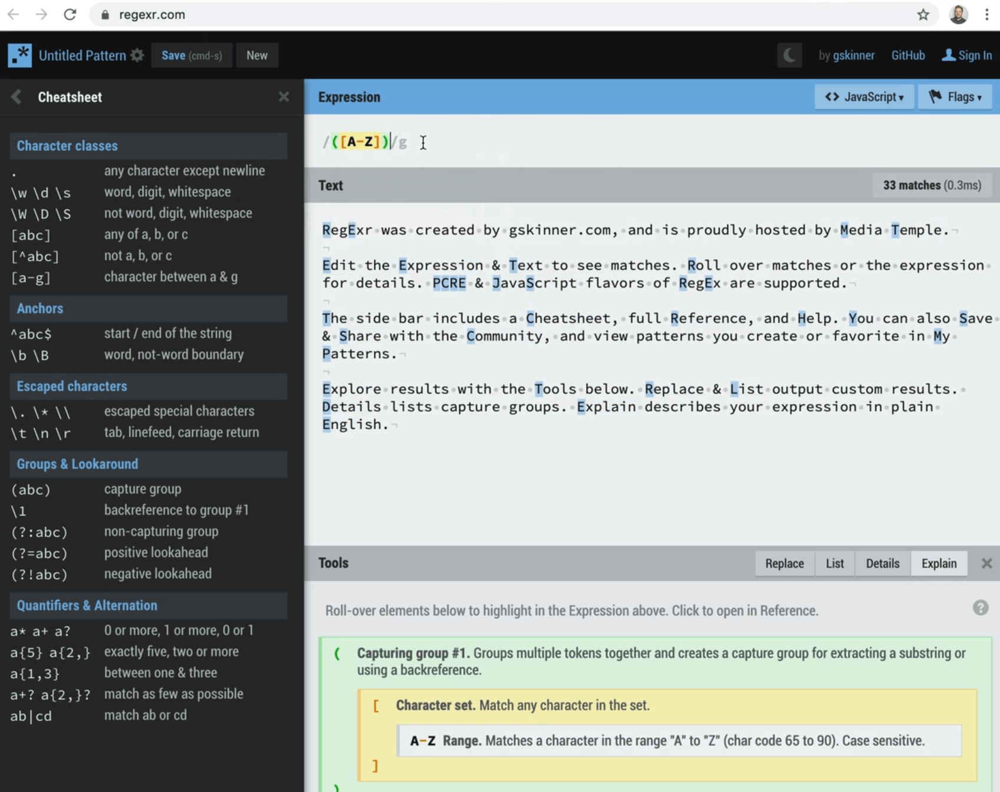
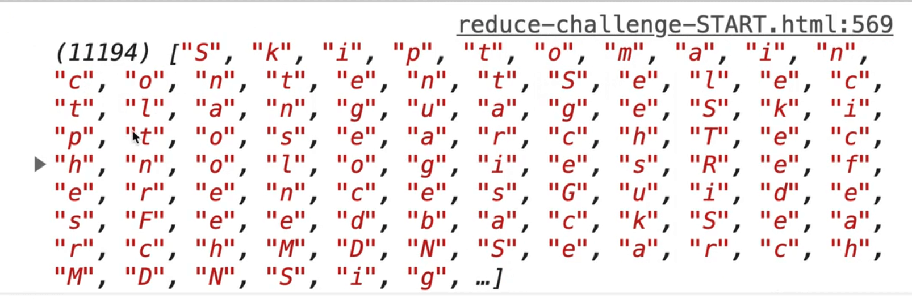
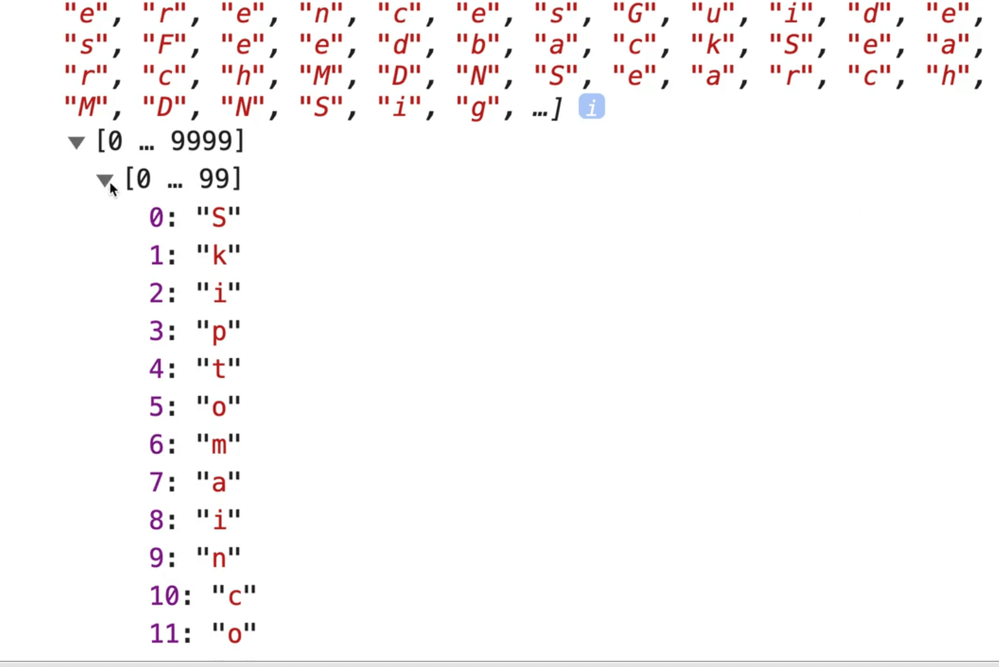
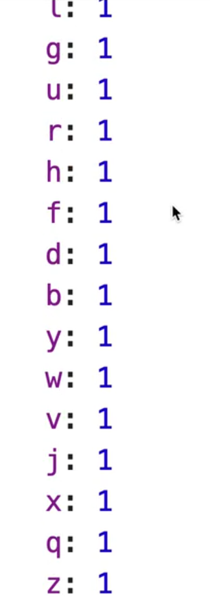
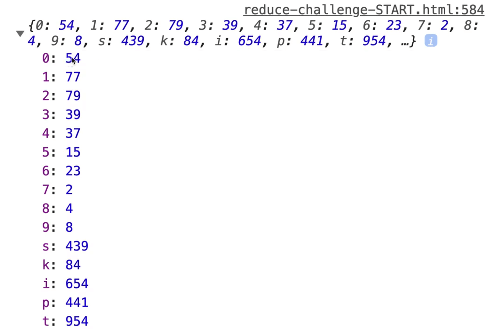
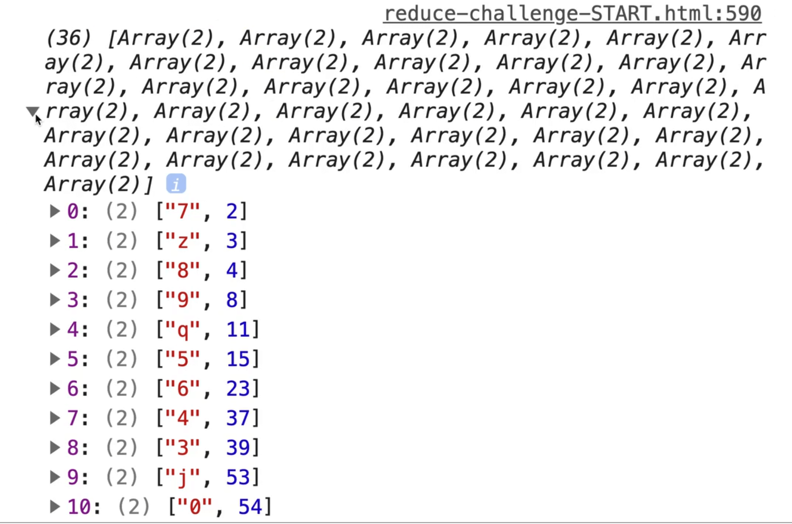

This lesson is an exercise where you have to use `map`, `filter`, and `reduce` all in one exercise.

The task is to go to any webpage, like the Mozilla Developer Docs for reduce, copy every single piece of text like Wes is doing in the screenshot below by pressing `Cmd` + `A` and `Cmd` + `C` and then counting how many times every letter and number occurs on the page.


Here are a couple of tips:
- first grab all the text
- then convert the text to an array of letters
- then we need to filter the text to grab only letters and numbers and ignore other text content like parenthesis, question marks, white space etc.
- we want to make sure that whether the letter is uppercase or lowercase, we still only count it once. For example `a` and `A` would could as two "a"s, not one uppercase A and one lowercase a.

This is going to use `filter`, `map` and `reduce` all in one go.

Open up the file `reduce-challenge.html`.

The first thing we will do is get the text in there.

Create a variable called `text` and use backticks for the value because we are going to paste the text we copied between the backticks and backticks allow our text to be multi line.

Note: the text within the `text` variable has been shortened for demonstration purposes in the following code examples.

```js
const text = `
[0, 1, 2, 3, 4].reduce( (accumulator, currentValue, currentIndex, array) => accumulator + currentValue);
If you were to provide an initialValue as the second argument to reduce(), the result would look like this:
The value returned by reduce() in this case would be 20.

Examples
Sum all the values of an array`;


console.log(text);
```


As you can see, we have over 31.1 KB worth of text.

How can we convert all of the text into an array of every single letter?

You can call `split()` or spread it into an array.

For example we can call split on our `text` variable and pass it an empty string so that we split it on nothing like so 👇

```js
const everything = text.split('');
console.log(everything);
```



As you see, now we get an array with 15,911 letters that are in it.

Next we need to deal with ignoring the case when counting letters.

There are 2 ways we can do that:
- we can either lowercase everything immediately or
- we could filter the things out for what we want

If we do lowercase first, we will be unnecessarily lowercasing things that do not have lowercase and uppercase, such as symbols like the question mark and numbers etc.

However, if we filter first, then our matcher will have to match both uppercase and lowercase.

Let's get rid of the junk by using `.filter()` before lowercasing.

```js
const result = everything.filter(char => )
```

We pass our filter a `char`, which is an instance of the item from our array, and then we want to filter out any items that are not letters or numbers from a-zA-Z and numbers 0-9.

## Regular Expression

So how do we check if a character is from a-z, A-Z or 0-9?

We can use a `.match()` function.

Let's look at these docs: https://developer.mozilla.org/en-US/docs/Web/JavaScript/Guide/Regular_Expressions


A **regular expression** is a way to use what is called a **Regex pattern** to match characters within a string.

There are a number of different methods that take a Regex like `match`, `matchAll`, `replace`, `search`.

So if we wanted to filter for the letter a for example, we use a matcher.

The way you pass a regular expression to the `.match()` method is you put two forward slashes like `//` and then put the matcher in the middle.

To check for a match with the letter `a` you would do `char.match(/a/)`, like so 👇

```js
const result = everything.filter((char) => {
  // if that characer is a-zA-Z0-9
  if (char.match(/a/)) {
    return true;
  }

  return false;
});
```



As you can see, when we checked if it is a match with the letter `a`, it returned the value with a bit more information like where we found the word.


However when we check if `'a'.match(/b/)`, it returned false because 'a' clearly does not match the letter 'b'.

In our case, we need a Regex that will match all letters, so we can do that using groups like so `/[a-z]/`.

Let's try that to see how we are doing.

```js
const result = everything.filter((char) => {
  // if that characer is a-zA-Z0-9
  if (char.match(/[a-z]/)) {
    return true;
  }

  return false;
});

console.log(result);
```


We have over 10,000 letters in our filtered array now.
If you look closely, you will see they are all lowercase.

Let's fix that by modifying the group in our Regex like so 👇

```js
char.match(/[a-zA-Z]/)
```



As you can see, our array now contains letters as well.

Now we need to get numbers so we can add 0-9 to our group, as shown below.

```js
char.match(/[a-zA-Z0-9]/)
```

Wes knows this off the top of his head from years of writing regex's.

However you can use the website https://regexr.com to find lots of patterns there and cheat sheets to help you match any character except a new line.




Another thing you could do is pass the case insensitive flag like so 👇

```js
/([A-Z])/i
```

What that will do is it won't care about upper or lowercase. So in our case we could have done the regex like this 👇

```js
char.match(/[a-z0-9]/i)
```

The `i` flag will make it case insensitive.

Let's refresh to mak sure that still works.



As you can see, it does work, and we also getting numbers now.

_(You might notice in the dev tools that when you expand a large array, it breaks them up into groups as displayed in the image below.)_



So that is our first filter. The next thing we want to do is to lowercase everything.

One way we can do that is using `.map()`.

We can chain the `.map()` directly on the `.filter()`, however the code is getting to be a little bit hard to work with so let's first refactor a bit.

Refactor the inline function we pass to `filter` to an external function we will name `isValidChar`.

```js
const everything = text.split("");

function isValidChar(char) {
  return char.match(/[a-z0-9]/i);
}

const result = everything.filter(isValidChar);

console.log(result);
```

That already looks much neater.

We can make the code even more concise by chaining the `.split()` instead of assigning it to a variable, like so 👇

```js
function isValidChar(char) {
  return char.match(/[a-z0-9]/i);
}

const result = text.split("").filter(isValidChar);

console.log(result);
```

Often developers like to put each method that is chained on it's own line as shown below.

```js
const result = text
  .split('') // split each char into an item of an array
  .filter(isValidChar);

console.log(result);
```

Now let's chain the map over a function we will call `lowercase`.

```js
function lowercase(char) {
  return char.ToLowerCase();
}
```

You could also write that as an arrow function, which we will use instead so comment the `lowercase` method we just added out and add the code below

```js
const lowercase = char => char.toLowerCase();
```

If you refresh the page and open the array in the console, you will see that now there are only lowercase letters.

The last step in this exercise is to count the instances of each letter and number using a reduce.

Let's create an external function which we will pass to the reduce method.

We want to start with an empty object so we will pass that as the second argument.

```js
function instanceCounter() {

}

const result = text
  .split("")
  .filter(isValidChar)
  .map(lowercase)
  .reduce(instanceCounter, {});
```

We will name the accumulator parameter `counts` and the individual character instance `char`.

Inside of the function, we will check whether the character already exists in the array using square brackets and a ternary function.

If the character does exist, we will increment it by 1.

If it does not, we will add it and set it to one.

```js
function instanceCounter(counts, char) {
  counts[char] ? counts[char] + 1 : (counts[char] = 1);
}
```
If you refresh the page, you might see something like the following error 👇


In Wes' example, `k` is the second character.


Why is it telling us it's `undefined`?

It's because the first time it works, the first time our reducer accumulator is an object. However, because we didn't return anything from this line, then the second time the return is `undefined`.

To fix the issue, we simply need to add `return counts;` to the end of our `instanceCounter` method, as shown below.

```js
function instanceCounter(counts, char) {
  counts[char] ? counts[char] + 1 : (counts[char] = 1);
  return counts;
}
```

If you refresh the page and open the console, you will see it is showing a count of 1 next to each character.

That's not right!



Let's debug this by looking at our ternary operator in `instanceCounter`.

So first we check if the letter exists in the array with `counts[char] ?`.

If it does exist, then the count of that character should be equal to the existing count plus one.

We forgot the equal sign!


Modify the code like so

```js
counts[char] ? counts[char] = counts[char] + 1 : counts[char] = 1;
```

You could even put the ternary operator on separate lines as shown below.

```js
counts[char] ? (counts[char] = counts[char] + 1) : (counts[char] = 1);
```



It looks like we are getting real values!

A fun thing you could do now with the object we get back is figure out how to sort the characters from the most popular to the least popular.

Let's do it together.

What if we try using `Object.entries(result);`?


It gives us an array of arrays with each arrays first item being the key and the second item being the count.

Next, we can use `.sort()`.

Create an external function `sortByValue`, and name the two parameters `a` and `b`.

Within the function, we will compare the second items in the array because the first item is the key and the second item is the count.  We want to compare the count.

If you recall, the way that sort works is that you can take the previous item and the next item and compare their values.

You can return any of these from a sort:
- `0`, stay where you are.
- `-1`, go forward
- `1`, go backward towards the end of the array

So instead of saying if it's greater or less than (go back to the sorting video if you want to see that), we can simply just return whatever the value is.

It might be a positive value, it might be a zero value, that's just the benefit of doing that.

```js
function sortByValue(a, b) {
  return a[1] - b[1];
}

const sortedResult = Object
  .entries(result)
  .sort(sortByValue);
```



It is possible to do all of the work we just did in one single reduce function,  but it's much easier to read and better for re-usability to split it up into separate functions and chain them along.
