In this lesson we will build a shopping list, where you can add items, check them off, and delete them.

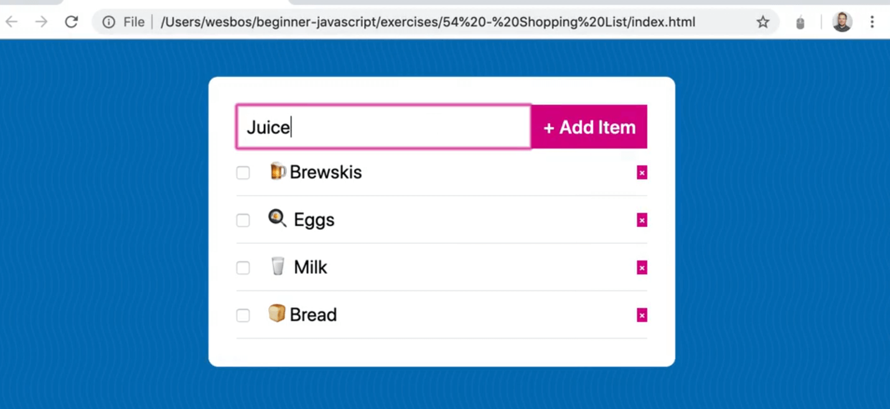

Although you may have written something like this before, Wes has baked a lot of things that we need to learn about JavaScript into this simple example.

We will be learning about emitting **custom events**, such as the one highlighted in the image below (if you don't know what a custom event is, don't worry, we will be learning about it).


We will also be learning about **event delegation**, how do you listen for clicks on things that happen in the future, as well as **DOM events**, and **localstorage**.

If you open up the `index.html` file in the `exercises/57 - Shopping List` directory, let's go over the code that we are starting with.

We have a div with a class of `shopping-list` which contains a form element and an empty `ul`. Within that ul, we will be outputting the shopping list items.

The form has input and submit buttons.

```html
<body>
  <div class="shopping-list">
    <form class="shopping">
      <input type="text" name="item" id="item">
      <button type="submit">+ Add Item</button>
    </form>

    <ul class="list"></ul>
  </div>

  <script src="./shopping.js"></script>
</body>
```

With this exercise, you can right-click and open the file in the browser and everything should still work. However if you do want the live reloading, and instant CSS changes, we can use Parcel, which will give us a server, live reloading and module bundling (which we have yet to learn about).

There are 2 ways to install Parcel on your machine. You can:
1. install it once, to each project, which is what we did in the last exercise, or
2. install it globally on your machine so that anytime you need it you can get a little server up and running.

To install Parcel globally on your machine, open the terminal and type `npm install -g parcel-bundler`. That will globally install Parcel for you, so that anytime you are in a terminal, Parcel will be available to you.


If you are on a Mac and you have trouble installing global modules on your command line, type `sudo` in front of the command like so `sudo npm install -g parcel-bundler`.  That will ask you for a password first.

To check if it worked, you can type `parcel --version` into the terminal and it will tell you what version you have.

Now in the terminal, cd into the Shopping List directory and then type `parcel index.html` in the terminal and hit enter.

There will be a message in the terminal telling on which server it is running (usually localhost:1234).

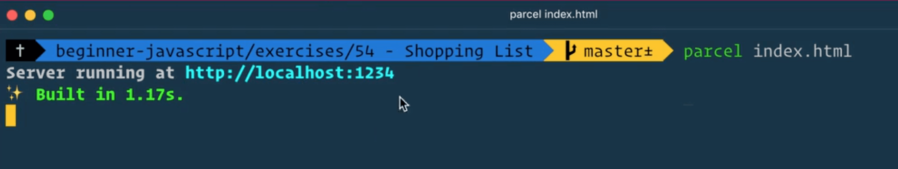


Let's get started. Open the `shopping.js` file, which should contain nothing.

There are a couple of things that need to happen. We need to:
- listen for when someone types into the input and hits the submit button
- keep track of all of the shopping list items and whether or not they are complete
- render out a list of all of the shopping items

_Note: you may notice when you focus into the input to enter a shopping list, all these values of everything you have ever typed show up, like in the picture below. To fix that, you can go to the HTML, you can set autocomplete to false on either the input or the whole form. There is also an `autocapitialize` attribute which you can switch on or off._


```html
<form class="shopping" autocomplete="off">
```

Back to our JavaScript, let's start by grabbing the shopping form and the list elements.

```js
const shoppingForm = document.querySelector(".shopping");
const list = document.querySelector(".list");
```

Next we need an array to hold our **state**.

```js
//We need an array to hold our state
const items = [];
```

What does **state** mean?

The definition changes from framework to framework, but generally what people are saying is that state is a bunch of data that reflects the state of your application.

But what does that mean? Let's use this finished shopping list screenshot below as an example.


In this example, state is going to contain a list of all of your items, a list of those item ids, and whether they have been completed.

If it was a shopping cart, state would be a list of all the items in the card, how many of each item was in the shopping cart, how expensive is each item, etc.

You should always be able to recreate the visual part of your application given just the data.

All of the current state of your application, meaning how it currently is, should always be reflected in some sort of object or array of data and that is what we refer to as **state**.

Next we need to listen for a submit event on the form.

If you refresh the page and try to type an item in the input and hit submit, you will notice that the form submits, it puts `?item=Egg` in the URL bar.

However that is not what we want.

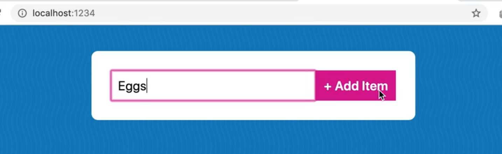


Let's make a submit handler for that.

The first thing the handler needs to do is prevent the form from submitting so add `e.preventDefault()`.

```js
function handleSubmit(e) {
  e.preventDefault();
}
```

Grab the `shoppingForm`, add an event listener on the submit event and pass it the `handleSubmit` callback.

Remember, for forms, we don't use click or enter events because it's much easier to just listen to the submit event. That way, if you submit by clicking, you submit by hitting enter, something else triggers a submit of the form, all of those use cases are covered by a single event called `submit`.

```js
shoppingForm.addEventListener('submit', handleSubmit);
```

If you refresh the page, type in eggs and hit enter, nothing should happen, which is good.

Log "submitted" in the `handleSubmit` function.

Next we need to pull the data out of the input. How can we get that?

Within the `handleSubmit` function, add the following code after we log "submitted".

```js
function handleSubmit(e) {
  e.preventDefault();
  console.log("Submitted!!!!");
  const name = e.currentTarget.value;
  console.log(name);
}
```

If you refresh the page now, type in eggs and hit enter, you should get something like below in the console.


Why are we getting `undefined`?

Let's do a bit of debugging.

Log of `e.currentTarget` in our handler, and then refresh the page. You should see the form element logged.

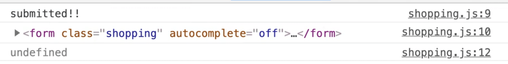

The reason we are getting `undefined` is because the `currentTarget` is the form, not the input and we want to get the text out of the input.  There are a couple ways we could do this.

We could write another query selector to grab it. However, because the input has a name, it's actually accessible via the form dot the name of the input.

```html
<input type="text" name="item" id="item>
```

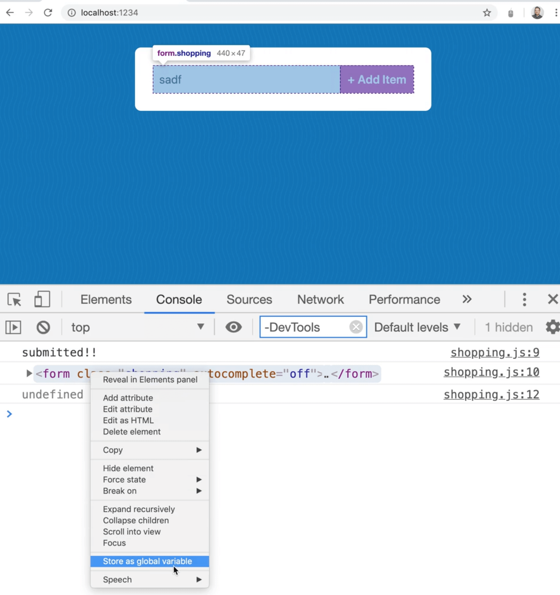

Take the form and store it as a global variable, called `temp1`, then add `console.dir(temp1)` to get every property inside of it.

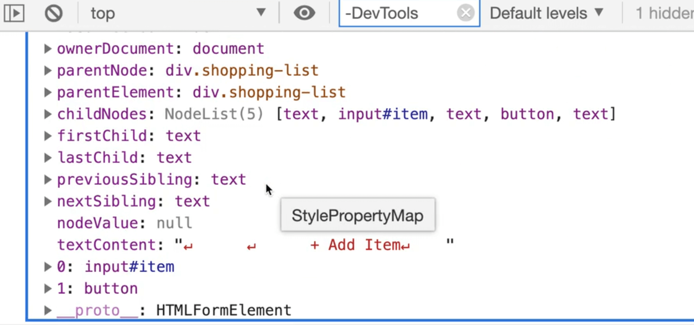

Somewhere inside of all those properties is `item`.

Wes is having trouble finding it but we will demonstrate it with code.

Modify the log of `console.log(e.currentTarget)` to `console.log(e.currentTarget.item)`.

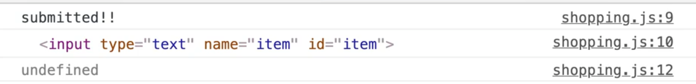

As you can see, we now get the item, not the entire form itself.

Modify the name declaration to `e.currentTarget.item.value` like so 👇

```js
function handleSubmit(e) {
  e.preventDefault();
  console.log("Submitted!!!!");
  const name = e.currentTarget.item.value;
  console.log(name);
}
```

As you can see, now we can capture the value of eggs.


Next step is to store the data about the shopping item in the `items` array, but we cannot just store the straight up string, because we need to be able to store a bit more info about that item.

The other two things we need to know are:
- is it completed (have you bought it or not?)
- what is the ID of the item?

Any time you have a list of items, it's best to give every single one a unique identifier, so you can easily find it from within the list.

That is what we are going to do now.

The name of the item is going to be our name variable.

The id of the item just needs to be something unique. One trick that Wes likes to use is to use `Date.now()` as an ID, which works if you aren't creating more than one item per millisecond, which works for our case.


The third property will be `complete` which we will set to false when the item is added to the list.

```js
function handleSubmit(e) {
  e.preventDefault();
  console.log("Submitted!!!!");
  const name = e.currentTarget.item.value;
  const item = {
    name: name,
    id: Date.now(),
    complete: false
  }
}
```

_Note: when you save the code above, it might refactor it due to prettier to look more like what you see below, which is fine._

```js
const item = {
  name,
  id: Date.now(),
  complete: false,
};
```

Next we need to push these items to our state, which we will do by adding the following code to the `handleSubmit` function.

```js
items.push(item);
console.log(`There are now ${items.length} in your state`);
```

If you refresh the page and try adding a few items, you should see the count in our log increasing.


Next we need to clear the form. There are a few ways we can do this.

One way is to set the item's value to nothing like so 👇

```js
event.currentTarget.item.value = '';
```

Another way you can do it, and this works if there are multiple inputs, is to call `e.target.reset()`.

That will clear all of the inputs in a particular form.

Notice that we used `e.target` not `e.currentTarget`. If we used `e.currentTarget` it would still work the same in this scenario.

```js
function handleSubmit(e) {
  e.preventDefault();
  console.log("Submitted!!!!");
  const name = e.currentTarget.item.value;
  const item = {
    name,
    id: Date.now(),
    complete: false,
  };
  // push the items into our state
  items.push(item);
  console.log(`There are now ${items.length} in your state`);
  // clear the form
  e.target.reset();
}
```


When we have a form event, it will only actually ever fire on the form, it doesn't bubble like our clicks and hovers do.

In this case, there is no upside or downside to using `target` vs `currentTarget` to reset the form using the `.reset()` method.

So far we have written code to enter an item and push that item up to state.

Next, we need to display the items that are in our state. Create a function called `displayItems` which will loop over each item in the array and return a list item for each.

What is the best method to loop over an array and return some HTML for each one? Map!

Why?

Let's go over a little demonstration in the console. Let's say you have an array of names like `const names = ['wes','kait'];`.

You can call `map` on the `names` array which will go over each of them and then you can just wrap each one in a list item tag as a string using interpolation and then you can call `.join('')` on the returned array to join all the list item strings like in the image below.

That is what we will be doing with the `items` array.

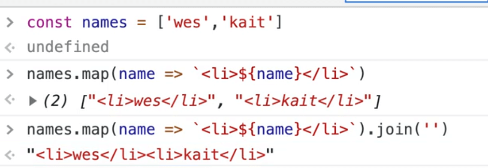

```js
function displayItems() {
  console.log(items);
  const html = items.map((item) => `<li>${item.name}</li>`);
  console.log(html);
}
```

Now how do we run `displayItems`? You might be thinking that we need to display them after we submit, right?

We could just add `displayItems()` right after the `e.target.reset()` call within the `handleSubmit` function. That is okay for now, but Wes will show us a better way to do it, and why, with custom events. For now, just add it to our `handleSubmit()` function.

Refresh the page and test that out by adding a few items: egg, milk and then beer, and you should see something like what is displayed below in the console.

We pushed the item into state, and then once that is finished `displayItems` run and that loops over each item and returns a list item with each of them.


A couple of problems there...

First, the list items returned to us are in an array, not in an HTML string.

To fix that, add a `.join('');` on the `html` variable declaration like so:

```js
const html = items.map(item=>`<li>${item.name}</li>`).join('');
console.log(html);
```

Now as you can see, we are returned one string.


Take the list and set the innerHTML of it, within the `displayItems` function.

```js
function displayItems() {
  console.log(items);
  const html = items.map((item) => `<li>${item.name}</li>`);
  list.innerHTML = html;
}
```

Now when you type in an item and enter submit, you will see it displayed.

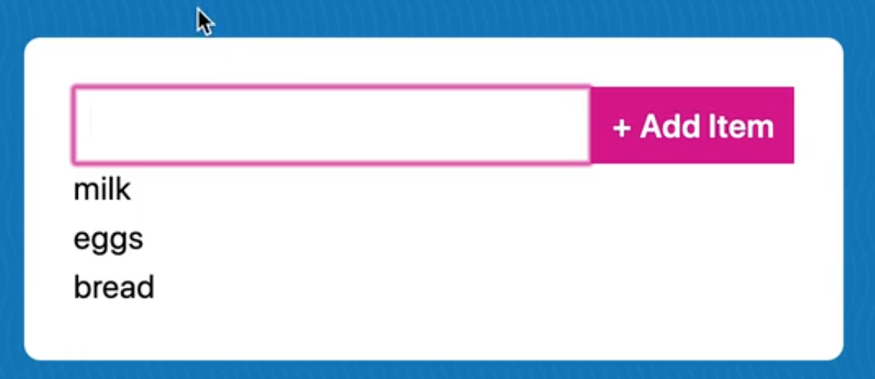

We need to add a bit more to our HTML like a delete button and a complete checkbox. Let's scaffold the HTML out a bit more for each item.

Add a class of `shopping-item` to each list item.

We also need to add a checkbox as well as a button with `&times;` which should give us an x.

```js
function displayItems() {
  console.log(items);

  const html = items
    .map(
      (item) => `<li class="shopping-item">
      <input type="checkbox">
      <span class="itemName">${item.name}</span>
      <button>&times;</button>
      </li>`
    )
    .join("");

  list.innerHTML = html;
}
```

If you refresh the page and try entering items, you should see something like the following 👇


We need to fix a few things here.

The button that we added is currently not accessible to people who are using screen readers. If the screen reader were to read to the user what is currently on the page, it would read the item's name and then the multiplication sign, which makes no sense.

What we can do to fix that is to add an `aria-label` attribute to it.

For sighted users, nothing changes, but for people using a screen reader, when they tab over to it, it will tell them "remove bananas" instead.

```js
<button aria-label="Remove ${item.name}">&times;</button>
```

Another thing we need to do is when you check one of the items, we need to add the item to our state and update the checked property.

First, let's fix the problem happening now where if you don't type anything into the input and hit enter, you will see we are able to submit a lot of blanks.

One way to fix that would be to add the required attribute to the input, as shown below.

```js
<input type="text" name="item" id="item" required>
```

That is an example of **client-side validation**.

Another thing we can do is say if there is no name, return within our `handleSubmit` function like so 👇

```js
function handleSubmit(e) {
  e.preventDefault();
  console.log("Submitted!!!!");
  const name = e.currentTarget.item.value;

  // if it's empty, then don't submit it.
  if (!name) return;

  const item = {
    name,
    id: Date.now(),
    complete: false,
  };
}
```

Now if you try to submit a blank input, you will see that no item is added because we just return from the function.

If you try entering any of the following: `0, null, undefined, false` in the input, it will still get added to the list instead of being returned, even though they are falsy.

Why is that? Because they are all strings, and not types.

Let's go back to how we are calling `displayItems` each time the `handleSubmit` function is called. The reason Wes doesn't love that approach is because it tightly couples the `handleSubmit` with the displaying of the items.

What will happen is that we will also need to display the items when they are restored from localstorage (when we refresh the page, we want the items to still be there) so we would need to call it again.

We also need to display the items when we mark them as complete.

When we delete an item we will need to re-run `displayItems` because there is now one less item. And we call `displayItems` from a couple of other spots.

Having those functions so tightly coupled now isn't a big deal but what happens in larger JS applications is you may need to do more things after you display the items, and then sometimes you won't want to run all those other things after displaying the items. So what people end up doing is copy and pasting the function and modifying it slightly which causes duplicated logic.

Instead, what we are going to do is use the event system in JavaScript to fire off our own events, and then listen for them.

We are going to listen to an item updating event, and then anyone who cares about that event can listen for it, just like if it were a click or a hover.

That allows us to decouple it, and you will see this pattern a lot in JavaScript applications.

Let's do that right now.

Instead of displaying our items, we will fire off a custom event which will tell anyone who cares that our items have been updated.

We will be using the term **dispatch** which means an event happens.

When you click on something, the browser dispatches a click event.

We need something to fire off an event about that data and we need to attach it.

If we look at our HTML, we will probably fire off the event from this list. You could also fire it off from the form or the body, it doesn't matter that much.


At the bottom of the `handleSubmit` function, run `list.dispatchEvent()`. The `dispatchEvent` method lives on all DOM elements. You provide it a `CustomEvent`, which is a constructor in the browser.

As you can see, it's just a function.

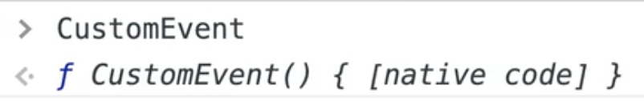

```js
new CustomEvent('PIZZAS HERE')
```

If you were to run it by passing the name of your event, as shown above, you should see something like the image below in the console.


It gives us the type of events, as well as any details about when it is fired.

So when we want to dispatch a custom event, we must first create a new `CustomEvent`, by passing the constructor the name of the event.

```js
list.dispatchEvent(new CustomEvent('itemsUpdated'));
```

If you try to add an item now, nothing happens, it just dispatched that event. No one is listening for `itemsUpdated` so no one cares, but if we go down to the bottom of the JavaScript file, where we have added our event listeners, we can listen for that event like so...

```js
list.addEventListener('itemsUpdated', displayItems);
```

Now when you add an item, you will see it in the list. That is because we are dispatching the `itemsUpdated` event and also listening to it, and then calling `displayItems` when it fires.

You can add as many event listeners to the same event as you want.

If we were to add the following code and refresh the page and add an item, we can see the details of the event.

```js
list.addEventListener('itemsUpdated', (e) => {
  console.log(e);
});
```


You can see all sorts of details such as the path, which is pretty neat because it shows you the path at which the events have bubbled through. It was first triggered on the `ul`, then bubbled up to the shopping list, then the `body`, `html`, `document` and then the `window`.

That is a **custom** event, which Wes uses often when working with vanilla JavaScript to keep concerns separate, instead of tightly tying them together.

Remove the second event listener where we are just logging the event.

## LocalStorage

Next, we want to mirror the data to **localstorage**.

Localstorage is kind of like a mini database that lives in your browser. It allows users who are using your website to come back with the same browser and pickup from where they last left. It does not send data to a server. It's just the ability to save some data in the user's browser.

If you go to the "Application" tab of the chrome developer tools and look at localstorage, and then click on the domain name, you won't see anything. However Wes has already completed it so he has values there. There is all this information in his localstorage about the items.


So what we want to do now is create a function that will mirror our data to localstorage.

```js
function mirrorToLocalStorage() {
  console.info('Saving items to localstorage');
}
```

When we add something, we need to listen for the event, and then mirror all the items to localstorage.  Let's duplicate our event listener and call `mirrorToLocalStorage` when the `itemUpdated` event is triggered. Add the following code where we call the rest of our event listeners..

```js
list.addEventListener("itemsUpdated", mirrorToLocalStorage);
```

See how nice having a custom event is?

Anyone who cares about items updating can listen in on the event.

If you try typing in an item, you should see logged in the console "Saving items to localstorage".

How do you save items to localstorage?

The API is pretty simple.

If you type in `localStorage` in the console, it will return to you everything that is in localstorage.

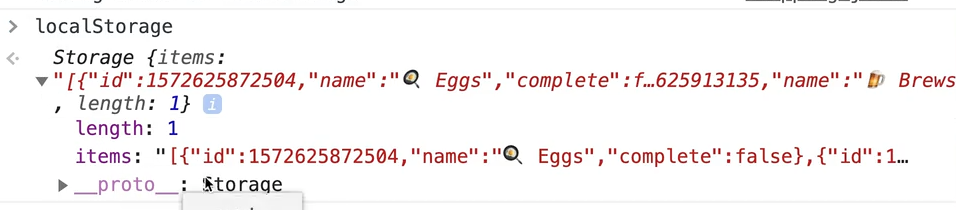

To set an item in localstorage, you can use `localStorage.setItem()` where you pass in the key and the value.

To get an item from localstorage, you can use `localStorage.getItem()` to which you pass the key that you are looking for.

If something funky is happening with localstorage, it's best to just clear it out and start fresh which you can do by clicking this button in the Applications tab.


So how are we going to save items to localstorage?

What if we do something like the following 👇

```js
function mirrorToLocalStorage() {
  localStorage.setItem(items, items);
  console.info("Saving items to localstorage");
}
```

If you take a look, you will see `[object Object]`.. what is that? If you try to open it up, you can't, it's just the word object.


Why is that? That is because localstorage is text only. That means if you have an object or an array or a boolean, it will try to convert that item to text first before it puts it in.

Every single type has a `.toString()` method, which will convert it to a string.


If you have an object, and you call `.toString()` on it, it just gives you `"[object Object]"`, which is not helpful at all.

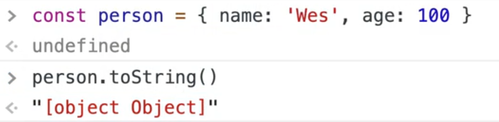

That is what is happening here, because we are passing it an object, it is trying to convert it to a string which isn't very helpful because there is no data for that.

So how do you convert objects to strings?
Using JSON.

If you call `JSON.stringify()`, you can pass it an object, and it will convert that object to a string representation of that object.

At a later point in time, we can do the opposite which is `JSON.parse()`. If you pass it a string, it will convert it back to an object.

That is exactly what we will do here. Before we put the object into localstorage, we will convert it to a string and when we pull it out of localstorage, we can convert it back to an array of objects.

Modify the code as shown below.

```js
function mirrorToLocalStorage() {
  localStorage.setItem(items, JSON.stringify(items));
  console.info("Saving items to localstorage");
}
```

If you try to add some items now, you will see those changes reflected in localstorage.

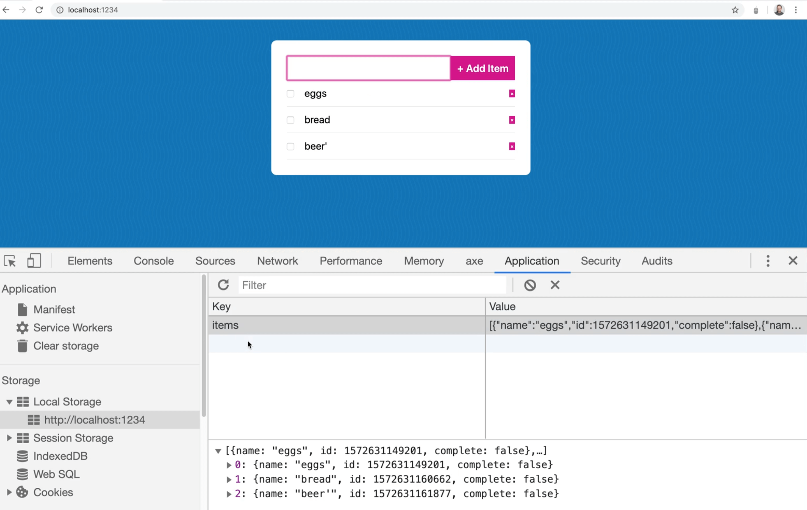

In order to mirror everything to localstorage, we need another function that restores from localstorage when you load the page.

```js
function restoreFromLocalStorage() {
  console.log('Restoring from localstorage');
}
```

We will run that on page load so you can add the call `restoreFromLocalStorage()` to the end of the JavaScript file.

If you refresh the page, you should see the message in the console.

Now we need to pull the items from localstorage.

To do that, call `localStorage.getItem()` which will bring us back a large string of text. Convert it back into an object by wrapping the `getItem` method around `JSON.parse()` which will convert the text back into an array of objects 👇

```js
function restoreFromLocalStorage() {
  console.info("restoring from LS");
  const lsItems = JSON.parse(localStorage.getItem("items"));
}
```

Next we want to check if there are any items in the `lsItems` array, because it could be that this is the first time the user is loading the application, and there isn't even an empty array yet.

If there is something in localstorage, we will assign the value to the `items` variable and then dispatch the `itemsUpdated` event.

```js
if (lsItems.length) {
  items = lsItems;
  list.dispatchEvent(new CustomEvent('itemsUpdated'));
}
```

However if you refresh that you will see an error in the console that "items" is read-only.

Why? Because it's a const variable.

We can fix that a few ways. We can change the variable from a `const` to a `let`, or push all the items into the items array like so 👇

```js
lsItems.forEach(item=> items.push(item));
```

We could also use a combination of push and the spread operator as shown below.

```js
items.push(...lsItems);
```

Why does that work?

That works because push takes unlimited arguments. We could have called `items.push(lsItems[0], lsItems[1])` and that would have worked fine, but using the spread operator it takes each item in the array and spreads it into the method as an argument.

Two more things we need to do. We need to handle:
1. the clicking of the checkboxes. As it stands right now, you can check the item but when you refresh the page, it will no longer be checked. It is not being mirrored to the state
2. The deleting of items

Let's start with deletion.

You might think we could select the buttons on the page, loop over them and listen for a click, and when that happens, remove it from our array. That is kind of right, but let's show you why that doesn't exist.

Add the code below to the very bottom of the JavaScript file/

```js
const buttons = list.querySelectorAll('button');
console.log(buttons);
```

You should get 5.

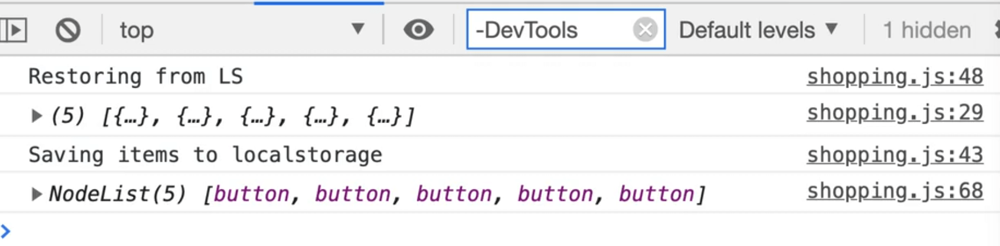

However, if you move that code further up, above the event listener declarations, we get none.

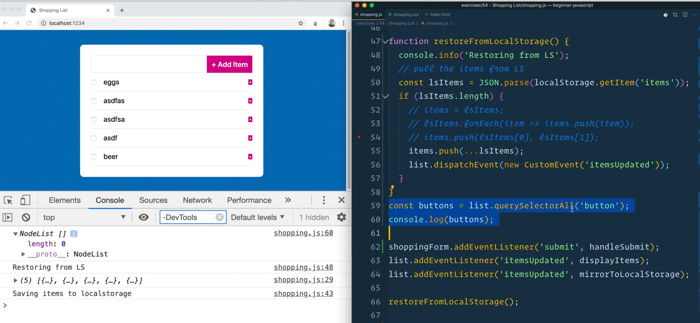

Why is that?

Because when we run the code from a bit further up in the file, none of the rest of the code below it has been executed and thus all those event listeners have not yet been created. So that means we have not yet created any of the items.

If you throw a `debugger;` after  `console.log(buttons);` and refresh the page, you will see that when the debugger hits, there are no items yet.

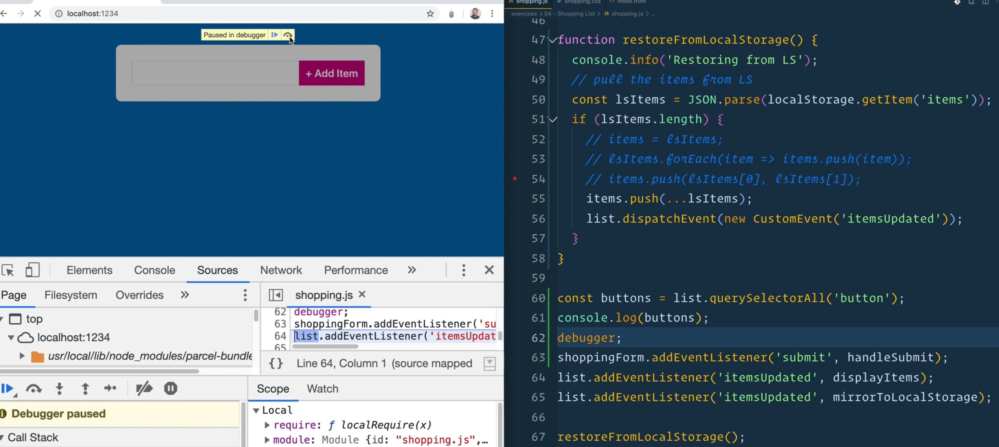

That happen a bit later. So you may think it's safe to leave that code at the very bottom of the page. Let's try that.

Create a function `deleteItem` which takes in an `id` and for now simply logs that it is deleting an item.

```js
function deleteItem(id) {
  console.log("DELETING ITEM!");
}
```

If you try pressing all the delete buttons, you will see that it works.

However, if we were to add a new item, if you click on the x, it doesn't say deleting item.

If you try to click any of the delete buttons that worked before we added the item, you will notice that it no longer works.

Why?? There are 2 things going on.

If you try to listen for clicks on things that do not exist on the page, it will not attach an event listener to that element. That is why the code behaved so differently when we moved it above the event listeners.

The second problem is that when we add a new item, it re-renders the entire list.

If you have the console open while you add an item, you will notice that for a second the `ul` disappears and is added back, because it is re-rendering.

That is because we have re-run the `displayItems` function, and it's actually creating a brand new list item each time.

When you remove an item from the DOM, and replace it with a new item, all of those event listeners are lost.

We would have to manually add them back, which is a pain.

So what do we do?

## Event Delegation

We can use a concept called **event delegation**.

What that means is instead of listening for clicks on things that might not exist yet, or things that will come in the future, what we do is listen for clicks on things that we do know will be there, and then we check if the things that they actually clicked on is a lower item.

Let's demonstrate this.

Get rid of the button log and query selector, but keep the `deleteItem` function.

Let's listen for a click on the list, and then in the event handler log both `e.target` and `e.currentTarget`.

```js
list.addEventListeners('click', function(e) {
  console.log(e.target, e.currentTarget);
});
```

If you refresh the page and then click anywhere on it, you will see that it thinks we are click on the span, even though we listened on the list.


Now if you click on the x next to an item, we listened on the list but we actually clicked on the button.

`currentTarget` is the thing that you listened on and the `target` is the thing that you actually clicked on.


Now we need to check if what was clicked matches the button, using `e.target.matches('button')`. That will check if an element matches a CSS selector, which in this case is `button`, then we will delete the item by passing the delete method the id of that item.

```js
// event delegation: We listened for the click on the list <ul> but then delegate the click over to the button if that is what was clicked.
list.addEventListeners('click', function(e) {
  if (e.target.matches('button')) {
    deleteItem();
  }
});
```

Now, when you click on any X next to an item, you should see "DELETING ITEM".

If we add a new item and then click on it's X button, we should still see "DELETING ITEM", because we are simply just listening on the `ul` and delegating the event to the delete button.

One more thing we should mention is that whenever we add an item to the list, we re-render the entire list. We are basically deleting the existing list and adding a brand new one. This happens so quick you can't even see it happening but on large applications, that can slow down how your application works.

That is where frameworks like Angular, React, Vue come in handy. They know how to instead of re-rendering the entire list, only update a specific piece of it.

Just changing part of the DOM rather than wiping it out leads to better performing applications. That is hard to do in just Vanilla JS. For our purposes, the way we are doing it is fine.

Next, when someone clicks on the x, we need to figure out which item id is it related to. Give the button a value of the item's id upon creation, as shown below  👇

```js
function displayItems() {
  console.log(items);

  const html = items
    .map(
      (item) => `<li class="shopping-item">
        <input type="checkbox">
        <span class="itemName">${item.name}</span>
        <button
          aria-label="Remove ${item.name}"
          value="${item.id}"
        >&times;</button>
      </li>`
    )
    .join("");

  list.innerHTML = html;
}
```

Now when you look at the HTML, you should see the id is in the button.

Pass that value to the `deleteItem` function.


Modify the code like below.

```js
list.addEventListener("click", function(e) {
  if (e.target.matches("button")) {
    deleteItem(e.target.value);
  }
});
```

Add a log for the id in the `deleteItem` function.

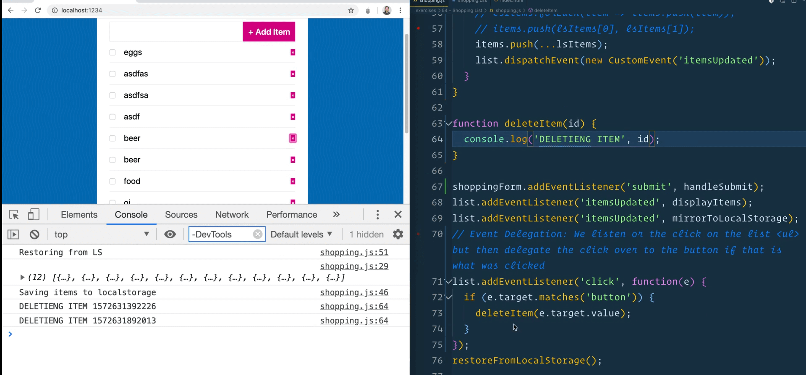

That works now, because when you click on the button, you take the value of the button and pass it as an argument to `deleteItem`, which then logs that argument.

How can we update our `items` array to remove that one item?

It's actually pretty simple. Filter for every item that is not the one with the ID.

```js
const newItems = items.filter(item => item.id === id);
```

That is the opposite, but we will flip it in a second.

Now if you press the delete button next to an item, we get nothing.


If we change the code from `===` to `==` will it work?

Let's try that. Modify the code like below.

```js
const newItems = items.filter(item => item.id == id);
```

Why does it work with double equals?

That is because the `id` is being stored as a number, but when you pull it out, it is returned as a string.

```js
deleteItem(parseInt(e.target.value));
```

When you pass the value to the `deleteItem` function, you can wrap it in `parseInt` as shown above, which will convert it to a number for us.

Now you can add back the triple equals.

Now when you click the button, you will get the item that needs to be removed.


```js
const newItems = items.filter(item => item.id !== id);
```

We actually want the opposite so modify the line of code as shown above 👆.

If you were to click the delete button for an item now, and you had 12 items, you would only get 11 returned.


We need to get the new items into our items array. How can we do that?

In our case, we just want to overwrite the entire list. To do that, change the declaration of the `items` array from a `const` to a `let`.

In `deleteItem`, modify the code so instead of assigning the filter to a variable `newItems`, you will assign it to `items` instead so it overwrites whatever the previous value was.

```js
function deleteItem(id) {
  console.log("DELETING ITEM!!!", id);
  items = items.filter((item) => item.id !== id);
}
```

Now if you click the items, you can tell they are deleting because the array that is being logged keeps getting smaller but if you refresh the page, you will see they are all still there.

There are 2 things we need to do. We need to:
1. re-render everything
1. localStorage

You might notice that both of those things are bound to the `itemsUpdated` event. That means you can just fire another `itemsUpdated` event as shown below 👇

```js
function deleteItem(id) {
  console.log("DELETING ITEM!!!", id);
  items = items.filter((item) => item.id !== id);
  list.dispatchEvent(new CustomEvent("itemsUpdated"));
}
```

Now it should just work, and when you click the item, it should be removed as you do it.

Why?

Because your event listener is listening for the items to be updated and then will do the respective work, mirroring them to the page and updating.

The last thing we need to do is handle the checking and un-checking of the data.

If we have 3 items and 2 were checked, that information should persist when we refresh the page.

Create another function, `markAsComplete`, which will take in an `id`.

What do we listen for in our case? We want to listen for a check of the checkbox.

We can use event delegation for that as well. We could add another event listener or do it inside of our existing click event listener.

Let's do it inside of the existing one.

```js
list.addEventListener("click", function(e) {
  if (e.target.matches("button")) {
    deleteItem(parseInt(e.target.value));
  }

  if (e.target.matches('input[type="checkbox"]')) {
    markAsComplete();
  }
});
```

Our checkbox input currently does not have an `id` on it, so let's fix that.

Go to where we make the HTML and modify the code as shown below.

```js
const html = items
  .map(
    (item) => `<li class="shopping-item">
      <input type="checkbox" value="${item.id}">
      <span class="itemName">${item.name}</span>
      <button
        aria-label="Remove ${item.name}"
        value="${item.id}"
      >&times;</button>
    </li>`
  )
  .join("");
```

Now, we have the value of the `id` in the input so we can go to our event delegation and pass the id like so 👇

```js
if (e.target.matches('input[type="checkbox"]')) {
  markAsComplete(parseInt(e.target.value));
}
```

Now when you check them, you should see "marking as complete" with the id logged to the console.

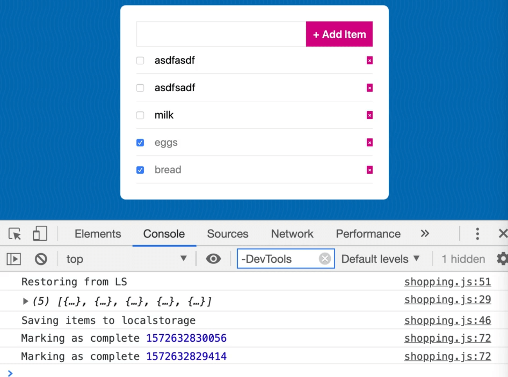

We are repeating ourselves a bit in our event delegator so refactor it as shown below 👇

```js
list.addEventListener("click", function(e) {
  const id = parseInt(e.target.value);

  if (e.target.matches("button")) {
    deleteItem(id);
  }

  if (e.target.matches('input[type="checkbox"]')) {
    markAsComplete(id);
  }
});
```

Back to the `markComplete` function, we have to actually find the item that we need to set as completed.

How do we look for it? We can use `find`.

Look for an item whose `id` matches the `id` that was passed in, using the code below. 👇

```js
function markAsComplete(id) {
  console.log("Marking as complete!", id);
  const itemRef = items.find((item) => item.id === id);
  console.log(itemRef);
}
```

The reason we called it `itemRef` because if we change a value on the objet, it will be reflected in the array of items. So we can update the value of the item's `complete` property easily.

```js
itemRef.complete =
```

This function will be used to check the item on and off.

You could have an if statement that says if it's true, set to false and if false, set to true.

Or you can just set it to itself, but the opposite, as shown below 👇

```js
itemRef.complete = !itemRef.complete;
```

That should work because the opposite of true is false and vice versa. Thus, setting it to the bang version of itself should work.


Now all you have to do is dispatch the `itemsUpdated` event because after updating the items.

```js
itemRef.complete = !itemRef.complete;
list.dispatchEvent(new CustomEvent('itemsUpdated'));
```

You will notice that if you try to enter an item and the check it, it looks like nothing is happening.

However if you go to the application tab, you will see that the localstorage values are updating.


What is going on?

What is happening is the value is toggling true to false, but the checkbox is never working because we have not yet supplied the "checked" attribute to it when we rendered our HTML.

Modify the code as shown below to add the checked attribute 👇

```js
const html = items
  .map(
    (item) => `<li class="shopping-item">
      <input
        type="checkbox"
        value="${item.id}"
        checked="true"
      >
      <span class="itemName">${item.name}</span>
      <button
        aria-label="Remove ${item.name}"
        value="${item.id}"
      >&times;</button>
    </li>`
  )
  .join("");
```

Now all the items will be checked by default.

One of the things about the checked attribute is if you do `checked="false"`, they will still maintain checked. Even just passing `checked` as shown below works.

```js
<input type="checkbox" value="${item.id}" checked />
```

The absence of the checked attribute marks something as unchecked.

If the checked attribute is true, you need to add the checked attribute, otherwise we will pass nothing.

Do that by modifying the code as shown below 👇

```js
const html = items
  .map(
    (item) => `<li class="shopping-item">
      <input
        type="checkbox"
        value="${item.id}"
        ${item.complete ? 'checked' : ''}
        >
      <span class="itemName">${item.name}</span>
      <button
        aria-label="Remove ${item.name}"
        value="${item.id}"
      >&times;</button>
    </li>`
  )
  .join("");
```

We could have also used the `&&` operator instead like so 👇

```js
${item.complete && 'checked'}
```

Now if you refresh, the check marks should stay as they were.

That was a lot, but that is how all of those frameworks work.

You basically have some state, you write a bunch of handlers to update state and to modify it, filter it, change it. When that state changes, you re-render out the HTML that is on the page.

One last thing is that security, which we will go over in future lessons in more details.  Right now, if you wanted, you could submit an image as a list item input, which is a security issue. When you take input from a user and then display it in the HTML, we need to clean all the data the user types in.
