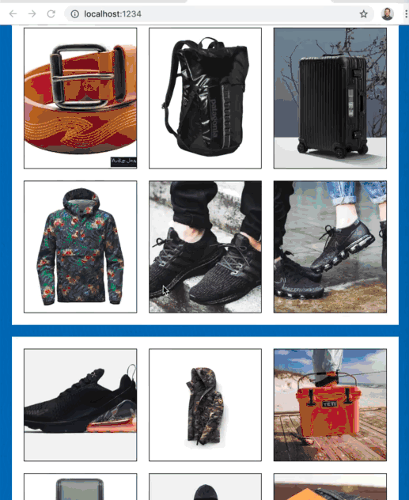
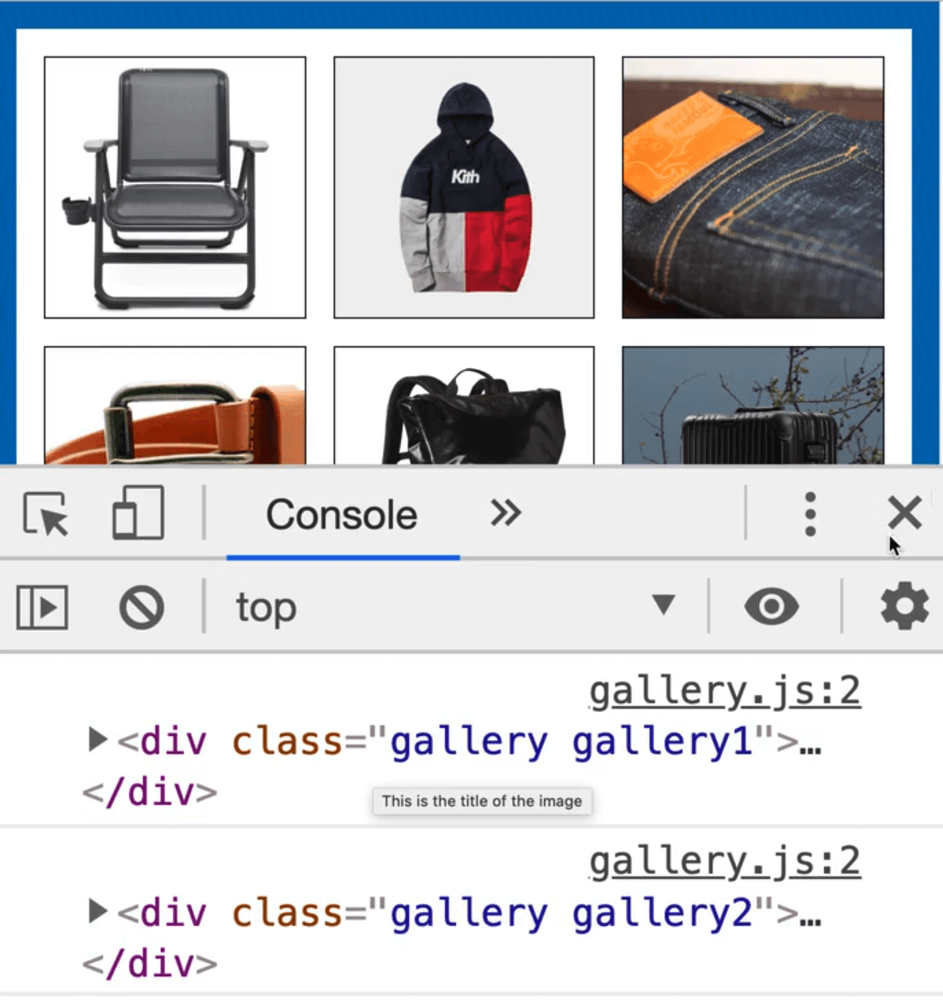
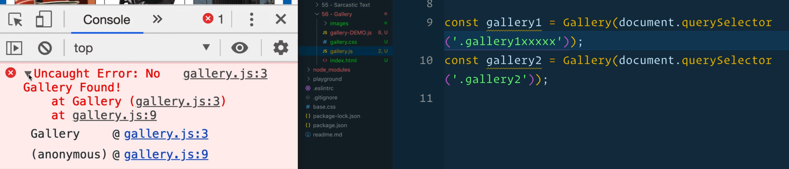
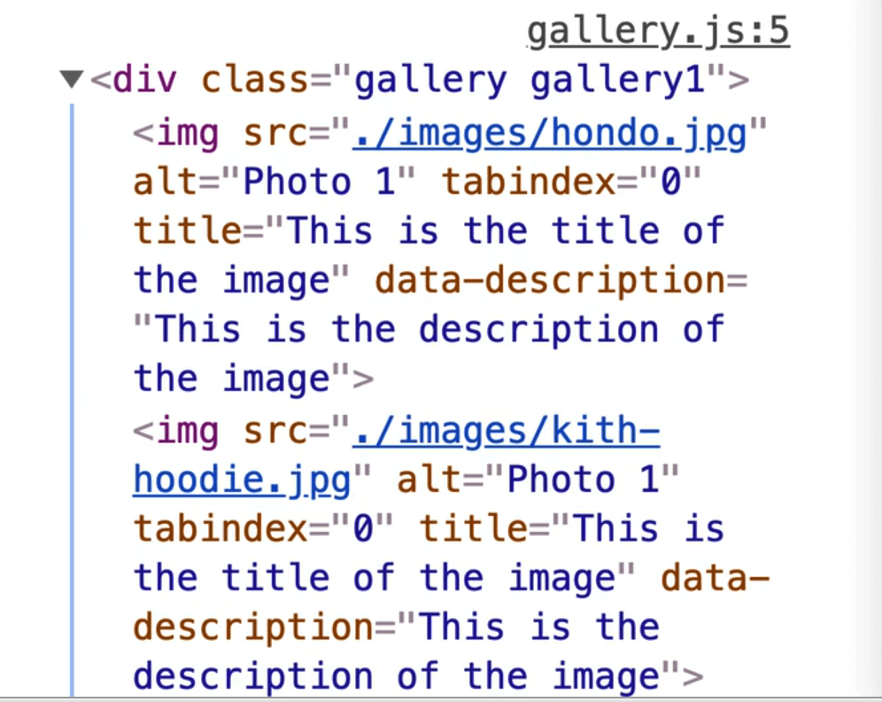
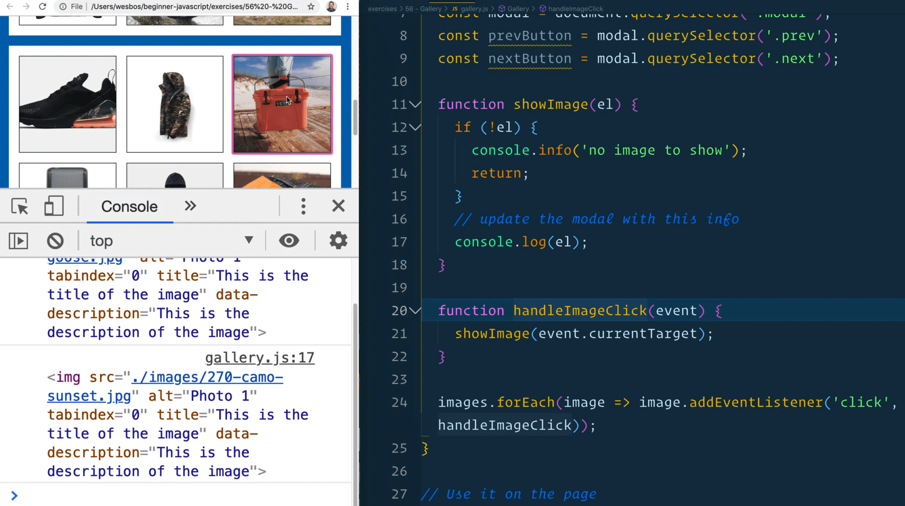
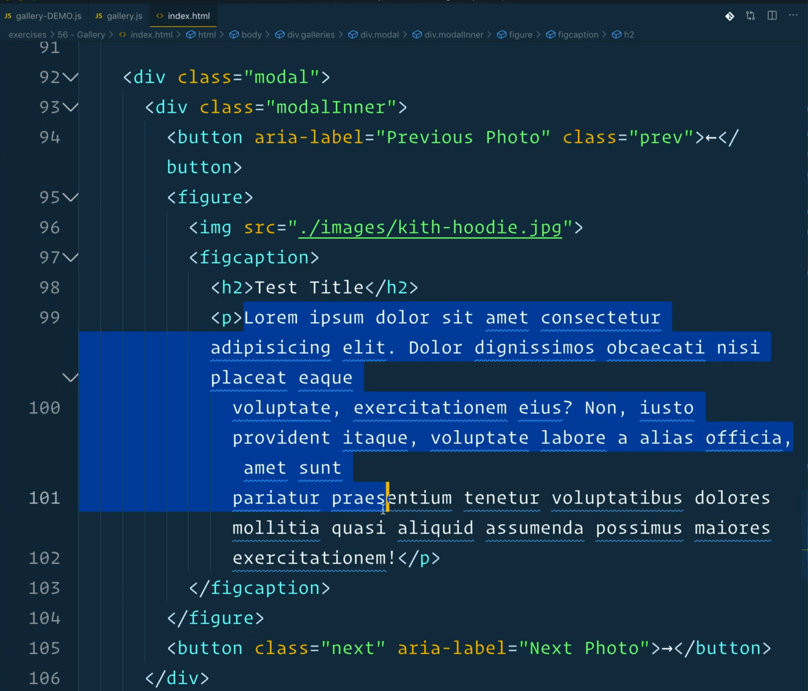
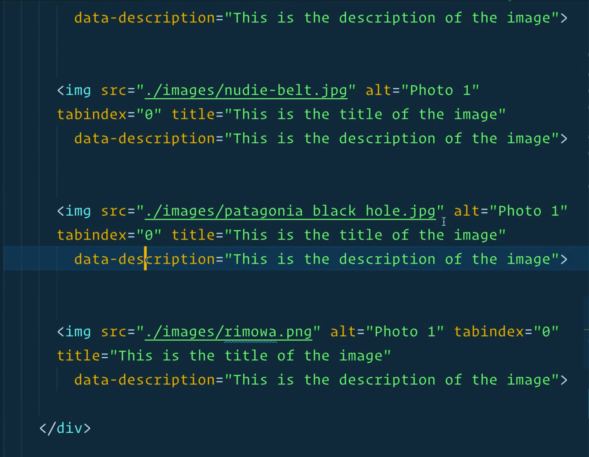
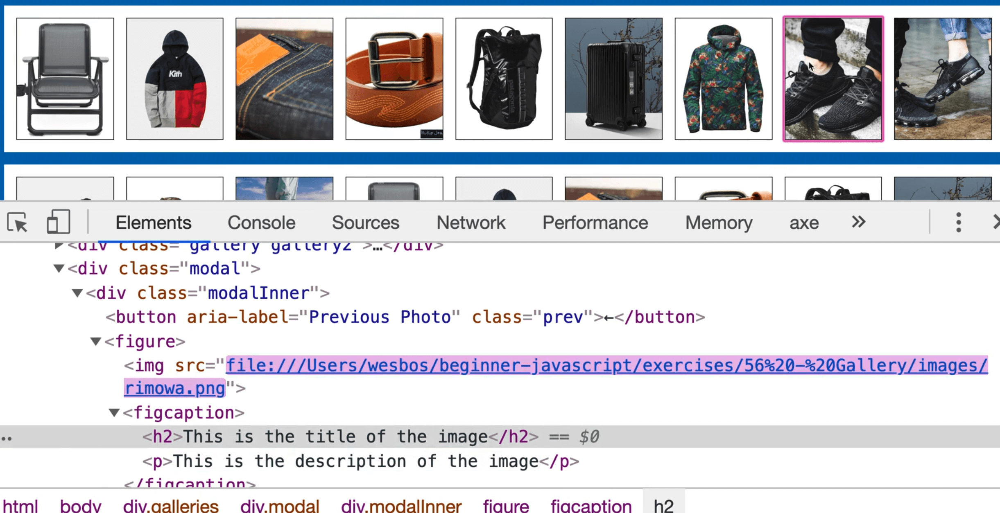
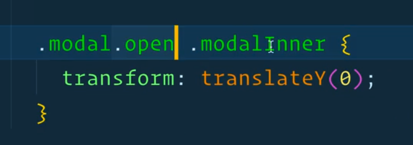

In this exercise we will be building a gallery.


We are going to be building it in a standard way, and then come back and refactor it for prototypes once we understand what those are. Then we are going to come back to this exercise a third time and refactor the gallery for classes.

Hopefully that gives you a good idea about why we need prototypes and what classes are.

This is an interesting example already because we want the ability to use this JavaScript many times over. A lot of the JavaScript we have written so far assumes that things are on the page and that there is only ever one of them.



This gallery allows you to tab through the images when they are tiled and select an image and have it open up larger with an overlay. The image has arrows on each side, allowing the user to navigate back and forth by clicking them or using the arrow keys, you can press the escape key to close the overlay view. It is basically a full featured gallery.

However, if we were to have another completely separate gallery below, we should be able to re-use the same code and have it function in the same way, while keeping both galleries separate.

So in this video we will be building the gallery from the ground up, multiple times, with the ability to re-use it multiple times.

We will be working from the exercises directory, specifically `58 - Gallery`. Open up the `gallery.js` file to get started.

## Closures

The first thing we need to do is create a closure.

We learned a couple lessons back that a closure is the ability to create a function, and that functions have scope.

```js
function Gallery(gallery) {

}
```

For example, the function shown above will have scope.

If inside of that function you were to make some variables, such as a variable to hold all the buttons, and also create another function called `showNextImage` which references those button variables, then you have created a closure.

```js
function Gallery(gallery) {
  const buttons = gallery.querySelectorAll('button');
  function showNextImage() {

  }
}
```

That means that the gallery function will run when we create it, and the function `showNextImage` will exist for things like click handlers. The variables (`buttons`)  that have been created in between the 2 functions (`Gallery` and `showNextImage`) will still be accessible even after the `Gallery` function has closed and stopped running.

We are going to use that concept to allow us to create scope for each of the galleries, so that they don't interfere with each other but they can reuse the same code.

If you added any of the code, clear out everything within the `Gallery()` block.

The idea with the Gallery is that at the end of writing the code, we have built almost like a plugin and we can go ahead and use it on the page.

The idea is to be able to do something as shown below.

```js
const gallery1 = Gallery();
```

Soon there will be a `new` keyword before we do ` = Gallery()` but for now we don't need that.

If we go to the `index.html` that is on the Gallery exercises directory, you will see that we have a `div` with class of `gallery1`, and then a secondary gallery.


Pass the gallery function reference to the gallery we want, which is the first one.

```js
const gallery1 = Gallery(document.querySelector('.gallery1'));
const gallery2 = Gallery(document.querySelector('.gallery2'));
```

From the beginning we will be running these examples with 2 different galleries so that we know that every line of code that we are writing is safe for re-use over time.

The first thing we want to do is log the gallery from within the `Gallery` function. When you refresh the page, you should see both `gallery1` and `gallery2` logged.



One helpful thing we can do is if no gallery argument was provided, throw an error that says "No Gallery Found".

By throwing an error like that, it will be logged to the console.

```js
function Gallery(gallery) {
  if (!gallery) {
    throw new Error('No gallery Found!');
  }
}
```



If instead you want the function to gracefully degrade, you can simply return without throwing anything. That will break and exit the function without throwing any errors in the console.

Keep the code you added above.

Next you need to select the whole bunch of images.

Previously, Wes has been selecting everything at the top of the file, however, since we need to select these things for each of our instances, we will be selecting the images from _within_ the `Gallery` function.

The first thing you need is a list of all of the images. Instead of using `document.querySelector` however, you need to make sure it's scoped to the gallery element that was passed in to the function.


Use the `gallery` variable as our selector. For the list, use `Array.from()` because you will need to loop over it at some point.

Add the following code 👇

```js
const images = Array.from(gallery.querySelectorAll('img'));
console.log(images);
```


If you add that code and look at the console, you will notice it is empty.

Let's debug that.

Start by logging `gallery` before we declare the `images` variable.


As you can see, the gallery is showing up.



If we look inside of the gallery, we can see lots of image elements.


The next thing you need is the modal, with the next and previous buttons.

If you take a look at the HTML Wes has provided us with, he has scaffolded out the HTML for showing the modal.

```html
<div class="modal">
  <div class="modalInner">
    <button aria-label="Previous Photo" class="prev">←</button>
    <figure>
      
      <figcaption>
        <h2>Test Title</h2>
        <p>
          Lorem ipsum dolor sit amet consectetur adipisicing elit. Dolor
          dignissimos obcaecati nisi placeat eaque voluptate,
          exercitationem eius? Non, iusto provident itaque, voluptate
          labore a alias officia, amet sunt pariatur praesentium tenetur
          voluptatibus dolores mollitia quasi aliquid assumenda possimus
          maiores exercitationem!
        </p>
      </figcaption>
    </figure>
    <button class="next" aria-label="Next Photo">→</button>
  </div>
</div>
```

So we have a `figure` with an `img`, a `figcaption`, an `h2`, a paragraph.

WHen someone clicks on an image in the gallery, that will open the modal and we will swap the text content of the modal out with the content associated with that image.

Start by selecting the modal. Do that with the `document` selector because in this instance, the markup for the modal will be shared between the galleries because we can only ever have one modal open at a time.

After that, look inside of the modal for the previous and next buttons.

Add the following code to do so 👇

```js
const modal = document.querySelector('.modal');
const prevButton = modal.querySelector('.prev');
const nextButton = modal.querySelector('.next');
```

For the rest of this exercise, we will be chunking up the functionality into a bunch of little functions.

Those functions will be responsible for showing the image, opening and closing the modal, listening for clicks... there is a lot going on!

This is a great example of how you can take a JavaScript app and make it simpler by breaking it into smaller, little functions.

Let's start with the showing of the image.

When someone clicks on one of the images, you need to update that modal with the associated images, as well as pop open the modal.

Name the function `showImage`. It will take a reference to an image element as a parameter which we will call `el`.

Within that function, check whether a reference to an image was passed.

We are adding these checks because sometimes if for some reason something is broken when the function is run, having those safety checks will prevent the application from breaking on your page.

If a reference was not passed, log the message "no image to show" and return from the function.

Otherwise, we will update the modal with that image's information but for now just log `el`.

The function should look like below.

```js
function Gallery(gallery) {
  if (!gallery) {
    throw new Error("No Gallery Found!");
  }

  const images = Array.from(gallery.querySelectorAll("img"));
  const modal = document.querySelector(".modal");
  const prevButton = modal.querySelector(".prev");
  const nextButton = modal.querySelector(".next");
  function showImage(el) {
    if (!el) {
      console.info("no image to show");
      return;
    }
    // update the modal with this info
    console.log(el);
  }
```

Next, take the images and loop over each of them to add an event listener on the click event.

When the image is clicked, the callback function `handleImageClick` will be run, which takes in the event as an argument.

```js
function handleImageClick(event) {

}

images.forEach(image => image.addEventListener('click', handleImageClick));
```

Inside of `handleImageClick`, call `showImage` and pass it the image tag that was clicked by using `event.currentTarget`.

Now that you have added a bunch of different functions, let's check that it works and refactor it out to another arrow function.

If you refresh the page, you should see that when you click an image, that image element is logged to the console.



Refactor the code so instead of having a separate `handleImageClick` function, you can just do the same functionality with an arrow function.

Remove the `handleImageClick` function and refactor the code as shown below.

```js
images.forEach(image => image.addEventListener('click', (e)=> showImage(e.currentTarget)));
```

If you run the code now, everything should work exactly the same.

Back to `showImage`, there are a few things that need to happen.

When someone clicks the image, you need to update the source of the image element in the modal and the `h2` and `p` content.



Add the following code 👇

```js
console.log(el);
modal.querySelector('img').src = el.src;
```

Now if you refresh the page and click on an image, you should be able to go into the elements tab and look inside the modal to check the `img` src. It should be the source of the image that you clicked.

Go ahead and duplicate the last line of code you added and switch the selector to be the `h2` instead.

Instead of setting the `src`, update the `textContent` of the `h2` to be `el.title`.

```js
modal.querySelector('h2').textContent = el.title;
```

Why do you need to do that?

If you take a look at the image elements, you will see a couple of attributes on them.



One of those is the `title`. Take the title from the image and then duplicate it again and grab the paragraph.

The description is a data attribute on the image element, and you will need to use `dataset` to grab that value.

```js
modal.querySelector('figure p').textContent = el.dataset.description;
```

Finally, you want to keep track of what the currently opened image is.  Underneath where you declare the next button, add the code below.

```js
let currentImage;
```

At the very bottom of the `showImage` function, add `currentImage = el;`

If you refresh the page, then click on an image with the dev tools elements tab open, you should see the modal values being swapped out.



_Note: the demo text is the same for each image, but you can tell it's being swapped because the first time you load the page, and then click, the value will be different._

Let's work on actually opening the modal now.

Add a function `openModal`, and inside of it log "Opening Modal".

At the bottom fo the `showImage` function, run `openModal()`.

Within `openModal` function, we need to check if the modal is already open. _(We need to perform this check because Wes has added some animations that will animate it in and out.  We don't want to be triggering those animations if the modal is already open for some reason.)_

We can do that using `modal.matches('.open')`, which will take in the modal and check whether it matches the CSS selector we have passed it. In our example, we are checking whether the modal is open or not by the presence of the CSS class `open`.

If it is open, log that it's already open and return from the function.

If it's not already open, add a class of "open" to it, as shown below 👇

```js
modal.classList.add('open');
```

Your open modal function should look like the following 👇

```js
function openModal() {
  console.info("Opening Modal...");
  // First check if the modal is already open
  if (modal.matches(".open")) {
    console.info("Modal already open");
    return;
  }
  modal.classList.add("open");
}
```

If you refresh the page, when you click on an image, the modal should now open.

The previous and next buttons won't work in the modal, and neither will closing the modal by hitting escape on the keyboard or clicking outside of it.
But it does slide down from the top when we click an image.

Why does that work?

If you look at the `gallery.css`, you will see that by default, the modal has an opacity of 0 and pointer-event of none.


However the modal with the class of `open` has opacity of 1 and pointer-event of all.


The CSS style `opacity:0` will hide the element from the user, and setting `pointer-events:none` will ignore all the clicks on the element.


There is also the `modalInner` which is currently off the page, via the CSS style `transform: translateY(-100vh);`.

If we comment that CSS style out and also set `opacity:1` by default on the modal, you will see that the modal is actually open and visible on the page by default. -100 viewport will move it off the screen.

When there is an open property on the parent, `.modalInner` gets a `translateY` of 0.



Make a function `closeModal` which will remove the `open` class from the modal. Add a TODO comment to remind you to add event listeners for clicks and keyboard like the escape key later.

```js
function closeModal() {
  modal.classList.remove('open');
  //TODO: add event listeners fro clicks and keyboard
}
```

If you click outside of the modal, you want to be able to run the `closeModal` function.

How can you do that?


We only want the modal to close when someone clicks outside of `modalInner`. If you click within the modal, it should not close.

Make a new function `handleClickOutside`, which takes in an event.

Go down to where we have our event listeners and add a comment of `//These are our Event Listeners` and then add `modal.addEventListener('click',handleClickOutside);`.

Inside of `handleClickOutside`, check whether the `event.target` is equal to the `event.currentTarget`. If it is, run `closeModal()`.

```js
function handleClickOutside(e) {
  if (e.target === e.currentTarget) {
    closeModal();
  }
}
```

The code above checks whether the thing the user clicked matches the thing that you are listening for a click on. If they are the exact same thing, that means the user has clicked outside, and not within the modal.

So if you clicked within the modal, that would return false but if you clicked outside of it, it would return true.


Refresh the page and open the modal and click outside of it, to ensure it works. (It should.)

Next, let's wire up the escape key on our keyboard.  Make another function `handleKeyUp`, which takes in an event.

Inside of the function, add an if statement that checks if the key that was pressed matches "Escape", and if it does, run `closeModal()`.

This if statement is a good use case for a blockless if statement because it is a clean one liner.

```js
function handleKeyUp(event) {
  if (event.key === 'Escape') closeModal();
}
```

The `keyup` event will fire for any key that is pressed, so we will add more logic to only listen for the keys we care about in the future.

Go down to our event listeners and add an event listener on the window. Listen for the `keyup` event and pass it the `handleKeyUp` function.

```js
window.addEventListener('keyup', handleKeyUp);
```

If you refresh the page, you will see that when you open the modal, you can hit the escape key and that will work. Try the second gallery to make sure it's still working too.

Next we need to hook up the next and previous buttons and arrow keys to show the next and previous images.

Let's start with the button. Add the following event listener in the event listener section.

```js
nextButton.addEventListener('click', showNextImage);
```

Notice that we have all these small little functions already? It doesn't necessarily matter in which order you put each function, but Wes likes to group them.

Further up, above the `showImage` function, add the function `showNextImage`.

To be able to display the next image, we need to know which image is next.

When an image is opened, set it to be equal to the variable `currentImage` we created earlier.

Now when we run `showNextImage` we will have access to the current image by referencing the `currentImage` variable.

To grab the next image, you should able to use the `nextElementSibling()` method of the `currentImage` variable.

Log the value of that within `showNextImage` for now.

```js
function showNextImage() {
  console.log(currentImage.nextElementSibling);
}
```


It gives Wes the suitcase which is correct but we get an error.

>gallery.js:37 Uncaught TypeError: Cannot read property 'nextElementSibling' of undefined
>    at HTMLButtonElement.showNextImage

Why is that happening?

That is a frequent problem that you will run into when you listen for clicks on things for multiple instances.

In our case, what happened is we are listening for a click on the `nextButton`. We are listening for a keyup on the `window`.

Because we have 2 galleries, there are 2 event listeners tacked onto the `window`, and onto the `nextButton`.

So what happened is it worked fine for the first instance and it errored out after the second one.

To fix that, we will take those 2 event listeners and move them the end of the `openModal` function.

```js
function openModal() {
  console.info("Opening Modal...");

  // First check if the modal is already open
  if (modal.matches(".open")) {
    console.info("Modal already open");
    return;
  }

  modal.classList.add("open");

  // Event listeners to be bound when we open the modal
  window.addEventListener("keyup", handleKeyUp);
  nextButton.addEventListener("click", showNextImage);
}
```

In the `closeModal` function we now need to do the exact opposite, which is to perform some cleanup when the modal closes.

```js
window.removeEventListener("keyup", handleKeyUp);
nextButton.removeEventListener("click", showNextImage);
```

That makes sure that we are only ever listening for `keyup` and `click` on the things once, and then when the modal closes, we cleanup after ourselves and remove the event listeners.

If you refresh the page and open the console and click the image and then hit next, you should see that works. If you go to the other gallery and try it, you should still see it works and isn't duplicating or anything.

Now instead of logging it, we will instead pass it to our `showImage` function.

```js
function showNextImage() {
  showImage(currentImage.nextElementSibling);
}
```

Now when you click one and then click the next one, it will automatically just change to the next one because we are passing the reference to the next image to our `showImage` function.

Now you probably see why we checked if there is no image passed in. When you hit the last image and click the next arrow, there is no next image, so it shouldn't work.

Let's actually write a function where if we are on the last image we show the first image.

Modify the code like so 👇

```js
function showNextImage() {
  showImage(currentImage.nextElementSibling || gallery.firstElementChild);
}
```

Now when you hit the last one, the first image will be shown.

Onto the back button now.  Duplicate the function we just wrote and modify it as shown below.

```js
function showPrevImage() {
  showImage(currentImage.prevElementSibling || gallery.lastElementChild);
}
```

In the open modal, duplicate the `nextButton` line of code and modify it like so 👇

```js
prevButton.addEventListener('click', showPrevImage);
```

If you refresh the page and try that, you will notice clicking next works but previous doesn't work. It's always wrapping around.

Go back to the `showPrevImage` function. We should have called `currentImage.previousElementSibling` not `prevElementSibling`. If you fix that it should now work.

The next step is to hookup the arrow keys. Let's piggyback on our `handleKeyUp` event handler.

```js
if (event.key === 'Escape') closeModal();
if (event.key === 'ArrowRight' ) showNextImage();
if (event.key === 'ArrowLeft') showPrevImage();
```

Now if you try using the arrow keys, you will see it works beautifully.

One thing you could do is type `return` after each if statement. Although we aren't actually returning anything, the return makes the function stop running. If it was escaped, there is no point in checking if arrow right or arrow left were clicked

```js
if (event.key === 'Escape') return closeModal();
if (event.key === 'ArrowRight' ) return showNextImage();
if (event.key === 'ArrowLeft') return showPrevImage();
```

The last thing we need to do is the enter key.

Images by default are not keyboard focus-able, and in order to make the gallery accessible to keyboard users, we need to ensure that when they tab through it, they highlight and when you hit enter, it opens it up.

## Tab-Index

If you look at the HTML page, you will see that all the images have a `tab-index` of 0.


By giving it a `tab-index` of 0, you are telling the browser that this is an element that you can tab through, just like an input or links. Giving them all a tab-index of 0 will allow the tab to just naturally go in the flow of the document.

If you added an input as a sibling of one of the images, you would see that we could tab from the input to the image with no problem.

On some elements when you tab to them and hit enter, like a button, it will fire a click event but that is not the case for an image that has a tab index.

Let's listen for a keyup  or keydown event and check if the user had hit enter when its' focused.

G down to our event listeners and take all the images, and loop over them again.

Note: you could do it in the same loop but for sanities sake, let's keep them separate.

```js
// loop over each image
images.forEach((image) => {
  // attach an event listener for each image
  image.addEventListener("keyup", (e) => {
    // when that is keyup check if it was enter
    if (e.key === "Enter") {
      // if it was, show that image.
      showImage(e.currentTarget);
    }
  });
});
```

Now when you tab through, you can hit enter and it will open the modal and you can press escape and it will close it.

There is a lot going on but we are at only 91 lines of JavaScript code for a full featured gallery, which is pretty cool.

We will be coming back to this video and refactoring it after we learn about **prototypes**.

The one thing about having all these `closeModal` and `openModal` functions inside of the gallery function is that those functions are not actually shared between the two galleries, they are just duplicated.

We basically have double functions that do the exact same thing.

When we learn about prototypes in classes, we will learn about how to share the functionality between galleries as well as open up the functionality so we can call them manually ourselves.
