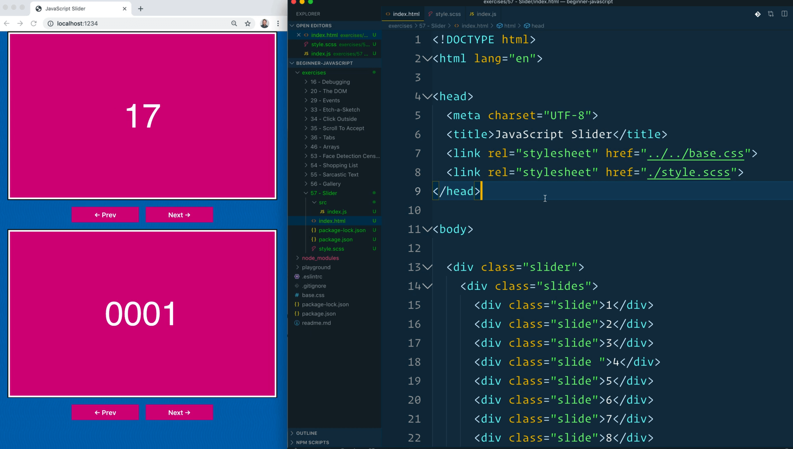
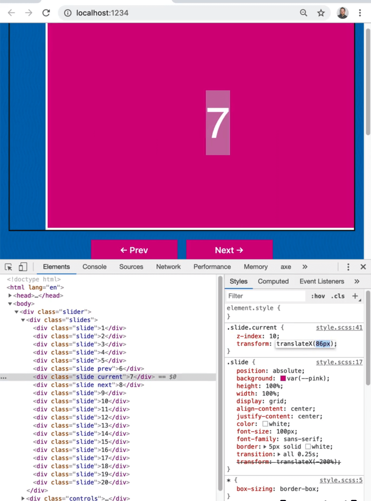
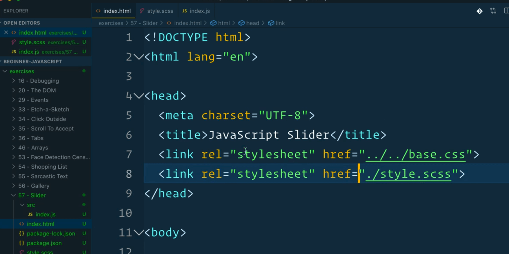
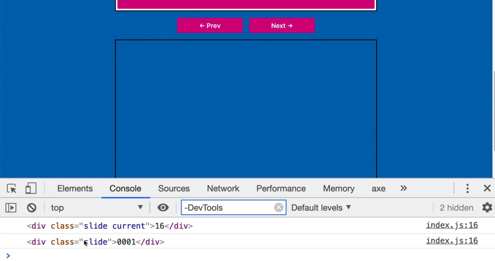
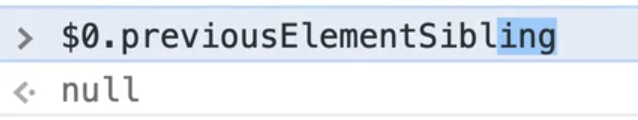
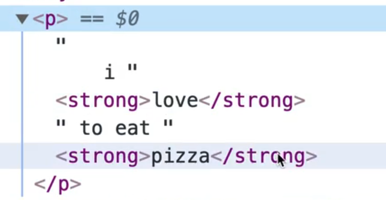
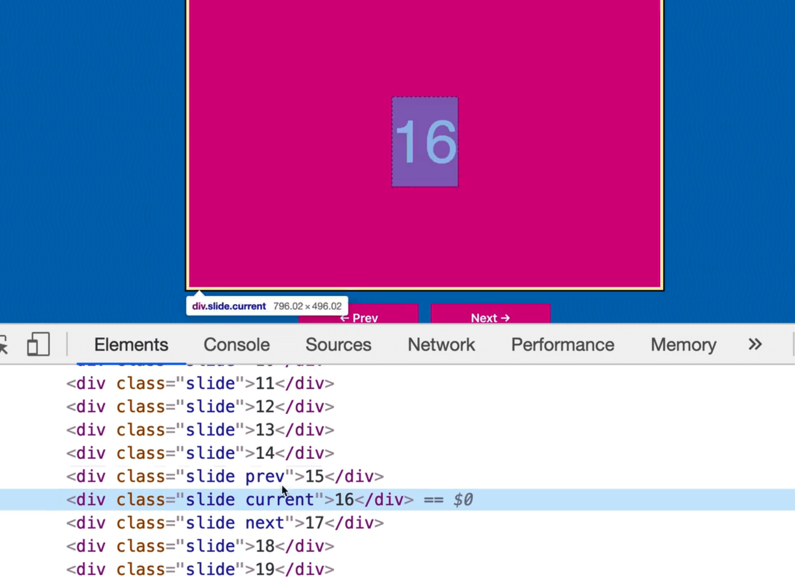
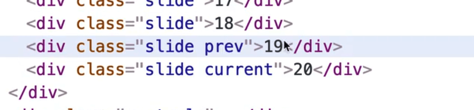

In this video, we will be building a slider.



A slider may seem simple, but once you dive into it, it starts to get pretty complex. We will build the basics of the slider together and then you can feel free to add any functionality you want to it.

Similarly to the last lesson, we will be writing everything in the same JavaScript file, and then later we will revisit this exercise and refactor it twice to use **prototypes** and **classes**.

We have 2 sliders on the page, so we can be sure that our code can be used more than once on the same page.

If we look at the HTML structure of the slider within the element tab of the dev tools, you will see that we have all 20 slides. Now as we hit the next button and previous buttons, the classes are actually changing on the sliders depending on what button you press.


In this lesson we will use **SASS**, just to demonstrate that it is possible. Wes will show us how to get that up and running.

We are starting with the CSS shown below.

```css
.slide {
  position: absolute;
  background: var(--pink);
  height: 100%;
  width: 100%;
  display: grid;
  align-content: center;
  justify-content: center;
  color: white;
  font-size: 100px;
  font-family: sans-serif;
  border: 5px solid white;
  transition: all .25s;
  transform: translateX(-200%);
}
```

The `slide` class positions the slide absolutely, using `display: grid`.
Then we take the slides and put them off the screen like so 👇

```css
.slide.prev {
  z-index: 10;
  transform: translateX(-100%);
}

.slide.current {
  z-index: 10;
  transform: translateX(0);
}

.slide.next {
  z-index: 10;
  transform: translateX(100%);
}
```

Our current slide has `translateX(0)`, which puts it in the middle. As we modify the value that we pass to `translateX`, you will see the slide is moving.



By translating something 100%, we are essentially just putting it outside the slides `div` and we have an `overflow:hidden` on it so you cannot see what is outside of it.

Have the previous, current and next slide on translateX -100, 0 and then 100% makes for that animation. Wes has added a transition on the animation to make it look smooth.

Back to the SASS, in the SASS file we aren't actually using any special SASS syntax, so you could change the file extension to `.css` and it would work. However, Wes wanted to demonstrate that the Parcel bundler is able to recognize a SASS file if you add it via a stylesheet tag.



The Parcel bundler detects that the file is a `.scss` extension and it will compile it SASS for us before it puts it into the browser.

Let's get started. Navigate in our terminal to the `exercises/59 - Slider` folder. Run `npm install` once you are in that directory.

While that installs, open up the `package.json` file and take a look.


You will notice that we have 2 dev dependencies, one for Sass and one for Parcel. When we type `npm start`, that will run the `parcel index.html` command.


You should see the server is running on a specific port indicated in your terminal. Nothing should be happening on the page because haven't added any JavaScript yet.

Our JavaScript file lives in the `src` directory of our current exercise folder. Putting scripts in a `src` or `lib` folder is a pretty common thing to do. There is nothing special there, it's just a way to organize your files.

Let's start writing some code. Create a function called `Slider` which will take in an argument, `slider` which will be the reference to the slider element that was passed as an argument.

_(Sometimes you will see people naming elements with an "El" at the end, just to specify that it is an element, but we won't do that.)_

Let's create 2 variables, one for each of the sliders we have on the page.

```js
function Slider(slider) {

}
const mySlider = Slider(document.querySelector('.slider'));
const dogSlider = Slider(document.querySelector('.dog-slider'));
```

Within the slider function, add a check for whether someone has passed a slider in or not.

```js
if (!slider) {
  throw new Error('No slider passed in');
}
```

Now if you were to run the function and pass in anything instead of a reference to an element like `const mySlider2 = Slider(12322)`, it would not error out, because we are just checking whether we are getting anything.

How can we check whether the function was passed in an actual HTML element? Like Wes has mentioned before, if we look at the docs for `document.querySelector()`,  you will see that it returns an element.

The element is the most general base class from which all objects in a document inherit.  That may not be very interesting to you, but wh at that means is when we create a div or a span, it inherits all of it's base attributes from the Element in the browser.

If you open up your dev tools and type `Element`, you will see that it is a function.


This means that we can use `document instanceof Element` to check whether something is an instance of the Element base class.


Modify the code as shown below 👇

```js
if (!(slider instanceof Element)) {
  throw new Error('No slider passed in');
}
```

As we move through the slider, we will need to keep track of what is the current, next and previous slides. Create some empty variables that we will use to keep track of that.

```js
let current;
let prev;
let next;
```

We will set those values when the slider starts, and when the user navigates with the previous and next buttons.

Next, we need to select the elements needed for a our slider. If you look at the HTML code, it consists of all the slides and then the next and previous buttons.

```js
const slides = slider.querySelector('.slider');
const prevButton = document.querySelector('.goToPrev');
const nextButton = document.querySelector('.goToNext')
```

Just like we did in the last lesson, we will be adding a whole bunch of functions to add and remove CSS classes and figure out what is next.

Create a function called `startSlider`. Within that function we will be populating those variables.


We want to update the `current` variable from within this function. The reason we are creating the variable outside of the function is that it needs to be accessible by other functions we will create in the future like move next functionality.

If we created the variable inside of the `startSlider` function, that would make it scoped only to the function, and it would not be accessible elsewhere. By creating the variable at the top, all of the functions that live inside of our slider will have access to it.

That is the concept of what a **closure** is. We have these variables that existing within our `Slider` function that other functions will be able to grab onto. They are not global variables, they are variables that live inside the closure of the `slider` function.

We will set the `current` variable to be either the first slide that is in the slider, or where the slider has the class of `current` (so you could set the slider to start at a specific image on page load).

In one of the sliders on our HTML page, Wes has set the starting slide by passing a class of current to one of the slides and in the second slide there is no current class on load.

We will set the value of current to be the slide that contains the class of "current" or if no slider has a class of current, we will get the first element child of `slides`.

```js
function startSlider() {
  current = slider.querySelector('.current') || slides.firstElementChild;
  console.log(current);
}
```


When we create the slider, we now have to run the `startSlider` function.  Add it to the bottom of the `Slider` function.

```js
//when this slider is created, run the start slider function
startSlider();
```

That is often what we refer to as a **constructor**, which we will be getting into more when we hit classes.

If you refresh the page you will see that we now have both of our slides logged in the console. The first slide starts at 16 because it has the class current on it and the slider had no class of current on any of the slides so it started on the first slide.



For the previous one we will grab the element that is behind the current one using `previousElementSibling`.

Let's demo how that works by going to the HTML page in the browser, selecting slide #2 in the elements tab and then going back to the console and typing `$0.previousElementSibling`. You will see that the slide that says 1 will be returned.


If you were to do the same thing but with #1 slide, you would get `null` because because there is nothing next to one.



So we want to set the previous slide to be the `previousElementSibling`, or if that doesn't exist, we can fall back to the last slide within our slides div.

```js
prev = current.previousElementSibling || slides.lastElementChild;
```

Why is Wes using the Element version of the methods instead of using `current.previousSibling` or `slides.lastChild`? What is the difference between `lastElementChild` and `lastChild`?

Let's demonstrate with an example.

Add a paragraph at the top of the HTML page such as `<p>I <strong>love</strong> to eat <strong>pizza</strong></p>` and inspect it.



Click on "love", and then go into the console and try the following 👇

```js
$0
$0.nextSibling;
$0.nextElementSibling;
```


What is the difference? `nextSibling` gives us a Node, and a node can be text or an element, whereas `nextElementSibling` will only return elements. Always use `elementSibling` when you are looking for an element.

Next will be `next = current.nextElementSibling || slides.firstElementChild;`.  Then we will add `console.log({current, prev, next });`

```js
function startSlider() {
  current = slider.querySelector(".current") || slides.firstElementChild;
  prev = current.previousElementSibling || slides.lastElementChild;
  next = current.nextElementSibling || slides.firstElementChild;
  console.log({ current, prev, next });
}
```


If you open the console, you will see we have `current, prev, next`.

Now we need to start applying classes to those to make them show up.

Make a function `applyClasses` and we will take the current, add the class of current to it and then do the same the prev and next.

```js
function applyClasses() {
  current.classList.add('current');
  prev.classList.add('prev');
  next.classList.add('next');
}
```

Now when the code runs, we will just run `applyClasses` as well.

```js
startSlider();
applyClasses();
```

If you were to inspect the code you would see that now the appropriate slides have classes.



Next we need a method called `move` that takes in a direction like back or forwards.

```js
function move(direction) {

}
```

When we call the `move` function it will move the classes around to switch which the current, next and previous slides are. You could manually edit the classes yourself in the element panel to do that.

The first thing this function will do is strip all the current classes off the slides.

Make an array of classes to remove and put the classes that we want to remove inside of the array. Then take the previous element and call `remove()`.  Remove will take in as many arguments of classes that you want to remove as you want.

We will have to do that with current and next as well which is kind of annoying.

```js
prev.classList.remove("prev", "current", "next");
current.classList.remove("prev", "current", "next");
next.classList.remove("prev", "current", "next");
```

What is even better is we can take the array of classes to remove and spread it into the remove method, like so 👇

```js
function move(direction) {
  // first strip all classes off the current slides
  const classesToRemove = ['prev', 'current', 'next'];
  prev.classList.remove(...classesToRemove);
  current.classList.remove(...classesToRemove);
  next.classList.remove(...classesToRemove);
}
```

We could even make that shorter by putting our elements into an array and then calling `forEach` on them and then within the `forEach` calling `remove` and spreading the `classesToRemove` array into it.

```js
[prev, current, next].forEach(el => el.classList.remove(...classesToRemove));
```

Let's go with the approach where we have three lines instead of the one liner to make it more readable instead however.

Now we need to figure out which direction the slides are going.

If the slides are going backwards, the need to take our `current`, `previous` and `next` variables and shift them by one. If we are going backwards previous will become current, current will become next. We are basically shifting everything to the left.

There is a bit of a problem when you are assigning variabels to be each other. Let's say we tried the code below 👇

```js
if (direction === 'back') {
  prev = prev.previousElementSibling;
  current = prev;
}
```

We have run into this problem where we have already updated what previous is. How do we access the old previous? We could do have a variable called `oldPrev` and then assign the value of prev to that before we reassign it but that is not the best way.

What Wes will show us instead is how to use **destructuring** to switch variables easily.

We will destructure the `[prev, current, next]` variables and make an array of their new values and destructure them over and into the prev, current and next variables.

That means the first thing we put into the array will be assigned to `prev`. Then next item will be `current` and the last will be `next`.

The first thing will be `prev.previousElementSibling`. Then the current will be the `prev` and the `next` will become the current.

```js
[prev, current, next] = [prev.previousElementSibling, prev, current];
```

Now we will do the opposite if the direction is forward.

```js
if (direction === "back") {
  [prev, current, next] = [prev.previousElementSibling, prev, current];
} else {
  [prev, current, next] = [current, next, next.nextElementSibling];
}
```

That seems confusing but all we are doing is shifting them all one lower.

Next we will just run the `applyClasses()` function which will in turn add the current, previous and next classes.

Now we can take our previous button and our next button and hook up click events.

Let's do it at the very bottom of our `Slider` function.

Call the  move   function from the event listener handlers and pass `'back'` to when the previous button is clicked using an arrow function. When the next button is clicked, we will just pass reference to `move` since unless you pass the string "back", it will move in the forward direction.

```js
// Event Listeners

prevButton.addEventListener('click', ()=> move('back'));
nextButton.addEventListeners('click', move);
```

If you need to pass an argument to a function, you need to use an arrow function here. Or, you use **call and apply** which you will learn about in the next video.

Now when you click it, you will see the slider works.

One error is when you get to the very end or very beginning, we will get an arrow because we lose our `next` class.



Now we need to say when we have the edge case where a previous element or next sibling doesn't exist you will add an or condition and get the `slides.lastElementChild` or `slides.firstElementChild` for the next button.

```js
if (direction === "back") {
  [prev, current, next] = [
    // get the prev slide, if there is none, get the last slide from the entire slider for wrapping
    prev.previousElementSibling || slides.lastElementChild,
    prev,
    current,
  ];
} else {
  [prev, current, next] = [
    current,
    next,
    // get the next slide or if its at the end, loop around and grab the first
    next.nextElementSibling || slides.firstElementChild,
  ];
}
```

Now if you refresh the page you will see the slider is working but the second one is not. Why not? Let's debug.

The reason is that the buttons are not working for the second slider.

Why is that?

Because if you look back at where we grab the buttons in our code, we are using `document.querySelector()` instead of `querySelectorAll()` to grab the buttons, which means both sliders are being moved by the same button. `querySelector` just finds the first element on the page and binds to that. It shouldn't be `document`, it should be `slider` because we need to look for the buttons within the slider itself.

If you refresh the page you will see they now run on their own.


63 lines of code for a slider!

It would be cool to get the arrow keys working but only when someone is focused in on one of the dev. That would be an interesting exercise to give a shot yourself if you're interested.

We will be revisiting this exercise in our prototype lesson. The functions, `move`, `applyClasses` and `startSlider` are going to be moving to what are called **the prototype**.
