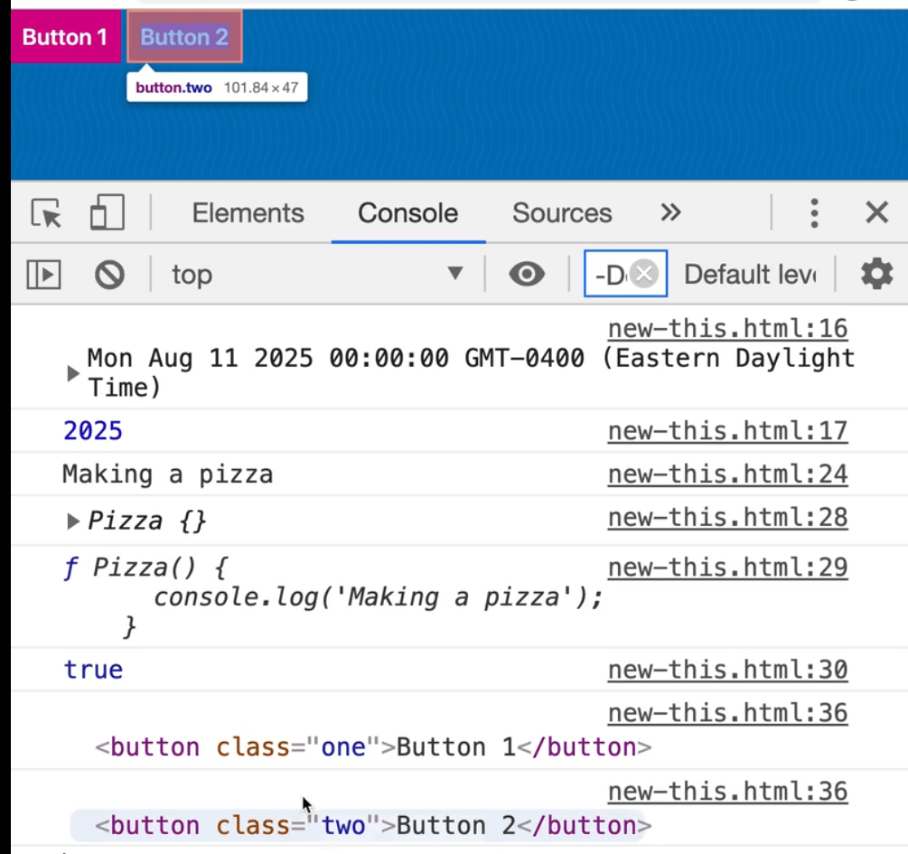
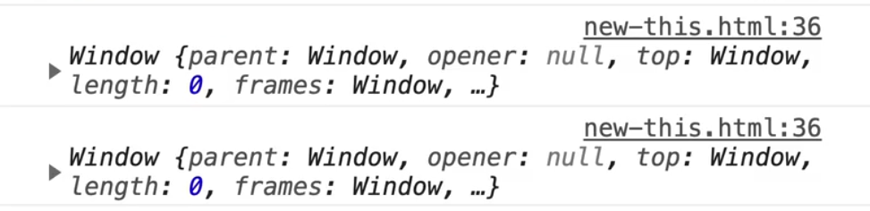
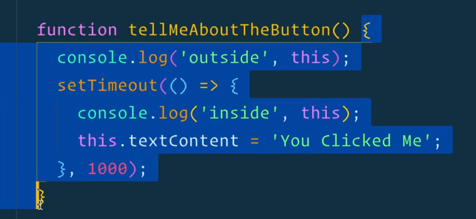
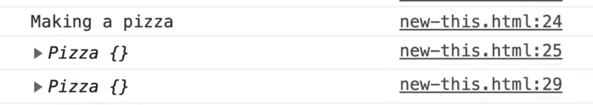

We will discuss the `this` keyword in this video and the next video which is about **prototypes** and **prototypal inheritance**.

The `this` keyword in JavaScript refers to the instance of an object that a function is bound.

So what does that mean?

Up to now Wes has told us that the `this` keyword is what is left of the dot when you are calling a method.

Let's demo with some code.

In the `new-this.html` file, within the body tag, make two buttons.

```js
<button class="one">Button 1</button>
<button class="two">Button 2</button>
```

Go to the bottom of the script tag and select both of the buttons.

Next, make a function `tellMeAboutTheButton` that simply logs the `this` keyword. Then add an event listener to both buttons on the click event to call the function we just made.

```js
function tellMeAboutTheButton() {
  console.log("outside", this);
}

button1.addEventListener("click", tellMeAboutTheButton);
button2.addEventListener("click", tellMeAboutTheButton);
```

Now when we go and click on each button, the `this` keyword will be equal to each button that was clicked.



Now we can call that an instance. Why?

Because `button1` and `button2` are simply instances of the mama Button that exists in the browser.

Whenever you make a new button, whether via HTML or it gets rendered to the DOM, or whether you use `document.createElement` it will create an new instance of the HTML button that is in the browser.

The `this` keyword in our example is equal to the thing that is left of the dot. The method that was called was `addEventListener()` and the thing to the left of it was either `button1` or `button2` in our example.

You will also hear that referred to as the `tellMeAboutTheButton` function "being bound to the button".

When something is "bound" to something, it means that the `this` keyword is going to be equal to whatever it was bound to. (You can change that with the `.bind()` method but we won't get into that here).

An important thing to know about the `this` keyword is that it is always scoped to a function. If you use an arrow function, for example if we converted `tellMeABoutTheButton` to an arrow function as shown below, watch what happens to `this`.

```js
const tellMeAboutTheButton = () => {
  console.log(this);
}
```

Now when you click the buttons, you will see the `Window` logged not the button.



The value of the `this` keyword does not change when you use an arrow function. The `this` keyword will be equal to whatever it was at a higher level function. (If there is no higher level function, it will be equal to the Window).

One use case for this is, lets say we bring `tellMeAboutTheButton` back to a regular function, and let's say after one second we want to update the text of the button to say something like "Good job". We can use `setTimeout()` to do that.

The first argument of `setTimeout` is a callback function and the second argument is how long the timeout should be.

Within the timeout we will set the `textContent` of the button to be equal to "You Clicked Me".

```js
const tellMeAboutTheButton = () => {
  console.log(this);
  setTimeout(function() {
    console.log(this);
    this.textContent = "You Clicked Me";
  }, 1000);
}
```

If you refresh the HTML page and try clicking on the buttons, you will see that nothing really happened. What is going on there?

Let's log the value of `this` within the timeout, refresh the page and click the second button and then look at the console. You should see the button logged and then the window.


Why is that?

Modify the logs to be a bit clearer. Replace the first log with `console.log('outside', this)` and the second one with `console.log('inside',this);`.


As you can see, outside it is equal to the button but inside the timeout it is equal to the window. That is because every time you create a new function, it will change what the value of `this` is equal to.

If you need to be able to access the value of the `this` keyword within the `tellMeABoutTheButton` function, you can use an arrow function because it will know not to change. It will instead grab the value of whatever `this` is equal to within the `tellMeABoutTheButton` function.



```js
setTimeout(() => {
  console.log("inside", this);
  this.textContent = "You Clicked Me";
}, 1000);
```

If you refresh the page you will see that the value of `this` remains the same now.


That is something about arrow functions that might come and bite you, so just know about that.

That is what we now about the `this` keyword so far. The other thing we need to know about the `this` keyword is that it refers to the instance of the thing that was made.

If you go up to the `Pizza` function further up in the file, and add a log of `this`, whenever the pizza is made we get access to the pizza that was created.



We can do things like store information about the pizza that is being made inside of that pizza. When you make a pizza, you need to store information about it like what are the toppings, who is it for, and things like that.

Let's go ahead and code that.

Modify the `Pizza()` function, which is referred to as **constructor** (_the function that makes an object is called a constructor)_. It will take in an array of toppings (default of which will be an empty array), and then it will take in a customer's name.

Inside of the Pizza function we will save the toppings and customer as shown below.

```js
function Pizza(toppings = [], customer) {
  console.log("Making a pizza");
  // save the toppings that were passed in, to this instance of pizza
  this.toppings = toppings;
  this.customer = customer;
}
```

You also do other things like generate an id inside of the constructor.

Let's add that.

Whenever Wes needs to generate a random id, he likes to use this blog post by Tom Irish. It's not guaranteed to be unique, but it is good enough for most use cases. This one gives you a random hex code. We will take the `#` sign off the method because we don't need it.


```js
this.id = Math.floor(Math.random() * 16777215).toString(16);
```

Now when you refresh the page, you will see that in our pizza there is a bunch of information about that pizza.


The `toppings` and `customers` are empty and `undefined` because we haven't passed them in so let's update `pepperoniPizza` to add some toppings and a customer and then add another pizza as shown below 👇

```js
const pepperoniPizza = new Pizza(['pepperoni'], 'Wes Bos');
const canadianPizza = new Pizza(['pepperoni', 'mushrooms', 'onion'], 'Kait Bos');
```

If you refresh the page and open up the console, you will see our two pizzas with all the information we passed to the function.


The `this` keyword, when you are creating an object, is used to store information about that instance.

This is a perfect example because `pepperoniPizza` is an instance of Pizza, and it has it's own unique data that needs to stay with that pizza, like toppings, customer and id. The same thing goes for the `canadianPizza`, it is another instance with it's own information that stays with that pizza.

`this` is used for storing data and functionality on each of the instances.

In the next video we will go into **prototypal methods** that can be shared amongst all the pizzas, because they always do the exact same thing.
