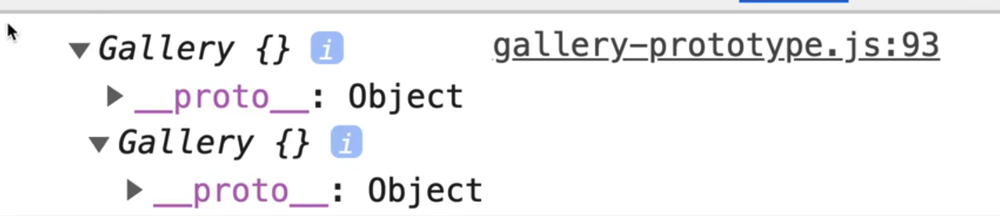
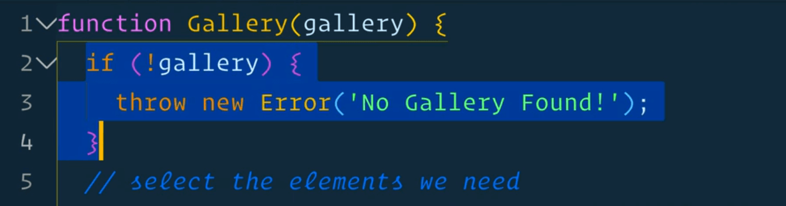
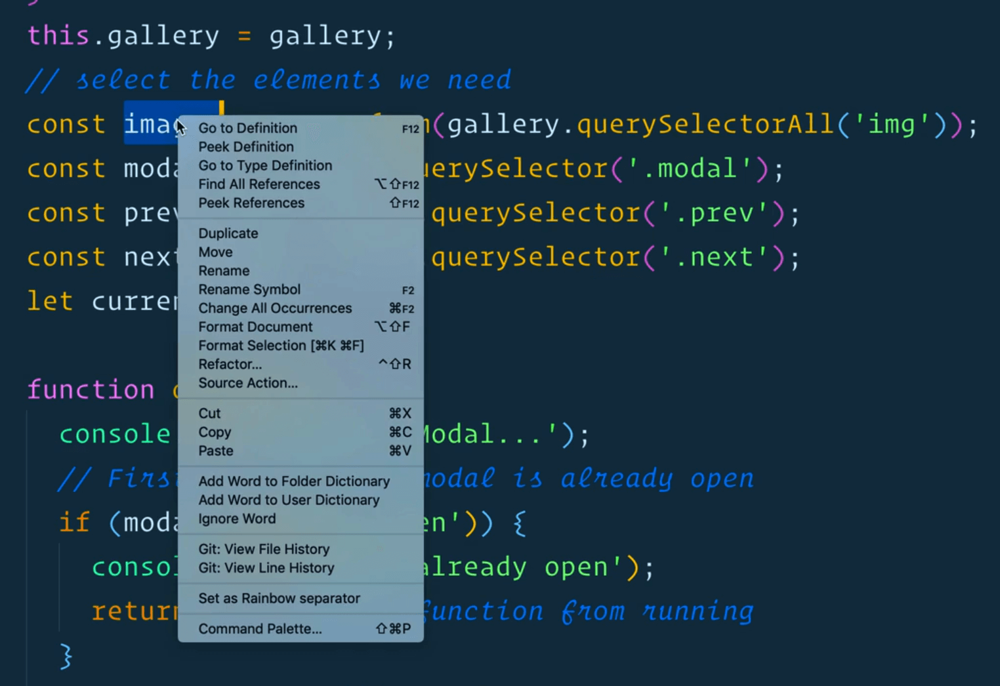
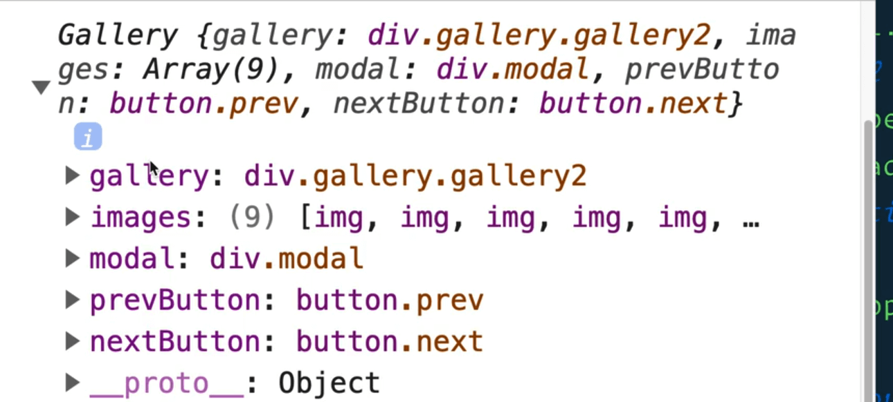
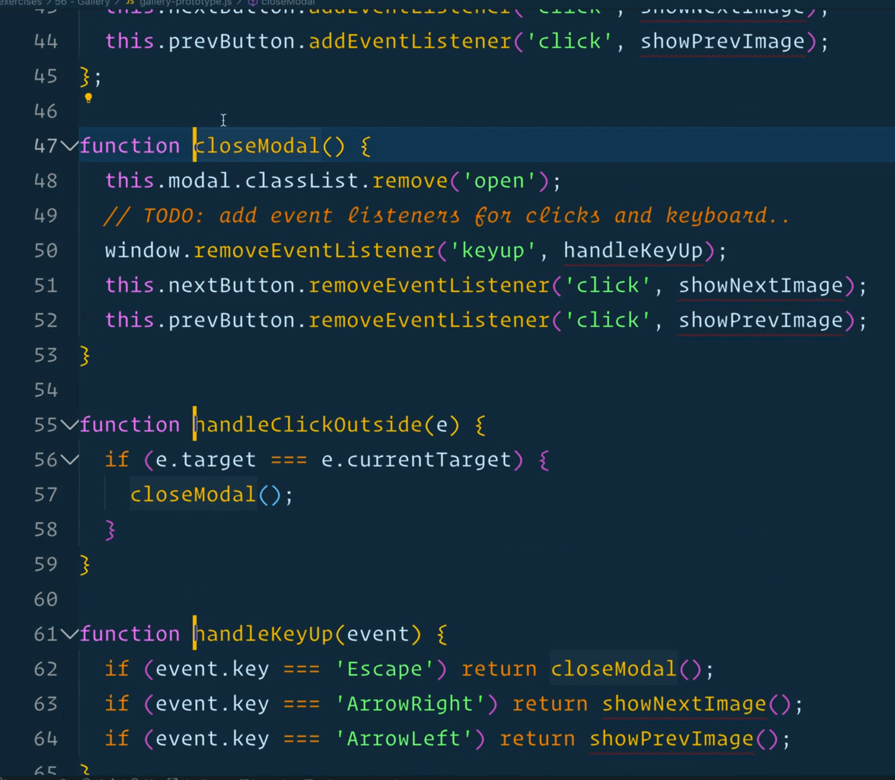
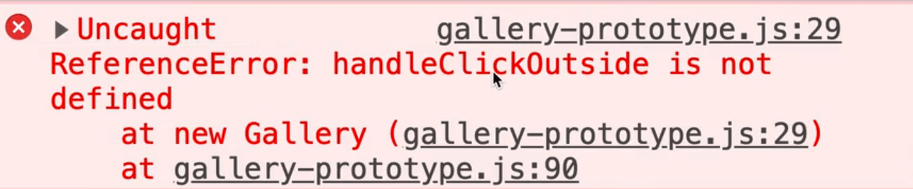
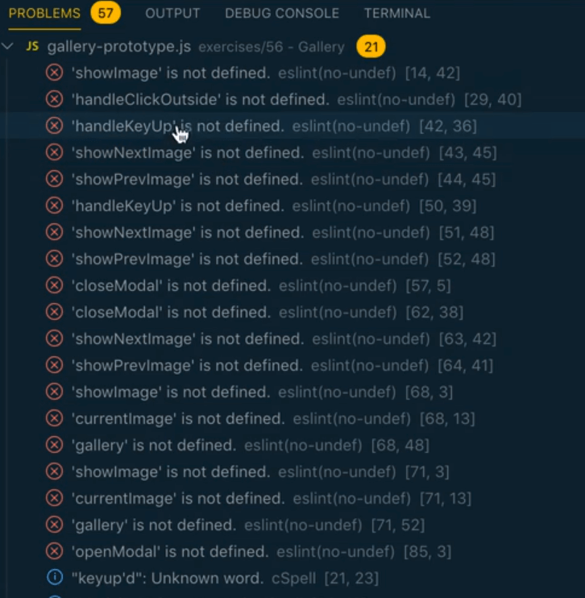
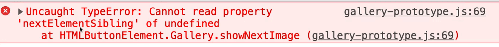
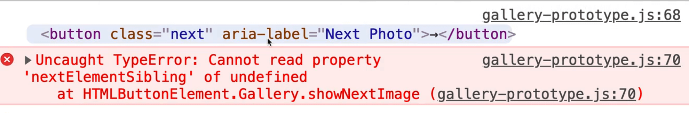
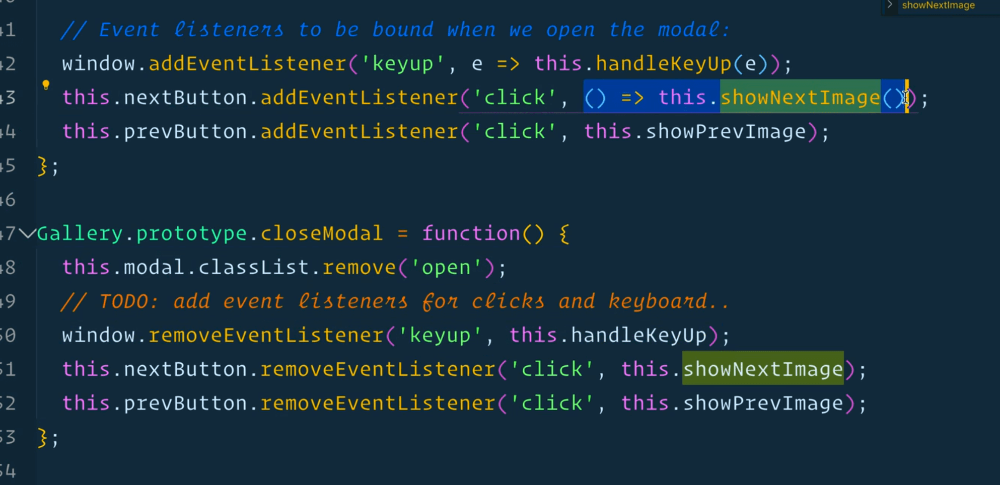

In the next two videos we will refactor the gallery and slider exercises that we did earlier to take advantage of the prototype.

Open up `gallery.js` and save a copy of the file under the name `gallery-prototype.js`.

Then go into the `index.html` file within the gallery exercise directory and modify the script src to point to the `gallery-prototype.js` file instead.

If you scroll to the bottom of the JavaScript page, you will see we have 2 variables `gallery1` and `gallery2`, and if we log them in the console, we will get `undefined` and `undefined`.

```js
const gallery1 = Gallery(document.querySelector('.gallery1'));
const gallery2 = Gallery(document.querySelector('.gallery2'));

console.log(gallery1, gallery2);
```

Why? because the `Gallery()` function doesn't actually return anything.


If, however, we change it to use the `new` keyword, it will automatically return an instance of that gallery.

```js
const gallery1 = new Gallery(document.querySelector('.gallery1'));
const gallery2 = new Gallery(document.querySelector('.gallery2'));
```



Right now there is nothing in our Gallery nor in the prototype of it, but you will see as we add things to the prototype and to the instance, we will see them populate there.

Let's go to the top of the file and go line by line.

```js
function Gallery(gallery) {
  if (!gallery) {
    throw new Error('No Gallery Found!');
  }
}
```

The way we check whether the parameter exists is fine, we can leave that alone.



The only thing we need to do is save the reference to the gallery div that was passed in because we will need it in our prototype method shortly.

Add the line below after the condition 👇

```js
this.gallery = gallery;
```

Now if you refresh the page, you should see both of our galleries logged, and you can see that those are instance properties because they differ in each one.


Now we need to go through all the variables we created.

We just created them as variables inside of the closure, but because we are going to be moving all of the methods like `handleClickOutside` and `handleKeyUp` to the prototype, they will no longer have access to the closure.  That means we need to surface the variables on our instance somehow.

The way you can surface a variable on an instance is simply by saying `this.` the name of the variable.

So we will change all those variables and everywhere we have used them to `this.images` instead of `const images`.

The easiest way that Wes has found to do that is to right click on a variable name in VSCode and select "Rename symbol". Then add `this.` next to `const image` and remove the `const`, because we are not declaring a new variable, we are simply setting a property on the gallery instance.




Now let's go through the rest of them.

```js
this.gallery = gallery;
// select the elements we need
this.images = Array.from(gallery.querySelectorAll('img'));
this.modal = document.querySelector('.modal');
this.prevButton = this.modal.querySelector('.prev');
this.nextButton = this.modal.querySelector('.next');
```

We don't need the `let currentImage` variable anymore because wherever we set the `currentImage`, we will simply say `this.currentImage = el;` where we are setting the `currentImage` instead. So delete the `let` declaration of that variable.



As you can see, our gallery now has all these properties inside of it.

Next we will share the rest of the functions amongst all the instances by moving them to the prototype.

Select all the functions below.

```js
function openModal() {
  console.info('Opening Modal...');
  // First check if the modal is already open
  if (modal.matches('.open')) {
    console.info('Madal already open');
    return; // stop the function from running
  }
  modal.classList.add('open');

  // Event listeners to be bound when we open the modal:
  window.addEventListener('keyup', handleKeyUp);
  nextButton.addEventListener('click', showNextImage);
  prevButton.addEventListener('click', showPrevImage);
}

function closeModal() {
  modal.classList.remove('open');
  // TODO: add event listeners for clicks and keyboard..
  window.removeEventListener('keyup', handleKeyUp);
  nextButton.removeEventListener('click', showNextImage);
  prevButton.removeEventListener('click', showPrevImage);
}

function handleClickOutside(e) {
  if (e.target === e.currentTarget) {
    closeModal();
  }
}

function handleKeyUp(event) {
  if (event.key === 'Escape') return closeModal();
  if (event.key === 'ArrowRight') return showNextImage();
  if (event.key === 'ArrowLeft') return showPrevImage();
}

function showNextImage() {
  showImage(currentImage.nextElementSibling || gallery.firstElementChild);
}

function showPrevImage() {
  showImage(currentImage.previousElementSibling || gallery.lastElementChild);
}

function showImage(el) {
  if (!el) {
    console.info('no image to show');
    return;
  }
  // update the modal with this info
  console.log(el);
  modal.querySelector('img').src = el.src;
  modal.querySelector('h2').textContent = el.title;
  modal.querySelector('figure p').textContent = el.dataset.description;
  currentImage = el;
  openModal();
}
```

Cut those functions out of the `Gallery()` function and add them right below the function.

Now what we need to do is we need to change each of those functions to be on the prototype of the gallery.

We are going to remove the word `function` and instead will put `Gallery.prototype`, as shown below.

```js
Gallery.prototype.openModal() {
  console.info('Opening Modal...');
  // First check if the modal is already open
  if (modal.matches('.open')) {
    console.info('Modal already open');
    return; // stop the function from running
  }
  modal.classList.add('open');

  // Event listeners to be bound when we open the modal:
  window.addEventListener('keyup', handleKeyUp);
  nextButton.addEventListener('click', showNextImage);
  prevButton.addEventListener('click', showPrevImage);
}
```

If you save and refresh, you will see that we now have access to the `openModal` function on the prototype of our galleries. Nothing will work yet but we will go through and fix them one by one.


Wes likes to use VSCode multi-cursor to refactor the methods all at once.

His shortcuts are to hold down Click + Cmd and then put the cursor in front of every function name so you can edit them all at once.



```js
Gallery.prototype.openModal() {
  console.info('Opening Modal...');
  // First check if the modal is already open
  if (modal.matches('.open')) {
    console.info('Madal already open');
    return; // stop the Gallery.prototype.from running
  }
  modal.classList.add('open');

  // Event listeners to be bound when we open the modal:
  window.addEventListener('keyup', handleKeyUp);
  nextButton.addEventListener('click', showNextImage);
  prevButton.addEventListener('click', showPrevImage);
}

Gallery.prototype.closeModal() {
  modal.classList.remove('open');
  // TODO: add event listeners for clicks and keyboard..
  window.removeEventListener('keyup', handleKeyUp);
  nextButton.removeEventListener('click', showNextImage);
  prevButton.removeEventListener('click', showPrevImage);
}

Gallery.prototype.handleClickOutside(e) {
  if (e.target === e.currentTarget) {
    closeModal();
  }
}

Gallery.prototype.handleKeyUp(event) {
  if (event.key === 'Escape') return closeModal();
  if (event.key === 'ArrowRight') return showNextImage();
  if (event.key === 'ArrowLeft') return showPrevImage();
}

Gallery.prototype.showNextImage() {
  showImage(currentImage.nextElementSibling || gallery.firstElementChild);
}

Gallery.prototype.showPrevImage() {
  showImage(currentImage.previousElementSibling || gallery.lastElementChild);
}

Gallery.prototype.showImage(el) {
  if (!el) {
    console.info('no image to show');
    return;
  }
  // update the modal with this info
  console.log(el);
  modal.querySelector('img').src = el.src;
  modal.querySelector('h2').textContent = el.title;
  modal.querySelector('figure p').textContent = el.dataset.description;
  currentImage = el;
  openModal();
}
```

It won't even load now because we get these errors like
>handleClickOutside is not defined



If you go to line 29, you will see we are calling `showImage(e.currentTarget)`.

Anytime we reference one of our functions, it needs to be changed to `this.showImage`.

That is where ESLint becomes very helpful. If you click ESLint at the bottom, you can see all of the problems.



Now we can go through them one by one and change them out.

```js
Gallery.prototype.openModal = function() {
  console.info('Opening Modal...');
  // First check if the modal is already open
  if (this.modal.matches('.open')) {
    console.info('Madal already open');
    return; // stop the function from running
  }
  this.modal.classList.add('open');

  // Event listeners to be bound when we open the modal:
  window.addEventListener('keyup', this.handleKeyUp);
  this.nextButton.addEventListener('click', this.showNextImage);
  this.prevButton.addEventListener('click', this.showPrevImage);
};

Gallery.prototype.closeModal = function() {
  this.modal.classList.remove('open');
  // TODO: add event listeners for clicks and keyboard..
  window.removeEventListener('keyup', this.handleKeyUp);
  this.nextButton.removeEventListener('click', this.showNextImage);
  this.prevButton.removeEventListener('click', this.showPrevImage);
};

Gallery.prototype.handleClickOutside = function(e) {
  if (e.target === e.currentTarget) {
    this.closeModal();
  }
};

Gallery.prototype.handleKeyUp = function(event) {
  if (event.key === 'Escape') return this.closeModal();
  if (event.key === 'ArrowRight') return this.showNextImage();
  if (event.key === 'ArrowLeft') return this.showPrevImage();
};

Gallery.prototype.showNextImage = function() {
  console.log('SHOWING NEXT IMAGE!!!');
  this.showImage(
    this.currentImage.nextElementSibling || this.gallery.firstElementChild
  );
};
Gallery.prototype.showPrevImage = function() {
  this.showImage(
    this.currentImage.previousElementSibling || this.gallery.lastElementChild
  );
};

Gallery.prototype.showImage = function(el) {
  if (!el) {
    console.info('no image to show');
    return;
  }
  // update the modal with this info
  console.log(el);
  this.modal.querySelector('img').src = el.src;
  this.modal.querySelector('h2').textContent = el.title;
  this.modal.querySelector('figure p').textContent = el.dataset.description;
  this.currentImage = el;
  this.openModal();
};
```

Now we have refactored everything (all our variables and methods) to be reference-able by `this.` and their name.

Let's go through the app and find any issues that might exist. We will first find all the bugs, make a list and then fix them.

Let's click on an image, the modal should open fine, but when we click the buttons, we get an error. If you try to click outside the modal to close it, that is also broken.

If you hit escape that is also broken.

Let's tackle those so far, starting with the next/prev buttons being broken.

The error says

> cannot read property 'nextElementSibling' of undefined.



The line that is throwing the error is

```js
this.showImage(
  this.currentImage.nextElementSibling || this.gallery.firstElementChild
);
```

`this.currentImage` is `undefined`. So what is the value of the `this` we have highlighted in the image below?


Let's add a log and take a look. As far as we know, `this` should always equal the instance of the gallery.



According to the log, `this` is equal to a button within our `showImage` method.

Let's find where `showNextImage()` is called from... it is being called from within the `closeModal` function to remove the event listener. It is also being called from another method to add the event listener.


What is happening is we are listening for a click and when the click happens, the `showNextImage` function is running.

However, like Wes has told us about passing callbacks to `addEventListener` and the keyword `this`?

Whenever you pass a callback to an event listener, the `this` keyword will be equal to whatever is to the left of the dot.

So how do we fix that?

There are a few ways which we will go over now.

A popular way in React word would be to make it an arrow function like so

```js
this.nextButton.addEventListener('click', () => this.showNextImage);
```

Now that works, but there is a problem with that which Wes will demonstrate once we get the Escape key working.

Let's refactor this method as well using an arrow function to get that working

```js
window.addEventListener('keyup', e=> this.handleKeyUp(e));
```

Now when you open the modal up, and hit the escape key, and repeat that a few times, when you click right, it will jump a few images instead of going to the next one.

What is going on there?

Every time we close the modal, it is going one further down the slideshow. Every time that we open it up, we are listening for another click on it already.

The way we fixed that before is we just removed the event listener when we closed the modal. That way we added and removed it every time that we opened and closed the modal.

However what happens when you use `() => this.showNextImage())` what is highlighted in the image below is that you are creating an anonymous function, and in order to remove an event listener, you have to have reference to that function.



The other way we can fix that is by binding it to `this` when we have access to `this` inside of the gallery.

It will get a bit complicated but don't sweat it if you don't get it right away. It took Wes a couple of years to get it. This will make sense eventually (like the 7th or 8th time you build something this way). This is pretty common in React world.

So now we need to bind our methods to the instance when we need them.

We will do that for `handleKeyUp`, `showNextImage` and `showPrevImage` because they are the ones giving us trouble.

```js
this.showNextImage = this.showNextImage.bind(this);
```

What we are doing there is we are creating an instance property of the same prototype function, but bound with `this`.

## bind method

`bind()` allows us to explicitly supply what `this` will be equal to. Because in our constructor `this` is equal to the instance, we are creating a new function that has `this` bound to it.

That allows us to now go to our `findNextImage` function and simply just pass `showNextImage` without using an arrow function like so 👇

```js
this.nextButton.addEventListener('click', this.showNextImage);
```

Now the next button should work.

The previous button won't work because we haven't fixed that yet.

The benefit of doing that over doing it right in the event listener call directly as shown in the example below is that when we do it like below, we lose reference to the new function that was created, which stops us from being able to remove that event listener in the future.

You always need to hold onto your functions when you create them so you can remove them in the future.

```js
this.nextButton.addEventListener('click', this.showNextImage.bind(this));
```

Let's do the same for `showPrevImage`.

```js
this.showPrevImage = this.showPrevImage.bind(this);
```

The escape key is also working, but only because we are passing the `e` like so `window.addEventListener('keyup', e=> this.handleKeyUp(e));`

Modify that line of code as shown below.

```js
window.addEventListener('keyup', this.handleKeyUp);
```

Now go to where you bound `this` for `showNextImage` and `showPrevImage` and do the same for `handleKeyUp`.

```js
this.handleKeyUp = this.handleKeyUp.bind(this);
```

The last one is the click outside, which is the same problem.

```js
this.handleClickOutside = this.handleClickOutside.bind(this);
```

A lot of people don't like this method of doing it because it is a bit of a pain to figure out how to bind `this` in each context, so a lot of people prefer to just have a bunch of functions.

It is not as explicit as when you have a bunch of functions so if you feel that way, then it may mean that the prototype way of coding is not for you. There are lots of people who to think that way.

Wes is showing us all the approaches because there are some developers who think prototypes are the best way to work and it will come up on interviews.

Now everything is working beautifully.

If you feel like a challenge, feel free to try to refactor the slider one yourself.
