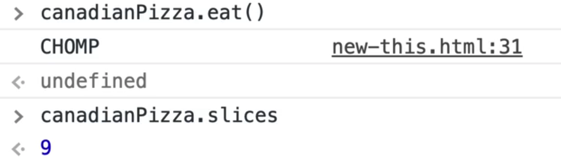
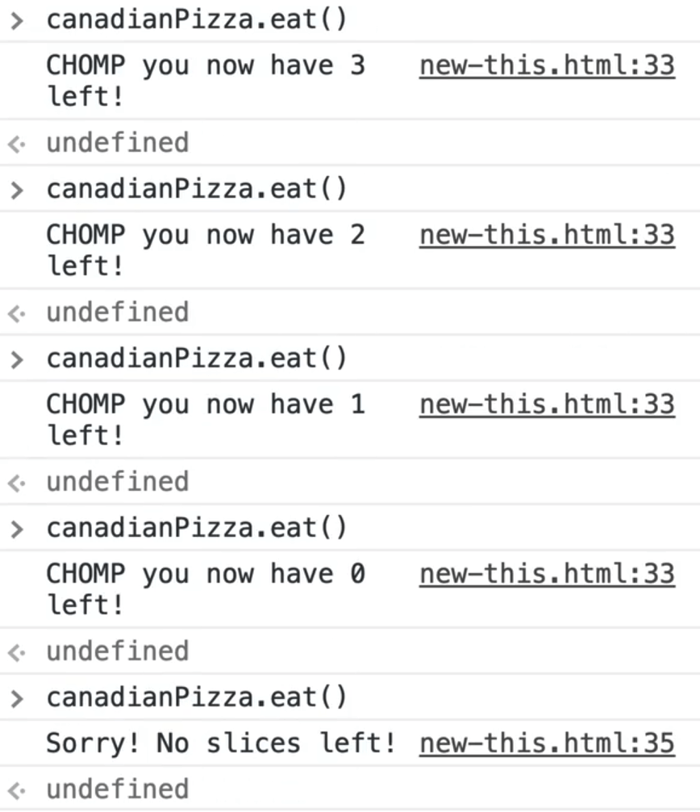
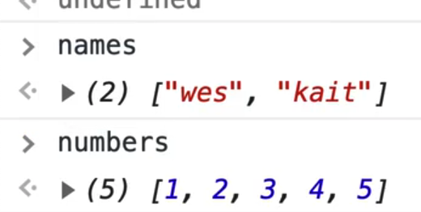
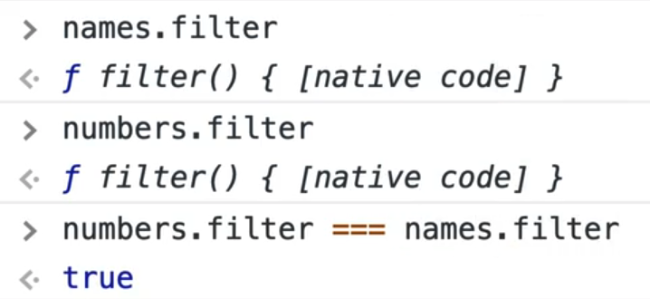
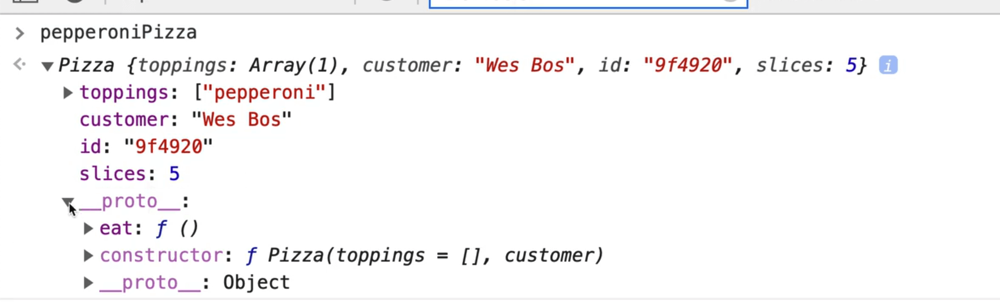
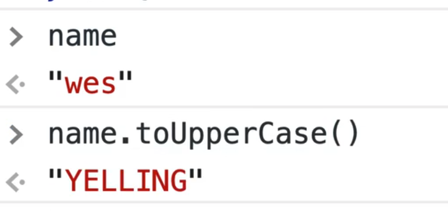
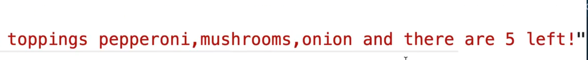

In the last video we learned that having a function and using the `new` keyword would return an object that is an instance of that object.

```js
function Pizza(toppings = [], customer) {
  console.log("Making a pizza");
  // save the toppings that were passed in, to this instance of pizza
  this.toppings = toppings;
  this.customer = customer;
  this.id = Math.floor(Math.random() * 16777215).toString(16);
}

const pepperoniPizza = new Pizza(["pepperoni"], "Wes Bos");

const canadianPizza = new Pizza(
  ["pepperoni", "mushrooms", "onion"],
  "Kait Bos"
);

```

In the example above, both `canadianPizza` and `pepperoniPizza` are instances of the `Pizza` function.

The way that we attach properties onto that instance is by saying `this.propertyname`.

Let's say we want to add some functionality, like the ability to count the number of slices left in the pizza. We can start with every pizza having 10 slices by adding the code below to our `Pizza` constructor function.

```js
this.slices = 10;
```

Now if you take a look at the pizza, you will see that there are 10 slices in that pizza.


If we needed to make a method of the pizza like `eat()`, which takes away slices one at a time, you might think you could do something like below.

```js
this.eat = function() {
  console.log('CHOMP');
  this.slices = this.slices - 1;
}
```

Now if you refresh the page and go to the console and call `eat()` on one of the pizzas, you will see "CHOMP".

If you look at how many slices there are, you would get 9.



If you run it again, you will see we have 8.

Lets go ahead and modify it so we do not run out of slices.

Add the condition below.

```js
this.eat = function() {
  if (this.slices > 0) {
    this.slices = this.slices - 1;
    console.log(`CHOMP you now have ${this.slices} left!`);
  } else {
    console.log('Sorry! No slices left');
  }
}
```

It might also be a good idea to return the new number of slices from the function. Similar to how `Array.prototype.push` returns the number of items in an array after we add them, you would just add `return this.slices;`.

If you call that a bunch of times in the console, you should see that it now works.



That works very well, however there is a downside to this which is that we are actually creating the `eat()` function once for every single pizza that is made.

If you compare whether `pepperoniPizza.eat` and `canadianPizza.eat` are the same function, you would get false even though they look identical.


What is happening here is we are duplicating the functionality of the function once for every single pizza.

That functionality looks identical for every single pizza so there is no need to generate it for every instance.

It does need to maintain it's own slice count, toppings, customer, etc, but the functionality to eat a piece of pizza is the same for every single pizza that is out there.

Instead of putting functions on every single instance, we can put them on what is referred to as the **prototype**.

You might be thinking, what is wrong with the code we have now? It seems to be working so far.

The problem comes when you have 20,000 pizzas. Then you have lots of instances of the pizza, and every time you define a new function, that takes up memory in your computer and that is what causes websites and computers to go slow in many cases.

It would be much more efficient to have one `eat()` function that is shared amongst all our pizzas.

Let's pause on that for a second and look at some of the built-in prototypes that we have.

We have our `names` array which we have already declared and we will create a new array named `numbers`.



Both of those arrays with have methods on them like `filter` for example. Every single time you make an array, the browser does not copy and paste the functionality inside of each one.

Instead, the method actually lives in something called a **prototype**, which allows each of the arrays to share that functionality.

If you checked for the equality of the `filter` method of `numbers` and `names`, you would get true because they are the exact same function. They don't just have the same functionality, _they are the same function._



Take the `eat` function, copy it and then remove those lines of code. Go further down the file, right below the Pizza function and then modify it as shown below.

```js
Pizza.prototype.eat = function() {
  if (this.slices > 0) {
    this.slices = this.slices - 1;
    console.log(`CHOMP you now have ${this.slices} left!`);
  } else {
    console.log(`Sorry! No slices left!`);
  }
};
```

Now every single time we make a pizza, we won't give it that function, but it will be available on the prototype.

Let's test that it still works by calling `canadianPizza.eat()` in the console multiple times, then try calling `pepperoniPizza.eat()` multiple times. It looks like it is working.

However, if you log `pepperoniPizza` and look inside, you will see  `customer`, `id`, `toppings` (all of which are instance properties). But there is no `eat` functionality. However, if you open up the prototype, you will see it there.



That is what is referred to as the **prototype lookup**. If you put something on the prototype, and it doesn't exist on the instance, it will look for it in the mamma.

If we did `pepperoniPizza.toppings` that would be an instance but if we did `pepperoniPizza.eat`, what would first happen is it would look inside the `Pizza` constructor function for a property called `eat`.

What that means is that every time an instance is made, we have access to this `eat` function.

One benefit of that is you can actually change the functions and those changes will apply to every single pizza that is there.

Let's do one more example.

Add the following under the `eat` function.

```js
Pizza.prototype.size = 'Large';
```

Now if you go to `pepperoniPizza` and look for the size, it will tell you "Large".


However, if you were to go into the `Pizza` function and add `this.size = "Medium";`, you will get "Medium".


It first checks for a property on the instance and if it doesn't exist, it will go to the prototype and look that up.

Get rid of the `this.size` because we don't actually need it.

Now if we look at our `name` array by typing `name.` in the console, you will see a long list of methods that are available to us.

If you log `String.prototype` you will also see the methods are available to us every single time that we create a new string.


All of the methods that you see already there are what are referred to as **built in functions**, meaning they just come with the language. You can actually add your own, but warning -- you should never do this. Wes is just demoing it to show us how that works.

```js
String.prototype.toUpperCase = function() {
  return 'YELLING';
}
```

Now if you run `name.toUpperCase()` in the console, it will return to us 'YELLING'.



That is because we overwrote the existing `toUpperCase` functionality on the prototype.

Now when any string calls `toUpperCase()` our function will run instead.

You can see why it would be a bad idea to modify a built in, because one person might expect the method to do something one way, and then if you have changed something, the libraries on the page that are expecting `toUpperCase` to work will break. You should never modify built-ins for this reason.

If you should never modify built-in functions, then why is that allowed?

Some new functionality that is added to the browser, like `Array.includes()`, might be missing from some older browsers. For those browsers, you can use something called a **polyfill**, which recreates the missing functionality. When the browser doesn't include it natively, you can **polyfill** it by recreating the functionality in vanilla JS.

You can also add your own methods. Again don't do this, but it's possible.

Let's add this to our code right before our `Pizza` function constructor.

```js
String.prototype.sarcastic = function() {
  console.log(this);
}
```

Now if we refresh the page and open the console, let's try using that function.


As you can see, it logged `this` which is a string of "wes".

What we can do is build out our sarcastic method similar to how we did in a previous example.

```js
String.prototype.sarcastic = function() {
  const sarcastic = this.split('').map((char, i) => {
    if (i % 2) {
      return char.toUpperCase();
    } else {
      return char.toLowerCase();
    }
  }).join('');

  return sarcastic;
}
```

If it's an even character, we uppercase the letter, if it's an odd character, we lowercase the character. Then we join the text together and return it.

Let's test if it works in the console. If you create a variable with a string and then call `.sarcastic()` on it, it will return the name with mixed case.


By adding a method to the prototype, it is then available on every instance of. Whether that is something that is built in, like a string, or something your own like pizza, you can add methods to the prototype of the pizza and every single one will get it.

Let's do one more example.

Make a description method.

When someone calls `pizza.subscribe()`, Wes wants it to tell you that this pizza is for customer `x` and there are `x` slices left.

Feel free to pause the lesson here and try this exercise on your own.

Here is how Wes would approach that.

Create the `describe()` function on `Pizza.prototype`.

Within that, simply return a string and use interpolation as shown below.

```js
Pizza.prototype.describe = function() {
  return `This pizza is for ${this.customer} with the toppings ${this.toppings.join(',')} and there are {this.slices} left.`;
}
```

Refresh the page and now in the console run `canadianPizza.describe()`. You should see the following 👇


Now if you run `canadianPizza.eat()` a few times in the console and then call `describe`, you should see that you now have less slices left.


